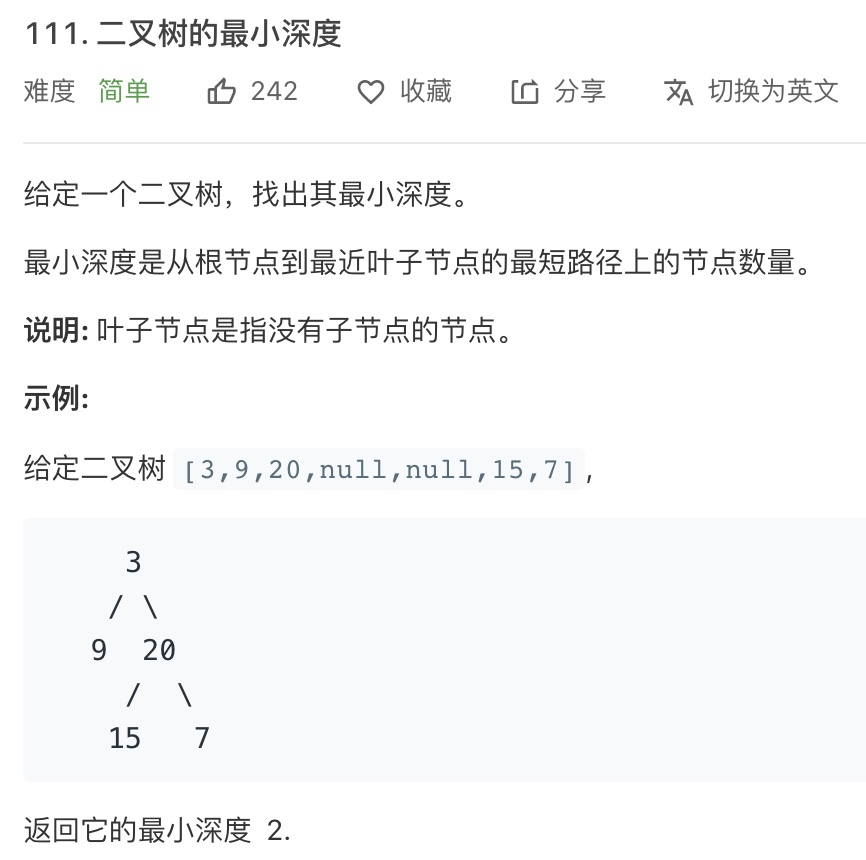

BFS 广度优先搜索的核心思想，就是把一些问题抽象成图，从一个点开始，向四周开始扩散。一般来说，我们写 BFS 算法都是用「队列」这种数据结构，每次将一个节点周围的所有节点都加入队列。BFS 与 DFS 的最主要区别是：**BFS 找到的路径一定是最短的，但代价就是空间复杂度比 DFS 大很多**。


## 算法框架

我们先说一下 BFS 出现的常见场景，**本质就是让你在一幅「图」中找到从起点 `start` 到终点 `target` 的最近距离**。这个广义的描述可以有多种变体，比如走迷宫，有的格子是围墙不能走，从起点到终点的最短距离是多少？如果这个迷宫带「传送门」可以瞬间传送呢？


再比如说两个单词，要求你通过某些替换，把其中一个变成另一个，每次只能替换一个字符，最少替换几次？或者说连连看游戏，两个方块消除的条件不仅仅是图案相同，还得保证两个方块之间的最短连线不能多于两个拐点。你玩连连看，点击两个坐标，游戏是如何判断它俩的最短连线有几个拐点的？


这些问题都没啥奇技淫巧，本质上都是一幅「图」，让你从一个起点，走到终点，问最短路径。记住下面的框架就 OK 了。

```java
   /**
     * 计算从起点 start 到终点 target 的最近距离
     * @param start
     * @param target
     * @return
     */
    public int BFS(Node start, Node target) {

        /**
         * 核心数据结构
         */
        Queue<Node> q;

        /**
         * 避免走回头路
         */
        Set<Node> visited;

        // 将起点加入队列
        q.offer(start);
        visited.add(start);
        // 记录扩散的步数
        int step = 0;

        while(!q.isEmpty()) {
            int size = q.size();
            // 将当前队列中的所有节点向四周扩散
            for(int i = 0; i < size; i++) {
                Node cur = q.poll();

                // 划重点：这里判断是否到达终点
                if(cur == target) {
                    return step;
                }
                
                // 将 cur 的相邻节点加入队列
                for(Node x : cur.adj()) {
                    q.offer(x);
                    visited.add(x);
                }
            }
            
            // 划重点：更新步数在这里
            step++;
        }

    }
```


队列 q 是 BFS 的核心数据结构；`cur.adj()` 泛指 `cur` 相邻的节点，比如说二维数组中，`cur` 上下左右四面的位置就是相邻节点；`visited` 的主要作用就是防止走回头路，大部分时候都是必须的，但是像一般的二叉树结构，没有子节点到父节点的指针，不会走回头路就不需要 `visited`


## 二叉树的最小深度

此题来自 LeetCode 的一道题目：[二叉树的最小深度](https://leetcode-cn.com/problems/minimum-depth-of-binary-tree/)，题目如下：




这里怎么套到 BFS 的框架里呢？首先明确一下起点 `start` 和终点 `target` 是什么，怎么判断到达终点？**显然起点就是 `root` 根节点，终点就是最靠近根节点的那个「叶子节点」**，叶子节点就是两个子节点都是 `null` 的节点：

```java
// 到达叶子节点
if(cur.left == null && cur.right == null)
```


那么，按照上述的框架稍微改造来写解法就可以了：

```java
public int minDepth(TreeNode root) {
        if(root == null) {
            return 0;
        }

        Queue<TreeNode> queue = new LinkedList<>();
        queue.offer(root);
        // root 本身就是一层，depth 初始化为 1
        int depth = 1;

        while (!queue.isEmpty()) {
            int size = queue.size();
            // 将当前队列中的所有节点向四周扩散
            for(int i = 0; i < size; i++) {
                TreeNode cur = queue.poll();
                // 判断是否到达叶子节点
                if(cur.left == null && cur.right == null) {
                    return depth;
                }
                // 将 cur 的相邻节点加入队列
                if(cur.left != null) {
                    queue.offer(cur.left);
                }
                if(cur.right != null) {
                    queue.offer(cur.right);
                }
            }
            //这里增加步数
            depth++;
        }

        return depth;
    }
```


其他复杂的问题都是这个框架的变形，在探讨复杂问题之前，我们先解答两个问题：


#### 1、为什么 BFS 可以找到最短距离，DFS 不行吗？

首先，BFS 的逻辑，`depth` 每增加一次，队列中的所有节点都向前迈一步，这保证了第一次到达终点的时候，走的步数是最少的。


DFS 也可以找到最短路径，但时间复杂度相对高很多。DFS 实际上是靠递归的堆栈记录走过的路径，你要找最短路径，肯定要把二叉树所有树杈都探索完才能对比出最短的路径有多长，而 BFS 借助队列做到一次一步齐头并进，是可以不遍历完整一棵树的条件下找到最短距离的


形象点说，DFS 是线，BFS 是面；DFS 是单打独斗，BFS 是集体行动。


#### 2、既然 BFS 那么好，为啥 DFS 还要存在？

BFS 可以找到最短距离，但是空间复杂度高，而 DFS 的空间复杂度较低。


那上面处理二叉树问题的例子，假设给你的二叉树是满二叉树，节点数为 `N`，对于 DFS 算法来说，空间复杂度无非就是递归堆栈，最坏情况下顶多就是树的高度，也就是 `O(logN)`。但 BFS 算法，队列中每次都会存储着二叉树一层的节点，这样的话最坏情况下空间复杂度应该是树的最底层节点的数量，也就是 `N / 2`，即 `O(N)`


所以，BFS 还是有代价的，一般来说在找最短路径的时候使用 BFS，其他时候还是 DFS 使用得多一些


## 解开密码锁的最少次数

这也是 LeetCode 的题目：[打开转盘锁](https://leetcode-cn.com/problems/open-the-lock/)


题目中描述的就是我们生活中常见的那种密码锁，如果没有任何约束，最少的拨动次数很好算，就像我们平时开密码锁那样直奔密码拨就行了。但现在出现了 `deadends`，那要如何计算？


第一步，我们不管所有的限制条件，不管 `deadends` 和 `target` 的限制，就思考一个问题：如果让你设计一个算法，穷举所有可能的密码组合，怎么做？那就穷举呗，再简单一点，如果你只转一下锁，有几种可能？总共有 4 个位置，每个位置可以向上转，也可以向下转，即有 8 种可能。例如从 `"0000"` 开始，转一次，可以穷举出 `"1000"，"9000"，"0100"，"0900" ...` 共 8 种密码，然后再以这 8 种密码为基础，对每个密码再转一下，穷举出所有可能


这就可以抽象出一幅图，每个节点都有 8 个相邻的节点，又让你求最短距离，这就是典型的 BFS。框架就可以派上用场了，先写一个简陋的 BFS：


```java
/**
     * 将 s[i] 向上波动一次
     * @param s
     * @param i
     * @return
     */
    public String up(String s, int i) {
        char[] chars = s.toCharArray();
        if(chars[i] == '9') {
            chars[i] = 0;
        }else {
            chars[i] += 1;
        }

        return new String(chars);
    }

    /**
     * 将 [i] 向下波动一次
     * @param s
     * @param i
     * @return
     */
    public String down(String s, int i) {
        char[] chars = s.toCharArray();
        if(chars[i] == '0') {
            chars[i] = '9';
        }else {
            chars[i] -= 1;
        }

        return new String(chars);
    }

    /**
     * BFS 框架，打印出所有可能的密码
     * @param target
     */
    public void BFS(String target) {
        Queue<String> q = new LinkedList<>();
        q.offer("0000");

        while (!q.isEmpty()) {
            int sz = q.size();
            // 将当前队列中的所有节点向周围扩散
            for (int i = 0; i < sz; i++) {
                String cur = q.poll();
                // 判断是否到达终点
                System.out.println(cur);

                /* 将一个节点的相邻节点加入队列 */
                for (int j = 0; j < 4; j++) {
                    String up = up(cur, j);
                    String down = down(cur, j);
                    q.offer(up);
                    q.offer(down);
                }
            }
            // 在这里增加步数
        }
        return;
    }
```

 

这段 BFS 密码已经能够穷举所有可能的密码组合了，但是显然不能完成所有题目，有如下问题需要解决：

- 会走回头路，比如说我们从 "0000" 拨打 "1000"，但是等从队列拿出 "1000" 时，还会拨出一个 "0000"，这样会产生死循环

- 没有终止条件，按照题目要求，我们找到 `target` 就应该结束并返回拨动的次数

- 没有对 `deadends` 的处理，按道理这些「死亡密码」是不能出现的，也就是你遇到这些密码的时候需要跳过


现在只要按照 BFS 框架在对应的位置修改即可修复这些问题：

```java
public int openLock(String[] deadends, String target) {
        // 记录需要跳过的死亡密码
        Set<String> deads = new HashSet<>();
        for (String s : deadends) { 
            deads.add(s);
        }
        // 记录已经穷举过的密码，防止走回头路
        Set<String> visited = new HashSet<>();
        Queue<String> q = new LinkedList<>();
        // 从起点开始启动广度优先搜索
        int step = 0;
        q.offer("0000");
        visited.add("0000");

        while (!q.isEmpty()) {
            int sz = q.size();
            // 将当前队列中的所有节点向周围扩散
            for (int i = 0; i < sz; i++) {
                String cur = q.poll();

                // 判断是否到达终点
                if (deads.contains(cur)) {
                    continue;
                }
                if (cur.equals(target)) {
                    return step;
                }

                // 将一个节点的未遍历相邻节点加入队列
                for (int j = 0; j < 4; j++) {
                    String up = up(cur, j);
                    if (!visited.contains(up)) {
                        q.offer(up);
                        visited.add(up);
                    }
                    String down = down(cur, j);
                    if (!visited.contains(down)) {
                        q.offer(down);
                        visited.add(down);
                    }
                }
            }
            // 在这里增加步数
            step++;
        }
        // 如果穷举完都没找到目标密码，那就是找不到了
        return -1;
    }
```


## BFS 框架的应用

我们看一下 LeetCode 的 [单词接龙](https://leetcode-cn.com/problems/word-ladder/)，这也是典型的 BFS 题目，可以套用我们的 BFS 算法。同样，我们也需要解决下面的问题：

每次转换只能改变一个字母

转换过程中的中间单词必须是字典中的单词


不过这次不一样的是，我们需要优化一下到达终点的位置，否则会出现「超出时间限制」的问题。具体代码如下：

```java
public int ladderLength(String beginWord, String endWord, List<String> wordList) {
        // 先将 wordList 放到哈希表里，便于判断某个单词是否在 wordList 里
        Set<String> wordSet = new HashSet<>(wordList);
        if (wordSet.size() == 0 || !wordSet.contains(endWord)) {
            return 0;
        }
        wordSet.remove(beginWord);

        // 图的广度优先遍历，必须使用的队列和表示是否访问过的 visited （数组，哈希表）
        Queue<String> queue = new LinkedList<>();
        queue.offer(beginWord);

        Set<String> visited = new HashSet<>();
        visited.add(beginWord);

        int wordLen = beginWord.length();
        // 包含起点，因此初始化的时候步数为 1
        int step = 1;
        while (!queue.isEmpty()) {

            int currentSize = queue.size();
            for (int i = 0; i < currentSize; i++) {
                // 依次遍历当前队列中的单词
                String word = queue.poll();
                char[] charArray = word.toCharArray();

                // 修改每一个字符
                for (int j = 0; j < wordLen; j++) {
                    // 一轮以后应该重置，否则结果不正确
                    char originChar = charArray[j];

                    for (char k = 'a'; k <= 'z'; k++) {
                        if (k == originChar) {
                            continue;
                        }

                        charArray[j] = k;
                        String nextWord = String.valueOf(charArray);

                        if (wordSet.contains(nextWord)) {
                            // 如果到达终点
                            if (nextWord.equals(endWord)) {
                                return step + 1;
                            }

                            if (!visited.contains(nextWord)) {
                                queue.add(nextWord);
                                // 注意：添加到队列以后，必须马上标记为已经访问
                                visited.add(nextWord);
                            }
                        }
                    }
                    // 恢复
                    charArray[j] = originChar;
                }
            }
            step++;
        }
        return 0;
    }
```


## 参考资料

[BFS 算法解题套路框架](https://labuladong.gitbook.io/algo/di-ling-zhang-bi-du-xi-lie/bfs-kuang-jia)


