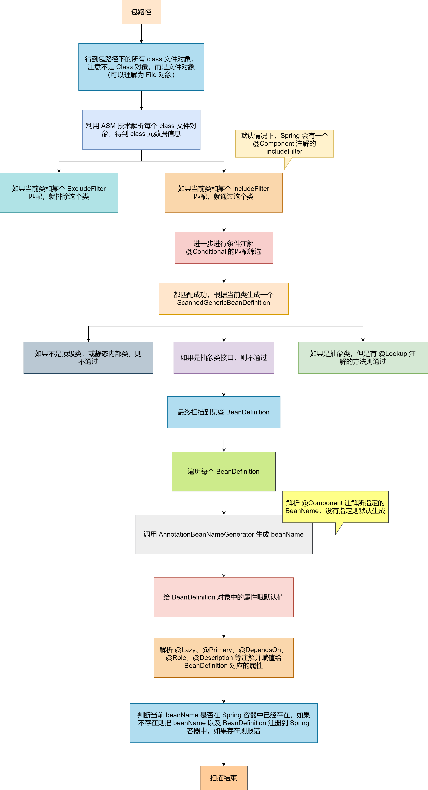

## Bean 的生成过程


### 生成 BeanDefinition


Spring 启动的时候会进行扫描，会先调用 `org.springframework.context.annotation.ClasspathScaningCandidateComponentProvider#scanCandidateComponents(String basePackage)` 扫描某个包路径，并得到 BeanDefinition 的 Set 集合


Spring 的扫描流程如下：





1. 首先，通过 ResourcePatternResolver 获得指定包路径下的所有 `.class` 文件（Spring 源码中将此文件包装成了 Resource 对象）
2. 遍历每个 Resource 对象
3. 利用 MetadataReaderFactory 解析 Resource 对象得到 MetadataReader（Spring 源码中MetadataReaderFactory 具体的实现类为 CachingMetadataReaderFactory，MetadataReader 的具体实现类为 SimpleMetadataReader）
4. 利用 MetaDataReader 进行 ExcludeFilter 和 includeFilter，以及条件注解 @Conditional 的筛选
5. 筛选通过后，基于 MetadataReader 生成 ScannerGenericBeanDefinition
6. 在基于 MetadataReader 判断对应的类是不是接口或抽象类
7. 如果筛选通过，那么就表示扫描到了一个 Bean，将 ScannerGenericBeanDefinition 加入结果集


MetadataReader表示类的元数据读取器，主要包含了一个AnnotationMetadata，功能有
1. 获取类的名字、
2. 获取父类的名字
3. 获取所实现的所有接口名
4. 获取所有内部类的名字
5. 判断是不是抽象类
6. 判断是不是接口
7. 判断是不是一个注解
8. 获取拥有某个注解的方法集合
9. 获取类上添加的所有注解信息
10. 获取类上添加的所有注解类型集合


值得注意的是，CachingMetadataReaderFactory 解析某个 .class 文件得到 MetadataReader 对象是利用的 **ASM** 技术，并没有加载这个类到 JVM。并且，最终得到的 ScannerGenericBeanDefinition 对象，**beanClass 属性存储的是当前类的名字，而不是 class 对象**


最后，上面说的是通过扫描得到的 BeanDefinition 对象，我们还可以通过直接定义 BeanDefinition，或解析 spring.xml 文件的 <bean />，或者 @Bean 注解的 BeanDefinition


### 合并 BeanDefinition


通过扫描得到所有 BeanDefinition 之后，就可以根据 BeanDefinition 创建 Bean 对象了，但是 Spring 中支持父子 BeanDefinition，和 Java 父子类类似，但是完全不是一回事


父子 BeanDefinition 实际用的比较少，使用如下：


```xml
<bean id="parent" class="com.zhouyu.service.Parent" scope="prototype"/>
<bean id="child" class="com.zhouyu.service.Child"/>
```


上面情况下，child 是单例 Bean


```xml
<bean id="parent" class="com.zhouyu.service.Parent" scope="prototype"/>
<bean id="child" class="com.zhouyu.service.Child" parent="parent"/>
```


上面情况下，child 就是原型 Bean


因为 child 的父 BeanDefinition 是 parent，所以会继承 parent 上所定义的 scope 属性


而在根据 child 生成 Bean 对象之前，需要进行 BeanDefinition 的合并，得到完整的 child 的 BeanDefinition


### 加载类


BeanDefinition 合并之后，就可以去创建 Bean 对象了，而创建 Bean 对象就必须实例化对象，而实例化就必须先加载当前 BeanDefinition 所对应的 class，在 AbstractAutowireCapableBeanFactory 类的 createBean() 方法中，一开始就会调用


```java
Class<?> resolvedClass = resolveBeanClass(mbd, beanName);
```


这行代码就是去加载类的，实现如下：


```java
// 如果beanClass被加载了
if (mbd.hasBeanClass()) {
   return mbd.getBeanClass();
}

// 如果beanClass没有被加载
if (System.getSecurityManager() != null) {
   return AccessController.doPrivileged((PrivilegedExceptionAction<Class<?>>)
         () -> doResolveBeanClass(mbd, typesToMatch), getAccessControlContext());
}
else {
   return doResolveBeanClass(mbd, typesToMatch);
}
```


```java
public boolean hasBeanClass() {
   return (this.beanClass instanceof Class);
}
```


如果 beanClass 属性的类型是 Class，那么就直接返回，如果不是，则会根据类名进行加载


#### ClassUtils.getDefaultClassLoader()


1. 优先返回当前线程中的 ClassLoader
2. 线程中类加载器为 null 的情况下，返回 ClassUtils 类的类加载器
3. 如果 ClassUtils 类的类加载器为空，那么则表示是 Bootstrap 类加载器的 ClassUtils 类，那么则返回系统类加载器


### 实例化前


当前 BeanDefinition 对应的类成功加载后，就可以实例化对象了。但是在 Spring 中，实例化对象之前，Spring 提供了一个扩展点，允许用户来控制是否在某个或某些 Bean 实例化之前做一些启动动作，这个扩展点叫 `InstantiationAwareBeanPostProcessor.postProcessBeforeInstantiation()`，比如：


```java
@Component
public class TestBeanPostProcessor implements InstantiationAwareBeanPostProcessor {

   @Override
   public Object postProcessBeforeInstantiation(Class<?> beanClass, String beanName) throws BeansException {
      if("userService".equals(beanName)) {
         System.out.println("实例化前");
      }
      return null;
   }
}
```


如上代码会导致，在 UserService 这个 Bean 实例化前，会进行打印


值得注意的是，postProcessBeforeInstantiation() 是有返回值的，如果这么实现：


```java
@Component
public class TestBeanPostProcessor implements InstantiationAwareBeanPostProcessor {

	@Override
	public Object postProcessBeforeInstantiation(Class<?> beanClass, String beanName) throws BeansException {
		if("userService".equals(beanName)) {
			System.out.println("实例化前");
			return new UserService();
		}
		return null;
	}
}
```


userService 这个 Bean，在实例化前会直接返回一个由我们所定义的 UserService 对象。如果是这样，表示不需要 Spring 来实例化了，并且后续的 Spring 依赖注入也不会进行了，会跳过一些步骤，直接执行初始化这一步


### 实例化


这个步骤中，会根据 BeanDefinition 去创建一个对象了


#### Supplier 创建对象


首先判断 BeanDefinition 是否设置了 Supplier，如果设置了则调用 Supplier 的 get() 得到对象。我们可以直接使用 BeanDefinition 对象来设置 Supplier，比如：


```java
AbstractBeanDefinition beanDefinition = BeanDefinitionBuilder.genericBeanDefinition().getBeanDefinition();
beanDefinition.setInstanceSupplier(new Supplier<Object>() {

   @Override
   public Object get() {
      return new UserService();
   }
});
context.registerBeanDefinition("userService", beanDefinition);
```


#### 工厂方法创建对象


如果没有设置 Supplier，则检查 BeanDefinition 中是否设置了 factoryMethod，也就是工厂方法，有两种方式可以设置 factoryMethod，比如：


方式一：


```xml
<bean id="userService" class="com.test.service.UserService" factory-method="createUserService" />
```


对应的 UserService 类为：


```java
public class UserService {

   public static UserService createUserService() {
      System.out.println("执行createUserService()");
      UserService userService = new UserService();
      return userService;
   }
}
```


方式二：


```xml
<bean id="commonService" class="com.test.service.CommonService"/>
<bean id="userService1" factory-bean="commonService" factory-method="createUserService"/>
```


对应的 CommonService 的类为：


```java
public class CommonService {
   
   public UserService createUserService() {
      return new UserService();
   }
}
```


Spring 发现当前 BeanDefinition 方法设置了工厂方法后，就会区分这两种方式，然后调用工厂方法得到对象


另外，我们通过 @Bean 所定义的 BeanDefinition，是存在 factoryMethod 和 FactoryBean 的，也就是和上面的方式二非常类似，@Bean 所注解的方法就是 factoryMethod，AppConfig 对象就是 FactoryBean。如果 @Bean 所注解的方法是 static，那么对应的就是方式一


```java
@ComponentScan("com.test")
public class AppConfig {
   
   
   @Bean
   public UserService userService() {
      return new UserService();
   }
}
```


#### 推断构造方法


这个之前已经讲过原理了。推断完构造方法后，就会使用构造方法来进行实例化了


另外，在推断构造方法逻辑中除了会去选择构造方法以及查找入参对象外，还会判断是否在对应的类中使用 `@Lookup` 注解方法。如果存在则把方法封装为 LookupOverride 对象并添加到 BeanDefinition 中


在实例化时，如果判断出当前 BeanDefinition 中没有 LookupOverride，那就直接用构造方法反射得到一个实例对象。如果存在 LookupOverride 对象，即类中存在 @Lookup 注解的方法，那就会生成一个代理对象


```java
@Component
public class UserService {


   public void test() {
      System.out.println(createOrderService());
   }

   @Lookup
   public OrderService createOrderService() {
      return null;
   }
}

@Component
public class OrderService {
}
```


### BeanDefinition 的后置处理


Bean 对象实例化出来后，接下来就要给对象的属性赋值了。在真正给属性赋值之前，Spring 又提供了一个扩展点 `MergedBeanDefinitionPostProcessor.postProcessMergedBeanDefinition()`，可以对此时的 BeanDefinition 进行加工，如下：


```java
@Component
public class TestMergeBeanDefinitionPostProcessor implements MergedBeanDefinitionPostProcessor {
   
   
   @Override
   public void postProcessMergedBeanDefinition(RootBeanDefinition beanDefinition, Class<?> beanType, String beanName) {
      if("userService".equals(beanName)) {
         beanDefinition.getPropertyValues().add("orderService", new OrderService());
      }
   }
}
```


在 Spring 源码中，AutowiredAnnotationBeanPostProcessor 就是一个 MergeBeanDefinitionProcessor，它的 postProcessorMergeBeanDefinition() 中会去查找注入点，并缓存再 AutowiredAnnotationBeanPostProcessor 对象的一个 Map 中


### 实例化后


在处理完 BeanDefinition 后，Spring 又设计了一个扩展点：`InstantiationAwareBeanPostProcessor.postProcessAfterInstantiation()`，比如：


```java
@Component
public class TestBeanPostProcessor implements InstantiationAwareBeanPostProcessor {

   @Override
   public boolean postProcessAfterInstantiation(Object bean, String beanName) throws BeansException {
      if("userService".equals(beanName)) {
         System.out.println("实例化后");
         UserService userService = (UserService) bean;
         userService.test();
      }
      return true;
   }
}
```


上述代码就是对 userService 所实例化出来的对象进行处理。这个扩展点，在 Spring 源码中基本没怎么使用


### 自动注入


这里就是依赖注入，自动注入 bean 中的属性


### 处理属性


这个步骤，就会处理 @Autowired、@Resource、@Value 等注解，也是通过 `InstantiationAwareBeanPostProcessor.postProcessProperties()` 扩展点来实现的，比如我们可以实现一个自动注入的功能。如下


```java
@Component
public class TestBeanPostProcessor implements InstantiationAwareBeanPostProcessor {

   @Override
   public PropertyValues postProcessProperties(PropertyValues pvs, Object bean, String beanName) throws BeansException {
      if("userService".equals(beanName)) {
         for(Field field : bean.getClass().getFields()) {
            if(field.isAnnotationPresent(TestInject.class)) {
               field.setAccessible(true);
               try {
                  field.set(bean, "123");
               }catch (Exception e) {
                  e.printStackTrace();
               }
            }
         }
      }
      
      return pvs;
   }
}
```


### 执行 Aware


完成属性赋值之后，Spring 就会执行一些回调，包括：


1. BeanNameAware：回传 beanName 给 bean 对象
2. beanClassLoaderAware：回传 ClassLoader 给 bean 对象
3. BeanFactoryAware：回传 BeanFactory 给对象


```java
private void invokeAwareMethods(String beanName, Object bean) {
   if (bean instanceof Aware) {
      if (bean instanceof BeanNameAware) {
         ((BeanNameAware) bean).setBeanName(beanName);
      }
      if (bean instanceof BeanClassLoaderAware) {
         ClassLoader bcl = getBeanClassLoader();
         if (bcl != null) {
            ((BeanClassLoaderAware) bean).setBeanClassLoader(bcl);
         }
      }
      if (bean instanceof BeanFactoryAware) {
         ((BeanFactoryAware) bean).setBeanFactory(AbstractAutowireCapableBeanFactory.this);
      }
   }
}
```


### 初始化前


初始化前，也是 Spring 提供的一个扩展点：`BeanPostProcessor.postProcessBeforeInitialization()`，比如：


```java
@Component
public class TestBeanPostProcessor implements BeanPostProcessor {
   
   @Override
   public Object postProcessBeforeInitialization(Object bean, String beanName) throws BeansException {
      if("userService".equals(beanName)) {
         System.out.println("初始化前");
      }
      return bean;
   }
}
```


利用初始化前，可以对进行了依赖注入的 Bean 进行处理


在 spring 源码中，InitDestroyAnnotationBeanPostProcessor 会在初始化前这个步骤中执行 `@PostConstruct` 方法；而 ApplicationContextAwareProcessor 会在初始化前这个步骤中进行其他 Aware 的回调


### 初始化


初始化主要进行以下行为：


1. 查看当前 bean 对象是否实现了 InitializingBean 接口，如果实现了就调用其 afterPropertiesSet() 方法
2. 执行 BeanDefinition 中指定的初始化方法


### 初始化后


这是 Bean 创建生命周期的最后一个步骤，也是 Spring 提供的一个扩展点：`BeanPostProcessor.postProcessAfterInitialization()`，比如：


```java
@Component
public class TestBeanPostProcessor implements BeanPostProcessor {

   @Override
   public Object postProcessAfterInitialization(Object bean, String beanName) throws BeansException {
      if("userService".equals(beanName)) {
         System.out.println("初始化后");
      }
      return bean;
   }
}
```


我们可以在这个步骤中，对 Bean 进行最终处理，**Spring 中的 AOP 就是基于初始化后实现的，初始化后返回的对象才是最终的 Bean 对象**


