> 思维导图

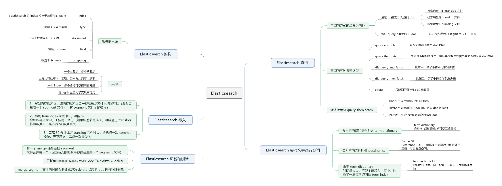

## Elasticsearch 简介

Elasticsearch 是一个**近实时**的**分布式存储、搜索、分析**的引擎。它是专门做搜索的，接下来我们简单说说 Elasticsearch 的相关知识。

## Elasticsearch 的数据结构

一般来说，要想知道查询的时候大概花多少时间，就需要知道它的底层数据结构是怎么样的。例如：

- 树形的查找时间复杂度一般是 O(logn)

- 链表的查找时间复杂度一般是 O(n)

- 哈希表的查找时间复杂度一般是 O(1)

不同的数据结构所花的时间往往是不一样的，你要查找的时候快，就需要有底层的数据结构支持。而我们要想知道 Elasticsearch 为什么模糊查询速度快，就需要知道它的底层数据结构是什么。

### 倒排索引

Elasticsearch 最强大的就是为每个字段提供了倒排索引，当查询的时候不用担心没有索引可以利用，什么是倒排索引，举个简单例子：

| 文档id | 年龄 | 性别 |
| ------ | ---- | ---- |
| 1      | 25   | 女   |
| 2      | 32   | 女   |
| 3      | 25   | 男   |

每一行是一个文档（document），每个 document 都有一个文档 id，那么给这些文档建立的倒排索引就是：

年龄的索引：

| 年龄 | 文档 id |
| ---- | ------- |
| 25   | [1,3]   |
| 32   | [2]     |

性别的索引：

| 性别 | 文档 id |
| ---- | ------- |
| 女   | [1,2]   |
| 男   | [3]     |

可以看到，倒排索引是针对每个字段的，每个字段都有自己的倒排索引，25、32 这些叫做 `term`，[1,3] 这种叫做 `posting list`。

首先我们得知道为什么 Elasticsearch 为什么可以实现快速的“模糊查询”或者“相关性查询”，实际上是你写入数据到 Elasticsearch 的时候会进行**分词**。如图：

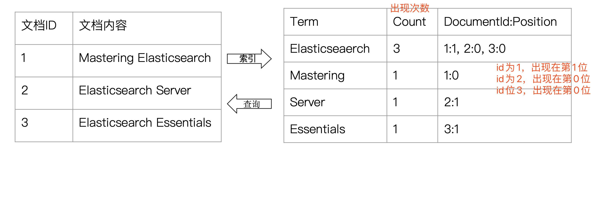

它会根据文档内容进行分词，上面是分成四个单词，并统计每个单词的个数以及位置。当然这只是一个例子，并不是 Elasticsearch 真正的原理。

我们都知道，世界上有很多语言，那 Elasticsearch 怎么切分这写词呢？其实 Elasticsearch 内置了一些分词器：

- **Standard Analyzer**：按词切分，将词小写

- **Simple Analyzer**：按非字母过滤（符号被过滤掉），将词小写

- **WhitespaceAnalyzer**：按照空格切分，不转小写

- 等等等。。。

Elasticsearch 分词器主要由三部分组成：

- **Character Filter**：文本过滤器，取出 HTML

- **Tokenizer**：按照规则切分，比如空格

- **TokenFilter**：将切分后的词进行处理，比如转小写

Elasticsearch 内置的分词器都是英文类的，而我们用户搜索的时候往往搜的是中文，现在中文分词器用的最多的就是 **IK**。

说了那么多，那 Elasticsearch 的数据结构是怎么样的呢？如图：

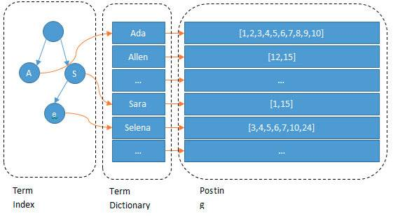

我们输入一段文字，Elasticsearch 会根据分词器对我们的那段文字进行分词（也就是图上看到的 Ada/Allen/Sara..），这些分词汇总起来我们叫做 `Term Dictionary`，而我们需要通过分词找到对应的记录，这些文档 ID 保存在 `PostingList`

在 `Term Dictionary` 中的词由于是非常非常多的，所以我们会为其进行**排序**，等要查找的时候就可以通过**二分**来查，不需要遍历整个 `Term Dictionary`。由于 `Term Dictionary` 的词实在太多，不可能把  `Term Dictionary` 都放在内存中，于是 Elasticsearch 还抽了一层叫做 `Term Index`，这层只存储部分**词的前缀**，`Term Index` 会存在内存中，检索会特别快。

### Term Dictionary

Elasticsearch 为了能快速找到某个 term，将所有的 term 进行了排序，然后二分查找 term，类似于上学时候老师教我们的翻新华字典的方式，所以叫做 Term Dictionary，这种查询方式其实和传统关系型数据库的 B-Tree 的方式很相近，所以这并不是 Elasticsearch 快的原因。

### Term Index

如果说 **Term Dictionary** 是直接去二分法翻字典，那么 **Term Index** 就是字典的目录页，当然这比我们真的去翻字典目录快多了，假设我们的 term 如果全是英文，那么 Term Index  就是 26 个字母表，但是通常 term 未必都是英文，而可以是任意的 byte 数组。因为就算 26 个英文字符也不一定都有对应的 term。例如，a 来头的 term 只有一个，c 开头的 term 有一百万个，x 开头的 term 一个也没有，这样查询到 c 的时候又会很慢了。所以通常情况下 **term index 是包含 term 的一些前缀的一棵树**，例如这样的一个 Term Index：

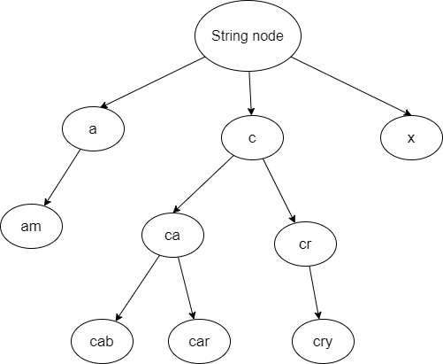

这样的情况下通过 term index 就可以根据快速定位到某个 offset（分支的开端），然后以此位置向下查找，再加上 FST（Finite-State-Transducer，Lucene4.0 开始使用该算法来查找 Term 在 Dictionary 中的位置）的压缩技术，将 Term Index 缓存到内存中，通过 Term Index 找到对应的 Term Dictionary 的 block，然后直接 去磁盘直接找到 term，减少磁盘的随机读写次数，大大地提升查询效率。

### Posting List 压缩技术 Roaring Bitmap

说到 roaring bitmaps 就要先了解 bitset 或者 bitmap。bitset 是一种数据结构，对应 posting list 如果是：[2, 3, 5, 7, 9]，那么对应的 bitset 就是：[0,1,1,0,1,0,1,0,1,0]。用 0 和 1 来表示该位置的数值的有无，这种做法就是一个 byte 可以代表 8 个文档。当大数据量时，仍然会消耗很多内存，所以直接将 bitset 结构存入内存不太理想。

Elasticsearch 不仅压缩了 Term Index，还对 posting list 进行了压缩。posting list 虽然只存储了文档 id，但是文档 id 很大的时候，可以达到 PB 级的数据，所以 Elasticsearch 对 posting List 的压缩做了两件事：排序和大数变小数。如图：

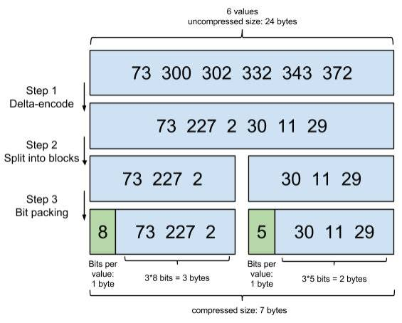

简单解读一下这种压缩技巧：

- step1：在对 posting list 进行压缩时进行了正序排序。

- step2：通过增量将 73 后面的大数变成小数存储增量值。例如 300 - 73 = 227、302 - 300 = 2

- step3：转换成二进制，取占最大位的数，227 占 8 位，前三个占八位，30 占五位，后三个数每个占五位。

从第三步可以看出，这种压缩方式仍然不够高效，所以 Lucene 使用的数据结构叫做 **Roaring Bitmap**，其压缩原理可以理解为：与其保存 100 个 0，占用 100 个 bit，还不如保存 0 一次，然后声明这个 0 有 100 个，它以两个自己可以表示的最大数 65535 为界，将 posting list 分块。比如第一块是 0 - 65535，第二块是 65535 - 131071，如图：

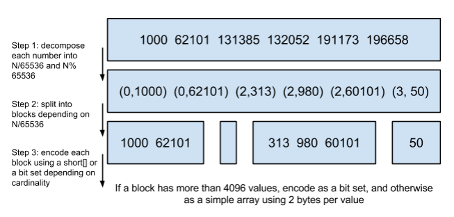

压缩技巧解读：

- step1：从小到大进行排序

- step2：将大数除以 65536，用除得的结果和余数来表示这个大数

- step3：以 65535 为界进行分块

## Elasticsearch 的术语和架构

在讲解 Elasticsearch 的架构之前，首先我们得了解一下 Elasticsearch 的一些常见术语：

- **Index**：Elasticsearch 的 Index 相当于数据库的 Table

- **Type**：这个在新的 Elasticsearch 版本已经废除（在以前的 Elasticsearch 版本，一个 Index 下支持多个 Type，有点类似消息队列一个 topic 下多个 group 的概念）

- **Document**：Document 相当于数据库的一行记录

- **Field**：相当于数据库的 Column 的概念

- **Mapping**：相当于数据库的 Schema 的概念

- **DSL**：相当于数据库的 SQL（给我们读取 Elasticsearch 数据的 API）

| RDBMS  | Elasticsearch |
| ------ | ------------- |
| TABLE  | Index(Type)   |
| Row    | Document      |
| Column | Field         |
| Schema | Mapping       |
| SQL    | DSL           |

说完 Elasticsearch 的相关术语，我们看一下 Elasticsearch 的架构。一个 Elasticsearch 集群会有多个 Elasticsearch 节点，所谓节点实际上就是运行着 Elasticsearch 进程上的机器。

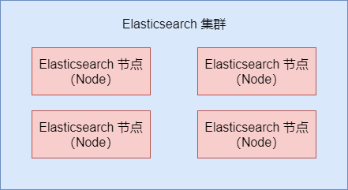

在众多节点中，会有一个 `Master Node`，它主要负责维护索引元数据、负责切换主分片和副分片本身等工作，如果主节点挂了，会选举出一个新的主节点。

Elasticsearch 最外层的是 Index（相当于数据库 表的概念），一个 Index 的数据我们可以分发到不同的 Node 上进行存储，这个操作就叫做分片。比如说我集群里有4个节点，我现在有一个 Index，想将这个 Index 在 4 个节点上存储，那我们可以设置 4 个分片，这 4 个分片的数据**合起来**就是 Index 的数据。

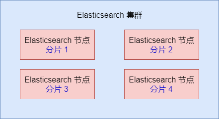

使用分片的原因：

- 如果一个 Index 的数据量太大，只有一个分片，那只会在一个节点上存储，随着数据量的增长，一个节点未必能把一个 Index 存储下来。

- 多个分片，在写入或查询的时候就可以进行并行操作，从各个节点中读写数据，提高吞吐量

如果某个节点挂了，那部分数据就丢了吗？为了解决这个问题，Elasticsearch 分片有主分片和副分片之分，为了实现**高可用**。数据写入的时候**写到主分片**，副本分片**复制**主分片的数据，读取的时候**主分片和副本分片都可以读**。

Index 需要分为多少个分片和副本分片都是可以 通过配置设置的。

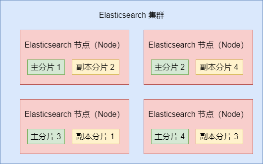

如果某个节点挂了，`Master Node` 就会把对应的副本分片提拔为主分片，这样即便节点挂了，数据就不会丢失了。

## Elasticsearch 写入流程

上面我们说过当我们向 Elasticsearch 写入数据的时候，是写到主分片上的，我们可以了解更多的细节。

客户端写入一条数据，到 Elasticsearch 集群里边就是由**节点**来处理这次请求：

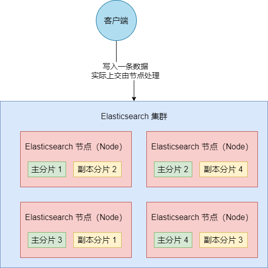

集群上的每个节点都是 `coordinating node`（协调节点），协调节点表明这个节点可以做**路由**。比如节点 1 收到了请求，但发现这个请求的数据应该是由节点 2 处理（因为主分片在节点 2 上），所以会把请求转发到节点 2 上。coordinate（协调）节点通过 hash 算法可以计算出在哪个主分片上，然后路由到对应的节点。`shard = hash(document_id) % (num_of_primary_shards)`

路由到对应的节点以及对应的主分片时，会做以下的事：

1. 将数据写到内存缓冲区
2. 然后将数据写到 translog 缓冲区.
3. 每隔 1s 数据从 buffer 中 refresh 到 FileSystemCache 中，生成 segment 文件，一旦生成 segment 文件，就能通过索引查询到了
4. refresh 完，memory buffer 就清空了
5. 每隔 5s，translog 从 buffer flush 到磁盘中
6. 定期/定量 从 FileSystemCache 中，结合 translog 内容 flush index 到磁盘中

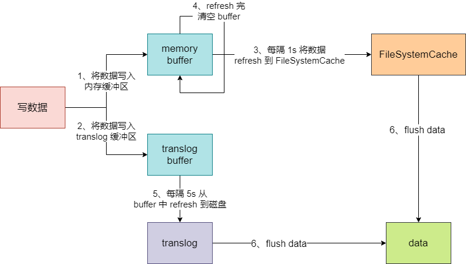

其中：

- Elasticsearch 会把数据先放入内存缓冲区，然后每隔 1s 刷新到文件系统缓存区（当数据被刷新到文件系统缓冲区以后，数据才可以被检索到）。所以，Elasticsearch 写入的数据需要 1s 才能查询到。

- 为了防止节点宕机，内存中的数据丢失，Elasticsearch 会另写一份数据到日志文件上。但最开始的还是写入到内存缓冲区，每隔 5s 才会将缓冲区的数据刷到磁盘中。所以，Elasticsearch 某个节点如果挂了，可能会造成 5s 的数据丢失。

- 等到磁盘上的 translog 文件打到一定程度或者超过了 30 分钟，会触发 **commit** 操作，将内存中的 segment 文件异步刷到磁盘中，完成持久化操作。

说白了就是，写内存缓冲区（**定时**去生成 segment，生成 translog），能够**让数据被索引、被持久化**。最后通过 commit 完成一次的持久化。

等主分片写完了以后，会将数据并行发送到副本节点上，等到所有的节点写入成功就返回 ack 给协调节点，协调节点返回 ack 给客户端，完成一次的写入。

## Elasticsearch 更新和删除

Elasticsearch 的更新和删除操作流程：

给对应的 `doc` 记录打上 `.del` 标识，如果是删除操作就打上 `delete` 状态，如果是更新操作就把原来的 `doc` 标志为 `delete`，然后重新写入一条数据。

前面讲到，每隔 1s 会生成一个 segment 文件，那 segment 文件会越来越多。Elasticsearch 会有一个 **merge** 任务，会将多个 segment 文件合并成一个 segment 文件。在合并的过程中，会把带有 `delete` 状态的 `doc` 给**物理删除**掉。

## Elasticsearch 查询

查询我们最简单的方式可以分为两种：

- 根据 ID 查询 doc

- 根据 query（搜索词）去查询匹配的 doc

根据 **ID** 去查询具体的 doc 的流程是：

- 检索内存的 Translog 文件

- 检索硬盘的 Translog 文件

- 检索硬盘的 Segment 文件

根据 **query** 去匹配 doc 的流程是：同时去查询内存和硬盘的 segment 文件

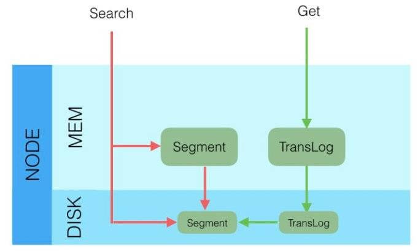

Elasticsearch 查询又可以分为五种搜索类型：

- **QUERY_AND_FETCH**：向索引的所有分片（shard）都发出请求，各分片返回的时候把文档（document）和计算后的排名信息一起返回。这种搜索方式是最快的。因为相比下面的几种搜索方式，这种查询方法只需要去 shard 查询一次。但是各个 shard 返回的结果的数量之和可能是用户要求的 size 的 n 倍。

- **QUERY_THEN_FETCH**：如果你搜索时，没有指定搜索方式，那默认就是使用这种方式。这种搜索方式，大概分为两个步骤。第一步，先向所有的 shard 发出请求，各分片只返回排序和排名相关的信息（注意，不包括文档 document），然后按照各分片返回的分数进行重新排序和排名，取前 size 个文档。然后第二步，去相关的 shard 取 document。这种方式返回的 document 与用户要求的 size 是相等的。

- **DFS_QUERY_AND_FETCH**：这种方式比第一步多了一个初始化散发（initial scatter）步骤。有这一步，可以更精确控制搜索打分和排名。

- **DFS_QUERY_THEN_FETCH**：比第二种多了一个初始化散发步骤。

- **COUNT**：这种一种特殊的搜索类型，只返回匹配查询的文档数目。

初始化散发其实就是在进行真正的查询之前，先把各个分片的词频率和文档频率收集一下，然后进行词搜索的时候，各分片依据全局的词频率和文档频率进行搜索和排名。显然如果使用 DFS_QUERY_THEN_FETCH 这种查询方式，效率是最低的，因为一个搜索，可能要查询 3 次分片，但使用 DFS 方法，搜索精度应该是最高的。

一般我们用得最多的就是 QUERY_THEN_FETCH，第一种查询完就返回这个 doc 内容（QUERY_AND_FETCH）只适合于只需要查一个分片的请求。

**QUERY_THEN_FETCH** 总体的流程大概是：

- 客户端请求发送到集群的某个节点上。集群上的每个节点都是 coordinate node（协调节点）

- 然后协调节点将搜索的请求转达到所有分片上（主分片和副本分片都行）

- 每个分片将自己搜索出的结果（doc id）返回给协调节点，由协调节点进行数据的合并、排序、分页等操作，产出最终结果。

- 接着由协调节点根据 `doc id` 去各个节点上拉取实际的 document 数据，最终返回给客户端。

**Query Phase** 时节点做的事：

- 协调节点向目标分片发送查询的命令（转发请求到主分片或者副本分片上）

- 数据节点（在每个分片内做过滤，排序等操作），返回 doc id 给协调节点

**Fetch Phase** 阶段时节点做的事：

- 协调节点得到数据节点返回的 doc id，对这些 doc id 做聚合，然后将目标数据分片发送抓取命令（希望拿到这个 doc 记录）

- 数据节点按照协调节点发送的 doc id，拉取实际需要的数据返回给协调节点

主流程其实说白了就是：**由于 Elasticsearch 是分布式的，所以需要从各个节点都拉取对应的数据，然后最终统一合成给客户端**。只是Elasticsearch 把这些活都干了，我们在使用的时候无感知而已。

## 参考资料

[扫盲--Elasticsearch](https://juejin.im/post/5e264b026fb9a03003008435)

[Elasticsearch 原理](https://blog.csdn.net/qq_36289377/article/details/82993160)

