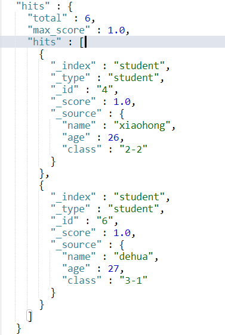
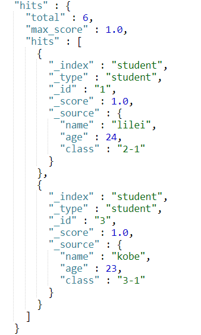
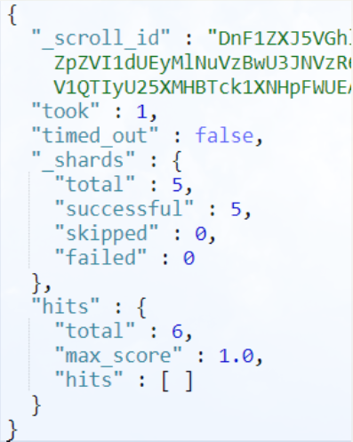

## 深度分页方式 from + size


ES 默认采用的分页方式是 from + size 的形式，在深度分页的情况下，这种使用方式效率是非常低的，比如我们执行如下查询


```http
1 GET /student/student/_search
2 {
3   "query":{
4     "match_all": {}
5   },
6   "from":5000,
7   "size":10
8 }
```


意味着 ES 需要在各个分片上匹配排序并得到 5010 条数据，协调节点拿到这些数据再进行排序处理，然后结果集中取最后 10 条数据返回


其次，ES 为了性能，限制了我们分页的深度。ES 默认支持的最大的 max_result_window = 10000，也就是说我们不能分页到 10000 条数据以上


## 深度分页值 Scroll


在 ES 中我们分页要请求大数据集或者一次请求要获取较大的数据集，scroll 是一个非常好的解决方案


使用 scroll 滚动搜索，可以先搜索一批数据，然后下次再搜索一批数据，以此类推，知道搜索出全部的数据来。scroll 搜索会在第一次搜索的时候，保存了一个当时的视图快照，之后只会基于该旧的视图快照提供数据搜索，如果这个期间数据变更，是不会让用户看到的。每次发送 scroll 请求，我们还需要指定一个 scroll 参数，指定一个时间窗口，每次搜索请求只要在这个时间窗口内能完成就可以了


一个滚屏搜索允许我们做一个初始阶段搜索并且持续批量从 Elasticsearch 里拉取结果直到没有结果剩下。这有点像传统数据库里的 cursors（游标）


滚屏搜索会及时制作快照。这个快照不会包含任何在初始阶段搜索请求后对 index 做的修改。它通过将旧的数据文件保存在手边，所以可以保护 index 的样子看起来像要搜索开始时的样子。这样将使得我们无法得到用户最近的更新行为


scroll 的使用很简单。执行如下 curl，每次请求两条。可以定制 scroll = 5m 意味着该窗口过期时间为 5 分钟


```http
1 GET /student/student/_search?scroll=5m
2 {
3   "query": {
4     "match_all": {}
5   },
6   "size": 2
7 }
```


```json
{
 2   "_scroll_id" : "DnF1ZXJ5VGhlbkZldGNoBQAAAAAAAC0YFmllUjV1QTIyU25XMHBTck1XNHpFWUEAAAAAAAAtGRZpZVI1dUEyMlNuVzBwU3JNVzR6RVlBAAAAAAAALRsWaWVSNXVBMjJTblcwcFNyTVc0ekVZQQAAAAAAAC0aFmllUjV1QTIyU25XMHBTck1XNHpFWUEAAAAAAAAtHBZpZVI1dUEyMlNuVzBwU3JNVzR6RVlB",
 3   "took" : 0,
 4   "timed_out" : false,
 5   "_shards" : {
 6     "total" : 5,
 7     "successful" : 5,
 8     "skipped" : 0,
 9     "failed" : 0
10   },
11   "hits" : {
12     "total" : 6,
13     "max_score" : 1.0,
14     "hits" : [
15       {
16         "_index" : "student",
17         "_type" : "student",
18         "_id" : "5",
19         "_score" : 1.0,
20         "_source" : {
21           "name" : "fucheng",
22           "age" : 23,
23           "class" : "2-3"
24         }
25       },
26       {
27         "_index" : "student",
28         "_type" : "student",
29         "_id" : "2",
30         "_score" : 1.0,
31         "_source" : {
32           "name" : "xiaoming",
33           "age" : 25,
34           "class" : "2-1"
35         }
36       }
37     ]
38   }
39 }
```


在返回的结果中，有一个很重要的 `_scroll_id`。在后面的请求中我们都要带着这个 `scroll_id` 去请求


现在这个索引中共有 6 条索引，id 分别为 1, 2, 3, 4, 5, 6。当我们使用 scroll 查询第 4 次的时候，返回结果应该为空，这时我们就知道结果集已经匹配完了。继续执行 3 次结果如下所示：


```http
1 GET /_search/scroll
2 {
3   "scroll":"5m",
4   "scroll_id":"DnF1ZXJ5VGhlbkZldGNoBQAAAAAAAC0YFmllUjV1QTIyU25XMHBTck1XNHpFWUEAAAAAAAAtGRZpZVI1dUEyMlNuVzBwU3JNVzR6RVlBAAAAAAAALRsWaWVSNXVBMjJTblcwcFNyTVc0ekVZQQAAAAAAAC0aFmllUjV1QTIyU25XMHBTck1XNHpFWUEAAAAAAAAtHBZpZVI1dUEyMlNuVzBwU3JNVzR6RVlB"
5 }
```











由结果集我们可以发现最终确实分别得到了正确的结果集，并且正确地终止了 scroll


## search_after


from + size 的分页方式虽然是最灵活的分页方式，但是当分页深度达到一定程度将会产生深度分页的问题。scroll 能够解决深度分页的问题，但是无法实现实时查询，即当 scroll_id 生成后无法查询到之哦户数据的变更，因为其底层是生成数据的快照。这时 search_after 应运而生。这时在 ES - 5.X 之后才提供的


search_after 是一种假分页方式，根据上一页的最后一条数据来确定下一页的位置，同时在分页请求的过程中，如果有索引数据的增删改查，这些变更也会实时的反映到游标上。为了找到每一页最后一条数据，每个文档必须有一个全局唯一值，官方推荐使用 _uid 作为全局唯一值，但是只要能表示其唯一性就可以


为了演示，我们在上文中的索引增加一个 uid 字段表示其唯一性


执行如下查询：


```http
1 GET /student/student/_search
 2 {
 3   "query":{
 4     "match_all": {}
 5   },
 6   "size":2,
 7   "sort":[
 8     {
 9       "uid": "desc"
10     }  
11   ]
12 }
```


结果集：


```json
{
  "took" : 1,
  "timed_out" : false,
  "_shards" : {
    "total" : 5,
    "successful" : 5,
    "skipped" : 0,
    "failed" : 0
  },
  "hits" : {
    "total" : 6,
    "max_score" : null,
    "hits" : [
      {
        "_index" : "student",
        "_type" : "student",
        "_id" : "6",
        "_score" : null,
        "_source" : {
          "uid" : 1006,
          "name" : "dehua",
          "age" : 27,
          "class" : "3-1"
        },
        "sort" : [
          1006
        ]
      },
      {
        "_index" : "student",
        "_type" : "student",
        "_id" : "5",
        "_score" : null,
        "_source" : {
          "uid" : 1005,
          "name" : "fucheng",
          "age" : 23,
          "class" : "2-3"
        },
        "sort" : [
          1005
        ]
      }
    ]
  }
}
```


下一次分页，需要将上述分页结果集的最后一条数据的值带上


```http
1 GET /student/student/_search
 2 {
 3   "query":{
 4     "match_all": {}
 5   },
 6   "size":2,
 7   "search_after":[1005],
 8   "sort":[
 9     {
10       "uid": "desc"
11     }  
12   ]
13 }
```


这样我们就使用 search_after 方式实现了分页查询


### 三种分页方式比较


| 分页方式     | 性能 | 优点                                                         | 缺点                                                         | 场景                                                         |
| ------------ | ---- | ------------------------------------------------------------ | ------------------------------------------------------------ | ------------------------------------------------------------ |
| from + size  | 低   | 灵活性好，实现简单                                           | 深度分页问题                                                 | 数据量比较小，能容忍深度分页问题                             |
| scroll       | 中   | 解决了深度分页问题                                           | 无法反应数据的实时性（快照版本）<br />维护成本高，需要维护一个 scroll_id | 海量数据的导出（比如将 ES 中 20W 的数据导入到 Excel）<br />需要查询海量结果集的数据 |
| search_after | 高   | 性能最好<br />不存在深度分页问题<br />能够反应数据的实时变更 | 实现复杂，需要有一个全局唯一的字段<br />连续分页的实现会比较复杂，因为每一次查询都需要上次查询的结果 | 海量数据的分页                                               |


### 参考内容


[ES 深度分页问题](https://www.cnblogs.com/hello-shf/p/11543453.html)