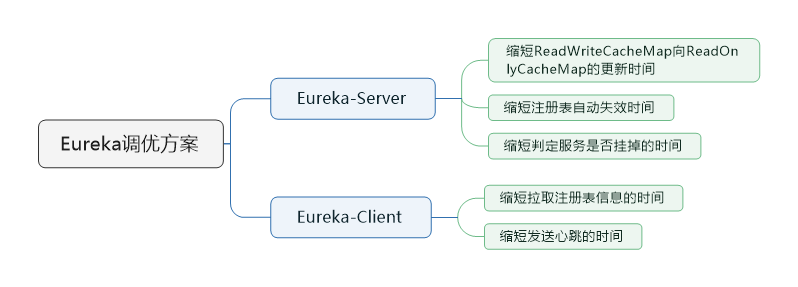

> 本节思维导图

​		Eureka的默认配置是比较糟糕的，一般服务的上线和下线极端情况下需要一分多钟才能感知到，服务故障极端情况下需要两到三分钟才能感知到，这相对于ZooKeeper的秒级感知来说实在是太慢了。因此我们可以通过修改Eureka的一些配置参数来达到秒级通知的效果。

## Eureka-Server端的配置

### eureka.server.responseCacheUpdateIntervalMs

​		这个参数表示的是Eureka中ReadWriteCacheMap的缓存数据多久会更新到ReadOnlyCacheMap中去，应为Eureka-Client是从ReadOnlyCacheMap拉取数据的。这个参数默认是30秒更新一次ReadOnlyCacheMap，我们可以改为3秒更新一次：**eureka.server.response-cache-update-interval-ms = 3000**

### eureka.server.evictionIntervalTimerInMs

​		这个参数表示的是Eureka-Server中的缓存数据每隔多少秒主动失效。默认是60秒主动清空服务列表，我们可以改为6秒：**eureka.server.eviction-interval-timer-in-ms = 6000**

### eureka.instance.leaseExpirationDurationInSeconds

​		服务过期时间配置，超过这个时间没有接收到心跳就会认为该服务实例已经挂了。并将该服务实例从注册表中剔除掉。默认情况下是90秒，我们可以设置为9秒：**eureka.instance.lease-expiration-duration-in-seconds = 9**

## Eureka-Client端的配置

### eureka.client.registryFetchIntervalSeconds

​		这个参数表示的是Eureka-Client拉取数据，刷新本地缓存的时间，默认是每30秒拉取一次数据，我们可以将速度提高10倍，改为3秒：**eureka.client.registry-fetch-interval-seconds = 3**

### eureka.instant.leaseRenewalIntervalInSeconds

​		这个参数表示的是Eureka-Client每隔多久发送一次心跳，默认是30秒发送一次心跳到Eureka-Server上。我们可以改成3秒：**eureka.instant.lease-renewal-interval-in-seconds = 30**

