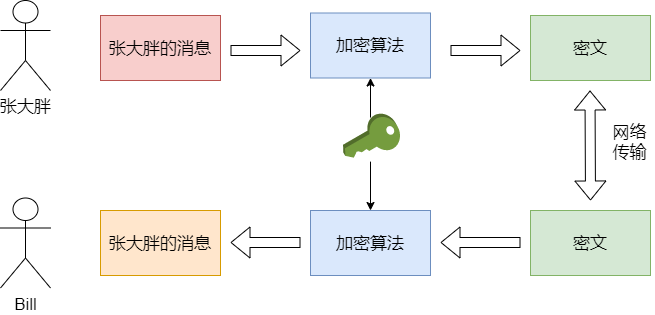
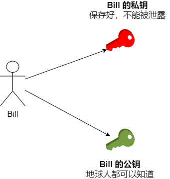
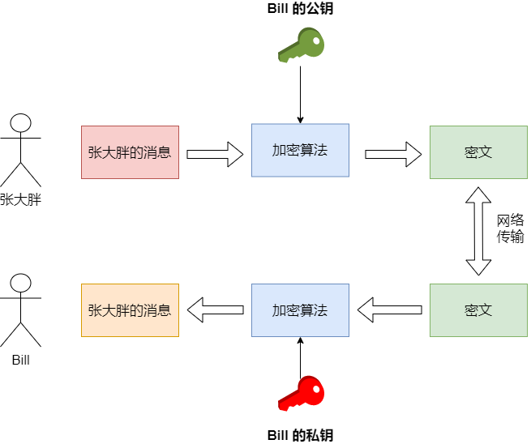
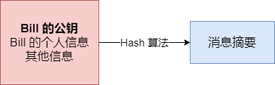
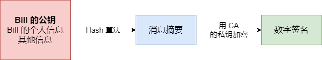
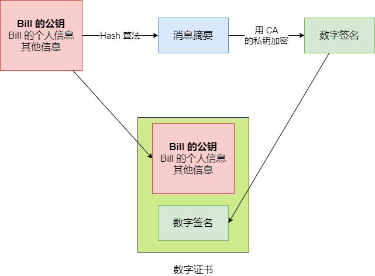
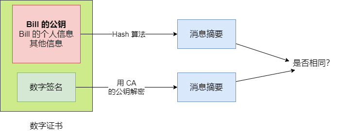
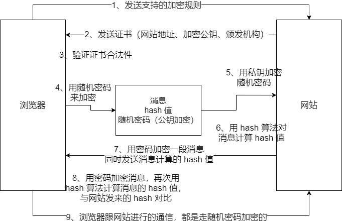

## HTTP

### HTTP 1.0

互联网初期，一般一个网页几乎没什么图片，当时就是挂一些文字，一个网页里就是一堆文字。那个时候使用的是 HTTP 1.0 版本。HTTP 1.0 要指定 `keep-alive` 来开启持久连接，默认是短连接，就是浏览器每次请求都要重新建立一次 tcp 连接，完了就释放 tcp 连接。早期的网页都比较简单，没什么东西，就一些文字，当时你打开一个网页，就是现场底层 tcp 三次握手，跟网站建立一个 tcp 连接，然后通过这个 tcp 连接，发送一次 http 请求，网站返回一个  http 响应（网页的 html，里面有一大段文字），浏览器收到 html 渲染成网页，浏览器就走 tcp 四次挥手，跟网站断开连接了。

到了后面，网页发展很迅猛，一个网页包含着大量的 css、js、图片等资源。比如你请求一个网页，这个网页的 html 先过来。过来之后，浏览器再次发起大量的请求去加载 css、js、图片。打开一个网页可能浏览器要对网站服务器发送几十次请求。

而这时候使用 HTTP 1.0 的短连接是不合适的，几十次频繁的建立 tcp 连接以及释放 tcp 资源，是非常慢的。最慢的不是发送请求和获取响应，而是打开和释放连接，这都是很重的过程。

### HTTP 1.1

http 1.1 默认支持长连接，就是说，浏览器打开一个网页之后，底层的 tcp 连接就保持着，不会立马断开。之后加载 css、js 之类的请求，都会基于这个 tcp 连接来走。http 1.1 还支持 host 头，也就可以支持虚拟主机；而且对断电续传有支持。

浏览器，第一次请求去一个网站的一个页面的时候，就会打开一个 tcp 连接，接着会在一段时间内不关闭。然后接下来这个网页加载 css、js、图片大量的请求全部走同一个 tcp 连接，频繁的发送请求和获取响应，等过了一段时间，这些事情都处理完了，然后才会去释放那一个 tcp 连接。这样可以大幅度提升网页的打开的速度和性能。

### HTTP 2.0

http 2.0 支持多路复用，基于一个 tcp 连接并行发送多个请求以及接收响应，解决了 http 1.1 对同一个时间同一个域名的请求有限制的问题。而且还支持二进制分帧，将传输数据拆分为更小的帧（数据包），提高了性能，实现低延迟高吞吐。

## HTTPS 

http 协议都是明文的，是没有加密的，所以其实现在一般大部分应用都是 https 协议的。HTTPS，是以安全为目标的 HTTPS 通道，简单讲是 HTTP 的安全版。之前是基于 SSL 协议对 http 进行加密，后来又升级到了 TSL 协议来加密。现在我们来看一下HTTPS 的原理。

### HTTPS 故事讲解

为了更好的了解 HTTPS 的原理，我们用一个故事来讲解。

#### 序言

来自中国的张大胖和位于美国的 Bill 进行通信。

#### 总有一种被偷看的感觉

由于张大胖和 Bill 都是使用 HTTP 进行通信，HTTP 是明文的，所以他们的聊天都是可被窥视的。于是，二人想要改变现状，所以 HTTP 首先要解决的问题就是要保证传输的内容只有两个人能看懂。

#### 方法一：使用对称秘钥

两人商量了一下，可以使用对称秘钥进行加密。（对称秘钥就是加密和解密使用的是同一个秘钥）但是问题又来了，既然网络是不安全的，那么最开始的时候怎么将这个对称秘钥发送出去呢？如果对称秘钥在发送的时候就已经被拦截了，那么发送的消息还是会被篡改和窥视。

所以这种对称秘钥的弊端就是，可能被中间人拦截，这样中间人就可以获取到秘钥，就可以对传输的信息进行窥视和篡改。

#### 方式二：使用非对称秘钥

RSA（非对称加密算法）：双方必须协商一对秘钥，一个私钥一个公钥。用私钥加密的数据，只有对应的公钥才能解密；用公钥加密的数据，只有对应的私钥才能解密。

有了这两个漂亮的特性，当张大胖给 Bill 发消息的时候，就可以先用 Bill 的公钥加密（反正 Bill 的公钥是公开的，地球人都知道），等到消息被 Bill 收到后，他就可以用自己的私钥去解密了（只有 Bill 才能解开，私钥是保密的）

返过来也是如此，当 Bill 想给张大胖发送消息的时候，就用张大胖的公钥加密，张大胖收到后，就用紫的私钥解密。这样一来，通信安全就固若金汤了。

但是这样有个弊端：RSA 算法很慢。为了解决这个问题，我们使用**非对称 + 对称秘钥**结合的方式。

#### 方法三：非对称秘钥 + 对称秘钥

使用对称秘钥的好处时速度比较快，使用非对称的好处是可以使得传输的内容不能被破解，因为就算你拦截到了数据，但是没有 Bill 的私钥，也是不能破解内容的。就好像你抢了一个保险柜，但是没有保险柜的钥匙也不能打开保险柜。

所以我们要结合两者的优点，使用 RSA 的算法将加密算法的秘钥发送过去，之后就可以使用这个秘钥，利用对称秘钥来通信了。

#### 中间人攻击

还有一个问题就是在使用非对称秘钥的时候，首先要将 Bill 的公钥给张大胖，那么在这个过程中，安全是没有保证的，中间人可以拦截到 Bill 的公钥，就可以对拦截到的公钥进行篡改。就相当于我有手机号，虽然是公开的，谁都可以给我打电话，但是你一开始并不知道我的手机号，我需要将我的手机号发给你。在我发给你手机号的时候，被中间人拦截了，然后将我正确的手机号改成了错误的手机号，但你并不知道这是错误的手机号。如果你一打电话，那就尴尬了。

### 确认身份---数据证书

所以以上的步骤都是可行的，只需要最后一点就可以了，要确定 Bill 给张大胖的公钥确实是 Bill 的公钥，而不是别人，那怎么确认 Bill 给张大胖的公钥确实是 Bill 的呢？

这个时候就需要公证处的存在 了。也就是说我需要先将我的电话号码到公证处去公证一下，然后我将电话号码传给你，你再将你收到的电话号码和公证处的对比下，就知道是不是我的了。

对应到计算机世界，那就是**数字签名**。

简单来讲是这样的，Bill 可以把他的公钥和个人信息用一个 Hash 算法生成一个**消息摘要**，这个 Hash 算法有个极好的特性，主要输入数据有一点点变化，那生成的消息摘要就会有巨变，这样可以防止别人修改原始内容。

这个时候黑客虽然没办法该公钥，但是可以把整个原始信息都替换了，生成一个新的消息摘要，从而来混淆我们。这个时候，我们就需要有公信力的认证中心（**简称 CA**）用它的私钥对消息摘要加密，形成签名：

这还不算，还要把原始信息和数据签名合并，形成一个全新的东西，叫做 "**数字证书**"

当 Bill 把他的证书发给张大胖的时候，就用同样的 Hash 算法，再次生产消息摘要，然后用 CA 的公钥对数字签名解密，的到 CA 创建的消息摘要，两者一比，就知道有没有人篡改了。

这样子已经算是相当安全了。但是，CA 的这个公钥要怎么拿到？难道不怕攻击者在传输 CA 公钥的时候发起攻击吗？如果攻击者成功的伪装成了 CA，这一套体系就彻底玩完了。

所以折腾了半天，又回到了公钥安全传输的问题。不过要解决鸡生蛋，蛋生鸡的问题，就必须得打破这个怪圈。我必须得信任 CA，并且通过安全的方式获取他们的公钥。

注：这些 CA 本身也有证书来证明自己的身份，并且 CA 的信用是像树一样分级的，高层的 CA 给底层的 CA 做信用背书，而操作系统 / 浏览器会内置一些顶层的 CA 证书，相当于你自动信任了他们。这些顶层的 CA 证书一定得安全地放入操作系统 / 浏览器当中。

### HTTPS 工作原理

HTTPS 的工作原理大概是这样的：

1. 浏览器请求服务端的时候，把自己支持的加密规则发送给网站
2. 服务端从这套加密规则里选出来一套加密算法和 hash 算法，然后把自己的身份信息用数字证书的方式发回给浏览器。证书里有服务端地址、加密公钥、证书颁发结构等。
3. 浏览器验证数字证书的合法性，接着浏览器会生成一个随机密码（就是公钥），然后用证书里的公钥进行加密，这块走的是非对称加密。用约定好的 hash 算法生成握手消息的 hash 值，然后用随机生成的公钥对消息进行加密，然后再把所有的东西都发送给服务端。
4. 服务端从消息里面取出来浏览器用服务端公钥加密后的随机密码，然后后自己的私钥解密取出来密码。然后后密码解密浏览器发来的握手消息，计算握手消息的 hash 值，并验证与浏览器发送过来的 hash 值是否一致，最后用这个随机密码加密一段握手信息，发给浏览器
5. 浏览器解密握手消息，然后计算消息的 hash 值。如果跟网站发来的 hash 一样，握手就结束，之后所有的数据都会由之前浏览器生成的随机密码，用对称加密的方法来进行加密。

## 参考资料

码农翻身公众号

