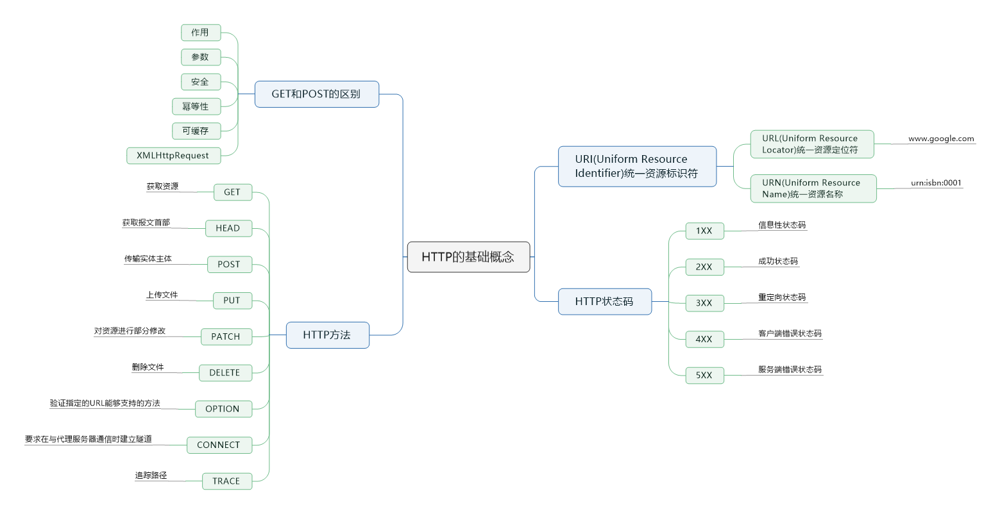

> 本节思维导图

## URI

URI(Uniform Resource Identifier)统一资源标识符，其中包括两个部分：URL(Uniform Resource Locator)统一资源定位符和URN(Uniform Resource Name)统一资源名称。

## HTTP方法

客户端发送的请求报文的第一行为请求行，包含了方法字段。

### GET

> 获取资源

### HEAD

> 获取报文首部

和GET方法类似，但不返回报文实体主体部分。主要用于确认URL的有效性和资源更新的日期时间等。

### POST

> 传输实体主体

POST主要用来传输数据，GET只要用来获取资源

### PUT

> 上传文件

由于自身不带验证机制，任何人都可以上传文件，因此存在安全性问题，一般不使用该方法

### PATCH

> 对资源进行部分修改

PUT也可以用于修改资源，但是只能完全替代原始资源，PATCH允许部分修改。

### DELETE

> 删除文件

与PUT功能相反，并且同样不带验证机制

### OPTIONS

> 查询支持的方法

查询指定的URL能够支持的方法。会返回Allow:GET, POST, HEAD, OPTIONS 这样的内容

CONNECT

TRACE