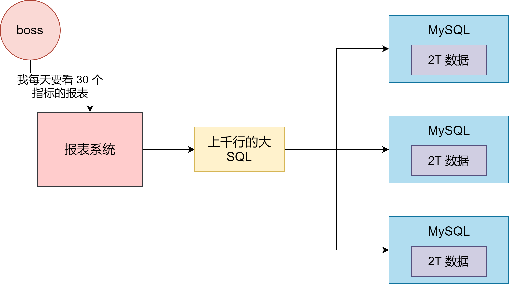
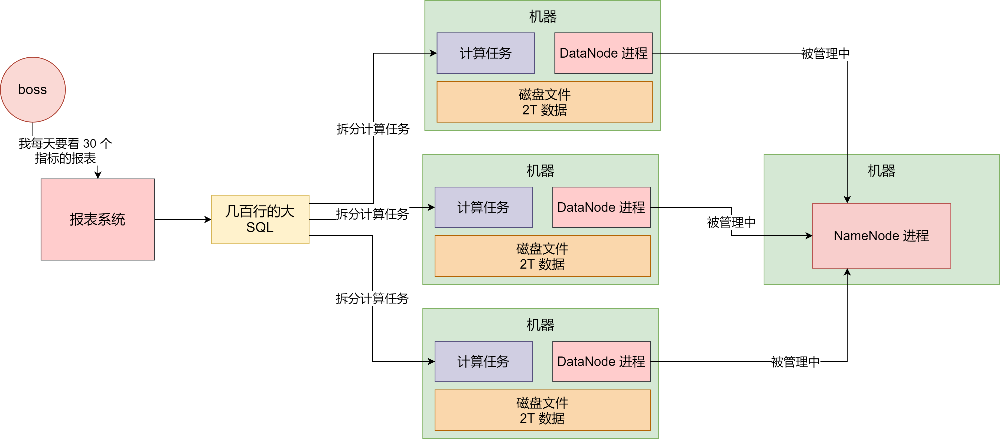
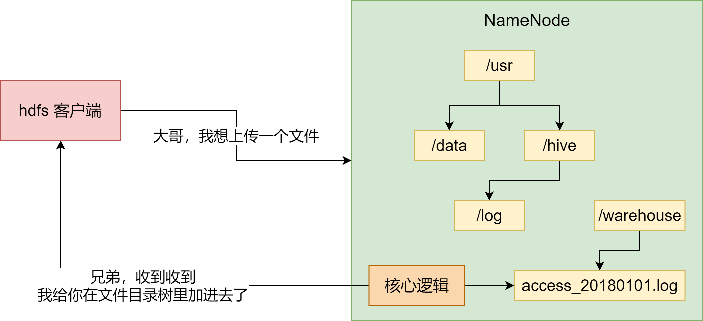
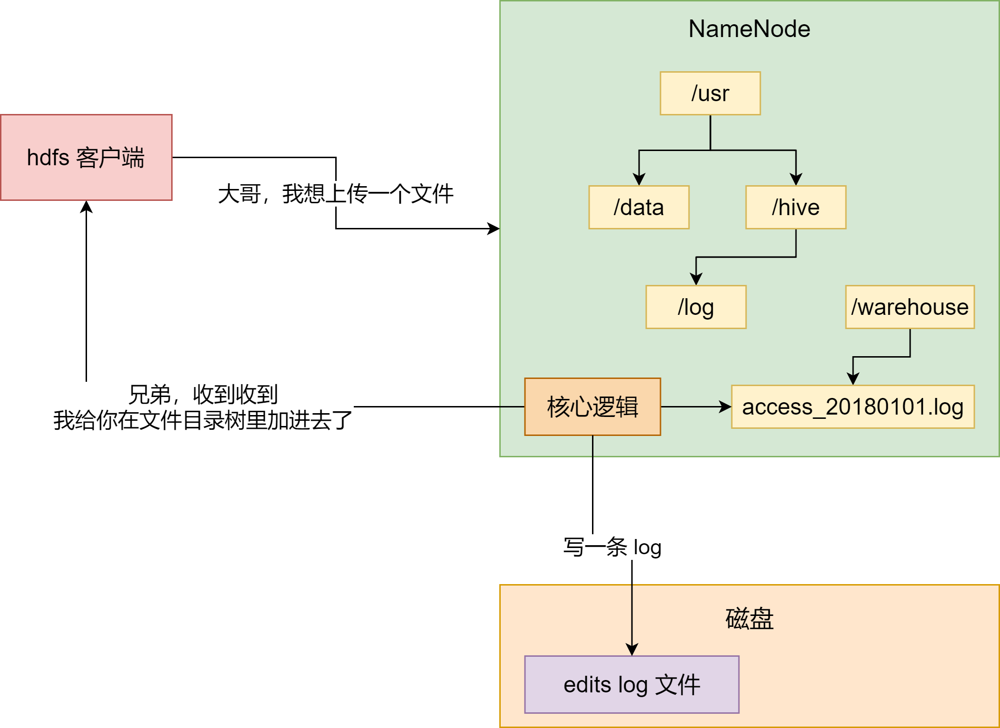
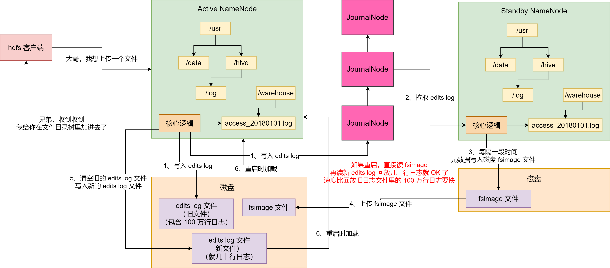
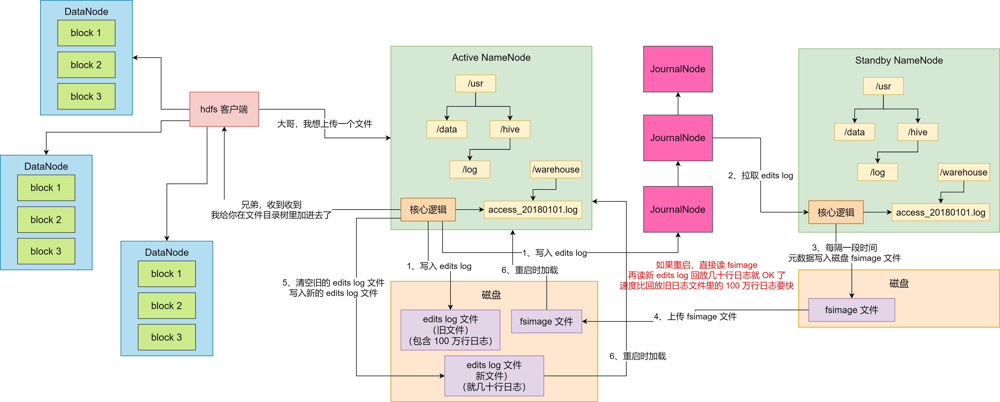

Hadoop 是目前大数据领域最主流的一套技术体系，包含了多种技术。包括 **HDFS**（分布式文件系统）、**YARN**（分布式资源调度系统）、**MapReduce**（分布式计算系统）等等

我们用一个简单的场景来阐述一下 Hadoop。假如你现在公司里的数据都是放在 MySQL 里的，并且全部放在一台数据库服务器上，假设这台服务器的磁盘空间有 2T ，如下：

如果你不停地往这台服务器的 MySQL 里放数据，结果数据量越来越大，超过了 2T 的大小，怎么办？我们可以搞多台 MySQL 服务器，分库分表，每台放一部分数据，就如上图所示，我们搞 3 台数据库服务器，3 个 MySQL 案例，然后每台服务器都可以放 2T 的数据

那么，**所谓的大数据是在干什么**？假设你有一个电商网站，现在要把这个电商网站里所有的用户在页面和 APP 上的点击、购买、浏览的行为日志都存放起来分析。你现在把这些数据全都放在了 3 台 MySQL 服务器，数据量很大，但还是勉强可以放得下

某天，你的 boss 要看一张报表，比如要看某天网站的 X 指标、Y 指标、Z 指标等等二三十数据指标。好，现在你尝试去从那些点击、购买、浏览的日志里，通过写一个 SQL 来分析出那二三十个指标试试看？

你可能会写出来一个几百行起步，甚至上千行的复制大 SQL。这个 SQL，你觉得能运行在分表分库后的 3 台 MySQL 服务器上么？这不现实，几百行的大 SQL 跨库 join，各种复杂计算

因此，大数据的存储和计算压根不是靠 MySQL 来搞的，Hadoop、Spark 等大数据技术体系才应运而生。本质上，**Hadoop、Spark 等大数据技术，其实就是一系列的分布式系统**

比如 Hadoop 中的 HDFS，就是大数据技术体系中的核心基石，**负责分布式存储数据**。HDFS 全程是 Hadoop Distribute File System，是 Hadoop 的分布式文件系统

它由很多机器组成，每台机器上运行一个 `DataNode` 进程，负责管理一部分数据。然后有一台机器运行了 `NameNode` 进程，`NameNode` 大致可以认为是负责管理整个 HDFS 集群的这么一个进程，它里面存储了 HDFS 集群的所有元数据

然后有很多台机器，每台机器存储一部分数据。所以，HDFS 现在可以很好地存储和管理大量的数据了

有人会问：MySQL 服务器不也是这样的吗？这个事情不是你想的那么简单，HDFS 天然就是分布式的技术，所以你上传大量数据，存储数据，管理数据，天然就可以用 HDFS 来做。如果你硬要基于 MySQL 分库分表来做这个事，会痛苦很多，因为 MySQL 并不是设计为分布式系统架构的，它在分布式数据存储这块缺乏很多数据保障的机制

至此，你现在用 HDFS 存储了数据，接着就是要分布式来计算这些数据了。对于分布式计算：

用 `Hive` 写几百行的大 SQL（底层基于 MapReduce）

用 `Spark` 写几百行的大 SQL（底层是 Spark Core 引擎）

总之就是写一个大 SQL，人家会拆分为很多的计算任务，放到各个机器上去，每个计算任务就负责计算一笑部分，这就是所谓的分布式计算。这个，绝对比你针对分库分表的 MySQL 来跑几百行大 SQL 要靠谱得多

整个过程如下图所示：

## HDFS 的 NameNode 架构原理

接着我们讨论一下 HDFS 集群中的 NameNode 核心架构原理

NameNode 有一个很核心的功能：**管理整个 HDFS 集群的元数据**，比如说文件目录树、权限的设置、副本数的设置等等

下面就用最典型的文件目录树的维护，来个大家举例。如下图，现在有一个客户端系统要上传一个 1TB 的大文件的 HDFS 集群里

此时它会先跟 `NameNode` 通信，说：大哥，我想创建一个新的文件，它的名字叫 `/usr/hive/warehouse/access_20180101.log`，大小是 1TB

然后 NameNode 就会在自己内存的文件目录树里，在指定的目录下搞一个新的文件对象，名字是 `access_20180101.log`

这个文件目录树不就是 HDFS 非常核心的一块元数据，维护了 HDFS 这个分布式文件系统中，有哪些目录，有哪些文件

但是有个问题，**这个文件目录树是在 NameNode 的内存里的，你把重要的元数据都放在内存里，万一 NameNode 不小心宕机了，元数据不就全部丢失了？**

可你要是每次都频繁地修改磁盘文件里的元数据，性能肯定是极地的，毕竟这是大量的磁盘随机读写。我们看看 HDFS 是如何优雅地解决的

每次内存里改完，写一条 `edits log`，元数据修改的操作日志到磁盘文件里，不修改磁盘文件内容，就是顺序追加，这个性能就高很多。每次 NameNode 重启的时候，把 `edits log` 里的操作日志读到内存里回放一下，就可以恢复元数据了。如下：

但是，如果 `edits log` 越来越大的话，岂不是每次重启都会很慢？因为要读取大量的 edits log 回放恢复数据

所以 HDFS 引入了一个新的磁盘文件叫 `fsimage`，然后再引入一个 `JournalNodes` 集群，以及一个 `Standby NameNode`（备节点）

每次 `Active NameNode`（主节点）修改一次元数据都会生成一条 `edits log`，**除了写入本地磁盘文件外，还会写入 JournalNodes 集群**

然后 Standby NameNode 就可以从 JournalNodes 集群拉取 edits log，应用到自己内存的文件目录树里，跟 Active NameNode 保持一致

然后每隔一段时间，Standby NameNode 都把自己内存里的文件目录树写一份到磁盘上的 `fsimage`。这可不是日志，这是完整的一份元数据。**这个操作就是所谓的 checkpoint 检查点操作**

然后把这个 `fsimage` 上传到 Active NameNode，接着清空掉 Active NameNode 的旧的 edits log 文件，这里可能都有 100 万行修改日志了

然后 Active NameNode 继续修改接收元数据的请求，再写入 edits log，写了一小会，这里可能就几十行修改日志而已

如果此时 Active NameNode 重启了，没关系，只要把 Standby NameNode 传过来的 fsimage 直接读到内存里，**这个 fsimage 直接就是元数据**，不需要做任何额外操作，纯读取，效率很高

然后把新的 edits log 里少量的几十行的修改日志回放到内存里就 OK 了

这个过程的启动速度就快很多了，因为不需要回放大量上百万行的 edits log 来恢复元数据。如下图：

另外，我们看上面这张图，现在我们又两个 NameNode了

- 一个是主节点对外提供服务接收请求

- 另外一个就是接收和同步主节点的 edits log 以及执行定期 checkpoint 的备节点

他们俩内存里的元数据几乎是一模一样的。所以，如果 Active NameNode 挂了，是不是可以立马切换成 Standby NameNode 对外提供服务？**这不就是所谓的 NameNode 主备高可用故障转移机制么**

接着，HDFS 客户端在 NameNode 内存里的文件目录树，增加了一个文件。这个时候，人家要把数据上传到多台 DataNode 机器上去，这可是一个 1TB 的大文件，咋传？

很简单，**把 1TB 的大文件拆成 N 个 block**，每个 block 是 **128MB**，1TB = 1024GB = 1048576MB，一个 block 是 128MB，那么就对应着 8192 个 block

这些 block 会分布式在不同的机器上管理者，比如说一共有 100 台机器组成的集群，那么每天机器放 80 个左右的 block 就可以了

但是，如果这个时候 1 台机器宕机了，不就导致 80 个 block 丢失了？也就是说上传上去的 1TB 的大文件，会丢失一小部分数据。没关系，HDFS 都考虑好了

它会**默认给每个 block 搞 3 个副本**，一模一样的副本，分别放在不同的机器上，如果一台机器宕机了，同一个 block 还有另外两个副本在其他机器上

如下图，每个 block 都在不同的机器上有 3 个副本，任何一台机器上宕机都没事，还可以从其他的机器上拿到那个 block

这样，上面就是 Hadoop 的基本架构原理

## 参考资料

[兄弟，用大白话告诉你小白都能看懂的Hadoop架构原理](https://juejin.cn/post/6844903713211940877)

