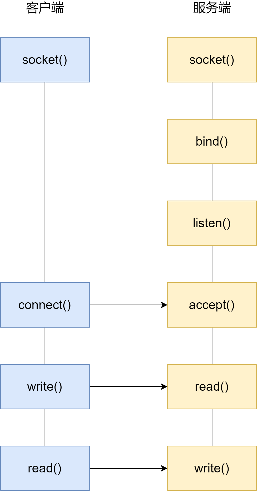

## 最基本的 Socket 模型

要想客户端和服务器能在网络中通信，必须要使用 `Socket` 编程，它是进程间通信里比较特别的方式，特别之处在于它是可以跨主机间通信

Socket 的中文名叫「插口」。事实上，双方要进行网络通信前，各自得创建一个 Socket，这相当于客户端和服务器都开了一个「口子」，双方读取和发送数据的时候，都通过这个口子。这样，是不是觉得很像弄了一根网线，一头插在客户端，一头插在服务器，然后进行通信

创建 Socket 的时候，可以指定网络层使用的是 IPV4 还是 IPV6，传输层使用的是 TCP 还是 UDP。UDP 的 Socket 编程相对简单一些，这里我们只介绍基于 TCP 的 Socket 编程

服务器的程序要先跑起来，然后等待客户端的连接和数据，我们先看服务端的 Socket 编程过程是怎样的

服务端首先调用 `socket()` 函数，创建网络协议为 IPV4 以及传输协议为 TCP 的 Socket，接着调用 `bind()` 函数，给这个 Socket 绑定一个 **IP 地址和端口**，绑定这两个的目的是什么？

- 绑定端口的目的：当内核收到 TCP 报文，通过 TCP 头里面的端口号，来找到我们的应用程序，然后把数据传递给我们

- 绑定 IP 地址的目的：一台机器是可以有多个网卡的，每个网卡都有对应的 IP 地址，当绑定一个网卡时，内核在收到该网卡上的包，才会发给我们

绑定完 IP 地址和端口后，就可以调用 `listen()` 函数进行监听，此时对应下面 TCP 状态图中的 `listen`，如果我们要判定服务器中一个网络程序有没有启动，可以通过 `netstat` 命令查看对应的端口号是否有被监听

服务端进入监听状态后，通过调用 `accept()` 函数，来从内核获取客户端的连接，如果没有客户端连接，则会阻塞等待客户端连接的到来

那客户端是怎么发起连接的呢？客户端在创建好 Socket 后，调用 `connect()` 函数发起连接，该函数的参数要指明服务器的 IP 地址和端口号，然后 TCP 三次握手就开始了

在 TCP 连接的过程中，服务器的内核实际上为每个 Socket 维护了两个队列：

- 一个是还没完全建立连接的队列，称为 **TCP 半连接队列**。这个队列都是没有完成三次握手的连接，此时服务端处于 `sync_rcvd` 的状态

- 一个是已经建立连接的队列，称为 **TCP 全连接队列**。这个队列都是完成了三次握手的连接，此时服务端处于 `established` 装填

当 TCP 全连接队列不为空后，服务端的 `accept()` 函数，就会从内核中的 TCP 全连接队列里拿出一个已经完成连接的 Socket 返回应用程序，后续数据传输都用这个 Socket

注意，监听的 Socket 和真正用来传数据的 Socket 是两个：

- 一个叫做**监听 Socket**

- 一个叫做**已连接 Socket**

连接建立后，客户端和服务端就开始相互传输数据了，双方都可以通过 `read()` 和 `write()` 函数来读写数据 

至此，TCP 协议的 Socket 程序的调用过程就结束了，整个过程如下图：

看到这，是不是觉得读写 Socket 的方式，有点像读写文件。是的，基于 Linux 一切皆文件的理念，在内核中 Socket 也是以「文件」的形式存在的，也是有对应的文件描述符

文件描述符的作用是什么？每一个进程都有一个数据结构：`task_struct`，该结构体里有一个指向「文件描述符数组」的成员指针。该数组里列出这个进程打开的所有文件的文件描述符。数组的下标是文件描述符，是一个整数，而数组的内容是一个指针，指向内核中所有打开的文件的列表，也就是说内核可以通过文件描述符找到对应打开的文件

然后每个文件都有一个 `inode`，Socket 文件的 inode

