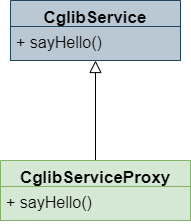

## 什么是动态代理

动态代理即动态的代理模式，所谓动态，是指抽象类（即抽象角色）在编译期是未确定的，在运行期生成。相对的，静态代理中抽象类的行为是在编译期确定的。动态代理是 AOP（面向切面编程）常见的实现方式。


Spring 里使用 AOP，比如说你对一批和它们的方法做了一个切面，定义好了要在这些类的方法里的增强代码，那 Spring 要对那些类生成动态代理，在动态代理中去执行你定义的那些增强代码。

## JDK 动态代理

### 动态代理使用示例

JDK 动态代理使用起来比较简单，只要我们掌握 `Proxy.newProxyInstance` 方法即可。Proxy。newProxyInstance 方法在 JDK 中定义如下：

```java
/**
 * 返回一个受调用处理器 (InvocationHandler) 管理，实现了指定接口的代理类的实例
 *
 * @param   loader 声明这个代理类的 ClassLoader
 * @param   interfaces 代理类实现的接口列表
 * @param   h 处理代理类的调用的调用处理器
 * @return  一个受调用处理器 (InvocationHandler) 管理，实现了指定接口的代理类的实例
 * @throws  IllegalArgumentException 违反了 getProxyClass 函数的参数限制条件
 * @throws  SecurityException 如果安全管理器存在并且下面的任意条件满足：
 *               (1) 传入的 loader 是 null 且调用者的类加载器非空，
 *               使用 RuntimePermission("getClassLoader")权限
 *               调用 SecurityManager#checkPermission禁止访问
 *
 *               (2) 对于每一个代理接口，调用者的类加载器与接口类加载器不同或不是其父类,
 *               并且调用 SecurityManager#checkPackageAccess 无权访问接口
 *
 *               (3) 所有传入的代理接口都是非公共的，且调用者类与非公共接口不在同一个包下，
 *               使用 ReflectPermission("newProxyInPackage.{package name}") 调用
 *               SecurityManager#checkPermission 无访问权限
 * @throws  NullPointerException interfaces 数组参数或其中的元素为 null，以及调用处理器 h 为 null
 */
@CallerSensitive
public static Object newProxyInstance(ClassLoader loader,
                                      Class<?>[] interfaces,
                                      InvocationHandler h)
    throws IllegalArgumentException;
```

从 Javadoc 中我们可以获知，主需要传入相应的类加载器，接口，调用处理器即可产生一个代理实例，那么我们不熟悉的就是 InvocationHandler 类，我们看一下 InvocationHandler 类的代码：

```java
package java.lang.reflect;

/**
* InvocationHandler是代理实例的调用处理器实现的接口。
* 每个代理实例都有一个关联的调用处理器。
* 在调用代理实例的方法时，方法调用将被编码并分派给其调用处理程序的 invoke 方法。
*
* @author      Peter Jones
* @see         Proxy
* @since       1.3
*/
public interface InvocationHandler {

   /**
    * 在代理实例上处理方法调用并返回结果。当在与其关联的代理实例上调用
    * 方法时，将调用处理期上的此方法。
    *
    * @param   proxy 该方法被调用的代理实例
    *
    * @param   method Method 对象将是代理接口声明的方法，它可能是代理
    *                 类继承方法的代理接口的超级接口。
    * @param   args 包含在代理实例的方法调用中传递的参数值的对象数组，
    *               如果interface方法不带参数，则为null。基本类型的参
    *               数被封装在适当的基本封装类的实例中，比如
    *               java.lang.Integer 或者 java.lang.Boolean。
    * @return  调用代理实例上的方法获得的返回值。如果接口方法的声明返
    *          回类型是基本类型，则此方法返回的值必须是相应基本包装类
    *          的实例;否则，它必须是转换为声明的返回类型的类型。如果
    *          此方法返回的值为null，并且接口方法的返回类型为原始类型，
    *          则代理实例上的方法调用将引发NullPointerException。如果
    *          此方法返回的值与上面所述的接口方法的声明返回类型不兼容，
    *          则将通过代理实例上的方法调用抛出ClassCastException。
    *
    * @throws  抛出调用代理实例的方法时抛出的异常。异常的类型必须可以
    *          转化为接口方法的 throws 子句中声明的异常类型，也可以分
    *          配给不强制检查的异常类型 java.lang.RuntimeException 或
    *          java.lang.Error。如果这个方法抛出一个强制检查的异常，
    *          这个异常不能转化为接口方法的 throws 子句中声明的异常类
    *          型，那么将会抛出包含这个异常的
    *          UndeclaredThrowableException 异常。
    *
    * @see     UndeclaredThrowableException
    */
   public Object invoke(Object proxy, Method method, Object[] args)
       throws Throwable;
}

```

从 Javadoc 中我们知道，通过调用 `Proxy.newProxyInstance` 方法创建的代理实例中的方法时，会执行传入的 `InvocationHandler#invoke` 方法，代理实例中方法返回值为 `InvocationHandler#invoke` 方法返回值。


我们做一个测试：

```java
/**
 * 代理接口
 */
public interface ITest {

    String test(String val);
}

/**
 * 代理实现类
 */
public class Test implements ITest {
    @Override
    public String test(String val) {
        return val + "我是Test";
    }
}

/**
 * 调用处理器
 */
public class TestInvocationHandler implements InvocationHandler {
    @Override
    public Object invoke(Object proxy, Method method, Object[] args) throws Throwable {
        System.out.println(method);

        return args[0] + "我是TestProxy";
    }
}

public class Main {

    /**
     * 分别对正常实现的 ITest 实现类和动态代理实现类进行调用
     * @param args
     */
    public static void main(String[] args) {
        ITest test = new Test();
        ITest testProxy = (ITest) Proxy.newProxyInstance(test.getClass().getClassLoader(), new Class[] {ITest.class}, new TestInvocationHandler());

        System.out.println(test.test("Hello，"));
        System.out.println("------------");
        System.out.println(testProxy.test("Hello，"));
    }
}
```

输出结果为：

```
Hello，我是Test
----------
public abstract java.lang.String com.example.demo.Main$ITest.test(java.lang.String)
Hello，我是TestProxy
```

从测试例子中，我们可以看出两个特点：

- 实现了 ITest 接口的实现类并不需要我们手动写，是自动生成并实例化的。

- 调用自动生成的 ITest 代理类实例，将调用 `InvocationHandler#invoke` 方法。


不知各位使用 MyBatis 的时候有没有疑问，为什么可以直接调用接口？答案就在这里，事实上，MyBatis 使用类似的技术，帮我们实现了一个代理类，我们拿到的都是接口的代理类实例。

### JDK动态代理实现原理

为了突出重点，以下代码仅展示与主题相关的代码，防御性编程，异常处理等无关内容已被省略，完整实现请自寻 JDK 源码


那么 Java 的动态代理是怎样实现的呢？我们去 JDK 源码，查看 `Proxy.newProxyInstance` 的实现：

```java
public static Object newProxyInstance(ClassLoader loader,
										Class<?>[] interfaces,
										InvocationHandler h)
	throws IllegalArgumentException {

	final Class<?> intfs = interfaces.clone();
	
	// 通过类加载器和接口使用 getProxyClass0 方法创建实现类
	Class<?> c1 = getProxyClass0(loader, intfs);
	
	// 获得指定构造器
	final Constructor<?> cons = c1.getConstructor(constructorParams);
	
	// 创建实例
	return cons.newInstance(new Object[](h));
}
```

其中两句创建实例的过程都是常见的反射操作，这里不赘述。但是 `getProxyClass0` 方法是如何通过接口创建类的？我们继续跟进 `getProxyClass0` 方法的实现：

```java
private static Class<?> getProxyClass0(ClassLoader loader,
                                    Class<?>... interfaces) {
    return proxyClassCache.get(loader, interfaces);
}
```

我们跟进至 `proxyClassCache.get` 的实现，这应该是一个负责缓存管理的类：

```java
public V get(K key, P parameter) {
	// Cache 置换，检查等实现均已省略，已下是 Cache 未命中时，创建新实现类的代码
	Object subKey = Objects.requireNonNull(subKeyFactory.apply(key, parameter));
	V value = supplier.get();
	return value;
}
```

我们跟进至 `ProxyClassFactory#apply` 的实现：

```java
public Class<?> apply(ClassLoader loader, Class<?> interfaces) {
	for(Class<?> intf : interfaces) {
		interfaceClass = Class.forName(intf.getName(), false, loader);
		// 对 interfaceClass 进行了系列权限检查，实现略
	}
	// 根据 interfaces.accessFlags 产生名为 proxyName 的代理类字节码
	byte[] proxyClassFile = ProxyGenerator.generateProxyClass(proxyName,
												interface, accessFlags);
	// 加载字节码，产生类对象
	return defineClass0(loader, proxyName, proxyClassFile, 0, proxyClassFile.length);
}
```

从代码中，可以看到：

ProxyGenerator.generateProxyClass 用于产生代理类的字节码

defineClass0 用于加载字节码产生类对象

这里的 `defineClass0` 是一个 native 方法，我们不深究。ProxyGenerator.generateProxyClass 是对字节码进行操作。我们做一个小实验：

```java
public class Main2 {
    /**
     * 代理接口
     */
    interface ITest {
        String test(String val);
    }

    public static void main(String[] args) throws IOException {
        // 通过 ProxyGenerator.generateProxyClass 产生字节码
        byte[] testProxyBytes = ProxyGenerator.generateProxyClass("TestProxy", new Class[]{ITest.class});
        // 将字节码输出到文件，然后我们再反编译它，看看它的内容是什么
        FileOutputStream fileOutputStream = new FileOutputStream("TestProxy.class");
        fileOutputStream.write(testProxyBytes);
        fileOutputStream.flush();
        fileOutputStream.close();
    }
}
```

TestProxy.class 反编译后的源码：

```java
public final class TestProxy extends Proxy implements ITest {
    private static Method m1;
    private static Method m2;
    private static Method m3;
    private static Method m0;

    public TestProxy(InvocationHandler var1) throws  {
        super(var1);
    }

    public final boolean equals(Object var1) throws  {
        try {
            return (Boolean)super.h.invoke(this, m1, new Object[]{var1});
        } catch (RuntimeException | Error var3) {
            throw var3;
        } catch (Throwable var4) {
            throw new UndeclaredThrowableException(var4);
        }
    }

    public final String toString() throws  {
        try {
            return (String)super.h.invoke(this, m2, (Object[])null);
        } catch (RuntimeException | Error var2) {
            throw var2;
        } catch (Throwable var3) {
            throw new UndeclaredThrowableException(var3);
        }
    }

    public final String test(String var1) throws  {
        try {
            return (String)super.h.invoke(this, m3, new Object[]{var1});
        } catch (RuntimeException | Error var3) {
            throw var3;
        } catch (Throwable var4) {
            throw new UndeclaredThrowableException(var4);
        }
    }

    public final int hashCode() throws  {
        try {
            return (Integer)super.h.invoke(this, m0, (Object[])null);
        } catch (RuntimeException | Error var2) {
            throw var2;
        } catch (Throwable var3) {
            throw new UndeclaredThrowableException(var3);
        }
    }

    static {
        try {
            m1 = Class.forName("java.lang.Object").getMethod("equals", Class.forName("java.lang.Object"));
            m2 = Class.forName("java.lang.Object").getMethod("toString");
            m3 = Class.forName("com.example.demo.Main2$ITest").getMethod("test", Class.forName("java.lang.String"));
            m0 = Class.forName("java.lang.Object").getMethod("hashCode");
        } catch (NoSuchMethodException var2) {
            throw new NoSuchMethodError(var2.getMessage());
        } catch (ClassNotFoundException var3) {
            throw new NoClassDefFoundError(var3.getMessage());
        }
    }
}
```

通过 ProxyGenerator.generatorProxyClass 生成的类字节码有以下特点：

- 该类继承了 Proxy 实现了传入接口类（ITest）

- 该类在 static 代码块中定义了所有该类包含的方法的 Method 实例。

- 该类有一个构造器 `TestProxy(InvocationHandler var1)` 传入调用处理器。

- 该类所有方法都执行 `super.h.invoke` 并返回结果。

那么这里的 `super.h` 是什么呢，我们看其父类 `Proxy` 的代码：

```java
protected InvocationHandler h;
protected Proxy(InvocationHandler h) {
    Objects.requireNonNull(h);
    this.h = h;
}
```

恍然大悟！这里的 `super.h` 就是 `TestProxy(InvocationHandler var1)` 构造器中传入的h。

### 总结

- 用户通过 `Proxy.newProxyInstance` 方法传入类加载器、接口对象、调用处理器来创建代理类实例。


- JDK 中通过 `ProxyGenerator.generateProxyClass` 方法根据传入接口类对象生成代理类的字节码，并加载字节码产生代理类对象。


- 生成的代理类继承了 Proxy 实现了传入接口类。


- 该类的每一个方法都会执行调用处理器的 invoke 方法，传入相应参数，返回 invoke 方法的返回值

## CGLIB 动态代理

### CGLIB 是什么

CGLIB（Code Generation Library）是一个开源项目，是一个强大的，高性能，高质量的 Code 生成类库，它可以在运行期扩展 Java 类与实现 Java 接口。CGLIB 是一个强大的高性能的代码生成包。它广泛地被许多 AOP 框架使用，例如 Spring AOP 和 dynaop。

### CGLIB 实现动态代理

先来个 service，注意没有接口

```java
public class CglibService {

    public CglibService() {
        System.out.println("CglibDao 构造方法");
    }

    /**
     * 该方法不能被子类覆盖，Cglib是无法代理final修饰的方法的
     * @param name
     * @return
     */
    final public String sayOthers(String name) {
        System.out.println("CglibDao final sayOthers：" + name);
        return null;
    }

    public void sayHello() {
        System.out.println("CglibDao:syaHello");
    }
}
```

新建一个 Interceptor 实现 org.springframework.cglib.proxy.MethodInterceptor

```java
public class MyMethodInterceptor implements MethodInterceptor {
    /**
     *
     * @param o 代理对象
     * @param method 被代理的对象方法
     * @param objects 方法入参
     * @param methodProxy 代理方法
     * @return
     * @throws Throwable
     */
    @Override
    public Object intercept(Object o, Method method, Object[] objects, MethodProxy methodProxy) throws Throwable {
        System.out.println("===========插入前通知===========");
        Object object = methodProxy.invokeSuper(o, objects);
        System.out.println("===========插入后通知===========");
        return object;
    }
}
```

新建测试类

```java
public class cglibAgentTest {

    public static void main(String[] args) {
        Enhancer enhancer = new Enhancer();

        enhancer.setSuperclass(CglibService.class);

        // 设置 enhancer 的回调对象
        enhancer.setCallback(new MyMethodInterceptor());

        // 创建代理对象
        CglibService proxy = (CglibService) enhancer.create();
        // 通过代理对象调用目标方法
        proxy.sayHello();
        proxy.sayOthers("小明");
    }
}
```

打印的值

```
CglibDao 构造方法
======插入前置通知======
CglibDao:sayHello
======插入后置通知======
CglibDao final sayOthers:小明
```

可以看出，会先执行它的构造方法，当调用 sayHello 时会先调用它们的代理方法，如果当方法为 final 修饰时，无法实现代理。

### 原理

CGLIB 可以在运行时，动态生成一个代理类继承我们的目标类，并重写了目标方法，如下：



动态生成的代理类，在方法中调用了父类（目标类）的目标方法，并在调用前后做了一些处理。


## JDK 代理和 CGLIB 代理的区别

这里稍微总结一下两者的区别：


- JDK 动态代理只能对实现了接口的类生成代理，而不能针对类
- CGLIB 是针对类实现代理，主要是对指定的类生成一个子类，覆盖其中的方法（继承）


Spring AOP 选择用 JDK 还是 CGLIB 的依据：


- 当 Bean 实现接口时，Spring 就会用 JDK 的动态代理
- 当 Bean 没有实现接口时，Spring 使用 CGLIB 来实现
- 默认是使用 JDK 代理，可以强制使用 CGLIB（在 Spring 配置中加入 <aop:aspectj - autoproxy proxy-target-class = "true"/>）


JDK 和 CGLIB 的性能对比：


使用 CGLIB 实现动态代理，CGLIB 底层采用 ASM 字节码生成框架，使用字节码技术生成代理类，在 JDK1.6 之前比使用 JAVA 反射要高。唯一需要注意的是，CGLIB 不能对生命为 final 的方法进行代理，因为 CGLIB 原理是动态生成被代理类的子类


## 总结

如果你的类是实现了某个接口的，Spring AOP 会使用 JDK 动态代理，生成一个跟你实现同样接口的一个代理类，构造一个实例对象出来，JDK 动态代理，其实就是在你的类有接口的时候，就会来使用。


如果你的类是没有实现接口的，Spring AOP 会改用 cglib 来动态生成代理，它是生成你的类的一个子类，可以动态生成字节码，覆盖你的一些方法，在方法里加入增强的代理。

## 参考资料

[小豹子带你看源码：JDK 动态代理](https://juejin.im/post/5a546ad051882573443c8eec)


[CGLIB 动态代理](https://juejin.im/post/5d0502d2f265da1ba431ebcc#heading-1)


