## 案例分析

### 日处理上亿数据的计算系统

假设有这么一个数据计算系统，日处理数据量在上亿的规模。简单来说，这个系统就是会不停地从 MySQL 数据库以及其他数据源里大量地加载数据到自己的 JVM 内存里来进行计算，一般情况下的生产负载是每分钟大概需要执行 500 次数据提取和计算的任务。


但这是一套分布式运行的系统，所以生产环境部署了多台机器，每台机器大概每分钟负责执行 100 次数据提取和计算的任务，每次会提取大概 1 万条左右的数据到内存里来计算，平均每次计算大概需要耗费 10 秒左右的时间。然后每台机器是 4 核 8G 的配置，JVM 内存给了 4G，其中新生代和老年代分别是 1.5G 的内存空间。如图：

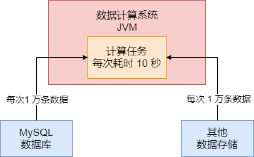

### 这个系统何时塞满新生代

既然这个系统每台机器上部署的实例，每分钟会执行 100 次数据计算任务，每次是 1 万条数据计算需要计算 10 秒的时间，那么每次 1 万条数据大概会占用多大的内存空间呢？


假设平均每条数据在 1KB 左右的大小，那么每次计算任务的 1 万条数据就对应了 10MB 的大小。如果新生代是按照 8 : 1 : 1 的比例来分配 Eden 和两块 Survivor 的区域，那么大体上来说，Eden 区就是 1.2GB，每块 Survivor 区域在 100MB 左右。如图：

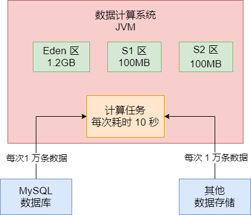

按照上面的内存大小，基本执行一个计算任务，就会在 Eden 区里分配 10MB 左右的对象，一分钟大概对应 100 次计算，基本上一分钟过后，Eden 区里就全是对象，基本就全满了。

### 触发 Minor GC 的时候会有多少对象进入老年代

此时假设新声代的 Eden 区在 1 分钟后都塞满对象了，然后接着继续执行计算任务的时候，势必会导致需要进行 Minor GC 回收一部分的垃圾对象。


之前说过执行 Minor GC 之前会先进行检查。那么首先第一步，先看看老年代的可用内存空间是否大于新生代。此时老年代是空的，大概有 1.5G 的可用内存空间，新生代的 Eden 区大概算他有 1.2G 的对象好了，此时会发现老年代的可用内存空间有 1.5GB，新生代的对象总共有 1.2GB，即使一次 Minor GC 过后，全部对象都存活，老年代也能放得下，那么此时就直接执行 Minor GC 了。


之前说过每个计算任务 1 万条数据需要计算 10 秒钟，所以假设此时的 80 个计算任务都执行结束了，但是还有 20 个计算任务共计 200MB 的数据还在计算中，那么此时就是 200MB 的对象是存活的，不能被垃圾回收掉，然后有 1GB 的对象是可以垃圾回收的。


但是因为剩余的存活对象 200MB 大于 Survivor 区的 100MB 的空间。此时就会通过空间担保机制，让这 200MB 直接进入老年代去，占用里面 200MB 内存空间，然后 Eden就清空了。

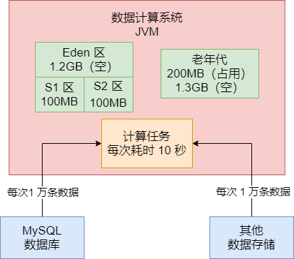

### 系统运行多久，老年代大概会填满

按照上述计算，每分钟都是一个轮回，大概算下来是每分钟都会把新生代的 Eden 区填满，然后触发一次 Minor GC，然后大概会有 200MB 左右的数据进入老年代。假设现在 2 分钟运行过去了，此时老年代已经有 400MB 内存被占用，只有 1.1GB 的内存可用，此时如果第 3 分钟运行完毕，又要进行 Minor GC 会做什么检查呢？


此时会先检查老年代可用空间是否大于新生代全部对象，此时老年代可用空间 1.1GB，新生代对象有 1.2GB，那么此时假设一次 Minor GC 过后新生代对象全部存活，老年代是放不下的，那么此时就得看另一个参数是否打开了。


如果 `-XX:-HandlePromotionFailure` 参数被打开了，此时会进入第二步检查，就是看看老年代可用空间是否大于历次 Minor GC 过后进入老年代的对象的平均大小。我们己经计算过了，每次大概 200MB 对象进入老年代。


那么此时老年代是 1.1GB 空间，是大于每次 Minor GC 后平均 200MB 对象进入老年代的大小的，所以基本可以推测，本次 Minor GC 后大概率还是有 200MB 对象进入老年代，1.1G 可用空间是足够的。所以此时就会放心执行一次 Minor GC，然后又是 200MB 对象进入老年代。


转折点大概在运行了 7 分钟后，7 次 Minor GC 执行过后，大概 1.4G 对象进入老年代，老年代空间就不到 100MB了，几乎快满了。

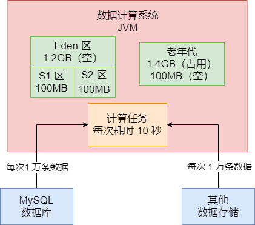

### 这个系统运行多久会触发一次 Full GC

大概在第 8 分钟运行结束的时候，新生代又满了，执行 Minor GC 之前进行检查，此时发现老年代只有 100MB 内存空间了，比之前每次 Minor GC 后进入老年代的 200MB 要小，此时就会触发一次 Full GC。Full GC 会把老年代的垃圾对象都回收了，假设此时老年代被占据的 1.4G 空间里，全部都是可以回收的对象，那么此时一次性就会把这些对象都给回收了。


然后接着就会执行 Minor GC，此时 Eden 区情况，200MB 对象再次进入老年代，之前的 Full GC 就是为这些新生代本次 Minor GC 要进入老年代的对象准备的。如图：


按照这个运行模型，基本上平均就是七八分钟一次 Full GC，这个频率就相当高了，因为每次 Full GC 速度都是很慢的，性能很差。

### 该案例如何进行 JVM 优化

这个系统，其实要优化也是很简单的，因为这个系统是数据计算系统，每次 Minor GC 的时候，必然会有一批数据没计算完毕，但是按照现有的内存模型，最大的问题，就是每次 Survivor 区域放不下存活对象。


所以可以这么优化，增加新生代的内存比例，3GB 左右的堆内存，其中 2GB 分配给新生代，1GB 留给老年代。这样 Survivor 区大概就是 200MB，每次刚好能放得下 Minor GC 过后存活的对象。


只要每次 Minor GC 过后 200MB 存活对象可以放 Survivor 区域，那么等下一次 Minor GC 的时候，这个 Survivor 区的对象对应的计算任务早就结束了，都是可以回收的了。例如此时 Eden 区里的 1.6GB 空间被占满了，然后 Survivor1 区里有 200MB 上一轮 Minor GC 后存活的对象吗，如图：

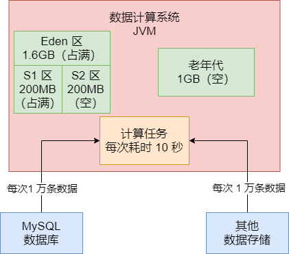

此时执行 Minor GC，就会把 Eden 区里 1.4GB 对象回收掉，Survivor1 区里的 200MB 对象也会回收掉，然后 Eden 区里剩余的 200MB 存活对象会放入 Survivor2 区里，如图：

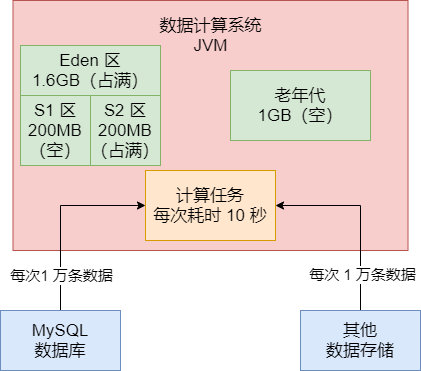

以此类推，基本上就很少对象会进入老年代中，老年代里的对象也不会太多。通过分析和优化，我们成功把系统的老年代 Full GC 的频率从几分钟一次降低到了几个小时一次，大幅度提升了系统的性能，避免了频繁 Full GC 对系统运行的影响。

## 代码示例

### 运行程序用的示例 JVM 参数

使用下面的 JVM 参数运行程序：

```verilog
-XX:NewSize=104857600 -XX:MaxNewSize=104857600 -XX:InitialHeapSize=209715200 -XX:MaxHeapSize=209715200 -XX:SurvivorRatio=8 -XX:MaxTenuringThreshold=15 -XX:PretenureSizeThreshold=20971520 -XX:+UseParNewGC -XX:+UseConcMarkSweepGC -XX:+PrintGCDetails -XX:+PrintGCTimesStamps -Xloggc:gc.log
```


上面的参数需要注意的是 `-XX:PretenureSizeThreshold`，把大对象阈值修改为了 20MB，避免我们程序里分配的大对象直接进入老年代。

### 示例程序

```java
public class Demo1 {

	public static void main(String[] args) throws Exception {
		Thread.sleep(30000);
		while(true) {
			loadData();
		}
	}
	
	private static void loadData() throws Exception {
		byte[] data = null;
		for(int i = 0; i < 4; i++) {
			data = new byte[10 * 1024 * 1024];
		}
		data = null;
		
		byte[] data1 = new byte[10 * 1204 * 1024];
		byte[] data2 = new byte[10 * 1024 * 1024];
		
		byte[] data3 = new byte[10 * 1024 * 1024];
		data3 = new byte[10 * 1024 * 1024];
		
		Thread.sleep(1000);
	}
}
```


j简单解释上面的程序，大概意思就是，每秒钟都会执行一次 loadData() 方法，它会分配 4 个 10MB 的数组，但是都立马成了垃圾。但是会有 data1 和 data2 两个 10MB 的数组时被变量引用必须存活的，此时 Eden 区已经占用了六七十 MB 空间了，接着是 data3 变量依次指向了两个 10MB 的数组，这是为了在 1s 内触发 Young GC 的。

### 基于 jstat 分析程序运行的状态

接着我们基于 jstat 分析程序运行的状态，启动程序后立马采用 jstat 监控其运行状态可以看到如下的信息：

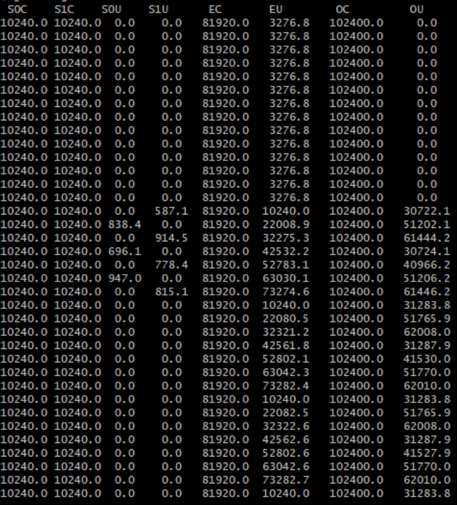


我们一点一点来分析这个 JVM 的运行状态。首先先看如下这一行截图：

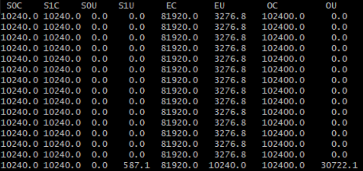


在这里的最后一行，可以看到，程序运行起来之后，在一秒内就发生一次 Young GC，因为按照我们上述的代码，它一定会在一秒内触发一次 Young GC 的。


Young GC 过后，我们发现 S1U，也就是一个 Survivor 区中有 587KB 的存活对象，这应该就是那些未知对象了。然后我们明显看到在 OU 中多出来了 30MB 左右的对象，因此可以确定，在这次 Young GC 的时候，有 30MB 的对象存活了，此时因为 Survivor 区域放不下，所以直接进入老年代了。


接着看下面的图：

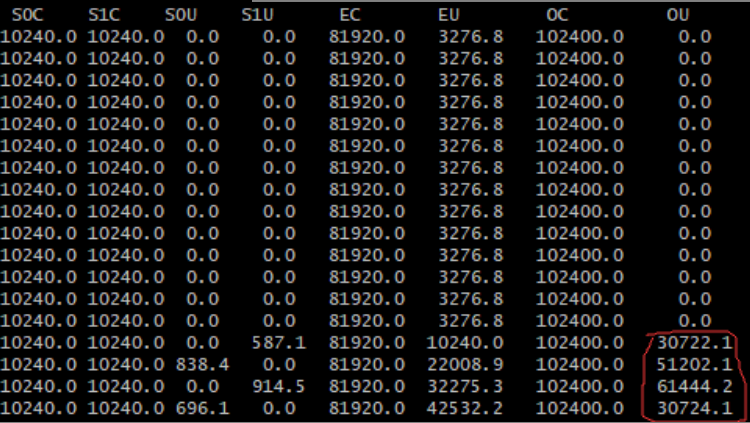


看红圈的部分，很明显每秒会发生一次 Young GC，都是导致 20MB ~ 30MB 左右的对象进入老年代。因为每次 Young GC 都会存活下来这么多对象，但是 Survivor 区域是放不下的，所以会直接进入老年代。此时看到老年代的对象占用从 30KB 一路到 60MB 左右，此时突然在 60MB 之后下一秒，明显发生了一次 Full GC，对老年代进行了垃圾回收，因为此时老年代重新变成了 30MB 了。


为什么会这样？因为老年代总共就 100MB 左右，已经占用了 60MB 了，此时如果发生一次 Young GC，有 30MB 存活对象要进入老年代的话。此时会进行 Full GC，回收掉之前那 60MB，然后再放进去新的 30MB 对象。


所以按照我们的这段代码，几乎是每秒新增 80MB 左右，触发每秒 1 次 Young GC，每次 Young GC 后存活下来 20MB ~ 30MB 的对象，老年代每秒新增 20MB ~ 30MB 的对象，触发老年代几乎三秒一次 Full GC，是不是跟我们上面的案例分析的场景很类似？Young GC 太频繁了，而且每次 GC 后存活对象太多，频繁进入老年代，频繁触发 Full GC。


继续看下图：

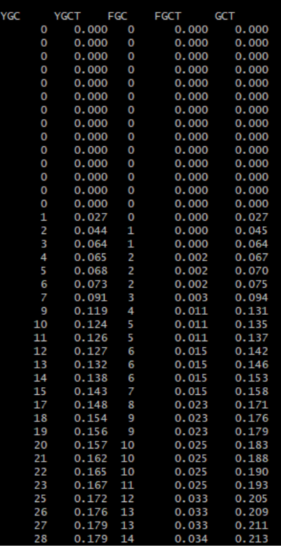


大家看上图，发现 28 次 Young GC，结果耗费了 180 毫秒，平均下来一次 Young GC 要 6 毫秒左右。但是 14 次 Full GC 才耗费 34 毫秒，平均下来一次 Full GC 才耗费两三毫秒。这是为什么？道理是这样，按照上述程序，每次 Full GC 都是由 Young GC 触发的，因为 Young GC 过后存活对象太多要放入老年代，老年代内存不够触发 Full GC，所以必须等 Full GC 执行完毕了，Young GC 才能把存活对象放入老年代才算结束。这就导致 Young GC 也是速度非常慢。

### 对 JVM 性能进行优化

我们只需要调大年轻代的内存空间，增加 Survivor 的内存即可。看如下参数：

```
-XX:NewSize=209715200 -XX:MaxNewSize=209715200 -XX:InitialHeapSize=314572800 -XX:MaxHeapSize=314572800 -XX:SurvivorRatio=2 -XX:MaxTenuringThreshold=15 -XX:PretenureSizeThreshold=20971520 -XX:+UseParNewGC -XX:+UseConcMarkSweepGC -XX:+PrintGCDetails -XX:+PrintGCTimeStamps -Xloggc:gc.log
```


我们把堆大小调整为 300MB，年轻代给了 200MB，同时 `-XX:SurvivorRatio=2` 表明，Eden : Survivor 的比例为 2 : 1 : 1，所以 Eden 区是 100MB，每个 Survivor 区是 50MB，老年代是 100MB。


接着我们用这个 JVM 参数运行程序，用 jstat 来监控其运行状态如下：

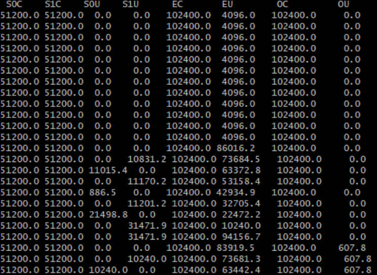


在上图可以看到，每秒的 Young GC 过后，都会有 20MB 左右的存活对象进入 Survivor，但是每个 Survivor 区都是 50MB 的大小，因此可以轻松容纳，而且一般不会超过 50% 的动态年龄判定的阈值。


我们可以清楚地看到每秒触发 Young GC 过后，几乎就没有对象会进入老年代，最终 600KB 的对象进入了老年代里。在看下面的截图：

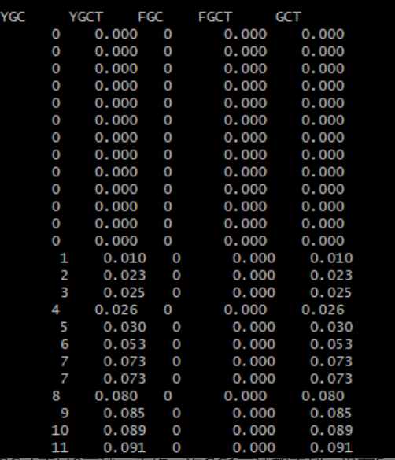


我们可以看到，只有 Young GC，没有 Full GC，而且 11 次 Young GC 才不过 9 毫秒，平均一次 GC 1 毫秒都不到，没有 Full GC 干扰之后，Young GC 的性能极高。


所以这个案例的优化就成功了，同样的程序，仅仅是调整了内存分配比例，立马就大幅度提升了 JVM 的性能，几乎把 Full GC 消灭了。