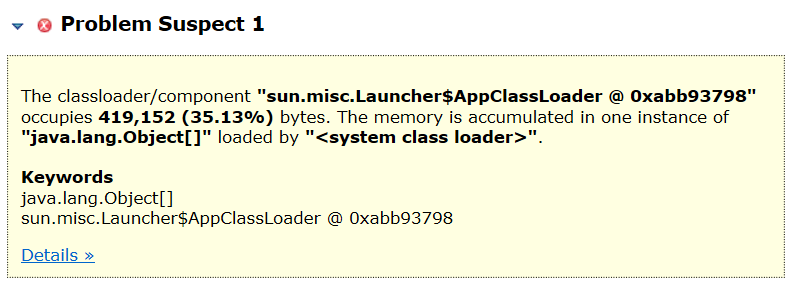
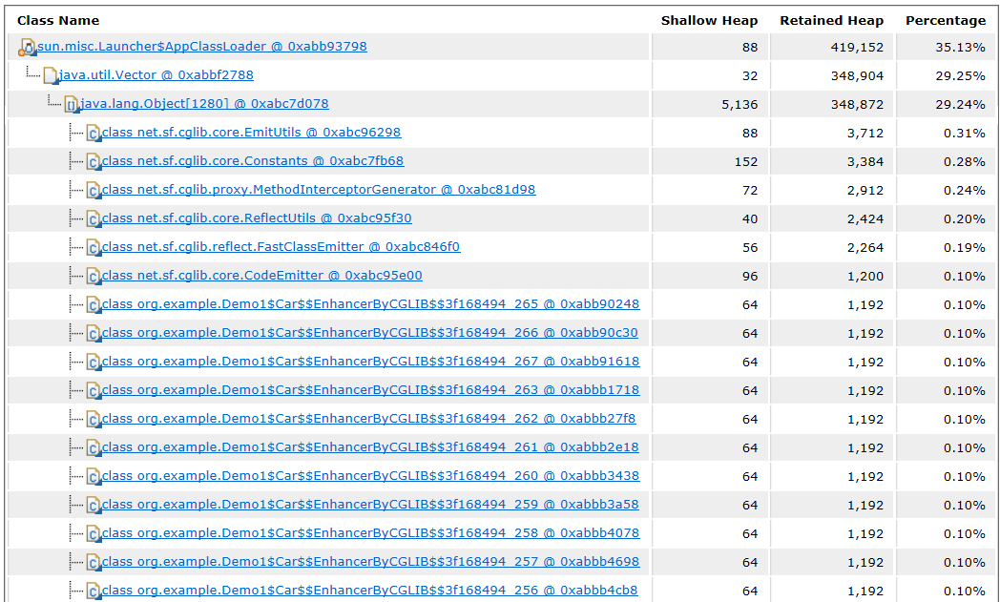
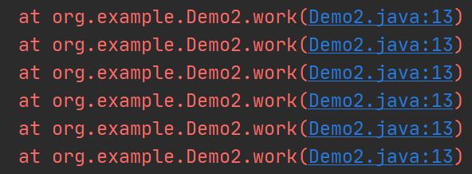
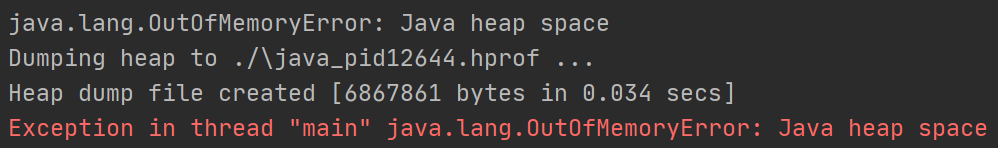
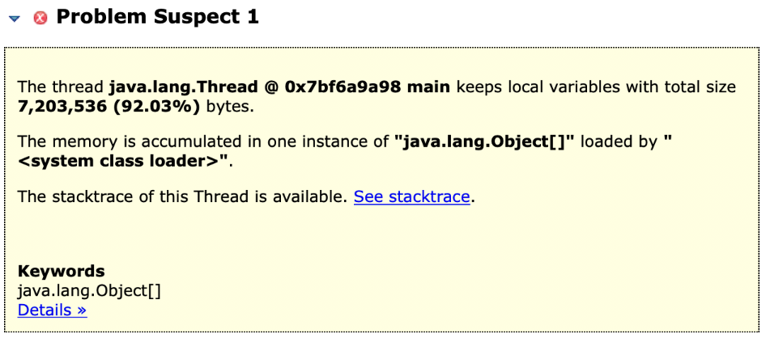
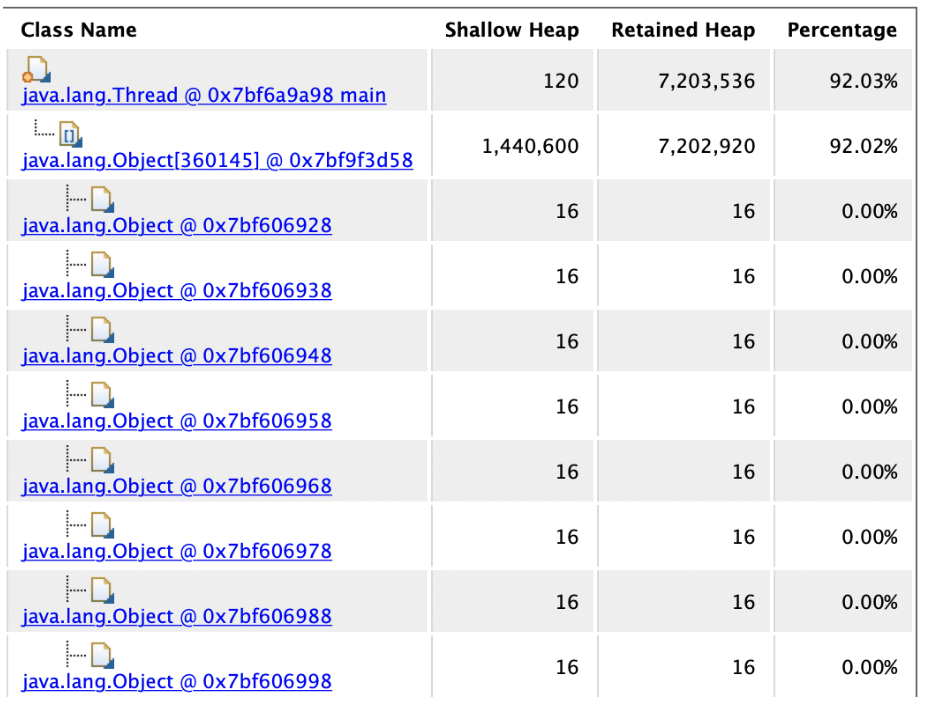
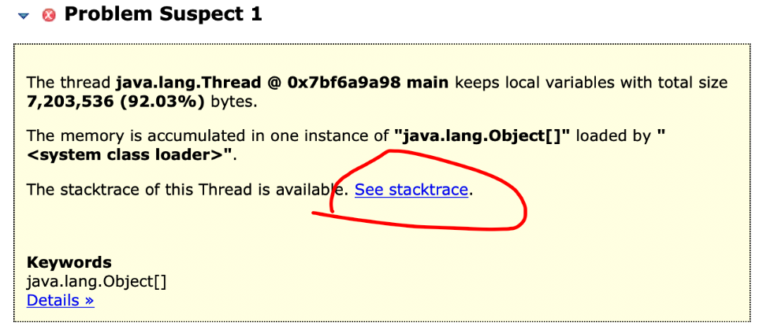
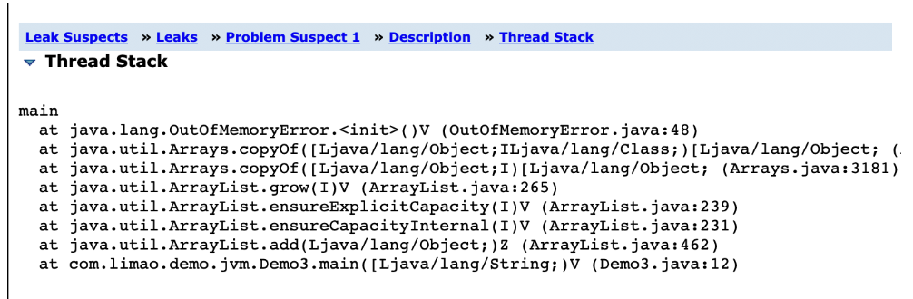

对于内存溢出，我们需要生成并分析一下 GC 日志，然后再让 JVM 自动 dump 出来内存快照，最后用 MAT 来分析一下这份内存快照，从内存快照里去找到内存溢出的原因。


## Metaspace 内存区域溢出

首先我们先看下面的代码：

```java
public class Demo1 {

    public static void main(String[] args) {
        long counter = 0;

        while (true) {
            Enhancer enhancer = new Enhancer();
            enhancer.setSuperclass(Car.class);
            enhancer.setUseCache(false);
            enhancer.setCallback(new MethodInterceptor() {
                @Override
                public Object intercept(Object o, Method method, Object[] objects, MethodProxy methodProxy) throws Throwable {
                    if(method.getName().equals("run")) {
                        System.out.println("启动汽车之前，先进行自动的安全检查。。。。。。");
                        return methodProxy.invokeSuper(o, objects);
                    }else{
                        return methodProxy.invokeSuper(o, objects);
                    }
                }
            });

            Car car = (Car) enhancer.create();
            car.run();

            System.out.println("目前创建了 " + (++counter) + " 个Car类的子类了");
        }

    }

    static class Car {
        public void run() {
            System.out.println("汽车启动，开始行使。。。。。。");
        }
    }

    static class SafeCar extends Car {
        @Override
        public void run() {
            System.out.println("汽车启动，开始行使。。。。。。");
            super.run();
        }
    }
}
```


我们用上面的代码来说明，不过需要在 JVM 参数中加入一些东西，以为我们要看一下 GC 日志和导出内存快照，如下：

```verilog
-XX:+UseParNewGC -XX:+UseConcMarkSweepGC -XX:MetaspaceSize=10m -XX:MaxMetaspaceSize=10m -XX:PrintGCDetails -Xloggc:gc.log -XX:+HeapDumpOnOutOfMemoryError -XX:HeapDumpPath=./
```


注意，上面那个 HeapDumpPath 参数我给调整为当前项目的根目录下了，这样我们看的时候方便一些。


### 分析 GC 日志

我们用上述 JVM 参数运行这段程序，项目下面会多了两个文件，一个是 `gc.log`，还有一个是 `java_pid16056.hrof`。当然不同的机器运行生成的 hrof 文件的名字是不太一样的，因为它会用你的 PID 进程 id 作为文件名字。


接着我们先来分析一下这个 gc.log，看一下它是如何往 Metaspace 区域里放入大量生成的类，然后出发 Full GC，接着回收 Metaspace 区域，回收后还是无法放下更多的类，接着才会抛出内存溢出的异常。然后我们再用 MAT 分析一下 OOM 的时候的内存快照，找 Metaspace 内存溢出的原因。


首先看下面一段 GC 日志：

```verilog
0.716: [GC (Allocation Failure) 0.717: [ParNew: 139776K-> 2677K(157248K), 0.0038770 secs] 139776K-> 2677K(506816K),0.0041376 secs] [Times: user=0.03 sys=0.01, real=0.00 secs]
```


上面那段日志，这是第一次 GC，它本身是一个 Allocation Failure 的问题。即，它是在 Eden 区中分配对象时，发现 Eden 区内存不足，于是触发了一次 ygc。那这个对象是什么对象？


回顾我们的代码，Enhancer 本身是一个对象，它是用来生成类的，`Enhancer enhancer = new Enhancer()`。接着我们基于每次 Enhancer 生成的类还会生成那个类的对象：`Car car = (Car) enhancer.create()`。因此上述代码不光是动态生成类，本身它也是对应很多对象的，因此你在 while(true) 循环里不停地创建对象，当然也会塞满 Eden 区。


上述日志中：`[ParNew: 139776K -> 2677K(157248K), 0.0038770 secs]`，就是说在默认的内存分配下，年轻代一共可用空间是 150MB 左右，然后还包含了一点 Survivor 区域的大小。然后大概用到了 140MB 左右了，也就是 Eden 区塞满了，此时就触发 Allocation Failure，没 Eden 区的空间分配对象了，此时就触发 ygc 了。


接着下面这段日志：

```verilog
0.771: [Full GC (Metadata GC Threshold) 0.771: [CMS: 0K-> 2161 K(349568K), 0.0721349 secs] 20290K->2161 K(506816K),[Metaspace: 9201K->9201K(105881 6K)], 0.0722612 secs] [Times: user=0.12 sys=0.03, real=0.08 secs]
```


这就是 Full GC，而且通过 "Metadata GC Threshold" 清楚看到，是 Metaspace 区域满了，所以触发了 Full GC。这个时候继续看日志：`20290K -> 2161K(506816K)`，这个就是说堆内存（年轻代 + 老年代）一共是 500MB 左右，然后有 20 MB 左右的内存被使用了，这个是年轻代用的。


然后 Full GC 会带着一次 Young GC，因此这次 Full GC 其实是执行了 ygc，所以回收了很多对象，剩下了 2161KB 的对象，这个大概就是 JVM 的一些内置对象了。然后直接就把这些对象放入老年代了：`[CMS: 0K -> 2161K(349568K), 0.0721349 secs]`。这里明显说了，Full GC 带着 CMS 进行了老年代的 Old GC，结果人家本来是 0KB，然后从年轻代转移来了 2161KB 的对象，所以老年代变成 2161KB 了。


接着看日志：`[Metaspace: 9201K -> 9201K(1058816K)]`。此时 Metaspace 区域已经使用了差不多 9MB 左右的内存了，此时明显离我们限制的 10MB 内存很接近了，所以触发了 Full GC，但是对 Metaspace GC 后发现类全部存活，因此还是剩余 9MB 左右的类在 Metaspace 里。


接着看下面的日志：

```verilog
0.843: [Full GC (Last ditch collection) 0.843: [CMS: 2161K-> 1217K(349568K), 0.01 64047 secs] 2161K-> 1217K(506944K),0.843: [Full GC (Last ditch collection) 0.843: [CMS: 2161K-> 1217K(349568K), 0.01 64047 secs] 2161K-> 1217K(506944K),
[Metaspace: 9201K-> 9201K(105881 6K)], 0.0165055 secs] [Times: user=0.03 sys=0.00, real=0.01 secs] 
```


这个又是一个 Full GC，注意这个 `Last ditch collection`。就是说，最后一次拯救机会了，因为之前 Metaspace 回收了一次但是没有类可以回收，所以新的类无法放入 Metaspace 了。所以最后试一试 Full GC，结果如下：`[Metaspace: 9201K -> 9201K(1058816K), 0.0165055 secs]`。Metaspace 区域还是无法回收掉任何的类，几乎还是占满了我们设置的 10MB 左右。


```verilog
0.860: [GC (CMS Initial Mark) [1 CMS-initial-mark: 1217K(349568K)] 1217K(506944K), 0.0002251 secs] [Times: user=0.00 sys=0.00, real=0.00 secs]
0.860: [CMS-concurrent-mark-start]
0.878: [CMS-concurrent-mark: 0.003/0.018 secs] [Times: user=0.05 sys =0.01, real=0.02 secs]
0.878: [CMS-concurrent- preclean-start]
Heap
par new generation total 157376K, used 6183K [0x0000005ffe00000, 0x000000060a8c0000, 0x0000000643790000)
eden space 139904K，4% used [00000005f00000, 0x0000000600409d48, 0x00000006086a0000)
from space 17472K，0% used [000000006086a0000, 0x00000006086a0000, 0x00000006097b0000)
to space 17472K，0% used [00000006097b0000, 0x00000006097b0000, 000000060a8c0000)
concurrent mark- sweep generation total 349568K, used 1217K [0000000643790000, 0000000658c0000,
0x00000007ffe00000)
Metaspace
used 9229K, capacity 10146K, committed 10240K, reserved 1058816K
class space used 794K, capacity 841K, committed 896K, reserved 1048576K
```


接着 JVM 就退出了，退出的时候就打印出了当前内存的一个情况，年轻代和老年代几乎没占用，但是 Metaspace 的 capacity 是 10MB，使用了 9MB，无法再继续使用，所以触发了内存溢出。此时就会在控制台打印出如下的一些东西：

```verilog
Caused by: java.lang.OutOfMemoryError: Metaspace
at java.lang.ClassLoader.defineClass1(Native Method)
at java.lang.ClassLoader.defineClass(ClassLoaderjava:763)
...11 more
```


明确抛出异常，说 OutOfMemoryError，原因就是 Metaspace 区域满了导致的。


### 分析内存快照

当我们知道是 Metaspace 引发的内存溢出之后，可以把内存快照文件从线上机器拷回本地电脑，打开 MAT 工具进行分析，如下：




从这里可以看到实例最多的就是 AppClassLoader。为啥有这么多的 ClassLoader？一看就是 CGLIB 之类的东西在动态生成类的时候搞出来的，我们点击上图的 Detail 进去看看




为什么这里有一堆自己的 Demo1 中动态生成出来的 Car$$EnhancerByCGLIB 的类呢？看到这里就真相大白了，上图告诉了我们，是我们自己的哪个类搞出来了一大堆的动态生成的类，所以填满了 Metaspace 区域。所以此时直接去代码里排查动态生成类即可。


解决这个问题的办法也很简单，直接对 Enhancer 做一个缓存，只有一个，不要无限制地去生成类即可。

```java
    private volatile Enhancer enhancer = null;

    public void doSomething() {

        if(enhancer == null) {
            Enhancer enhancer = new Enhancer();
            enhancer.setSuperclass(Car.class);
            enhancer.setUseCache(false);
            enhancer.setCallback(new MethodInterceptor() {
                @Override
                public Object intercept(Object o, Method method, Object[] objects, MethodProxy methodProxy) throws Throwable {
                    if (method.getName().equals("run")) {
                        System.out.println("启动汽车之前，先进行自动的安全检查。。。。。。");
                        return methodProxy.invokeSuper(o, objects);
                    } else {
                        return methodProxy.invokeSuper(o, objects);
                    }
                }
            });
        }
        Car car = (Car) enhancer.create();
        car.run();
    }
```


## 栈内存溢出

首先，栈内存溢出能根据之前的方法解决吗？其实，栈内存溢出跟堆内存是没有关系的，因为它的本质是一个线程的栈压入了过多方法调用的栈帧，比如几千次方法调用的几千个栈帧，此时就导致线程的堆内存不足，无法放入更多栈帧了。所以 GC 日志对你有用吗？


没用。因为 GC 日志主要是分析堆内存和 Metaspace 区域的一些 GC 情况的，就线程的栈内存而言，它们不存在所谓的 GC。因为调用一个方法时在栈里压入栈帧，接着执行完整的方法，栈帧从栈里出来，然后一个线程运行完毕时，它的栈内存就没了。所以本身这块内存不存在所谓的 GC 和回收，调用方法就给栈分配内存，执行完方法就回收掉那个栈帧的内存。


内存快照呢？内存快照主要是分析一些内存占用的，同样是针对堆内存和 Metaspace 的，所以对线程的栈内存而言，也不需要借助这个东西。


### 示例代码

```java
public class Demo2 {

    public static long counter = 0;

    public static void main(String[] args) {
        work();
    }

    public static void work() {
        System.out.println("目前是第 " + (++counter) + " 次调用方法");
        work();
    }
}
```


使用的 JVM 参数如下：

- -XX:ThreadStackSize=1m

- -XX:+PrintGCDetails

- -Xloggc:gc.log

- -XX:+HeapDumpOnOutOfMemoryError

- -XX:HeapDumpPath=./

- -XX:+UseParNewGC

- -XX:+UseConcMarkSweepGC


### 运行代码后分析异常报错信息的调用栈

接着我们运行代码让它产生栈内存溢出的保存，如下：




实际上我们会在这里看到大段如上所示的异常，即，它会直接告诉你这个栈内存溢出的问题，是因为你拼命地调用 Demo2 这个类的 work() 方式时发生的。因此就定位栈内存溢出而言，我们定位和解决问题非常简单，你只要把所有的异常都写入本地日志文件，那么当你发现系统崩溃时，第一步就去日志里定位一下异常信息就知道了


## 堆内存溢出

我们看下面的示例代码：

```java
public class Demo3 {

    public static void main(String[] args) {
        Long counter = 0L;

        List<Object> list = new ArrayList<>();
        while (true) {
            list.add(new Object());
            System.out.println("当前创建了第" + (++counter) + "个对象");
        }
    }
}
```


采用的 JVM 参数如下：

- -Xms10m

- -Xmx10m

- -XX:+PrintGCDetails

- -Xloggc:gc.log

- -XX:+HeapDumpOnOutOfMemoryError

- -XX:HeapDumpPath=./

- -XX:+UseParNewGC

- -XX:+UseConcMarkSweepGC


接着我们运行上述程序。


### 运行后的观察

其实堆内存溢出的现象也是很简单的，在系统运行一段时间之后，直接会发现系统崩溃了，然后登陆到线上机器检查日志文件，先看为什么崩溃。





这就告诉我们是 Java 堆内存溢出了，而且他还给我们导出了一份内存快照。所以我们 GC 日志都不用分析了，因为堆内存往往对应着大量的 GC 日志，所以分析起来很麻烦。此时直接将线上自动导出的内存快照拷贝会本地电脑，用 MAT 分析即可。


### 用 MAT 分析内存快照

使用 MAT 打开内存快照之后会看到下图：




这次 MAT 比较简单，直接在内存泄露报告中告诉我们内存溢出原因只有一个，只有上面哪一个问题，因为它没提示任何其他的问题。


我们看这句：`The thread java.lang.Thread @ 0x7bf6a9a98 main keeps local variables with total size 7203536(92.03%) bytes`。这个意思就是 main 线程通过局部变量引用了 7203536 个字节对象，大概是 7MB左右。考虑到我们总共就给堆内存 10MB，所以 7MB 基本上就已经到极限了，是差不多的。


接着看：`The memory is accumulated in one instance of "java.lang.Object[]" loaded by "< system class loader >"`。这句话的意思就是内存都被一个对象占用了，就是 java.lang.Object[]。我们不知道这个是什么东西，所以点击 `Details` 继续往下看：




在 `Details` 里我们能看到这个东西，也就是占用了 7MB 内存的 java.lang.Object[]，它里面的每个元素在这里都有，我们看到的是一大堆的 java.lang.Object。这些 java.lang.Object 不就是我们在代码里创建的吗？至此就很清楚了，我们知道是一大堆 Object 对象占用了 7MB 的内存导致了内存溢出。


接着就是要知道这些对象是怎么创建出来的，我们看下图：




这个是说可以看看创建那么多对象的线程，它的一个执行栈，这样我们就知道这个线程执行什么方法的时候创建了一大堆的对象。




大家看上面的调用栈，在 Demo3.main() 方法中，一直在调用 ArrayList.add() 方法，然后此时直接引发了内存溢出。所以我们只要在对应代码里看一下，立马就知道怎么回事了。接下来优化对应的代码即可，就不会发生内存溢出了。


### 总结

堆内存溢出的问题如何分析和定位？一个是必须在 JVM 参数中加入自动导出内存快照，一个是到线上看一下日志文件里的报错，如果是堆溢出，立马用 MAT 分析内存快照。


MAT 分析的时候，先看占用内存最多的对象是谁，然后分析那个线程的调用栈，接着就可以看到是哪个方法引发的内存溢出了，接着优化代码即可。