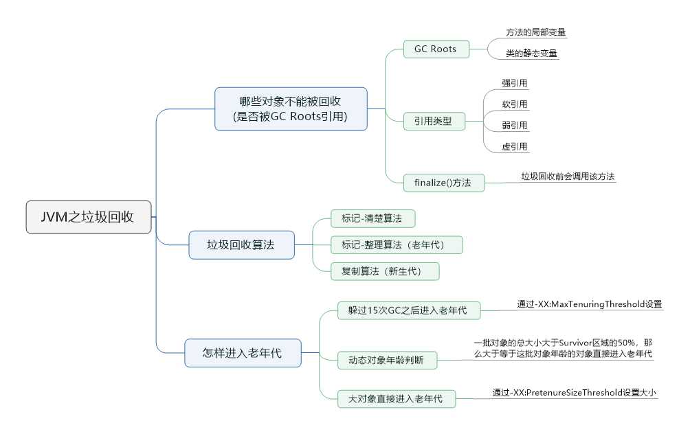
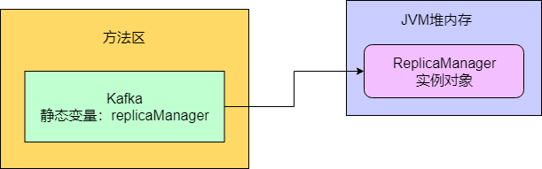
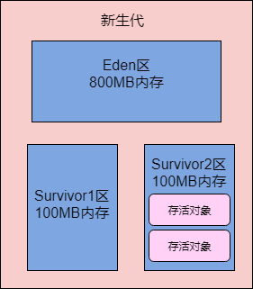

> 本节思维导图



​		在Java中，平时我们系统运行创建的对象都是优先分配在新生代里的。如果新生代里的对象越来越多，都快满了，此时就会触发垃圾回收，把新生代没有引用的对象给回收掉，从而释放内存空间。现在我们来看看，JVM是按照什么规则来回收垃圾对象的。

## 哪些引用对象不能被回收

​		JVM中使用了**可达性分析算法**来判定哪些对象是可以被回收的。这个算法的意思是，**对每个对象，都分析一下有谁在引用他，然后一层一层往上去判断，看是否有一个`GC Roots`**。其中**方法的局部变量、类的静态变量**都可以看做是一种GC Roots。

### 案例

​		如下一段代码，就是在一个方法中创建了一个对象，然后有一个局部变量引用了这个对象。

```java
public class Kafka {

    public static void main(String[] args) {
        loadReplicaFromDisk();
    }

    public static void loadReplicaFromDisk() {
        ReplicaManager replicaManager = new ReplicaManager();
    }
}
```

​		分析代码可知，“main()”方法的桢栈入栈，然后调用“loadReplicaFromDisk()”方法，桢栈入栈，接着让局部变量“replicaManager”引用堆内存里的“ReplicaManager”实例对象，如下图：


​		现在上图中“ReplicaManager”对象被局部变量给引用了，此时一旦新生代满了，发生垃圾回收，就会分析这个“ReplicaManager”对象的可达性。此时会发现它是不能被回收的，因为它被人引用了，而且是局部变量“replicaManager”引用的。

​		只要一个对象被局部变量引用了，那么说明它有一个GC Roots，此时就不能被回收了。

​		另外一种情况，如下面代码：

```java
public class Kafka {

    public static ReplicaManager replicaManager = new ReplicaManager();
}
```



​		跟上面的那个一样，一分析，发现“ReplicaManager”对象被Kafka类的一个静态变量"replicaManager"给引用了，此时就不会去回收它。

​		总结：**只要你的对象被方法的局部变量、类的静态变量给引用了，就不会回收它们**。

### Java中对象不同的引用类型

​		关于引用和垃圾回收的关系，我们要有一个概念，就是Java里有不同的引用类型。分别是**强引用、软引用、弱引用和虚引用**。

#### 强引用

​		强引用，就是类似下面的代码：

```java
public class Kafka {

    public static ReplicaManager replicaManager = new ReplicaManager();
}
```

​		这个就是最普通的代码，一个变量引用一个对象。**只要是强引用的类型，那么垃圾回收的时候就绝对不会去回收这个对象的**。

#### 软引用

​		软引用，类似下面的代码：

```java
public class Kafka {

    public static SoftReference<ReplicaManager> replicaManager = 
            new SoftReference<ReplicaManager>(new ReplicaManager());
}
```

​		就是把“ReplicaManager”实例对象用一个“SoftReference”软引用类型的对象给包裹起来，此时这个“replicaManager”变量对“ReplicaManager”对象的引用就是软引用了。

​		正常情况下垃圾回收时不会回收软引用对象的，但是如果进行垃圾回收之后，发现内存空间还不不够存放新的对象，此时就会把这些软引用对象给回收了。即便它被变量引用了，但是因为它是软引用，所以还是可以回收的。

#### 弱引用

​		弱引用，类似下面代码：

```java
public class Kafka {

    public static WeakReference<ReplicaManager> replicaManager =
            new WeakReference<ReplicaManager>(new ReplicaManager());
}
```

​		弱引用就跟没有引用是类似的，如果发生垃圾回收，就会把这个对象回收掉。

#### 虚引用

​		 虚引用，正如其名，对一个对象而言，这个引用形同虚设，有和没有一样。此外，虚引用必须和引用队列一起使用。

### finalize()方法的作用

​		从上面可知，有GC Roots引用的对象不能回收，没有GC Roots引用的对象可以别回收。如果有GC Roots引用，但是引用时软引用或者弱引用，也有可能被回收。

​		但是没有GC Roots引用的对象，一定会被立马回收吗？其实并不是，这里有一个`finalize()`方法可以抢救一下。如下代码：

```java
public class ReplicaManager {
    
    public static ReplicaManager instance;

    @Override
    protected void finalize() throws Throwable {
        ReplicaManager.instance = this;
    }
}
```

​		如果有一个ReplicaManager对象要被垃圾回收了，那么假如这个对象重写了Object类中的finalize()方法。此时会先尝试调用它的finalize方法，看是否把这个实例对象给了某个GC Roots变量，比如上面代码就给了ReplicaManager类的静态变量。这样就重新让某个GC Roots变量引用了自己，那么就不用被垃圾回收了。

## 垃圾回收算法

### 标记-清除算法

​		改算法会从每个GC Roots出发，依次标记没有引用关系的对象，最后将没有被标记的对象清除。但是这种算法会带来大量的空间碎片，导致需要分配一个较大连续空间时容易触发full GC.

### 标记-整理算法

​		为了解决“标记-清除”算法导致的大量内存碎片问题，又提出了“标记-整理算法”。改算法类似计算机的磁盘整理，首先会从GC Roots出发标记存活的对象，然后将存活的对象整理到内存空间的一端，形成连续的已使用空间，最后把已使用空间之外的部分全部清除掉，这样就不会产生空间碎片的问题。

### 复制算法

​		为了能够并行地标记和整理，将空间分为两块，每次只激活其中一块，垃圾回收时只需把存活的对象复制到另一块未激活的空间上，将未激活空间标记为已激活，将已激活空间标记为未激活，然后清除原空间中的原对象。两块空间就这么重复循环使用。**复制算法现作为主流的YGC算法进行新生代的垃圾回收**。

#### JVM中对复制算法的优化

​		在实际真正的复制算法中，把新生代内存区域划分为三块：1个Eden区，2个Survivor区。其中Eden区占80%内存空间，每一块Survivor区各占10%内存空间。平时可以使用的，就是Eden区和其中一块Survivor区。但是刚开始对象都是分配在Eden区的，如果Eden区满了吗，此时就会触发YGC。

​		此时就会把Eden区中的存活对象都一次性转移到空着的Survivor区，接着Eden区就会被清空，然后再次分配新对象到Eden区。这就就会变成Eden区和Survivor区里都是有对象的，其中Survivor区里放的是上一个YGC存活后的对象。

​		这么设计会始终保持一个Survivor区的空着的，就这样一直循环只用这三块内存区域。这么最最大的好处是，只有10%的空间时被闲置的，90%的内存都被用上了。

## 老年代和新生代

### 怎样变成老年代

​		对象一般都先分配在新生代，但什么情况下新生代会变成老年代呢？

#### 躲过15次GC之后进入老年代

​		一般情况下，我们系统刚启动的时候，创建的各种各样的对象，都是分配在新生代里的。然后系统跑着跑着，新生代就满了，此时就会触发Minor GC，可能就是1%的少量存活对象转移到空着的Survivor区中。然后系统继续运行，继续在Eden区了分配各种对象。大概就是这个流程。

​		但那些每次在新生代里躲过一次GC被转移到一块Survivor区域中，它的年龄就会增长一岁。默认情况下，当对象的年龄达到15岁时，也就是躲过15次GC的时候，它就会转移到老年代里去。具体是多少岁进入老年代，可以通过参数`-XX:MaxTenuringThreshold`来设置，默认是15岁。

#### 动态对象年龄判断

​		这里跟这个对象年龄有另外一个规则可以让对象进入老年代，不用等待15次GC过后才可以。大致的规则是：**假如当前放对象的Survivor区域里，一批对象的总大小大于了这块区域的内存大小的50%，那么此时大于等于这批对象年龄的对象，就可以直接进入老年代了**。



​		假设图里的Survivor2区有两个对象，这两对象的年龄一样，都是2岁。然后这两对象加起来超过了50MB，超过了Survivor2区的100MB内存的一半了，这个时候，Survivor2区里的大于等于2岁的对象，就要全部进入老年代里去。

​		这就是所谓的动态年龄判断的规则。实际上这个规则运行的时候是如下的逻辑：**年龄1 + 年龄2 + 年龄n的多个年龄对象总和超过了Survivor区域的50%，此时就会把年龄n以上的对象都放入老年代**。

#### 大对象直接进入老年代

​		有一个JVM参数，就是`-XX:PretenureSizeThreshold`，可以把他的值设置为字节数，比如“1048576”，就是1MB。它的意思是，**如果你要创建一个大于等于这个大小的对象，比如一个超大的数组，此时就直接把这个大对象放到老年代去，不会经过新生代**。

​		这么做的原因，就是要避免新生代里出现那种大对象，然后屡次躲过GC，还得把它在两个Survivor区域里来回复制多次之后才能进入老年代，那么大的对象在内存里来回复制，浪费时间。

### Minor GC后的对象太多无法放入Survivor区怎么办

​		如果Minor GC后的对象太多无法放入Survivor，那么这个时候就必须把这些对象直接转移到老年代中去。

### 老年代空间分配担保规则

1. 在执行任何一次Minor GC之前，JVM会先检查一下老年代可用的内存空间，是否大于新生代所有对象的总大小。为什么检查这个，因为极端情况下，可能新生代Minor GC过后，所有对象都存活下来。
2. 如果老年代的内存大小是大于新生代所有对象的，此时就可以放心大胆的对新生代发起一次Minor GC。因此即使Minor GC之后所有对象存活，Survivor区放不下，也可以转移到老年代去。
3. 如果老年代的可用内存已经小于新生代的全部对象了，就去看`-XX:-HandlePromotionFailure`参数是否设置。
4. 如果设置了，就看老年代的内存大小，是否大于之前每一次Minor GC后进入老年代的对象的平均大小。例如，之前每次Minor GC后，平均都有10MB左右的对象会进入老年代，那么此时老年代可用内存大于10MB。很可能这次Minor GC过后也是差不多10MB左右的对象会进入老年代，此时老年代空间是够的。
5. 如果判断失败，或者是`-XX:-HandlePromotionFailure`参数没设置，此时就会触发一次“Full GC”，就是对老年代进行垃圾回收，尽量腾出一些内存空间，然后再执行Minor GC。
6. 如果上面两个步骤都判断成功了，那就可以冒风险尝试一下Minor GC。此时进行Minor GC有几种可能。
7. 第一种可能，Minor GC过后，剩余存活的对象的大小小于Survivor区的大小，那么此时存活对象进入Survivor区域即可。
8. 第二种可能，Minor GC过后，剩余的存活对象的大小，大于Survivor区域的大小，但是小于老年代可用内存大小，此时直接进入老年代。
9. 第三种可能，Minor GC过后，剩余的存活对象的大小，大于Survivor区域的大小，也大于老年代可用内存的大小。此时老年代都放不下这些存活对象了，就会发生“Handle Promotion Failure”的情况，这个时候就会触发一次“Full GC”。Full GC就是对老年代进行垃圾回收，同时一般也会对新生代进行垃圾回收。
10. 如果Full GC之后，老年代还是没有足够的空间存放Minor GC过后的剩余存活对象，那么此时就会导致所谓的“OOM”内存溢出。

### 老年代垃圾回收算法

​		通过上面的内容，可以总结一句话：对老年代触发垃圾回收时机，一般就是两个：

- 在Minor GC之前，检查发现很可能Minor GC之后要进入老年代的对象太多了，老年代放不下，此时需要提前触发Full GC然后再带着进行Minor GC。
- 在Minor GC之后，发现剩余对象太多，老年代内存不够。

​        那么对老年代进行垃圾回收采用的是什么算法呢？简单地说，就是上面提到过的**标记-整理算法**。但是，这个老年代的垃圾回收算法的速度比新生代的垃圾回收算法的速度慢10倍。如果系统频繁出现老年代的Full GC，会导致系统性能被严重影响，出现频繁卡顿的情况。

​		其实， 所谓JVM优化，就是尽可能让对象都在新生代里分配和回收，尽量别让太多对象频繁进入老年代，避免频繁对老年代进行垃圾回收，同时给系统充足的内存大小，避免新生代频繁的进行垃圾回收。 

