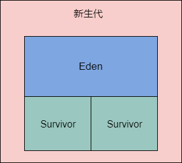
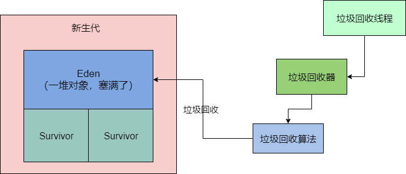
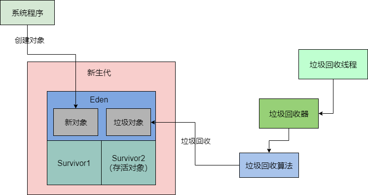
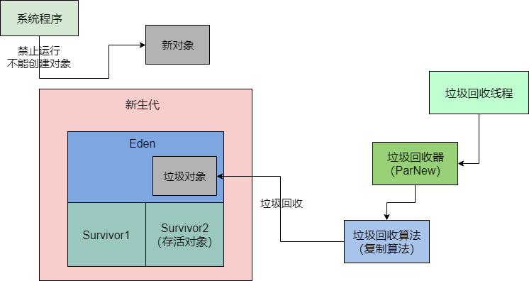
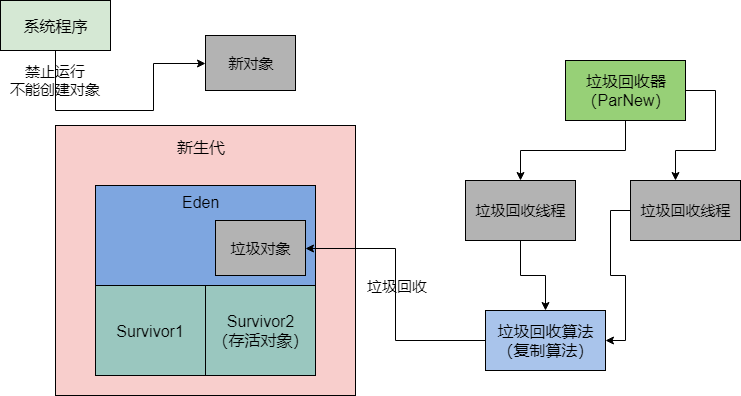

​		在新生代和老年代进行垃圾回收的时候，都是要用垃圾回收器进行回收的，不同的区域用不同的垃圾回收器。常用的垃圾回收机有一下几种：

- **Serial和Serial Old垃圾回收器**：分别用来回收新生代和老年代的垃圾对象。工作原理就是单线程运行，垃圾回收的时候会停止我们自己写的系统的其他工作线程，让我们系统直接卡死不动，然后让他们垃圾回收，这个现在一般写后台Java系统几乎不用。
- **ParNew和CMS垃圾回收器**：ParNew现在一般都是用在新生代的垃圾回收器，CMS是用在老年代的垃圾回收器，他们都是多线程并发的机制，性能更好，现在一般是线上生产系统的标配组合。
- **G1垃圾回收器**：统一收集新生代和老年代，采用了更加优秀的算法和设计机制。下面会详细介绍这个G1垃圾回收器。

## GC的大概流程

​		看下图，新生代的内存一般都是分为一个Eden和两个Survivor



​		此时系统不停的运行，然后把Eden给塞满了，此时就会触发Minor GC。**进行垃圾回收时有专门的垃圾回收线程的，而且对不同的内存区域会有不同的垃圾回收器**。相当于垃圾回收线程和垃圾回收器配合起来，使用自己的垃圾回收算法，对指定的内存区域进行垃圾回收。



​		由上图可知，垃圾回收会通过一个后台运行的垃圾回收线程来执行它具体的一个逻辑。比如针对新声代我们会用ParNew垃圾回收器进行回收，然后ParNew垃圾回收器针对新生代采用的就是复制算法来垃圾回收。

### GC的时候还能继续创建新的对象吗

​		我们写好的Java系统在运行期间能不能继续在新生代里创建新的对象？假设一个场景，如下图：



​		如果所示，如果一边垃圾回收器在想办法把Eden和Survivor2里的存活对象标记出来转移到Survivor2去，然后还在想办法把Eden和Survivor2的垃圾对象清理掉，结果这个时候系统程序还在不停的在Eden里创建新的对象。而这些新的对象很快就成了垃圾对象，有的还有人引用是存活对象。这样子就会全部乱套了，对于程序新创建的这些对象，你怎么让垃圾回收器去持续追踪这些新对象的新状态？所以，在垃圾回收过程中，同时还允许我们写的Java系统不停的运行在Eden里持续创建新的对象，目前来看是不合适的。

## Stop the World

​		由上述可知，平时使用的JVM最大的痛点，就是在垃圾回收的这个过程。因为在垃圾回收的时候，尽可能让垃圾回收器专心致志的干活，不能随便让我们写的Java系统继续创建对象了，所以此时JVM会在后台直接进入“stop the World”状态。即，**它会直接停止我们写的Java系统的所有工作线程，让我们写的代码不再运行，然后让垃圾回收线程可以专心致志地进行垃圾回收的工作**。



​		这样的话，就可以让我们的系统暂停运行，然后不再创建新的对象，同时让垃圾回收线程尽快完成垃圾回收的工作，就是标记和转移Eden和Survivor2的存活对象到Survivor1中去，然后尽快一次性地回收掉Eden和Survivor2中的垃圾对象。一旦垃圾回收完毕，既可以继续恢复我们写的Java系统的工作线程了，然后我们的那些代码就可以继续运行，继续在Eden中创建新的对象。

### Stop the World造成的系统停顿

​		现在大家清楚了“Stop the World”对系统造成的影响了，假设我们的Minor GC要运行100ms，那么可能会导致我们系统直接停顿100ms不能处理任何请求。如果因为内存分配不合理，导致对象频繁进入老年代，平均七八分钟一次Full GC，而Full GC是最慢的，有的时候弄不好一次回收要运行几秒钟，甚至是几分钟都是有可能的。

​		因此，无论是新生代GC还是老年代GC，都尽量不要让频率过高，也避免持续时间过长，避免影响系统正常运行，这也是使用JVM过程中一个最需要优化的地方，也是最大的一个痛点。

## 新生代垃圾回收器：ParNew

​		一般来说，假设没有最新的G1垃圾回收器的话，大家线上系统都是ParNew垃圾回收器作为新生代的垃圾回收器。

​		新生代的ParNew垃圾回收器主打的是多线程垃圾回收机制。另外一种Serial垃圾回收器主打的是单线程垃圾回收，他们两都是回收新生代的，唯一的区别就是单线程和多线程的区别，但是垃圾回收算法都是一致的。

​		如下图，ParNew垃圾回收器如果一旦在合适的时期执行Minor GC的时候，就会把系统程序的工作线程全部停掉，禁止程序继续运行创建新的对象，然后自己就用多个垃圾回收线程去进行垃圾回收，回收的机制和算法跟之前是一样的。



### 为线上系统指定使用ParNew垃圾回收器

​		线上系统，如果部署到Tomcat时可以在Tomcat的`catalina.sh`中设置Tomcat的JVM参数，使用Spring Boot也可以在启动时指定JVM参数。

​		在启动系统的时候，使用`-XX:+UseParNewGC`选项，就可以对系统指定使用ParNew垃圾回收器。那么Minor GC的时机，检查机制，包括垃圾回收的具体过程，以及对象升入老年代的机制，都是我们之前说的那套原理了，只不过，ParNew会使用多个线程来进行垃圾回收。

### ParNew垃圾回收器默认情况下的线程数量

​		因为现在一般我们不熟系统的服务器都是多核CPU，所以为了在垃圾回收的时候充分利用多核CPU的资源，一旦我们指定了使用ParNew垃圾回收器之后，他默认给自己设置的垃圾回收线程的数量就是跟CPU的核数是一样的。

​		比如我们线上机器假设用的是4核CPU或者8核CPU，那么此时ParNew的垃圾回收线程数就会分别是4个线程、8个线程。

​		这个东西一般不用我们手动去调节，因为跟CPU核数一致的线程数量，是可以充分进行并行处理的。如果要调节ParNew的垃圾回收线程数量，可以使用`-XX:ParallelGCThreads`参数即可。但是一般不建议随意动这个参数。

## 老年代垃圾回收器：CMS

​		一般老年代我们选择的垃圾回收器是CMS，他采用的是标记整理算法，其实非常简单，就是先用之前讲过的标记方法区标记出哪些对象是垃圾对象，然后把这些垃圾对象清理掉。

### 先Stop the World，再垃圾回收？

​		如果先Stop the World，然后再采用“标记-整理”算法去回收垃圾。会造成系统卡死时间过长，很多相应无法处理。**所以CMS垃圾回收器采取的是垃圾回收线程和系统工作线程尽量同时执行的模式来处理的**。

### CMS的垃圾回收过程

​		CMS在执行一次垃圾回收的过程一共分为4个阶段：

- 初始标记

- 并发标记

- 重新标记

- 并发清理

#### 初始标记

​		首先，CMS要进行垃圾回收，会先执行初始标记阶段，这个阶段会让系统的工作线程全部停止，进入“Stop the World”状态。而所谓的“初始标记”，就是**标记出来所有GC Roots直接引用的对象**。例如下面的代码：

```java
public class Kafka {

    public static ReplicaManager replicaManager = new ReplicaManager();
}
public class ReplicaManager {

    private ReplicaFetcher replicaFetcher = new ReplicaFetcher();
}
```

​		在初始标记阶段，仅仅过通过“replicaManager”这个类的静态变量代表的GC Roots，去标记出他直接引用的ReplicaManager对象，这就是初始标记的过程。它不会去管ReplicaFetcher这种对象，因为ReplicaFetcher对象是被ReplicaManager类的“replicaFetcher”实例变量引用的。之前说过，方法的局部变量和类的静态变量是GC Roots。但类的实例变量不是GC Roots。

​		所以第一个阶段，初始标记，虽然要造成“Stop the World”暂停一切工作线程，但是其实影响并不大，因为他的速度很快，仅仅标记GC Roots直接引用的那些对象而已。