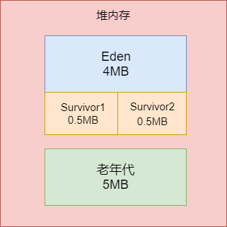
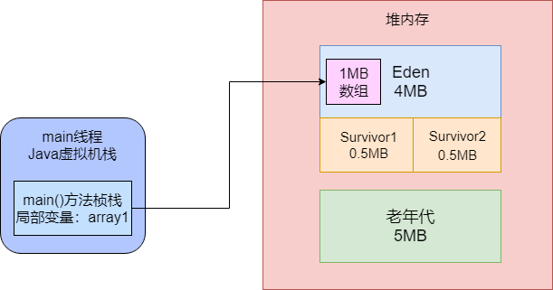
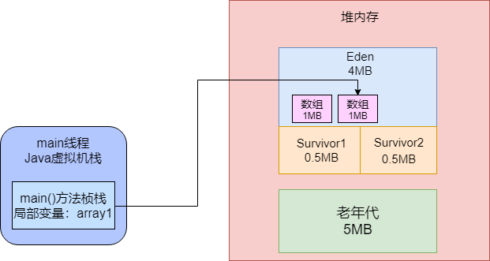
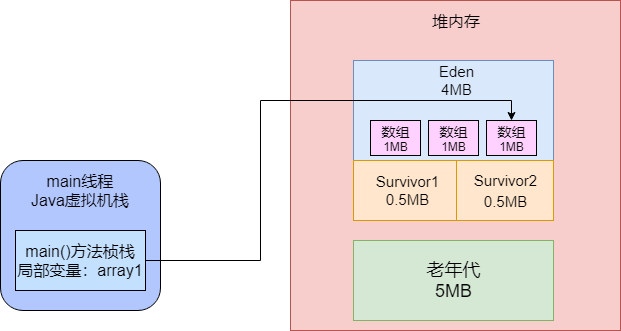
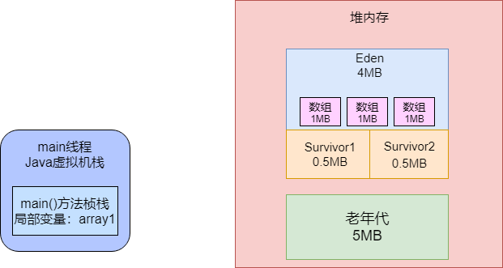
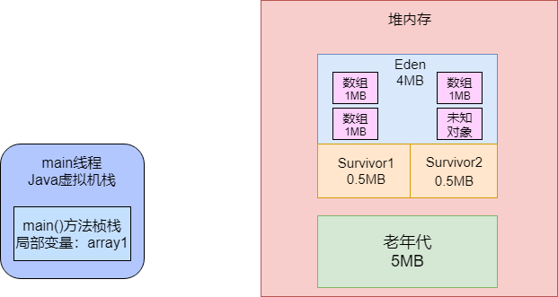
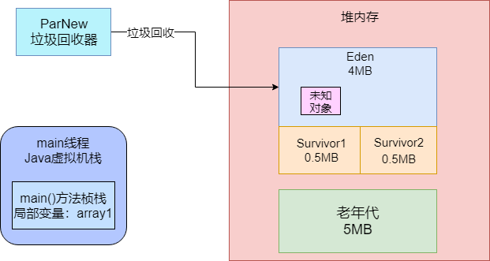
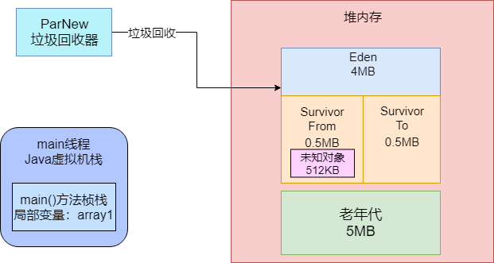
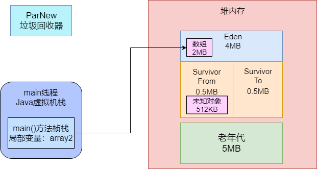

## 打印JVM的GC日志

​		如果想打印GC日志，需要在系统的JVM参数中加入GC日志的打印选型，如下：

```yaml
-XX:+PrintGCDetail #打印详细的gc日志
-XX:+PrintGCTimeStamps #打印出每次GC发生的时间
-Xloggc:log	#设置将gc日志写入一个磁盘文件
```

## 示例

### 示例程序代码

```java
public class Demo1 {

    public static void main(String[] args) {

        byte[] array1 = new byte[1024 * 1024];
        array1 = new byte[1024 * 1024];
        array1 = new byte[1024 * 1024];
        array1 = null;

        byte[] array2 = new byte[2 * 1024 * 1024];
    }

}
```

​		给上述程序配置一下JVM参数：

```
-XX:NewSize=5242880 -XX:MaxNewSize=5242880 -XX:InitialHeapSize=10485760 -XX:MaxHeapSize=10485760 -XX:SurvivorRatio=8 -XX:PretenureSizeThreshold=10485760 -XX:+UseParNewGC -XX:+UseConcMarkSweepGC -XX:+PrintGCDetails -XX:+PrintGCTimeStamps -Xloggc:gc.log
```

​		这些JVM参数的意思是给堆内存分配10MB内存空间，其中新生代是5MB内存空间，其中Eden区占4MB，每个Survivor区占0.5MB，大对象必须超过10MB才会直接进入老年低，年轻代使用ParNew垃圾回收器，老年代使用CMS垃圾回收器，如图所示：



### 对象如何分配在Eden区内的

​		上面的代码比较简单。先通过“new byte[1024 * 1024]”这样的代码连续分配了3个数组，每个数组都是1MB。然后通过array1这个局部变量依次引用这三个对象，最后还把array1这个局部变量指向了null。那么在JVM中上述代码如何运行？

​		首先第一行代码：`byte[] array1 = new byte[1024 * 1024]`。这个代码一运行，会在JVM的Eden区内放一个1MB的对象，同时在main线程的虚拟机栈中会压入一个main()方法的桢栈，在main()方法桢栈内部，会有一个“array1”变量，这个变量是指向堆内存Eden区的那个1MB的数组，如下图：



​		接着第二行代码：`array1 = new byte[1024 * 1024]`。此时会在堆内存的Eden区中创建第二个数组，并且让局部变量指向第二个数组，然后第一个数组就没人引用了，此时第一个数据就变了没人引用的“垃圾对象”，如图所示：



​		然后第三行代码：`byte[] array1 = new byte[1024 * 1024]`。这行代码在堆内存的Eden区内创建了第三个数组，同时让array1变量指向了第三个数组，此时前面两个数组都没有引用了，变成了垃圾对象。



​		第四行代码：`array1 = null`。这行代码一执行，就让array1这个变量什么都不指向，此时会导致之前创建的3个数组全部变成垃圾对象，如图：



​		最后第五行代码：`byte[] array2 = new byte[2 * 1024 * 1024]`。此时会分配一个2MB大小的数组，尝试放入Eden区中。但这是不行的，因为Eden区总共就4MB大小，而且里面已经放入了3个1MB的数组，所以剩余空间只有1MB，此时放一个2MB的的数组是放不下的。这个时候就会触发年轻代的Young GC。

### 讲解GC日志

​		当我们以指定的JVM参数运行，会在根目录生成一个文件`gc.log`。打开gc.log文件，会看到如下内容：

```verilog
Java HotSpot(TM) 64-Bit Server VM (25.151-b12) for windows-amd64 JRE (1.8.0_151-b12), built on Sep  5 2017 19:33:46 by "java_re" with MS VC++ 10.0 (VS2010)

Memory: 4k page, physical 33450456k(25709200k free), swap 38431192k(29814656k free)

CommandLine flags: -XX:InitialHeapSize=10485760 -XX:MaxHeapSize=10485760 -XX:MaxNewSize=5242880 -XX:NewSize=5242880 -XX:OldPLABSize=16 -XX:PretenureSizeThreshold=10485760 -XX:+PrintGC -XX:+PrintGCDetails -XX:+PrintGCTimeStamps -XX:SurvivorRatio=8 -XX:+UseCompressedClassPointers -XX:+UseCompressedOops -XX:+UseConcMarkSweepGC -XX:-UseLargePagesIndividualAllocation -XX:+UseParNewGC

0.268: [GC (Allocation Failure) 0.269: [ParNew: 4030K->512K(4608K), 0.0015734 secs] 4030K->574K(9728K), 0.0017518 secs] [Times: user=0.00 sys=0.00, real=0.00 secs]

Heap

par new generation   total 4608K, used 2601K [0x00000000ff600000, 0x00000000ffb00000, 0x00000000ffb00000)

 eden space 4096K,  51% used [0x00000000ff600000, 0x00000000ff80a558, 0x00000000ffa00000)

 from space 512K, 100% used [0x00000000ffa80000, 0x00000000ffb00000, 0x00000000ffb00000)

 to   space 512K,   0% used [0x00000000ffa00000, 0x00000000ffa00000, 0x00000000ffa80000)

concurrent mark-sweep generation total 5120K, used 62K [0x00000000ffb00000, 0x0000000100000000, 0x0000000100000000)

Metaspace       used 2782K, capacity 4486K, committed 4864K, reserved 1056768K

 class space    used 300K, capacity 386K, committed 512K, reserved 1048576K
```

​		现在让我们来讲解一下这个日志。

​		首先在GC日志中，可以看到以下内容：

` CommandLine flags: -XX:InitialHeapSize=10485760 -XX:MaxHeapSize=10485760 -XX:MaxNewSize=5242880 ......... `

​		这是说明这次运行程序采取的JVM参数是什么，基本是我们设置的，同时还有一些参数默认就给设置了，不过一般关系不大。

​		接着看GC日志中的如下一行：

` 0.268: [GC (Allocation Failure) 0.269: [ParNew: 4030K->512K(4608K), 0.0015734 secs] 4030K->574K(9728K), 0.0017518 secs] [Times: user=0.00 sys=0.00, real=0.00 secs] `

​		这个就是概要说明了本次GC的执行情况。`GC (Allocation Failure)`是发生GC的原因，我们要分配一个2MB的数组，结果Eden区内存不够，所以就出现了“Allocation Failure”，即对象分配失败。所以此时就要触发一次Young GC。

​		那这次GC什么时候发生呢？通过上面的一个数字`0.268`，这个意思是说你的系统运行以后过了多少秒发生了本次的GC，比如这里就是大概系统运行之后大概200多毫秒，发生了本次GC。

` ParNew: 4030K->512K(4608K), 0.0015734 secs `

​		这个`ParNew`。我们触发的是年轻代的Young GC，所以用我们指定的ParNew垃圾回收器执行GC的。而`4030K -> 512K(4608K)`，这个代表的意思是年轻代可用的空间是4608KB，也就是4.5MB。因为上面的例子中，Eden区是4MB，两个Survivor中只有一个是可以放存活对象的，另外一个必须一致保持空闲，所以它考虑年轻代的可用空间，就是Eden + 1个Survivor的大小，也就是4.5MB。

​		然后`4030K -> 512K`。意思是对年轻代执行了一次GC，GC之前都使用了4030KB，但是GC之后只有512KB的对象存活了下来。而`0.0015734 secs`这个是本次GC耗费的时间。这里大概是1.5ms，仅仅是回收3MB的对象而已。

​		`4030K->574K(9728K), 0.0017518 secs`，这段话指的是整个Java堆内存的情况。意思是整个Java堆内存是总可用空间9728KB（9.5MB），其实就是4.5MB + 老年代5MB，然后GC前整个Java堆内存里使用了4030KB，GC之后Java堆内存使用了574KB。

`[Times: user=0.00 sys=0.00, real=0.00 secs] `

​		这个意思就是本次GC消耗的时间。这里最小单位是小数点之后两位，但是这里全部是0.00 secs，也就是说本次gc就耗费了几毫秒。所以从秒为单位来看，几乎是0。

### 图解GC执行过程

​		第一个问题，`ParNew: 4030K->512K(4608K), 0.0015734 secs`。在GC之前，明明在Eden区域里放了3个1MB的数组，一共是3MB，也就是3072KB的对象，那么GC之前年轻代应该是使用了3072KB的内存，为什么是4030KB的内存？其实要明白两点：

- 虽然你创建的数组本身是1MB，但是为了存储这个数组，JVM内置还会附带一些其他信息，所以每个数组实际占用的内存是大于1MB的；

- 除了你自己创建的对象以外，可能还有一些你看不见的对象在Eden区里。

​		如图所以，GC之前，三个数组和其他一些未知对象加起来，就是占据了4030KB的内存：



​		接着你要在Eden分配一个2MB的数组，此时肯定触发了“Allocation Failure”，对象分配失败，就触发了Young GC，然后ParNew执行垃圾回收，回收掉之前我们创建的三个数组，此时因为它们都没人引用了，一定是垃圾对象，如图：



​		继续看gc日志：ParNew: 4030K->512K(4608K), 0.0015734 secs。gc回收之后，从4030KB内存使用降低到了512KB的内存使用，也就是说这次gc日志有512KB的对象存活了下来，从Eden区转移到了Survivor1区。或者我们改一下称呼，叫做Survivor From区，另外一个叫做Survivor To区。



​		结合GC日志日志就能看出，这就是本次GC的全过程。

### GC过后的堆内存使用情况

​		接着我们看下面的GC日志：
```verilog
Heap

par new generation   total 4608K, used 2601K [0x00000000ff600000, 0x00000000ffb00000, 0x00000000ffb00000)

 eden space 4096K,  51% used [0x00000000ff600000, 0x00000000ff80a558, 0x00000000ffa00000)

 from space 512K, 100% used [0x00000000ffa80000, 0x00000000ffb00000, 0x00000000ffb00000)

 to   space 512K,   0% used [0x00000000ffa00000, 0x00000000ffa00000, 0x00000000ffa80000)

concurrent mark-sweep generation total 5120K, used 62K [0x00000000ffb00000, 0x0000000100000000, 0x0000000100000000)

Metaspace       used 2782K, capacity 4486K, committed 4864K, reserved 1056768K

 class space    used 300K, capacity 386K, committed 512K, reserved 1048576K
```

​		这段日志是在JVM退出的时候打印出来的当前堆内存的使用情况，其实也很简单。先看这段：

```verilog
par new generation   total 4608K, used 2601K [0x00000000ff600000, 0x00000000ffb00000, 0x00000000ffb00000)

 eden space 4096K,  51% used [0x00000000ff600000, 0x00000000ff80a558, 0x00000000ffa00000)

 from space 512K, 100% used [0x00000000ffa80000, 0x00000000ffb00000, 0x00000000ffb00000)

 to   space 512K,   0% used [0x00000000ffa00000, 0x00000000ffa00000, 0x00000000ffa80000)
```

​		`par new generation total 4608K,used 2601K`，就是说“ParNew”垃圾回收器复制的年轻代共有4608KB（4.5MB）可用内存，目前是使用了2601KB（2.5MB）。为什么JVM退出之前，年轻代占用了2.5MB的内存？因为在gc之后，我们有通过了代码`byte[] array2 = new byte[2 * 1024 * 1024]`分配了一个2MB的数组，所以此时Eden区中会有一个2MB的数组，也就是2048KB，然后上次gc之后在From Survivor区中存活了一个512KB的对象。但2048 + 512 = 2560KB，为什么年轻代使用了2601KB？因为之前说过每个数组会额外占据一些内存来存放一些自己这个对象的元数据，所以你可以认为多出来的41KB可以是数组对象额外使用的空间。如图：



​		继续看日志

```
eden space 4096K,  51% used [0x00000000ff600000, 0x00000000ff80a558, 0x00000000ffa00000)

 from space 512K, 100% used [0x00000000ffa80000, 0x00000000ffb00000, 0x00000000ffb00000)

 to   space 512K,   0% used [0x00000000ffa00000, 0x00000000ffa00000, 0x00000000ffa80000)
```

​		通过GC日志可以验证我们的推测是正确的，这里说的很清楚，Eden区此时4MB的内存被使用了51%，就是因为有一个2MB的数组在里面，然后From Survivor区，512KB是100%的使用率，此时被之前gc后的512KB的未知对象占据了。

​		后面的日志

```
concurrent mark-sweep generation total 5120K, used 62K [0x00000000ffb00000, 0x0000000100000000, 0x0000000100000000)

Metaspace       used 2782K, capacity 4486K, committed 4864K, reserved 1056768K

 class space    used 300K, capacity 386K, committed 512K, reserved 1048576K
```

​		`concurrent mark-sweep generation total 5120K, used 62K`这就是CMS垃圾回收器，管理的老年代内存空间一共是5MB。此时使用了62KB的空间。而下面两段日志也很简单，就是Metaspace元数据空间和Class空间，存放一些类信息、常量池之类的东西，此时他们的总容量和使用内存等等。