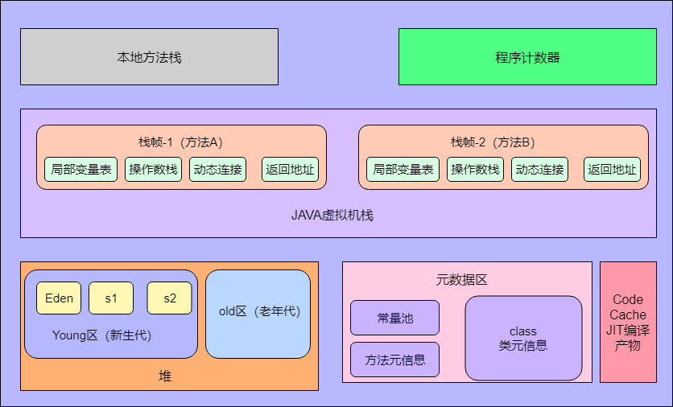
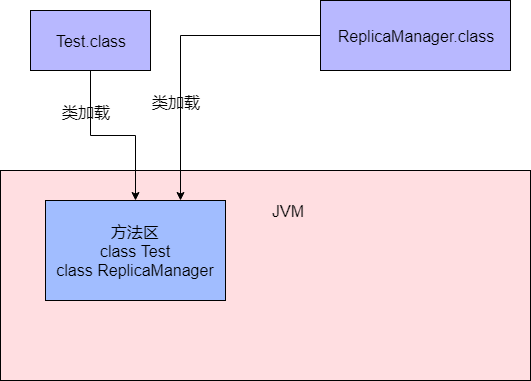
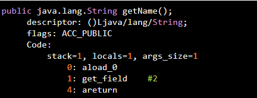
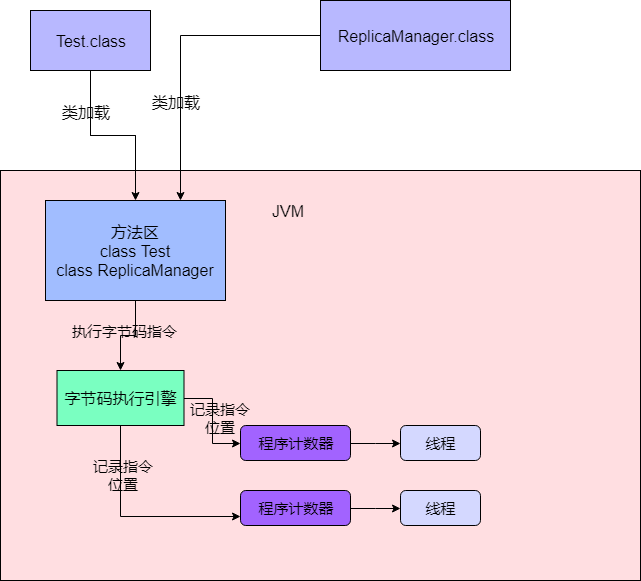
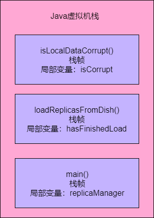
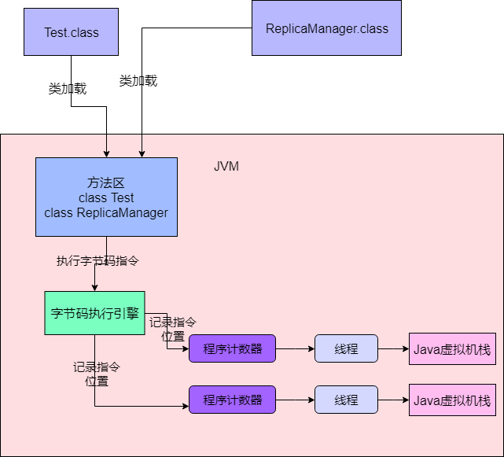
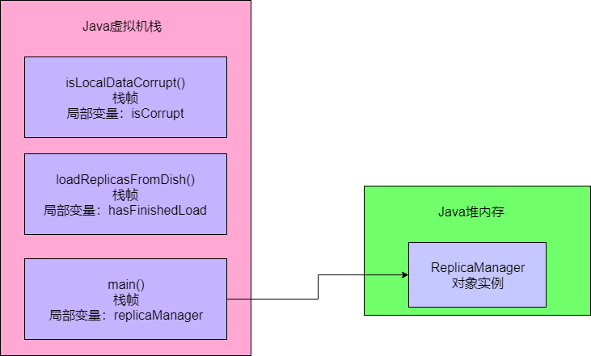
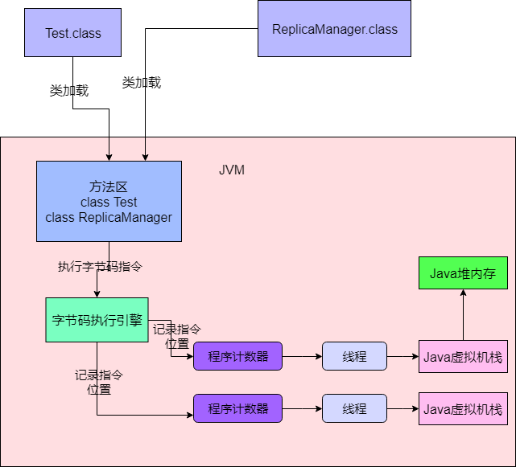

> JVM内存布局



### 存放类的方法区

​		这个方法区是在JDK1.8以前的版本里，代表JVM中的一块区域。主要是放从“.class”文件里加载进来的类，还会有一些类似常量池的东西放在这个区域。JDK1.8以后，这个区域改了名字，叫“Metaspace”，也叫“元空间”。

​		还是拿之前的代码举例，如下：

```java
public class Test {

    public static void main(String[] args) {
        ReplicaManager replicaManager = new ReplicaManager();
    }
}
```

​		这两个类加载后，就会放在这个方法区中，



### 执行代码指令用的程序计数器

​		假设我们的代码是这样：

```java
public class Test {

    public static void main(String[] args) {
        ReplicaManager replicaManager = new ReplicaManager();
        replicaManager.loadReplicaFromDish();
    }
}
```

​		实际上这段代码先存在于“.java”后缀的文件里，但为了能让计算机看懂这段代码，需要将这个文件经过编译器编译，把“.java”后缀的源文件编译为“.class”后缀的字节码文件。这个“.class”后缀的字节码文件里，存放的就是编译好的字节码了，字节码才是计算机可以理解的一种语言。字节码大概如下：



​		所以首先明白一点：**我们写好的Java代码会被翻译成字节码，对应各种字节码指令**

​		现在Java代码通过JVM跑起来的第一件事情就确定了，首先Java代码被编译成字节码指令，然后字节码指令一定会被一条一条地执行，这样才能实现我们写好的代码执行的效果。当JVM加载类信息到内存之后，实际就会使用自己的**字节码执行引擎**，去执行我们写的代码编译出来的代码指令，那么在执行字节码指令的时候，JVM就需要一个特殊的内存区域，“程序计数器”。它是**用来记录当前的字节码指令位置的，也就是记录目前执行到了哪一条字节码指令**。

​		JVM是支持多个线程的，所以你写好的代码可能会开启多个线程并发执行不同的代码，所以就会有各个线程来并发的执行不同的代码指令，因此每个线程都会有自己的一个程序计数器，专门记录当前这个线程目前执行到了哪一条字节码指令。



### Java虚拟机栈

​		Java代码在执行的时候，一定是线程来执行某个方法中的代码，即使是下面的代码，也会有一个main线程来执行main()方法里的代码。在main线程执行main()方法的代码指令的时候，就会通过main线程对应的程序计数器记录自己执行的指令位置。

```java
public class Test {

    public static void main(String[] args) {
        ReplicaManager replicaManager = new ReplicaManager();
        replicaManager.loadReplicaFromDish();
    }
}
```

​		但在方法里，一般会定义一些方法内的局部变量，例如上面的代码中就有一个“replicaManager”局部变量。因此JVM必须有一块保存每个方法内的局部变量等数据的，这个区域就是Java虚拟机栈。**每个线程都有自己的Java虚拟机栈**，比如这里的main线程就会有自己的一个Java虚拟机栈，用来存放自己执行的那些方法的局部变量。

​		如果线程执行了一个方法，就会对这个方法调用创建对应的一个栈帧。栈帧就有这个方法的局部变量表、操作数栈。动态链接、方法出口等信息。

​		比如main线程执行了main()方法，那么就会给main()方法创建一个栈帧，压入main线程的Java虚拟机栈，同时在main()方法的栈帧里，存放对应的“replicaManager”局部变量。

​		然后假设main()线程继续执行ReplicaManager对象里的方法，比如下面，就在“loadReplicasFromDisk”方法里定义了一个局部变量：“hasFinishedLoad”。

```java
public class ReplicaManager {

    public void loadReplicasFromDish() {
        Boolean hasFinishedLoad = false;
    }
}
```

​		那么main线程执行上面的“loadReplicasFromDish”方法时，就会为“loadReplicasFromDish”方法创建一个栈帧压入线程自己的Java虚拟机栈里面去。

​		接着如果“loadReplicasFromDish”方法调用了另外一个“isLocalDataCorrupt()”方法，这个方法里也有自己的局部变量，如下：

```java
public class ReplicaManager {


    public void loadReplicasFromDish() {
        Boolean hasFinishedLoad = false;
        if(isLocalDataCorrupt()) {

        }
    }

    public Boolean isLocalDataCorrupt() {
        Boolean isCorrupt = false;
        return isCorrupt
    }
}
```

​		这个时候会给“isLocalDataCorrupt”方法又创建一个栈帧，压入线程的Java虚拟机里，而且“isLocalDataCorrupt”方法的栈帧的局部变量表里会有一个“isCorrupt”变量，这个“isLocalDataCorrupt”的局部变量，整个过程如下：



​		接着如果“isLocalDataCorrupt”方法执行完毕，就会把“isLocalDataCorrupt”方法对应的栈帧从Java虚拟机栈里出栈；然后如果“loadReplicasFromDisk”方法也执行完毕，就会把“loadReplicasFromDisk”方法也从Java虚拟机栈里出栈、

​		“JAVA虚拟机栈”这个组件的作用：调用执行任何方法时，都会给方法创建栈帧然后入栈，在栈帧里存放了这个方法对应的局部变量之类的数据，包括这个方法执行的其他相关信息，方法执行完毕之后出栈。



### Java堆内存

​		Java堆主要是存放我们在代码中创建的各种对象。

```java
public class Test {

    public static void main(String[] args) {
        ReplicaManager replicaManager = new ReplicaManager();
        replicaManager.loadReplicaFromDish();
    }
}
```

​		上面的“new ReplicaManager()”这个代码就是创建了一个ReplicaManager类的对象实例，这个对象实例里面会包含一些数据，如下代码所示：这个“ReplicaManager”类里的“replicaCount”就是属于这个对象实例的一个数据。而类似ReplicaManager这样的对象实例就会存放在Java堆内存里。

```java
public class ReplicaManager {
    
    private long replicaCount;
    
    public void loadReplicasFromDish() {
        Boolean hasFinishedLoad = false;
        if(isLocalDataCorrupt()) {

        }
    }

    public Boolean isLocalDataCorrupt() {
        Boolean isCorrupt = false;
        return isCorrupt
    }
}
```

​		Java堆内存区域里会放入类似ReplicaManager的对象，然后我们因为在main方法里创建了ReplicaManager对象，那么在线程执行main方法代码的时候，就会在main方法对应的栈帧的局部变量表里，让一个引用类型的“replicaManager”局部变量来存放ReplicaManager对象的地址。

​		相当于你可以认为局部变量表的“replicaManager”指向了Java堆内存里的ReplicaManager对象。



### 核心内存区域的全流程串讲

​		


```java
public class Test {

    public static void main(String[] args) {
        ReplicaManager replicaManager = new ReplicaManager();
        replicaManager.loadReplicaFromDish();
    }
}

public class ReplicaManager {
    
    private long replicaCount;
    
    public void loadReplicasFromDish() {
        Boolean hasFinishedLoad = false;
        if(isLocalDataCorrupt()) {

        }
    }

    public Boolean isLocalDataCorrupt() {
        Boolean isCorrupt = false;
        return isCorrupt
    }
}
```

​		首先，你的JVM进程会启动，就会先加载Test类到内存里，然后有一个main线程，开始执行你的Test中的main()方法。main线程是关联了一个程序计数器的，他执行到哪一行指令，就会记录在这里。

​		其次，就是main线程执行main()方法的时候，会在main线程相关的Java虚拟机栈里，压入一个main()方法的栈帧，接着会发现需要创建一个ReplicaManager类的实例对象，此时会加载ReplicaManager类到内存里来。

​		然后会创建一个ReplicaManager的对象实例分配在堆内存里，并且在main()方法的栈帧里的局部变量表引入一个“replicaManager”变量，让他引用ReplicaManager对象在Java堆内存中的地址。

​		接着，main线程开始执行ReplicaManager对象中的方法，会依次把自己执行到的方法对应的栈帧压入自己的Java虚拟机栈。

​		执行完方法之后再把方法对应的栈帧从Java虚拟机栈里出栈。

### 其他内存区域

​		在JDK很多底层API里，比如IO相关、网络Socket相关的，很多地方都不是JAVA代码了，而是走的native方法去调用本地操作系统里面的一些方法，可能调用的都是C语言写的方法，或者一些底层类库。在调用这种native方法时，就会有线程对应的本地方法栈，这个跟Java虚拟机栈类似的，也是存放各种native方法的局部变量表之类的信息。

