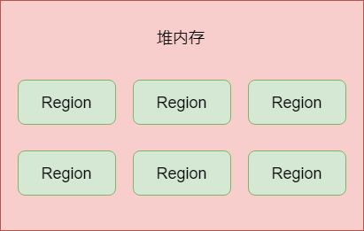
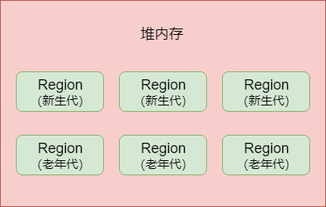
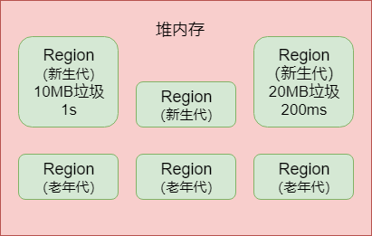
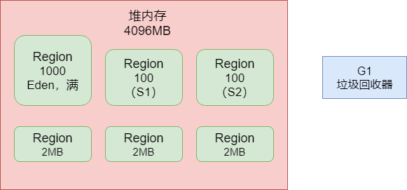
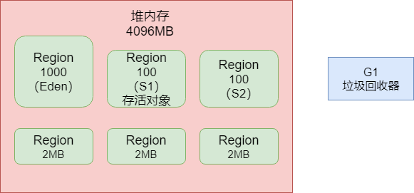
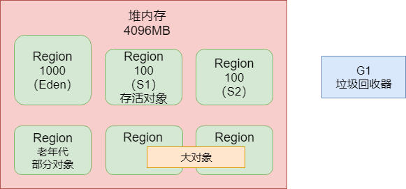

## ParNew + CMS组合的痛点

​		传统的JVM垃圾回收器ParNew + CMS组合有一个很大的痛点，就是**Stop the World**。无论是新生代垃圾回收，还是老年代垃圾回收，都会或多或少产生“Stop the World”现象，对系统的运行有一定的影响。所以后面对垃圾回收器的优化，都是朝着减少“Stop the World”的目标去做的。在这个基础上，G1垃圾回收器就应运而生，它提供了比`ParNew + CMS`组合更好的垃圾回收的性能。

## G1垃圾回收器

​		G1垃圾回收器是可以同时回收新生代和老年代的对象的，不需要两个垃圾回收器配合起来运作，它一个人就可以搞定所有的垃圾回收。

​		**它最大的一个特点，就是把Java堆内存拆分为多个大小相等的Region**，如图：

​		然后G1也会有新生代和老年代的概念，但是只不过是**逻辑上的概念**，即，新生代可能包含了某些Region，老年代也可能包含了某些Region，如图：

​		而且G1最大的一个特点，就是可以让我们**设置一个垃圾回收的预期停顿时间**。也就是说比如我们可以指定：希望G1在垃圾回收的时候，可以保证，在一小时内由G1垃圾回收导致的“Stop the World”时间，不能超过一分钟。

​		这个就很厉害了，我们之前的一系列JVM优化思路，包括内存合理分配等待，都是为了尽可能减少Minor GC和Full GC带来的系统停顿，避免影响系统处理请求。但是我们现在可以直接给G1指定，在一个时间内，垃圾回收导致的系统停顿时间不能超过多久，G1全权给你负责，保证达到目标，**这相当于我们就可以直接控制垃圾回收对系统性能的影响了**。

## G1对垃圾回收导致的系统停顿可控的原理

​		G1要做到这一点，就必须要追踪每个Region里的**回收价值**。也就是说，它必须搞清楚每个Region里的对象有多少是垃圾，如果对这个Region进行垃圾回收，需要耗费多长时间，可以回收掉多少垃圾。

​		如下图，G1通过追踪发现，1个Region的垃圾对象有10MB，回收它们需要耗费1秒钟，另外一个Region中对垃圾对象有20MB，回收它们需要耗费200毫秒。

​		然后在垃圾回收的时候，G1会发现在最近一个时间段内，比如一小时内，垃圾回收已经导致了几百毫秒的停顿了，现在又要执行一次垃圾回收，那么必须是回收上图中那个只需要200ms就能回收掉20MB垃圾的Region，于是G1触发一次垃圾回收，虽然导致了系统停顿了200ms，但是一下子回收了更多的垃圾。

​		所以简单来说，G1可以做到让你来设定垃圾回收对系统的影响，它自己通过把内存拆分为大量小Region，以及追踪每个Region中可回收对象大小和预估时间，最后在垃圾回收的时候，尽量把垃圾回收对系统造成的影响控制在你指定的时间范围内，同时在有限的时间内尽量回收尽可能多的垃圾对象。这就是G1的核心设计思路。

## Region可能属于新生代也可能是老年代

​		在G1中，每一个Region可能属于新生代，也可能属于老年代。刚开始Region可能谁都不属于，然后接着就分配给了新生代，放了很多属于新生代的对象，接着就触发了垃圾回收这个Region。然后下一次同一个Region可能又分配了老年代，用来存放老年代的长生存周期的对象。

​		所以其实在G1对应的内存模型中，Region随时会属于新生代也会属于老年代，所以没有所谓新生代给多少内存，老年代给多少内存这一说了，实际上新生代和老年代各自的内存区域是不停变动的，由G1自动控制。

## 设定G1对应的内存大小

​		上面说到G1对应的是一大堆的Region内存区域，每个Region的大小是一致的。那到底有多少个Region呢？每个Region的大小是多大呢？其实这个默认情况下是自动计算和设置的，我们可以给整个堆内存设置一个大小，比如用`-Xms`和`-Xmx`来设置堆内存的大小，然后JVM启动的时候发现你使用的是G1垃圾回收器，可以使用`-XX:+UseG1GC`来指定使用G1垃圾回收器，此时会自动用**堆大小除以2048**，因为JVM最多可以有2048个Region，然后Region的大小必须是2的倍数，比如说1MB、2MB和4MB之类的。

​		比如说堆大小是4G，就是4096MB，此时除以2048个Region，每个Region的大小就是2MB，大概就是这个样子来决定Region的数量和大小的，一般保持默认的计算方式就可以。如果通过手动的方式来指定，则可以使用`-XX:G1HeapRegionSize`。

​		刚开始的时候，默认新生代对堆内存的占比是5%，也就是占据200MB左右，对应大概是100个Region。这个可以通过`-XX:G1NewSizePercent`来设置新生代初始占比，其实维持这个默认值即可，因为在系统运行中，JVM会不停地给新生代增加更多的Region，但是最多新生代的占比不会超过60%，可以通过`-XX:G1MaxNewSizePercent`来设置。而且一旦Region进行了垃圾回收，此时新生代的Region数量还会减少，这些其实都是动态的。

## 新生代还有Eden和Survivor的概念

​		虽然G1把内存划分了很多的Region，但是其实还是有新生代和老年代的区分，而且新生代里还是有Eden和Survivor的划分的。之前说过的一个新生代的参数：`-XX:SurvivorRatio=8`，比如说新生代刚开始的时候，有100个Region，那么可能80个Region就是Eden，两个Survivor各自占10个Region。所以大家要明白这里其实还是有Eden和Survivor的概念的，它们会各自占据不同的Region，只不过随着对象不停地在新生代里分配，属于新生代的Region会不断增加，Eden和Survivor对应的Region也会不断增加。

## G1的新生代垃圾回收

​		既然G1的新生代也有Eden和Survivor的区分，那么触发垃圾回收的机制都是类似的。

​		随着不停地在新生代的Eden对应的Region中放对象，JVM会不停地给新生代加入更多的Region，直到新生代占据堆大小的最大比例60%。一旦新生代达到了设定的占据堆内存的最大大小60%，比如都有1200个Region了，里面的Eden可能占据了1000个Region，每个Survivor是100个Region，而且Eden区还占满了对象，如图：

​		这个时候还是会触发新生代的GC，G1就会用之前说过的复制算法来进行垃圾回收，进入了一个“Stop the World”状态，然后把Eden对应的Region中的存活对象放入到S1对应的Region中，接着回收掉Eden对应的Region中的垃圾对象。

​		但是这个过程还有跟之前有区别的，因为G1是可以设定目标GC停顿时间的，也就是G1执行GC的时候最多可以让系统停顿多长时间，可以通过`-XX:MaxGCPauseMills`参数来设定，默认值是200ms。那么G1就会通过之前说的，对每个Region追踪回收它需要多少时间，可以回收多少对象来选择回收一部分的Region，保证GC停顿时间控制在指定范围内，尽可能多地回收掉一些对象。

## 对象什么时候进入老年代

​		在G1的内存模型下，新生代和老年代各自都会占据一定的Region，老年代也会有自己的Region，按照默认，新生代最多只能占据堆内存60%的Region来推算，老年代最多可以占据40%的Region。那么对象什么时候可以从新生代进入老年代呢？

- 对象在新生代躲过了很多次的垃圾回收，达到了一定的年龄了，`-XX:MaxTenuringThreshold`参数可以设置这个年龄，他就会进入老年代。
- 动态年龄判定规则，如果一旦发现某次新生代GC过后，存活对象超过了Survivor的50%。此时就会判断一下，比如年龄为1岁、2岁、3对和4岁的对象的大小综合超过了Survivor的50%，此时4岁以上的对象全部会进入老年代。这就是动态年龄判定规则。

​        经过一段时间的新生代使用和垃圾回收之后，总有一些对象会进入老年代中。

## 大对象Region

​		在以前，大对象是可以直接进入老年代的，那G1这套内存模型下呢？实际上这里会有所不同，G1提供了专门的Region来存放大对象，而不是让大对象进入老年代的Region中。

​		在G1中，大对象的判定规则就是**一个大对象超过了一个Region大小的50%**，例如按照上面的算的，每个Region是2MB，只要一个对象超过了1MB，就被被放入专门的Region中。而且一个大对象如果太大，可能会横跨多个Region来存放。如图：

​		那堆内存哪些Region用来存放大对象呢？之前不是说60%给新生代，40%给老年代吗，那还有哪些Region给大对象？很简单，之前说过了，在G1里，新生代和老年代的Region是不停变化的。比如新生代占据了1200个Region，但是一次垃圾回收之后，就让里面1000个Region都空了，此时那1000个Region就可以不属于新生代了，里面很多Region可以用来存放大对象。

​		在垃圾回收方面，新生代、老年代在回收的时候，会顺带着对大对象Region一起回收，所以这就是G1内存模型下对大对象的分配和回收的策略。