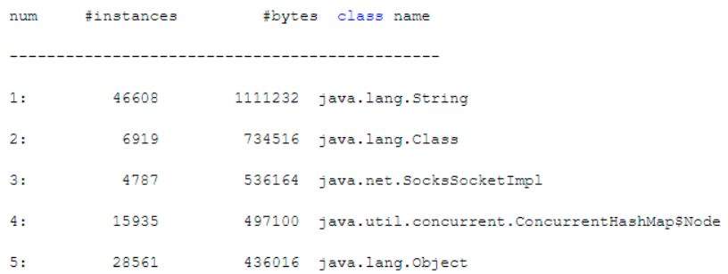

​		JVM中有两个非常实用的工具：jmap和jhat。这两个工具可以帮助我们观察线上JVM中的对象分布，了解到你的系统运行过程中，哪些对象占据了主角位置，占据了多少内存空间，让你对你的系统有更加细致的了解。

### 使用jmap了解系统运行时的内存区域

​		如果只是要了解JVM的运行状况，然后去进行JVM GC优化，一般情况下jstat就够用了。但是有时候我们会发现JVM新增对象的速度很快，想要了看看，到底什么对象占据了那么多的内存。如果发现有的对象在代码中可以优化一下创建的时机，避免多种对象对内存占用过大，也许甚至可以去反过来优化一下代码。当然，如果不是出现OOM那种极端情况，也没有那么大的必要着急优化代码。

​		先看一个命令：`jmap -heap PID`，这个命令可以打印出来一系列的信息，大致来说，这个信息会打印出来堆内存相关的一些参数设置，然后就是当前堆内存里的一些基本各个区域的情况。比如Eden区总容量，已经使用的容量、剩余空间容量、两个Survivor区的总容量、已经使用的容量和剩余的空间容量、老年代的总容量、已经使用和剩余的容量等等。

​		但是其实这些信息`jstat`就已经有了，所以一般不会用`jmap`去看这些信息，毕竟它的信息还没`jstat`全，例如缺少gc相关的统计。

### 使用jmap了解系统运行时的对象分布

​		jmap命令比较有用的使用方式，是`jmap -histo PID`。这个命令会打印出类似下面的信息：

​		这个命令打印出来的东西，会按照各种对象占用内存空间的大小降序排列，把占用内存最多的对象放在最上面。所以如果你只是想要简单了解一下当前JVM中的对象对内存占用的情况，直接使用`jmap -histo`命令即可。这样就可以快速了解到当前内存里到底是哪个对象占用了大量的内存空间。

### 使用jmap生成堆内存转储快照

​		如果上面的信息还不够深入，想要更仔细点的。那就可以使用jmap命令生成一个堆内存快照放到一个文件里，用如下的命令：`jmap -dump:live,format=b,file=dump.hprof PID`。这个命令会在当前目录下生成一个**dump.hrpof**文件，你不能直接打开看得，它把这一时刻JVM堆内存里所有对象的快照放到文件里去，以方便后续去分析。

### 使用jhat在浏览器中分许堆转储快照

​		接着就可以使用jhat去分析堆快照了。jhat内置了web服务器，它会支持你通过浏览器以图形化的方式分析堆转储快照。使用`jhat dump.hprof`命令即可启动jhat服务器，还可以指定自己想要的http端口号，默认是7000端口号。接着你就在浏览器上访问当前这台机器的7000端口号，就可以通过图形化的方式去分析堆内存里的对象分布情况了。