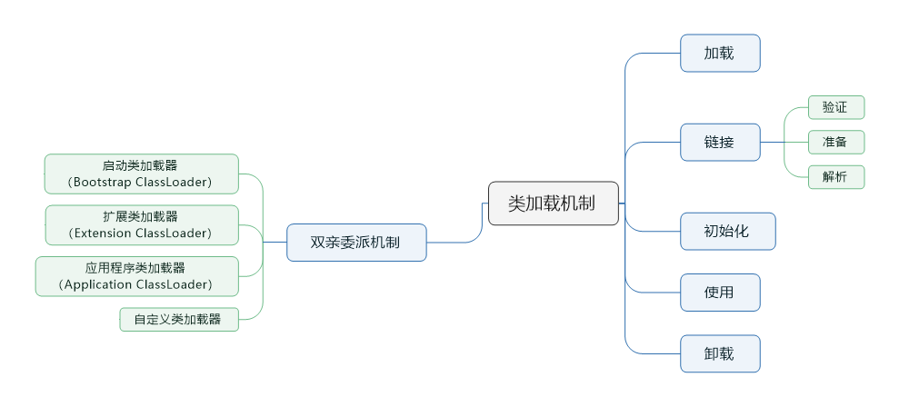
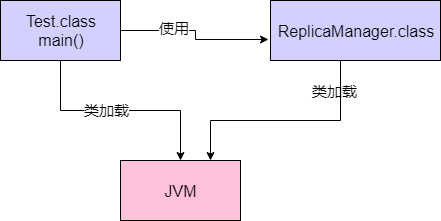

> 本节思维导图



### JVM什么情况下会加载一个类

​		首先，我们应该清楚一个类从加载到使用，一般会经过**加载-->链接-->初始化-->使用-->卸载**这几个过程，其实链接阶段又可以细分为三个：**验证-->准备-->解析**。所以首先要明白的一个问题就是，JVM在执行我们代码的时候，什么时候去加载一个类呢？即什么时间会从“.class”字节码文件中加载这个类到JVM内存中？

​		答案就是**你的代码中用到这个类的时候**。

​		比如下面有一个类，里面有一个“main()”方法作为入口，那么一旦你的JVM进程启动之后，它一定会先把这个类加载到内存里，然后从main()方法入口的代码开始执行。

```java
public class Test {
    public static void main(String[] args) {
        
    }
}
```

接着上面的代码中，出现了这么一行代码：

```java
public class Test {

    public static void main(String[] args) {
        ReplicaManager replicaManager = new ReplicaManager();
    }
}
```

这个时候，你的代码中明显需要使用“ReplicaManager”这个对象，因此会从“ReplicaManager.class”字节码中加载对应的类到内存中使用。



简单概括就是：**首先你的代码中包含“main()”方法的主类一定会在JVM启动后加载到内存中，开始执行你的“main()”方法中的代码，接着遇到你使用了别的类，此时就会从对应的“.class”字节码文件中加载对应的类到内存里来。**

### 从使用角度出发，来看验证、准备和初始化的过程

#### 1、验证阶段

​		简单来说，这一步即使根据JAVA虚拟机规范，来检验你加载进来的“.class”文件中的内容，是否符合指定的规范。

#### 2、准备阶段

​		一般情况下，我们写好的类，都有一些类变量，如下：

```java
public class ReplicaManager {

    public static int flushInterval;
}
```

​		假设有这么一个类“ReplicaManager”，它的“ReplicaManager.class”，刚被加载到内存之后，会被进行验证，确认这个验证码是符合规范的。接着就会进行准备工作。这个准备工作，就是给这个“ReplicaManager”类分配一定的内存空间，然后给他里面的类变量（也就是static修饰的变量）分配内存空间，来一个默认的初始值。比如上面的“flushInterval”这个类变量分配的内存空间，会给一个“0”初始值。

#### 3、解析阶段

​		这个阶段，实际上就是**把符合引用替换为直接引用**的过程

#### 4、三个阶段的小结

​		这三个阶段中，最核心的就是“**准备阶段**”，这个阶段是给加载进来的类分配好了内存空间，类变量也分配好了内存空间，并且给了默认的初始值。

### 核心阶段：初始化

​		上面说过，在准备阶段，会把我们的“ReplicaManager”类给分配好内存空间。另外的一个类变量“flushInterval”也会给一个默认的初始值“0”。那么接下来，在初始化阶段，就会正式执行我们的类初始化的代码了。

​		那什么是类初始化代码呢？看看以下代码

```java
public class ReplicaManager {

    public static int flushInterval =
            Configuration.getInt("replica.flush.interval");
}
```

通过以上代码我们可以知道，这个类变量，我们是通过Configuration.getInt("replica.flush.interval")这段代码来获取一个值，并且赋值给他的。但是**这个赋值逻辑并不在准备阶段执行**，在准备阶段，仅仅是给这个类变量开辟一个内存空间，然后给个初始值“0”而已。

​		而这段赋值的代码，则是在“**初始化**”阶段来执行。在该阶段，代码Configuration.getInt("replica.flush.interval")会在这里执行，完成一个配置项的读取，然后赋值给这个类变量“flushInterval”。

另外比如下面的static静态代码块，也会在这个阶段执行。

```java
public class ReplicaManager {

    public static int flushInterval =
            Configuration.getInt("replica.flush.interval");

    private static Map<String, Object> replicas;

    static {
        loadReplicaFromDish();
    }

    public static void loadReplicaFromDish() {
        this.replicas = new HashMap<String, Object>();
    }
}
```

#### 什么时候会初始化一个类

​		一般来说有一下时机：比如“new ReplicaManager()”来实例化类的对象，此时就会触发类的加载到初始化全过程，把这个类准备好，然后再实例化一个对象出来；

​		或者是包含“main”方法的主类，必须是立马初始化的。

​		这里还有一个非常重要的规则，就是如果初始化一个类的时候，发现它的父类还没初始化，那么先必须初始化它的父类。

### 类加载器和双亲委派机制

​		上述的过程中，都必须依赖类加载器来实现，Java里主要有几种类加载器

#### 1、启动类加载器（Bootstrap ClassLoader）

​		它主要负责加载我们机器上安装的java目录下的核心类，比如Object、System、String等。

#### 2、扩展类加载器（Extension ClassLoader）

​		用于加载一些扩展的系统类，比如XML、加密、压缩相关的功能类等。**JDK9之后变成了平台类加载器，即Platform ClassLoader。**

#### 3、应用类加载器（Application ClassLoader）

​		主要是加载用户定义的CLASSPATH路径下的类。

#### 4、自定义类加载器

​		除了上面几种之外，还可以自定义类加载器，去根据你自己的需求加载你的类。

#### 双亲委派机制

​		低层次的当前类加载器，不能覆盖更高层次类加载器已经加载的类。如果低层次的类加载器想加载一个未知类，要礼貌地向上级询问：“请问这个类已经加载了吗”？被询问的高层次类加载器会自问两个问题：第一，我是否已加载过此类？第二，如果没有，是否可以加载此类？只有当所有高层次类加载器在两个问题上的答案均为“否”时，才可以让当前类加载器加载这个未知类。


​		简单地讲，所谓的双亲委派模型：**先找父亲去加载，不行的话再由儿子来加载**。

### 最后总结

