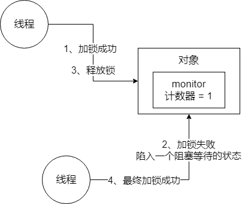
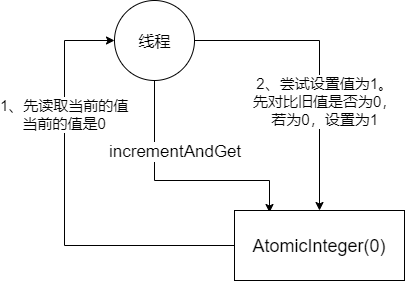
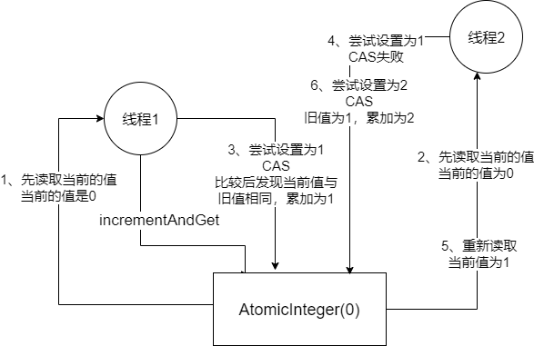
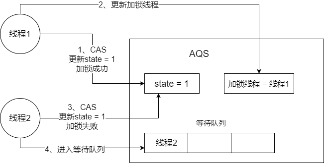
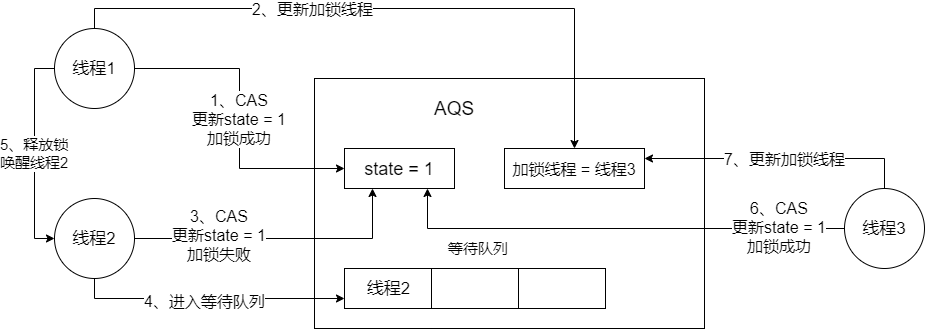
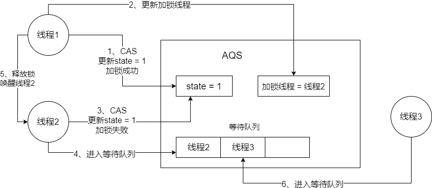

## synchronized关键字的底层原理

​		synchronized底层的原理，是跟jvm指令和monitor有关系的。你如果用到了synchronized关键字，在底层编译后的jvm指令中，会有`monitorenter`和`monitorexit`两个指令。

```haskell
monitorenter
	// 代码对应的指令
monitorexit
```

​		那么monitorenter指令执行的时候会干什么呢？每个对象都有一个关联的`monitor`。比如一个实例对象就有一个monitor，一个类的Class对象也有一个monitor，如果要对这个对象加锁，那么必须先获取这个对象关联的monitor的lock锁。

​		它的原理和思路大概是这样的：monitor里面有一个计数器，从0开始。如果一个线程要获取monitor的锁，就看看它的计数器是不是0，如果是0的话，那么说明没人获取锁，它就可以获取锁了，然后对计数器加1。



​		这个monitor的锁是支持重入加锁的，什么意思呢？好比下面的代码片段：

```java
synchronized(myObject) {
	// 一大堆代码
	
	synchronized(myObject) {
	
		// 一堆代码
	}
}
```

​		加锁，一般来说都是必须对同一个对象进行加锁。如果一个线程第一次synchronized那里，获取到了myObject对象的monitor的锁，计数器加1，然后第二次synchronized那里，会再次获取myObject对象的monitor的锁，这个就是重入加锁了，然后计数器会再次加1，变成2。

​		这个时候，其他的线程在第一次synchronized那里，会发现myObject对象的monitor锁的计数器是大于0的，意味着被别人加锁了，然后此时线程就会进入block阻塞状态，什么都干不了，就是等着获取锁。

​		接着如果出了synchronized修饰的代码片段的范围，就会有一个`monitorexit`指令在底层。此时获取锁的线程就会对那个对象的monitor的计数器减1，如果有多次重入加锁就会对应多次减1，直到最后计数器是0。然后后面block住阻塞的线程，会再次尝试获取锁，但是只有一个线程可以获取到锁。

## CAS的理解及其底层实现原理

​		首先我们先看这一段代码：

```java
public class MyObject {
    
    int i = 0;
    
    // 在一个对象实例的方法上加上synchronized
    // 同一时间只有一个线程可以进入这个方法
    public synchronized void increment() {
        i++
    }

    public static void main(String[] args) {
        // 第一个线程同时都基于myObject这一个对象，来执行increment()方法
        MyObject myObject = new MyObject();
        myObject.increment();
    }
}
```

​		上面的代码中，synchronized的意思就是针对当前执行这个方法的myObject对象进行加锁，此时只有一个线程可以成功地对myObject加锁，可以对它关联的monitor的计数器加1.一旦多个线程并发的去执行synchronized加锁，这就会变成串行化，导致很多线程都要去排队去执行，效率并不是太高。

​		再来看下面的这段代码：

```java
public class MyObject {

    // 底层就是基于CAS来进行实现的
    AtomicInteger i = new AtomicInteger(0);

    // 多个线程此时执行这段代码
    // 不需要synchronized加锁，也是线程安全的
    public void increment() {
        i.incrementAndGet();
    }
}
```

​		CAS（compare and set）。就是设值的时候先进行比较，如果当前的值等于之前获取到的旧值，就说明之前没有其他线程对这个值进行过修改，就可以将我们的新值设置给它。如果当前的值不等于我们之前获取的旧值，说明之前有线程对它进行过修改，那么就设置新值失败。



​		CAS在底层的硬件级别给你保证一定是原子性的，同一时间只有一个线程可以执行CAS。先比较再设置，其他的线程的CAS同时间去执行就会失败。

​		

## ConcurrentHashMap实现线程安全的底层原理

​		多个线程访问同一个数据，为了保证线程安全，可以synchronized加锁，或者CAS进行安全的累加，从而实现多线程场景下安全更新一个数据的效果。在比较多的情况下，可能就是多个线程同时读写一个HashMap。

​		为了保证线程安全，可以对HashMap进行synchronized，但没这个必要。HashMap的底层就是一个大的数组，假设多个线程过来，线程1要put的位置是数组[5]，线程2要put的位置是数组[21]，如果使用synchronized加锁，那么线程1跟线程2就要排队执行，但这明显不好，锁的粒度太粗，效率太低。除非是对同一个元素执行put操作，此时多线程才需要进行同步。

​		因此，JDK并发包里推出了一个`ConcurrentHashMap`，它默认实现了线程安全。在JDK1.7以及之前的版本，ConcurrentHashMap底层采取的是分段加锁来实现线程安全。ConcurrentHashMap本身是一个大数组，把它拆成多个数组：[数组1]，[数组2]，[数组3]...，每个数组都对应一个锁，这就是分段加锁。

​		[数组1]，[数组2]，[数组3] -> 每个数组都对应一个锁，分段加锁

​		当多个线程过来，线程1要put的位置是数组1的第五个位置[5]，线程2要put的位置是数组2的第21个位置[21]，那这样子两个线程就互不干扰，可以同时对ConcurrentHashMap赋值。

​		JDK1.8以及之后，对ConcurrentHashMap做了一些优化和改进，就是细化锁的粒度。在JDK1.8及其之后，ConcurrentHashMap底层还是一个大的数组，但对数组每个元素进行put操作，都是有一个不同的锁。刚开始进行put的时候，如果两个线程都是在数组[5]这个位置进行put。这个时候，就是对数组[5]这个位置进行put的时候，采取的是CAS的策略。

​		同一时间，只有一个线程能成功执行这个CAS。就是说，它刚开始先获取一下数组[5]这个位置的值，为null，然后执行CAS，然后线程1比较当前还是null，就可以put进去我的这条数据。同时间，其他线程执行CAS，都会失败。

​		这其实也可以算是分段加锁，通过对数组每个元素执行CAS的策略。如果是很多线程对数组里不同的元素执行put，大家互不干扰，没有关系。如果其他线程失败了，发现数组[5]这个位置，已经别人放进去值了，就需要在这个位置基于链表+红黑树进行处理。就是synchronized(数组[5])进行加锁，然后基于链表或者红黑树在这个位置插进去自己的数据。所以说，如果你是对数组里同一个位置的元素进行操作，才会加锁进行串行化处理；如果是对数组不同位置的元素操作，那么此时大家可以并发执行。

​		总的来说，在JDK1.8之前，多个数组，分段加锁，一个数组一个锁。在JDK1.8之后，优化细粒度，一个数组，每个元素进行CAS，如果失败说明有人了，此时synchronized对数组元素进行加锁，基于链表+红黑树处理，对数组每个元素加锁。

## 简单说一下AQS

​		AQS，全称 `Abstract Queue Synchronizer`，中文名叫抽象队列同步器。java 并发包中的 Semahore 和部分Lock底层的实现原理都是利用AQS，例如可重入锁`ReentrantLock`。现在简单说一下AQS的原理。

​		AQS内部主要包含`state`变量，一个存储当前加锁线程的变量和一个等待队列。当多个线程访问时，先通过CAS尝试更新state的变量，如果成功了，将加锁线程的变量更改为自己，并进行后续操作。如果失败了，进入队列等待，等待拥有锁的线程释放锁后唤醒。大概如下图：



​		接下来会涉及到公平锁和非公平锁。像ReentractLock，默认就是非公平锁。只有`ReentrantLock lock = new ReentrantLock(true)`时，才是公平锁。那什么是公平锁，什么是非公平锁。例如上面那个图，非公平锁就是，此时线程1释放了资源，唤醒线程2，但此时刚好线程3来进行CAS加锁等操作，并且成功了，那是此时就是线程3获取这个锁，而线程2继续回到等待队列。这就是非公平锁。



​		公平锁就是新的线程来获取锁时，会先看等待队列是否有其它线程，有的话就进入等待队列。




