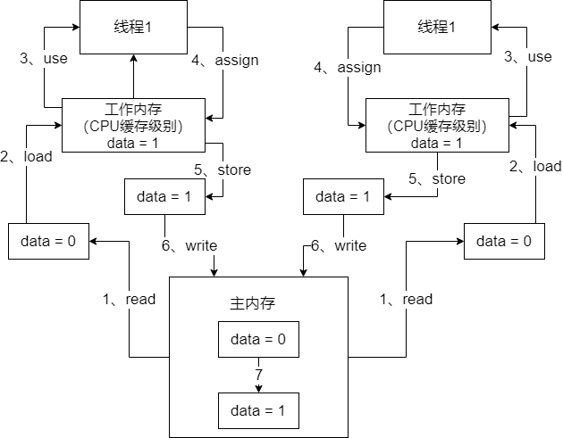

## Java内存模型

​		Java线程之间的通信采用的是共享内存模型，这里提到的共享内存模型指的就是Java内存模型（Java Memory Model，简称JMM），**JMM决定一个线程对共享变量的写入何时对另一个线程可见**。从抽象的角度来看，JMM定义了线程和内存之间的抽象关系：**线程之间的共享变量存储在主内存中，每个线程都有一个私有的本地内存，本地内存中存储了该线程以读/写共享变量额的副本**。本地内存是JMM的一个抽象概念，并不真实存在。它涵盖了缓存，写缓存区，寄存器以及其他的硬件和编译器优化。

​		Java内存模型主要有`read`、`load`、`use`、`assign`、`store`、`write`这几个动作。举一个例子，下面这么一段代码：

```java
public class HelloWorld {

    private int data = 0;

    public void increment() {
        data++;
    }

    public int getData() {
        return data;
    }
    
     public static void main(String[] args) {
        final HelloWorld helloWorld = new HelloWorld();
        Thread thread1 = new Thread() {
            @Override
            public void run() {
                helloWorld.increment();
                System.out.println("=====线程1：" + helloWorld.getData() + " =====");
            }
        };

        Thread thread2 = new Thread() {
            @Override
            public void run() {
                helloWorld.increment();
                System.out.println("=====线程2：" + helloWorld.getData() + " =====");
            }
        };

        thread1.start();
        thread2.start();
    }
}

```

​		通过上面的代码，我们来梳理一下线程与共享变量之间的关系：

