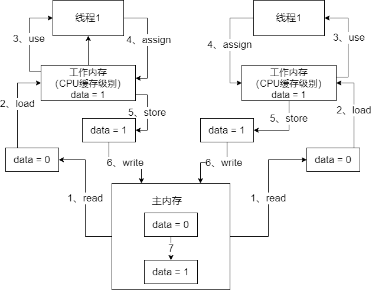

## Java内存模型

​		Java线程之间的通信采用的是共享内存模型，这里提到的共享内存模型指的就是Java内存模型（Java Memory Model，简称JMM），**JMM决定一个线程对共享变量的写入何时对另一个线程可见**。从抽象的角度来看，JMM定义了线程和内存之间的抽象关系：**线程之间的共享变量存储在主内存中，每个线程都有一个私有的本地内存，本地内存中存储了该线程以读/写共享变量额的副本**。本地内存是JMM的一个抽象概念，并不真实存在。它涵盖了缓存，写缓存区，寄存器以及其他的硬件和编译器优化。

​		Java内存模型主要有`read`、`load`、`use`、`assign`、`store`、`write`这几个动作。举一个例子，下面这么一段代码：

```java
public class HelloWorld {

    private int data = 0;

    public void increment() {
        data++;
    }

    public int getData() {
        return data;
    }
    
     public static void main(String[] args) {
        final HelloWorld helloWorld = new HelloWorld();
        Thread thread1 = new Thread() {
            @Override
            public void run() {
                helloWorld.increment();
                System.out.println("=====线程1：" + helloWorld.getData() + " =====");
            }
        };

        Thread thread2 = new Thread() {
            @Override
            public void run() {
                helloWorld.increment();
                System.out.println("=====线程2：" + helloWorld.getData() + " =====");
            }
        };

        thread1.start();
        thread2.start();
    }
}

```

​		通过上面的代码，我们来梳理一下线程与共享变量之间的关系：



## Java并发之原子性、有序性和可见性

### 原子性

​		原子性指的是一个或者多个操作在CPU执行的过程中不被中断的特性。

> ​		线程切换带来的原子性问题

​		Java并发程序都是基于多线程的，操作系统为了充分利用CPU的资源，将CPU分成若干个时间片，在多线程环境下，线程会被操作系统调度进行任务切换。


​		为了直观了解什么是原子性，我们看下面哪些操作是原子性操作

```java
int count = 0;
count++;
int a = count;
```

​		上面展示语句中，除了语句1是原子操作，其它两个语句都不是原子性操作，下面来分析一下语句2。其实语句2在执行的时候，包含三个指令操作：

指令1：首先。先把变量count从内存加载到CPU的寄存器

指令2：之后，在寄存器中执行 +1 操作

指令3：最后，将结果写入内存

​		对于上面的三条指令来说，如果线程A在指令1执行后做线程切换，线程A和线程B按照下图的序列执行，那么我们会发现两个线程都执行了count += 1的操作，但是得到的结果不是我们期待的2，而是1。


​		操作系统做任务切换，可以发生在任何一条CPU指令执行完

### 有序性

​		有序性指的是程序按照代码的先后顺序执行

> ​		编译优化带来的有序性问题

​		为了性能优化，编译器和处理器会进行指令重排序，有时候会改变程序中语句的先后顺序，比如程序：

```java
flag = false;
// 线程1
prepare(); // 准备资源
falg = true;

// 线程2
while(!flag) {
	Thread.sleep(1000);
}
execute();	// 基于准备好的资源执行操作
```

​		重排序之后，让flag = true先执行了，会导致线程2直接跳过while等待，执行某段代码，结果prepare()方法还没执行，资源还没准备好，此时就会导致代码逻辑出现异常。

​		synchronized（具有有序性、原子性、可见性）表示锁在同一时刻中一个线程进行获取，当锁被占用后，其他线程只能等待。在单例模式的实现上有一种双重检验锁定的方式

```java
public class Singleton {

    private Singleton() {

    }

    private volatile static Singleton instance = null;

    public static Singleton getInstance() {
        if(instance == null) {
            synchronized (Singleton.class) {
                if(instance == null) {
                    instance = new Singleton();
                }
            }
        }

        return instance;
    }
}
```

​		我们先看`instance = new Singleton()`的未被编译器优化的操作：

- 指令1：分配一块内存M；


- 指令2：在内存M初始化Singleton对象；


- 指令3：然后M的地址赋值给instance变量；


编译器优化后的操作指令：

- 指令1：分配一块内存M；


- 指令2：将M的地址赋值给instance变量；


- 指令3：然后内存M上初始化Singleton对象。


​		现有A，B两个线程，我们假设线程A先执行了`getInstance()`方法，当执行编译器优化后的操作指令**2**时（此时未完成对象的初始化），这时发生了线程切换，那么线程B进入，刚好执行到第一次判断`instance == null`会发现`instance`不等于`null`了，所以直接返回`instance`，而此时的instance，是没有初始化过的。


### 可见性

​		可见性指的是当一个线程修改了共享变量后，其它线程能够立刻得知这个修改。

> 缓存导致的可见性问题

​		让我们回顾一下上面讲的java内存模型：

- 我们定义的所有变量都存储在`主内存`中。

- 每个线程都有自己`独立的功能内存`，里面保存该线程使用到的变量的副本（主内存中该变量的一份拷贝）

- 线程对共享变量所有的操作都必须在自己的工作内存中进行，不能直接从主内存中读写（不能越级）

- 不同线程之间也无法直接访问其他线程的工作内存中的变量，线程间变量值的传递需要通过主内存来进行。（同级之间不能相互访问）

​		线程1对共享变量的修改要被线程2及时看到的话，要经过如下步骤：

- 把工作内存1中更新的变量刷新到主内存中；

- 把主内存中的变量的值更新到工作内存2中

> 我们可以使用synchronized、volatile、final来保证可见性

## volatile

​		volatile关键字是用来保证可见性和有序性，在有些罕见的条件下，可以有限的保证原子性，但它不是用来保证原子性的。基本原理是当一个线程对一个volatile修饰的共享变量进行修改后，会强制线程将这个修改后的副本刷入主内存，**同时**，让其他线程对这个共享变量的副本进行失效，让他们重新去主内存中读取数据，从而保证可见性。

​		那volatile是如何保证有序性的呢？它是如何避免指令重排的呢？这就涉及了Java中的一个原则，叫做**happens-before原则**。在编译器对代码进行代码重排序之前，要遵守happens-before原则。如果符合happens-before原则，那么就不能胡乱重排，如果不符合这些规则，那就可以自己排序。happens-before规则包括以下几个：

程序次序规则：一个线程内，按照代码顺序，书写前面的操作先行发生于书写后面的操作。准确地说，应该是控制流顺序而不是程序代码顺序，因为要考虑分支、循环等结构。

锁定规则：一个unlock操作先行发生于后面对同一个锁的lock操作。比如说在代码里对一个锁的lock.lock()、lock.unlock()、lock.lock()操作，第二个unlock操作要先行发生于第三个的lock操作，而不能重排序成lock.lock()、lock.lock()、lock.unlock()。

volatile变量规则：对一个volatile变量的写操作先行发生于后面对这个volatile变量的读操作。volatile变量写，再读，必须保证是先写，再读。

​		volatile经常用于以下场景：状态标记变量、Double Check、一个线程写多个线程读。

## 参考资料

[Java并发之原子性、有序性、可见性](https://juejin.im/post/5c7dfc925188251b8c769f69)


