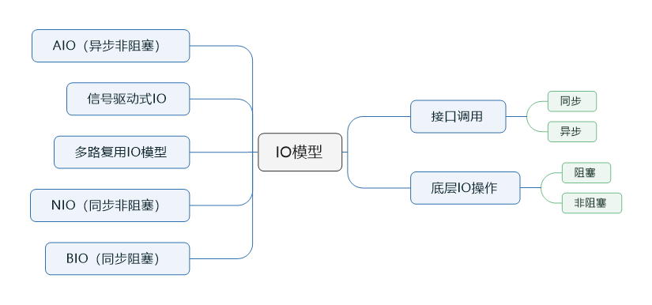
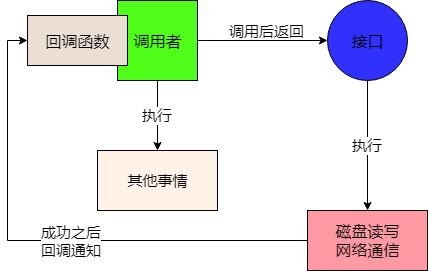
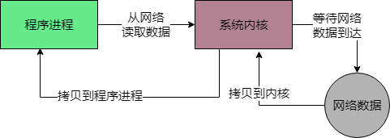
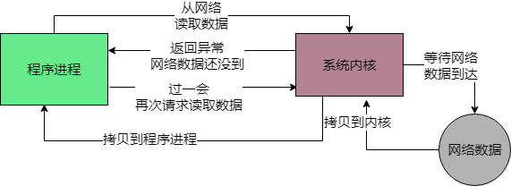
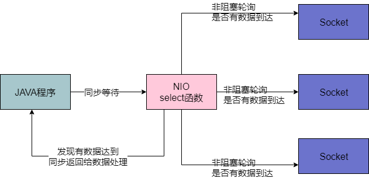
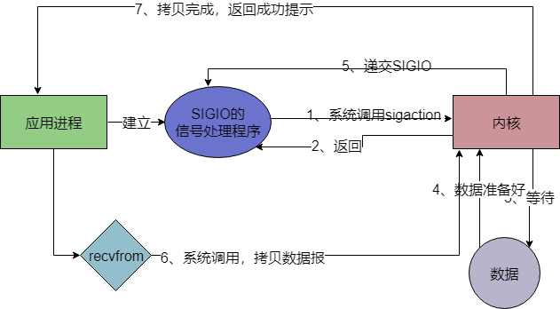
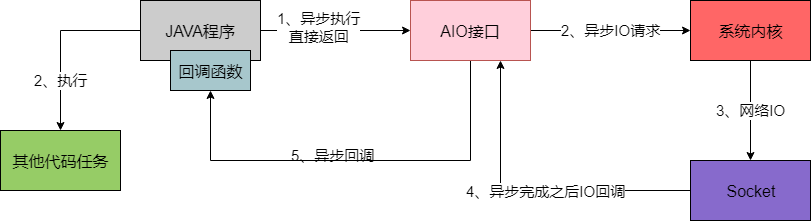

> 本节思维导图

## 同步和异步的概念：针对接口调用，API调用，服务调用等。

### 同步

调用者必须等待这个接口的磁盘读写或网络通信的操作执行完毕，调用者才可以返回，如图所示：

### 异步

调用者调用接口后，直接就返回，不用等待磁盘读写或网络通信操作完成，而是可以去做其他事情。而这个接口如果干完了某件事，会反过来通知调用者，之前的调用成功了。这个可以通过内部机制来通知，或者通过回调函数来通知。

## 阻塞和非阻塞：针对的是底层底层IO操作

### 阻塞

比如我们的程序现在想要通过网络读取数据，如果是阻塞IO模式，一旦发起请求到操作系统内核去从网络中读取数据，就会阻塞在那里，必须等待网络中的数据到达之后，才能从网络中读取数据到内核，再从内核返回给程序。

### 非阻塞

程序发送请求给内核要从网络读取数据，但是此时网络中的数据还没到，此时不会阻塞住，内核会返回一个异常信息给程序，程序可以干别的，然后不断去轮询去访问内核，看请求的数据是否读取到了。如图所示：

## BIO，NIO，多路复用IO，信号驱动式IO和AIO

### BIO

​		主要是同步阻塞IO模型，在JAVA里叫做BIO，在JDK1.4之前，在JAVA代码里调用IO相关接口，发起IO操作之后，JAVA程序就会同步等待，这个同步指的是JAVA程序调用IO API接口的层面而言。

​		而IO API在底层的IO操作是基于阻塞IO来的，向操作系统内核发起IO请求，系统内核会等待数据就位之后，才会执行IO操作，执行完毕了才会返回。

### NIO

​		在JDK1.4之后提供了NIO，他的概念是同步非阻塞，也就是说如果你调用NIO接口去执行IO操作，其实还是同步等待，但是在底层的IO操作上，会对系统内核发起非阻塞IO请求，以非阻塞的形式来执行IO。

​		也就是说，如果底层数据没到位，那么内核会返回异常信息，不会阻塞住，但是NIO接口内部会采用非阻塞方式过一会儿再次调用内核发起IO请求，知道成功为止。

​		之所以说是同步非阻塞的，这里的“同步”指的就是因为在你的JAVA代码调用NIO接口层面是同步的，你还是要同步等待底层IO操作真正完成了才可以返回，只不过在执行底层IO的时候采用了非阻塞的方式来执行罢了。

### IO多路复用模型

​		实际上，如果基于NIO进行网络通信，采取的就是多路复用的IO模型，这个多路复用IO模型针对的是网络通信中的IO场景来说的。就是在基于Socket进行网络通信的时候，如果有多个客户端跟你的服务端建立了Socket连接，你就需要维护多个Socket连接。而所谓的多路复用IO模型，就是说你的JAVA代码直接通过一个select函数（一般都是系统内核级别的函数，除此还有poll,epoll）调用，直接进入一个同步等待的状态。

​		这也是为什么说NIO一定是“同步”的，因为你必须在这里同步等待某个Socket连接有请求到来。接着你就要同步等着select函数去对底层的多个Socket连接进行轮询，不断地查看各个Socket连接谁有请求到达，就可以让select函数返回，交给我们的java程序处理。

​		select函数在底层会通过非阻塞的方式轮询各个Socket，任何一个Socket如果没有数据到达，那么非阻塞的特性会立即返回一个信息。然后select函数可以轮询下一个Socket，不会阻塞在某个Socket上，所以底层是基于这种非阻塞的模式来“监视”各个Socket谁有数据到达的。

​		这就是所谓的“同步非阻塞”，但是因为操作系统把上述工作都封装在一个select函数调用里，可以对多路Socket连接同时进行监控，所以就把这种模型称为“IO多路复用”模型。

​		通过这个模型，就可以用一个线程，调用一个select函数，然后监视大量的客户端连接，如下图：

### 信号驱动式IO

​		首先我们允许Socket进行信号驱动IO，并安装一个信号处理函数，进程继续运行并不阻塞。当数据准备好时，会收到一个SIGIO信号，可以在信号处理函数中调用IO操作函数处理数据，如下图所示：

​		相比于非阻塞式IO的轮询方式，信号驱动IO的CPU利用率更高。

### AIO

​		在JDK1.7之后，又支持了AIO，也就做NIO2.0，他就支持异步IO模型。

​		异步IO模型，就是你的Java程序可以基于AIO API发起一个请求，比如接收网络数据，AIO API底层会基于异步IO模型来调用操作系统内核。此时不惜要去管这个IO是否成功，AIO接口会直接返回，你的Java程序也会直接返回。然后，你的Java程序就可以去干别的事情了。

​		BIO，NIO都是同步的，你发起IO请求，都必须同步等待IO操作完成，但是这里你发起一个请求，直接AIO接口就返回了，你可以干别的事情了，纯异步方法，不过需要你提供一个回调函数给AIO接口，一旦底层系统内核完成了具体的IO请求，比如网络读写之类的，就会回调你提供的回调函数。

