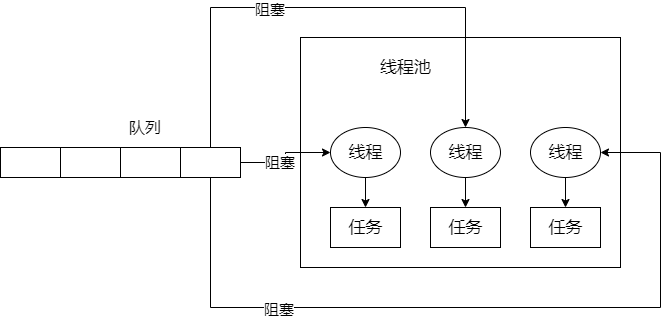

## 简单说一下Java线程池的底层工作原理

​		一般情况下，系统是不会说无限制地创建大量的线程，会构建一个线程池，保持一定数量的线程，让他们执行各种各样的任务，线程执行完任务后，不要销毁自己，继续去等待执行下一个任务。这样可以避免频繁地创建线程和销毁线程。

```java
  ExecutorService threadPool = Executors.newFixedThreadPool(3);
  threadPool.submit(new Callable<Object>() {

       @Override
       public Object call() throws Exception {
           return null;
       }
  });
```

​		大概流程是这样的：提交任务，先看一下线程池里的线程数量是否小于corePoolSize，也就是上面代码的3。如果小于，直接创建一个线程出来执行你的任务；执行完任务之后，这个线程是不会死掉的，它会尝试从一个无界的LinkedBlockingQueue里获取新的任务，如果没有新的任务，此时就会阻塞住，等待新的任务到来。

​		应用持续提交任务，上述流程反复执行，只要线程池的线程数量小于corePoolSize，都会直接创建新线程来执行这个任务，执行完了就尝试从无界队列里获取任务，知道线程里有corePoolSize个线程；接着再次提交任务，会发现线程数量已经跟corePoolSize一样大了，此时就会直接把任务放入队列中就可以了，线程会争取获取任务执行。如果所有人的线程此时都在执行任务，那么无界队列里的任务就可能会越来越多。



## 线程池的核心配置参数

​		上面的那段代码：`Executors.newFixedThreadPool(3);`，进去里面查看源码，是这样子的：

```java
public static ExecutorService newFixedThreadPool(int nThreads) {
        return new ThreadPoolExecutor(nThreads, nThreads,
                                      0L, TimeUnit.MILLISECONDS,
                                      new LinkedBlockingQueue<Runnable>());
    }
```

​		创建一个线程池就是这样子的。除了那个0L，参数依次是corePoolSize、maximumPoolSize，keepAliveTime，queue。如果你不用fixed之类的线程池，可以自己通过这个构造函数创建自己的线程池。

```
corePoolSize: 3
maximumPoolSize: 200
keepAliveTime: 60s
new ArrayBlockingQueue<Runnable>(200)
```

​		如果你把queue做成有界队列，比如上面的new ArrayBlockingQueue<Runnable>(200)，假设corePoolSize个线程都在繁忙地工作，大量的任务进入有界队列，队列满了，如果你的maximumPoolSize是比corePoolSize大的，此时会继续创建额外的线程放入线程池里，来处理这些任务，然后超过corePoolSize数量的线程如果处理完了一个任务也会尝试从队列里去获取任务来执行。

​		如果额外线程都创建完了去处理任务了，队列还是满了，此时还有新的任务，那该怎么办？只能reject掉。目前有几种reject策略，可以传入RejectExecutionHandler

- AbortPolicy

- DiscardPolicy

- DiscardOldestPolicy

- CallerRunsPolicy

- 自定义

​		如果后续队列里，慢慢没有任务了，线程空闲了，超过corePoolSize的线程会自动释放掉，在keepAliveTime之后就会释放。在具体场景中，我们可以根据上述原理定制自己的线程池，来考虑corePoolSize的数量、队列类型、最大线程数量、拒绝策略和线程释放时间等等。一般常用的是fixed线程。

## 线程池的队列满了之后会发生什么事情

​		这个要分情况考虑，如果`maximumPoolSize`是Integer.MAX_VALUE，那么线程池会创建无限多的线程，最终有可能导致内存溢出或者CPU负载过高而服务器挂掉。如果`maximumPoolSize`不是Integer.MAX_VALUE，而线程池的队列是无界队列，那么有可能系统会创建大量任务塞进队列中，最终导致内存溢出；如果队列是有界的，并且`maximumPoolSize`不是Integer.MAX_VALUE，那么有可能部分任务没被执行到而被reject掉。可以自定义一个reject策略，如果线程池无法执行更多的任务，此时建议可以把这个任务信息持久化写入到磁盘里去，后台专门启动一个线程，后续等待线程池的工作负载降低了，可以慢慢地从磁盘读取之前持久化的任务，重新提交到线程池里去执行。

## 线上机器突然宕机，如果处理线程池阻塞队列中的请求

​		服务器突然宕机，会导致线程池里积压的任务丢失。可以这么处理，如果你要提交一个任务到线程池里去，在提交之前，先在数据库里插入这个任务的信息，更新它的状态：未提交。已提交、已完成。提交成功之后，更新它的状态是已提交状态。

​		系统重启，后台线程去扫描数据库里的未提交和已提交状态的任务，可以把任务的信息读取出来，重新提交到线程池里去，继续执行。


