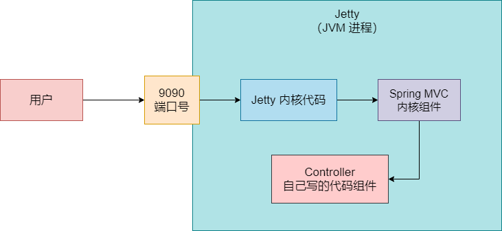
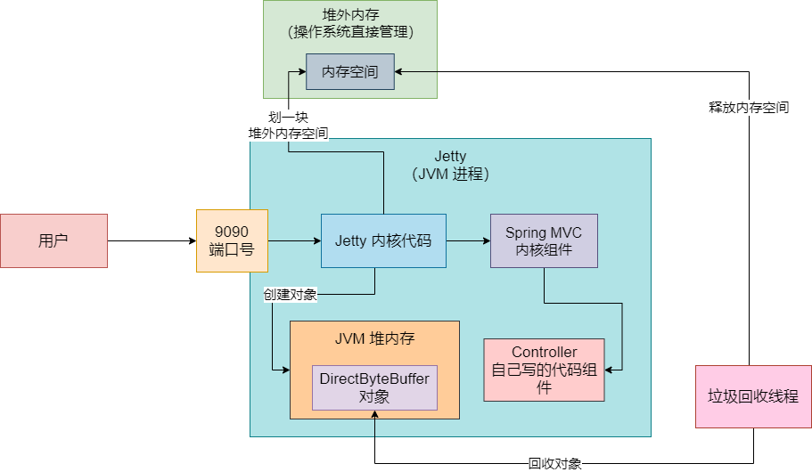
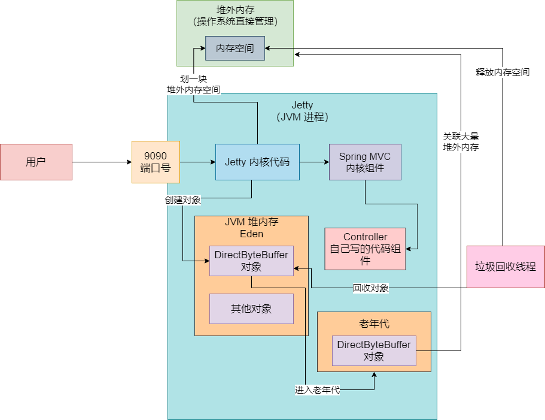

## 背景引入

这是一个使用 Jetty 作为 Web 服务器的时候在某个非常罕见的场景下发生的一次堆外内存溢出的场景。这种场景其实并不多见，只是给大家介绍一下这种场景的排查方法


### 案例发生

有一天收到线上的一个报警：某台机器部署的一个服务突然之间就不可以访问了。此时第一反应就是登陆机器去看日志，这个时候在机器的日志中发现了如下的一些信息：

```verilog
nio handle failed java.lang.OutOfMemoryError: Direct buffer memory
at org.eclipse.jetty.io.nio.xxx
at org.eclipse.jetty.io.nio.xxx
at org.eclipse.jetty.io.nio.xxx
```


过多的日志信息给省略掉了，因为都是非常杂乱的一些信息，也没太大意义。上述日志中，最主要的就是告诉我们有 OOM 异常，而且还是 `Direct buffer memory` 这一块内存导致的


到目前为止，仅仅看到这些日志，我们基本就可以分析出这次 OOM 发生的原因了


## 案例分析

先给大家解释一个东西： Direct buffer memory。这个东西其实就是堆外内存。它是 JVM 堆内存之外的一块内存空间，这块内存空间不是 JVM 管理的，但是你的 Java 代码确实是可以在 JVM 堆之外使用一些内存空间的。


另外再解释一下 `Jetty`。这个你大致可以理解为跟 Tomcat 一样的东西，就是 Web 容器。Jetty 本身也是 Java 写的，如果我们写好了一个系统，可以打包放入 Jetty，启动 Jetty 即可。Jetty 启动之后，本身就是一个 JVM 进程，它会监听一个端口号，比如说 9090


然后你就向 Jetty 监听的 9090 端口发送请求，Jetty 会把请求转交给你用的 Spring MVC 之类的框架，Spring MVC 之类的框架再去调用写好的 Controller 之类的代码。如图，我们简单看下 Jetty 作为一个 JVM 进程运行我们写好的系统的一个流程：




首先可以明确一点，这次 OOM 是 Jetty 这个 Web 服务器在使用堆外内存的时候导致的，即，基本可以推测出，Jetty 服务器可能在不停地使用堆外内存，然后堆外内存空间不足了，此时就会抛出内存溢出的异常。


至于为什么 Jetty 要不停地使用堆外内存，就暂时别管那么多，那涉及到 Jetty 作为一个 Web 服务器的底层源码细节。我们只要知道它会不停地去使用堆外内存，然后用着堆外内存不够了，就内存溢出了。


### 堆外内存是如何申请和释放的

堆外内存是如何申请和释放的？简单说，如果在 Java 代码里要申请使用一块堆外内存空间，是使用 `DirectByteBuffer` 这个类，你可以通过这个类构建一个 DirectByteBuffer 对象，这个对象本身是在 JVM 堆内存里的。但是你在构建这个对象的同时，就会在堆外内存中划出来一块内存空间跟这个对象关联起来。因此在分配堆外内存的时候大致就是这个思路。


那堆外内存是如何释放的？当你的 `DirectByteBuffer` 对象没人引用了，成了垃圾对象之后，自然会在某一次 young gc 或者是 full gc 的时候把 DirectByteBuffer 对象回收掉。只要回收掉一个 DirectByteBuffer 对象，就会自然释放掉它关联的那块堆外内存。




### 为什么会出现堆外内存溢出

那一般什么情况下回出现堆外内存溢出？如果你创建了很多的 DirectByteBuffer 对象，占用了大量的堆外内存，然后这些 DirectByteBuffer 对象还没有 GC 线程来回收，那么就不会释放堆外内存。久而久之，当堆外内存都被大量的 DirectByteBuffer 对象关联使用了，如果你再要使用更多的堆外内存，那么就会报内存溢出了


那什么情况下回出现大量的 DirectByteBuffer 对象一直存活着，导致大量的堆外内存无法释放呢？一种可能是系统承载了超高并发，压力很高，瞬时大量请求过来，创建了过多的 DirectByteBuffer 占用了大量的堆外内存，此时再继续想要使用堆外内存，就会内存溢出了。


但今天的这个案例不是这种情况，因为这个系统的负载其实没有想象中那么高，不会有瞬时大量的请求过来。


### 堆外内存溢出原因分析

这个时候你的思路就要活跃起来了，我们可以去用 `jstat` 等工具观察一下线上系统的实际运行情况，同时根据日志看看一些请求的处理耗时，综合性地分析一下。当时我们通过 `jstat` 工具分析 JVM 运行情况，同时分析了过往的 gc 日志，还看了一下系统各个接口的调用耗时之后，分析出了如下思路。


首先看了一下接口的调用耗时，这个系统并发量不高，但是它每个请求处理较为耗时，平均在每个请求需要一秒多的时间去处理


然后我们通过 `jstat` 发现，随着系统不停地被调用会一直创建各种对象，包括 Jetty 本身会不停地创建 DirectByteBuffer 对象去申请堆外内存空间，接着直到年轻代的 Eden 区满了，就会触发 young gc。但是往往在进行垃圾回收的一瞬间，可能有的请求还没处理完毕，此时就会有不少 DirectByteBuffer 对象处于存活状态，不能被回收掉，当然之前不少 DirectByteBuffer 对象对应的请求可能处理完毕了，他们就可以被回收了。


此时肯定会有一些 DirectByteBuffer 对象以及一些其他的对象是处于存活状态的，那么就需要转入 Survivor 区域中。此时要注意一点，这个系统当时在上线的时候，内存分配地极为不合理。在当时而言，大概就给了年轻代一两百 MB 的空间，老年代反而给了七八百 MB 的空间，进而导致年轻代中的 Survivor 区域只有 10MB 左右的空间。


因此往往在 young gc 过后，一些存活下来的对象（包括了一些 DirectByteBuffer 在内）会超过 10MB，没法放入 Survivor 中，就会直接进入老年代。因此上述的过程就这么反复执行，会慢慢的导致一些 DirectByteBuffer 对象慢慢地进入老年代中，老年代中的 DirectByteBuffer 对象会越来越多，而且这些 DirectByteBuffer 都是关联了很多堆外内存的。如图：




这些老年代里的 DirectByteBuffer 其实很多都是可以回收的状态了，但是因为老年代一直没塞满，所以没触发 full gc，也就自然不会回收老年代里的这些 DirectByteBuffer 了，所以老年代里这些没有被回收的 DirectByteBuffer 就一直关联占据了大量的堆外内存空间了


直到最后，当你要继续使用堆外内存的时候，结果所有的堆外内存都被老年代里大量的 DirectByteBuffer 给占用了，虽然他们可以被回收，但是无奈因为始终没有触发老年代的 full gc，所以堆外内存也始终无法被回收掉。最终就会导致内存溢出问题的发生。


### Java NIO 如何解决这个问题

难道 Java NIO 就没考虑过会有上述问题的产生吗？当时不是，Java NIO 是考虑到的。它知道可能很多 DirectByteBuffer 对象也许没人用了，但是因为没有触发 gc 就导致它们一直占据着堆外内存。


所以在 Java NIO 的源码中会做如下处理，它每次分配新的堆外内存的时候，都会调用 `System.gc()` 去提醒 JVM 去主动执行一下 gc 去回收掉一些没人引用的 DirectBYteBuffer 对象，释放堆外内存。只要能触发垃圾回收去回收掉一些没人引用的 DirectByteBuffer，就会释放一些堆外内存，自然就可以分配更多的对象到堆外内存去了。


但是我们又在 JVM 中设置了如下参数：`-XX:+DisabledExplicitGC`，导致这个 System.gc() 是不生效的，因此就会导致上述的情况。


### 问题的优化

其实项目问题有两个，一个是内存设置不合理，导致 DirectByteBuffer 对象一直慢慢进入老年代，导致堆外内存一直释放不掉。另一个是设置了 `-XX:+DisableExplicitGC` 导致 Java NIO 没法主动提醒去回收掉一些垃圾 DirectByteBuffer 对象，同样最终导致堆外内存无法释放。


因此最终对这个项目做得事情就是：

- 合理分配内存，给年轻代更多内存，让 Survivor 区域有更大的空间

- 放开 `-XX:+DisableExplicitGC` 这个限制，让 System.gc() 生效


做完优化之后，DirectByteBuffer 一般就不会不断进入老年代了。只要它停留在年轻代，随着 young gc 就会正常回收释放堆外内存了。另外，放开了 `-XX:+DisableExplicitGC` 的限制，Java NIO 发现堆外内存不足了，自然会通过 System.gc() 提醒 JVM 去主动垃圾回收，可以回收掉一些 DirectByteBuffer 释放一些堆外内存。