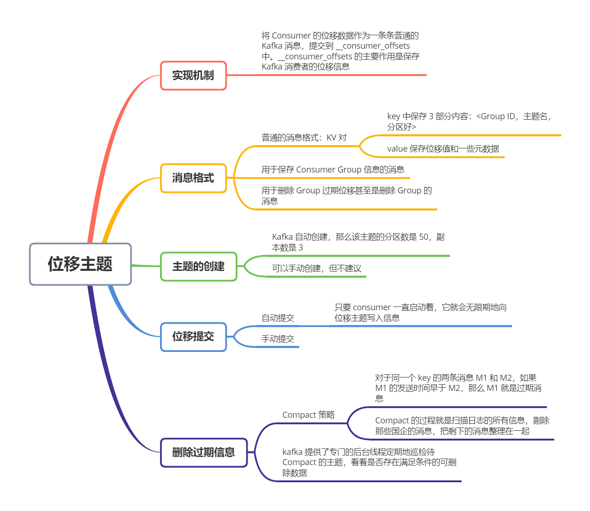
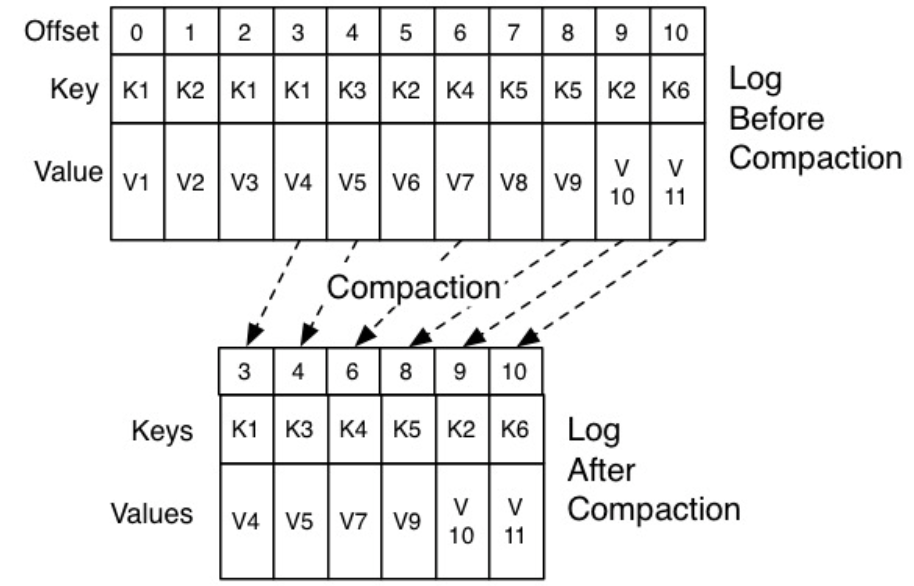

Kafka 内部有一个位移主题：`__consumer_offsets`，它的主要作用就是用来保存 Kafka 消费者的位移信息

位移主题可以看做是一个普通的 Kafka 主题，但它的消息格式却是 Kafka 自己定义的，用户不能修改，即你不能随意地向这个主题写消息，因为一旦你写入的消息不满足 Kafka 规定的格式，那么 Kafka 内部就无法解析成功

那这个主题存的到底是什么格式的消息呢？你可以简单地理解为是一个 KV 对。其中，**位移主题的 Key 中保存 3 部分内容：<Group ID，主题名，分区号>**。那么它的消息体呢？消息体除了保存一个位移值外，还保存了位移提交的一些其他元数据，诸如时间戳和用户自定义的数据等。保存这些元数据是为了帮助 Kafka 执行各种各样后续的操作，比如删除过期位移信息等。但总体来说，我们还是可以简单地认为消息体就是保存了位移值

事实上，除了上面说的那种格式，消息格式还有 2 种：

1. 用于保存 Consumer Group 信息的消息
2. 用于删除 Group 过期位移甚至是删除 Group 的消息

第一种比较神秘，你只需要记住它是用来注册 Consumer Group 的就可以了

第二种相对有名一些，有个专属的名字：tombstone 消息，即墓碑消息。这些消息只出现在源码中而不暴露给你，它的主要特点是它的消息体是 null，即空消息体

那么，何时会写入这类消息呢？一旦某个 Consumer Group 下的所有 Consumer 实例都停止了，而且它们的位移数据都已被删除了，Kafka 会向位移主题的对应分区写入 tombstone 消息，表名要彻底删除这个 Group 的信息

接着说说位移主题是怎么被创建的。一般来说，**当 Kafka 集群中的第一个 Consumer 程序启动时，Kafka 就会自动创建位移主题**。位移主题就是普通的 Kafka 主题，那么它自然也有对应的分区数。但如果是 Kafka 自动创建的，分区数是怎么设置呢？这就要看 Broker 端参数 `offsets.topic.num.partitions` 的取值了。它的默认值是 50，因此 kafka 会自动创建一个 50 分区的位移主题

除了分区数，副本数或者备份因子是怎么控制的？这就是 Broker 端另一个参数 `offsets.topic.replication.factor` 要做的事情了，它的默认值是 3

总结一下，如果位移主题是Kafka 自动创建的，那么该主题的分区数是 50，副本数是 3

当然，你也可以选择手动创建位移主题，具体方法是，在 kafka 主题尚未启动任何 Consumer 之前，使用 kafka API 创建它。手动创建的好处在于，你可以创建满足你实际场景需要的位移主题。比如 50 个分区太多了，那么你就可以手动创建，不用理会 offsets.topic.num.partitions 的值

不过我给你的建议是，还是让 Kafka 自动创建比较好。目前 Kafka 源码中有一些地方硬编码了 50 分区数，因此如果你自行创建了一个不同于默认分区数的位移主题，可能会碰到各种各种奇怪的问题

创建主题当然是为了用的，那么什么地方会用到位移主题呢？前面一直在说 Kafka Consumer 提交位移时会写入该主题，那 Consumer 是怎么提交位移的？目前 Kafka Consumer 提交位移的方式有两种：**自动提交位移和手动提交位移**

Consumer 端有个参数 `enabled.auto.commit`，如果值是 true，则 Consumer 在后台默默地为你定期提交位移，提交间隔由一个专属的参数 `auto.commit.interval.ms` 来控制。自动提交位移有一个显著的特点，就是省事，你不用操心位移提交的事情，就能保证消息消息不会丢失。但是，自动提交会丧失很大的灵活性和可控性，你完全没法把控 Consumer 端的位移管理

事实上，很多与 Kafka 集成的大数据框架都是禁用自动提交位移的，如 Spark、Flink 等。这就引出了另一种位移提交方式：**手动提交位移**，即设置 enable.auto.commit = false。一旦设置了 false，作为 Consumer 应用开发的你就要承担起位移提交的责任。Kafka Consumer API 为你提供了位移提交的方法，如 consumer.commitSync 等。当调用这些方法时，Kafka 会向位移主题写入相应的消息

如果你选择的是自动提交位移，那么就可能存在一个问题：只要 Consumer 一直启动着，它就会无限期地向位移主题写入消息

举个极端的例子。假设 Consumer 当前消费到了某个主题的最新一条消息，位移是 100，之后该主题没有任何新消息产生，故 Consumer 无消息可消费了，所以位移永远保持在 100。由于是自动提交位移，位移主题中会不停地写入位移 = 100 的消息。显然 Kafka 只需要保留这类消息中的最新一条就可以了，之前的消息都是可以删除的。这就要求 Kafka 要有针对位移主题消息特点的消息删除策略

Kafka 使用 Compact 策略来删除位移主题中的过期消息。那么如何定义 Compact 策略中的过期呢？对于同一个 Key 的两条消息 M1 和 M2，如果 M1 的发送时间早于 M2，那么 M1 就是过期消息。Compact 的过程就是扫描日志的所有消息，剔除那些过期的消息，然后把剩下的消息整理在一起

图中位移为 0、2、3 的消息的 key 都是 K1。Compact 之后，分区只需要保存位移为 3 的消息，因为它是最新发送的

**Kafka 提供了专门的后台线程定期地巡检待 Compact 的主题，看看是否存在满足条件的可删除数据**。这个线程叫 Log Cleaner。很多实际生产环境中都出现过位移主题无线膨胀占用过多磁盘空间的问题，这是可以去检查一下 Log Cleaner 线程的状态，通常都是这个线程挂掉导致的

