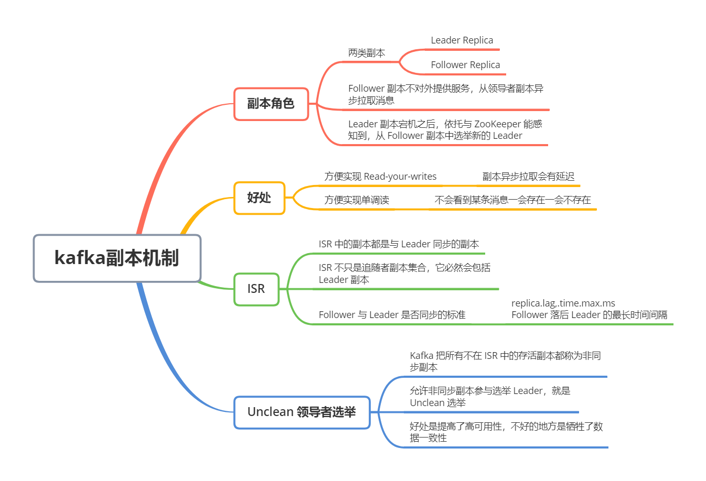
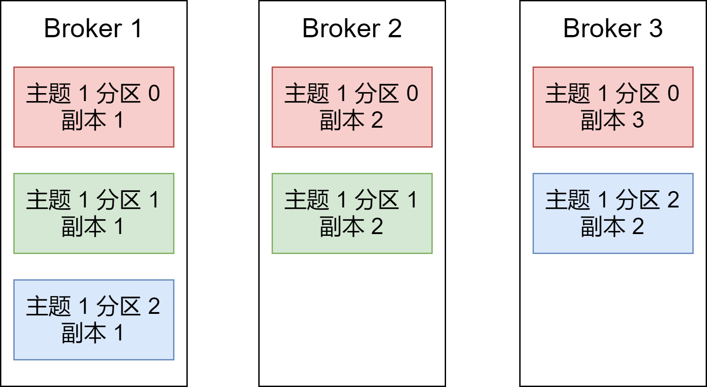
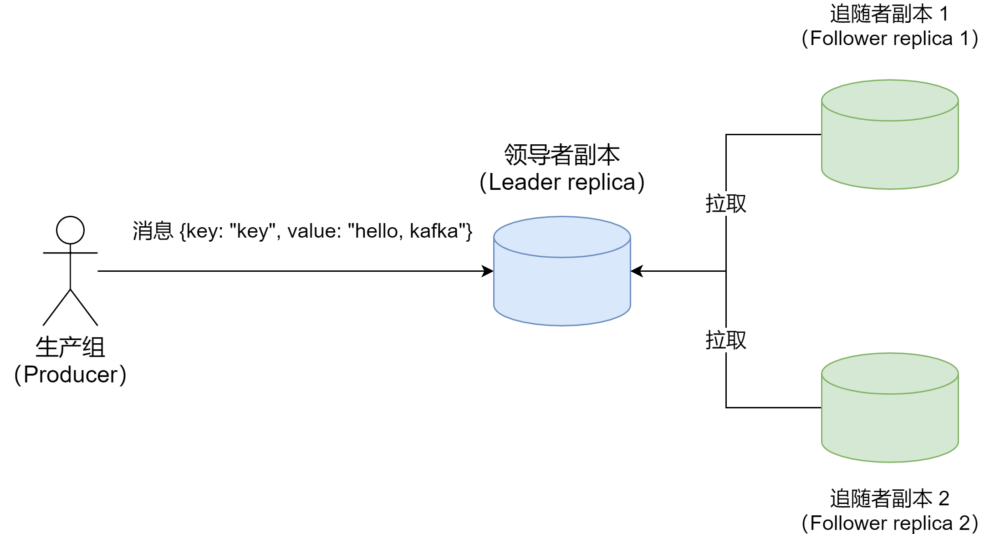

Kafka 是有主题概念的，而每个主题又进一步分成若干个分区。副本的概念实际上是在分区层架下定义的，每个分区配置有若干个副本。**所谓副本，本质就是一个只能追加消息的提交日志**。同一个分区下的所有副本保存有相同的消息序列，这些副本分散保存在不同的 Broker 上，从而能够对抗部分 Broker 宕机带来的数据不可用

如下图，展示的是一个有 3 台 Broker 的 Kafka 集群上的副本分布情况。我们可以看到，主题 1 分区 0 的 3 个副本分散在 3 台 Broker 上，其他主题分区的副本也都散落在不同的 Broker 上，从而实现数据冗余

### 副本角色

当生产者发送消息到某个主题后，消息是如何同步到对应的所有副本中的呢？针对这个问题，最常见的解决方案就是采用**基于领导者（Leader - based）的副本机制**

第一，在 Kafka 中，副本分成两类：领导者副本（Leader Replica）和追随者副本（Follower Replica）。每个分区在创建时都要选举一个副本，成为领导者副本，其余的副本自动称为追随者副本

第二，在 Kafka 中，**Follower Replica 是不对外提供服务的**。即，所有的读写请求都必须发往 Leader Replica 所在的 Broker 处理。Follower Replica 不处理客户端请求，它唯一的任务就是从 Leader Replica **异步拉取**消息，并写入到自己的提交日志中，从而实现与 Leader Replica 的同步

第三，当 Leader Replica 所在的 Broker 宕机时，Kafka 依托与 ZooKeeper 提供的监控功能能够实时感知到，并开启新一轮的 Leader 选举，从 Follower Replica 中选一个作为新的 Leader。老 Leader Replica 重启回来后，只能作为 Follower 加入到集群中

对于客户端而言，Kafka 的 Follower Replica 没有任何作用，它既不能像 MySQL 那样帮助 Leader Replica 「扛读」，也不能实现将某些副本放到离客户端近的地方来改善数据局部性

那 Kafka 为什么要这么设计？其实有两个方面的好处：

**1、方便实现「Read - your - writes」**

所谓「Read - your - writes」，就是当你使用生产者 API 向 Kafka 成功写入消息后，马上使用消费者 API 去读刚才生产的消息

例如，你平时发微博时，刚发完一条，肯定是希望能立即看到的，这就是典型的 Read - your - writes 场景。如果允许 Follower Replica 对外提供服务，由于副本同步是异步的，所以有可能出现 Follower Replica 还没有从 Leader Replica 那里拉取到最新的消息，从而使得客户端看不到最新写入的消息

**2、方便实现单调读**

单调读就是，对于一个消费者用户而言，在多次消费消息时，它不会看到某条消息一会存在一会不存在

如果允许 Follower Replica 提供读服务，假设当前有 2 个 Follower Replica，分别是 F1 和 F2，它们异步地拉取 Leader Replica 数据。如果 F1 拉取了 Leader 的最新消息而 F2 还没有及时拉取，那么，此时如果有一个消费者从 F1 读取消息之后又从 F2 拉取消息，它可能会遇到：第一次消费时看到的最新消息在第二次消费时不见了，这就不是单调读一致性了

但是，如果所有的读请求都是由 Leader 来处理，那么 Kafka 就很容易实现单调读一致性

### In - sync Replica（ISR）

上面说过，Follower 不提供服务，只是定期地异步拉取 Leader 中的数据而已。既然是异步，就存在这不可能与 Leader 实时同步的风险。那么，Follower 到底在什么条件下才算可以与 Leader 同步？

基于这个想法，Kafka 引入了 In- sync Replica，即 ISR 副本集合。ISR 中的副本都是与 Leader 同步的副本，相反，不在 ISR 中的 Follower 就被认为是与 Leader 不同步的。那么，什么副本能进入 ISR 中呢？

首先要明确的是，Leader 副本天然就在 ISR 中。即，**ISR 不只是 Follower 副本集合，它必然包含 Leader 副本。甚至在某些情况下，ISR 只有 Leader 这一个副本**

Follower 是否与 Leader 同步，**主要看 Broker 端参数 replica.lag.time.max.ms 的值**。这个参数的含义是 Follower 副本能够落后 Leader 副本的最长时间间隔，当前默认值是 10 秒。即，只要一个 Follower 落后 Leader 的时间不连续超过 10 秒，那么 Kafka 就认为该 Follower 与 Leader 是同步的，即使此时 Follower 副本中保存的消息明显少于 Leader 副本中的

上面说过，Follower 副本唯一的工作就是不断地从 Leader 副本拉取消息，然后写入到自己的提交日志中。如果这个同步过程的速度连续慢于 Leader 副本的消息写入速度，那么在 replica.lag.time.max.ms 时间后，此 Follower 副本就会被认为是与 Leader 副本不同步的。此时，Kafka 会自动收缩 ISR 集合，将该副本剔除 ISR

如果该副本后面慢慢地追上 Leader 的进度，那么它是能够重新被加回 ISR 的。这也说明，ISR 是一个动态的集合，而非静态不变的

### Unclean 领导者选举（Unclean Leader Election）

既然 ISR 是可以动态调整的，那么就可能出现ISR 为空的情况。因为 Leader 副本天然就在 ISR 中，如果 ISR 为空，说明 Leader 副本也挂掉了。Kafka 需要重新选举一个新的 Leader。可是此时 ISR 为空，该怎么选举新 Leader 呢？

**Kafka 把所有不在 ISR 中的存活副本都称为非同步副本**。一般来说，非同步副本落后 Leader 太多，因此，如果选举这些副本作为新 Leader，就可能出现数据的丢失。毕竟这些副本中保存的消息远远落后于老 Leader 中的消息

在 Kafka 中，选举这种副本的过程称为 Unclean 领导者选举。**Broker 端参数 unclean.leader.election.enable 控制是否允许 Unclean 领导者选举**

开启 Unclean 领导者选举可能会造成数据丢失，但好处是，它使得分区 Leader 副本一直存在，不至于停止对外提供服务，因此提升了高可用性。反之，禁止 Unclean 领导者选举的好处在于维护了数据的一致性，避免了消息丢失，但牺牲了高可用性

你可以根据记得实际场景决定是否开启 Unclean 领导者选举。不过，我强烈建议不要开启，毕竟我们可以通过其他方式来提升高可用性。如果为了这点高可用性的改善，牺牲了数据一致性，就很不值当了