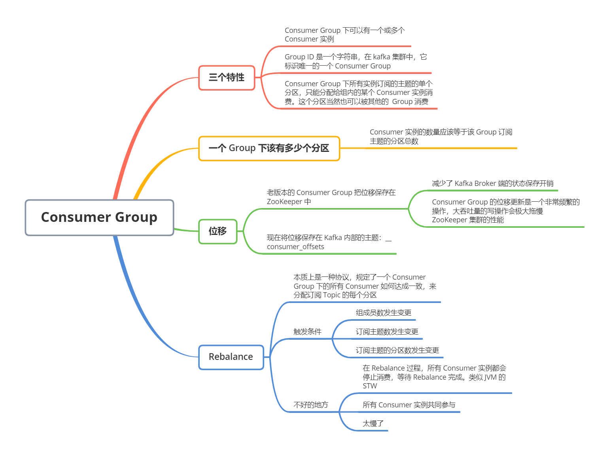

**Consumer Group 是 Kafka 提供的可扩展且具有容错性的消费者实例**。组内有多个消费者或消费者实例，他们共享一个公共的 ID，这个 ID 被称为 Group ID。组内的所有消费者协调在一起来消费订阅主题（Subscribed Topics）的所有分区（Partition）。当然，每个分区只能由同一个消费组内的一个 Consumer 实例来消费

理解 Consumer Group，记住下面三个特性就行

1. Consumer Group 下可以有一个或多个 Consumer 实例。这里的实例可以是一个单独的进程，也可以是统一进程下的线程。在实际场景中，使用进程更为常见一些
2. Group ID 是一个字符串，在一个 Kafka 集群中，它标识唯一的一个 Consumer Group
3. Consumer Group 下所有实例订阅的主题的单个分区，只能分配给组内的某个 Consumer 实例消费。这个分区当然也可以被其他的 Group 消费

Consumer Group 之间彼此独立，互不影响，它们能够订阅相同的一组主题而互不干涉。再加上 Broker 端的消息留存机制，Kafka 的 Consumer Group 完美地规避了伸缩性差的问题。**Kafka 仅仅使用 Consumer Group 这一种机制，就同时是吸纳了 传统消息引擎系统的两大模型**：如果所有实例都属于同一个 Group，那么它实现的就是消息队列模型；如果所有实例分别属于不同的 Group，那么它实现的就是发布 / 订阅模型

那么，在实际场景中，怎么知道一个 Group 下该有多少个 Consumer 实例呢？**理想情况下，Consumer 实例的数量应该等于该 Group 订阅主题的分区总数**

例如，一个 Consumer Group 订阅了 3 个主题，分别是 A、B、C，他们的分区数依次是 1、2、3，那么通常情况下，为该 Group 设置 6 个 Consumer 实例是比较理想的情形，它能最大限度地实现高伸缩性

接着，针对 Consumer Group，Kafka 是怎么管理位移的呢？消费者在消费的过程中需要记录自己消费了多少数据，即消费位置信息。在 Kafka 中，这个位置信息有个专门的术语：位移（Offset）

看上去 Offset 就是一个数值而已，其实对于 Consumer Group 而言，它是一组 KV 对，Key 是分区，V 对应 Consumer 消费该分区的最新位移。当然 Kafka 源码中并不是这样简单的数据结构，而是要复杂得多，不过不妨碍我们对 Group 位移的理解

老版本的 Consumer Group 把位移保存在 ZooKeeper 中。将位移保存 ZooKeeper 外部系统的做法，最显而易见的好处就是减少了 Kafka Broker 端的状态保存开销。现在比较流行的做法是将服务器节点做成无状态的，这样可以自由地扩缩容，实现超强的伸缩性。Kafka 最开始也是基于这样的考虑，才将 Consumer Group 位移保存在独立于 Kafka 集群之外的框架中

但是，Kafka 这类元框架其实并不适合进行频繁的写更新，而 Consumer Group 的位移更新确实一个非常频繁的操作。这种大吞吐量的写操作会极大拖慢 ZooKeeper 集群的性能，因此 Kafka 社区意识到，将 Consumer 位移保存在 ZooKeeper 中是不合适的

于是，在新版本的 Consumer Group 中，采用了将位移保存在 Kafka 内部主题的方法。这个内部主题就是 __consumer_offsets

最后，我们再说说 Consumer Group 端的重平衡，也就是所谓的 Rebalance

**Rebalance 本质上是一种协议，规定了一个 Consumer Group 下所有 Consumer 如何达成一致，来分配订阅 Topic 的每个分区**。比如某个 Group 下有 20 个 Consumer 实例，它订阅了一个具有 100 个分区的 Topic。正常情况下，Kafka 平均会为每个 Consumer 分配 5 个分区。这个分配的过程就叫 Rebalance

那么 Consumer Group 何时进行 Rebalance 呢？Rebalance 的触发条件有 3 个

1. 组成员数发生变更。比如有新的 Consumer 实例加入组或者离开组，抑或是有 Consumer 实例崩溃被「踢出」组
2. 订阅主题数发生变更。Consumer Group 可以使用正则表达式的方式订阅主题，比如 consumer.subscribe(Pattern.compile("t.*c")) 就表明该 Group 订阅所有以字母 t 开头、字母 c 结尾的主题。在 Consumer Group 的运行过程中，你新创建了一个满足这样条件的主题，那么该 Group 就会发生 Rebalance
3. 订阅主题的分区数发生变更。Kafka 当前只能允许增加一个主题的分区数。当分区数增加时，就会触发该订阅主题的所有 Group 开启 Rebalance

接着，我们说说 Rebalance 不好的地方

首先，Rebalance 过程对 Consumer Group 消费过程有极大的影响。如果你了解 JVM 的垃圾回收机制，一定听过 stop the world，简称 STW。在 STW 期间，所有应用线程都会停止工作，表现为整个应用程序僵在那一动不动。Rebalance 过程也和这个类似，在 Rebalance 过程中，所有 Consumer 实例都会停止消费，等待 Rebalance 完成。这个 Rebalance 为人诟病的一个方面

其次，目前 Rebalance 的设计是所有 Consumer 实例共同参与，全部重新分配所有分区。其实更高效的做法是尽量减少分配方案的变动。例如实例 A 之前负责消费分区 1、2、3，那么 Rebalance 之后，如果可能的话，最好还是让实例 A 继续消费分区 1、2、3，而不是重新分配其他分区。这样，实例 A 连接这些分区所在 Broker 的 TCP 连接就可以继续用，不用重新创建连接其他 Broker 的 Socket 资源

最后，Rebalance 实在是太慢了。有个国外用于的 Group 内有几百个 Consumer 实例，成功 Rebalance 一次要几个小时。这完全是不能忍受的。目前社区还没有特别好的解决方案，也许最好的方案就是避免 Rebalance 的发生吧 

