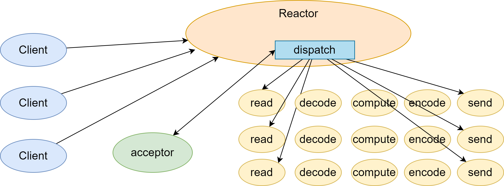
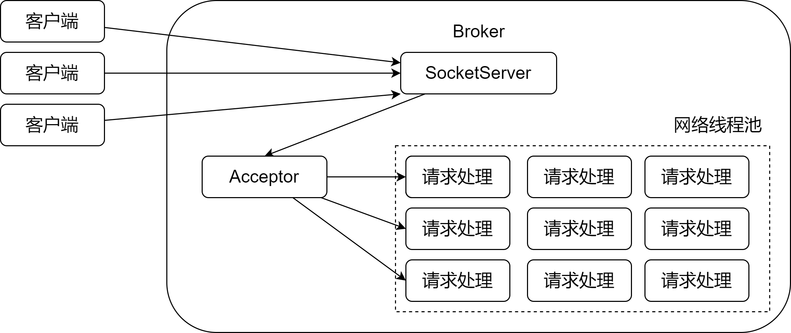
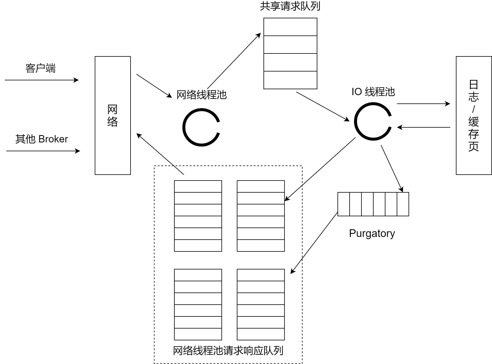

无论是 Kafka 客户端还是 Broker 端，它们之间的交互都是通过「请求 / 响应」的方式完成的。比如，客户端会通过网络发送消息生产请求给 Broker，而 Broker 处理完成后，会发送对应的响应给客户端


Apache Kafka 自己定义了一组请求协议，用于实现各种各样的交互操作。比如常见的 PORDUCE 请求用于生产消息，FETCH 请求用于消费信息，METADATA 请求用于请求 KAFKA 集群元数据信息的


总之，Kafka 定义了很多类似的请求格式。**所有的请求格式都是通过 TCP 网络以 Socket 的方式进行通讯的**


今天，我们就来讨论一下 Kafka Broker 端处理请求的全流程


关于如何处理请求，很容易想到的方案有两个


1、**顺序处理请求**。如果写成伪代码，大概是这样：


```java
while(true) {
    Request request = accept(connection);
    handle(request)
}
```


这个方法很简单，但是有个致命的缺陷，那就是**吞吐量太差**。由于只能顺序处理每个请求，因此，每个请求都必须等待前一个请求处理完毕才能得到处理。这种方式只适用于**请求发送非常不频繁的系统**


2、每个请求使用单独线程处理。即，我们为每个入站请求都创建一个新的线程来异步处理。伪代码如下：


```java
while(true) {
    Request request = accept(connection);
    Thread thread = new Thread(() -> {
        handle(request);
    });
    thread.start();
}
```


这种方式完全采用**异步**的方式。系统会每个入站请求都创建单独的线程来处理。这个方法的好处是，它是完全异步的，每个请求的处理都不会阻塞下一个请求。但缺陷也同样明显，为每个请求都创建线程的做法开销极大，在某些场景下甚至会压垮整个服务。因此，这个方式只适用于请求发送频率很低的业务


因为这两种方案都不好，所以 Broker 使用的是 **Reactor 模式**


**Reactor 模式是事件驱动架构的一种实现方式，特别适合应用于处理多个客户端并发向服务器端发送请求的场景**。Reactor 模式的架构如下图所示：





从上图可以知道，多个客户端会发送请求给 Reactor。Reactor 有个请求分发线程 Dispatcher，也就是图中的 Acceptor，它会将不同的请求下发到多个工作线程中处理


这个架构中，Acceptor 线程只是用于请求分发，不涉及具体的逻辑处理，非常得轻量级，因此有很高的吞吐量表现。而这些工作线程可以根据实际业务处理需要任意增减，从而动态调节系统负载能力


我们为 Kafka 画一张类似的图，如下：





Kafka 的 Broker 端有个 SocketServer 组件，类似于 Reactor 模式中的 Dispatcher，它也有对应的 Acceptor 线程和一个工作线程池，只不过在 Kafka 中，这个过程线程池有个专属的名称，叫网络线程池。Kafka 提供了 Broker 端参数 `num.network.threads`，用于调整该网络线程池的线程数，其**默认值是 3，表示每台 Broker 启动时会创建 3 个网络线程，专门处理客户端发送的请求**


Acceptor 线程采用轮询的方式将入站请求公平地发到所有网络线程中，因此，在实际使用过程中，这些线程通常都有几率被分配到待处理请求，这种轮询策略编写简单，同时也避免了请求处理的倾斜，有利于实现较为公平的请求处理调度


现在，我们知道了客户端发来的请求会被 Broker 端的 Acceptor 线程分发到任意一个网络线程中，由它们来处理。那么，当网络线程接收到请求后，它是怎么处理的？实际上，Kafka 在这个环节又做了一层异步线程池的处理，如下图：





当网络线程拿到请求后，它不是自己处理，而是将请求放入到一个共享请求队列中。Broker 端还有个 IO 线程池，负责从该队列中取出请求，执行真正的处理。如果是 PRODUCE 生产请求，则将消息写入到底层的磁盘日志中；如果是 FETCH 请求，则从磁盘或页缓存中读取消息


IO 线程池中才是执行请求逻辑的线程。Broker 端参数 `num.io.threads` 控制了这个线程池中的线程数。**目前该参数默认值是 8，表示每台 Broker 启动后自动创建 8 个 IO 线程的处理请求**。你可以根据实际硬件条件设置次线程池的个数


如果你的机器上 CPU 资源非常充裕，完全可以调大该参数，允许更多的并发请求被同时处理。当 IO 线程处理完请求后，会将生成的响应发送到网络线程池的响应队列中，然后由对应的网络线程负责将 Response 返还给客户端


通过上图我们还知道了请求队列和响应队列的差别：**请求队列是所有网络线程共享的。而响应队列则是每个网络线程专属的**。这么设计的原因在于，Dispatcher 只是用于请求分发而不负责回传，因此只能让每个网络线程自己发送 Response 给客户端，所以这些 Response 也就没必要放在一个公共的地方


上图中还有一个叫 Purgatory 的组件，它是用来**缓存延时请求**的。**所谓延时请求，就是那些一时未满足条件不能立刻处理的请求**。比如设置了 `acks = all` 的 PRODUCE 请求，一旦设置了 acks = all，那么该请求就必须等待 ISR 中所有副本都接收了消息后才能返回，此时该请求的 IO 线程就必须等待其他 Broker 的写入结果。当请求不能立刻处理，它就会暂存在 Purgatory 中。稍后一旦满足了完成条件，IO 线程就会继续处理该请求，并将 Response 放入对应网络线程的响应队列中


至此，Kafka 请求流程解析其实已经讲完了。接着我们再说点其他东西


目前为止，我提及的请求处理流程对于所有请求都是适用的，即，Kafka Broker 对所有请求是一视同仁的。但是，在 Kafka 内部，除了客户端发送的 PRODUCE 请求和 FETCH 请求之外，还有很多执行其他操作的请求类型，比如负责更新 Leader 副本、Follower 副本以及 ISR 集合的 LeaderAndIsr 请求，负责勒令副本下线的 StopReplica 请求等。与 PRODUCE 和 FETCH 请求相比，这些请求有个明显的不同：它们不是数据类的请求，而是控制类的请求。也就是说，它们不是操作消息数据的，而是用来执行特定的 Kafka 内部动作的


Kafka 把 PRODUCE 和 FETCH 这类请求称为数据类请求，把 LeaderAndIsr、StopReplica 这类请求称为控制类请求。所以，当前这种一视同仁的处理方式对控制类请求是不合理的。因为**控制类请求可以直接令数据类请求失效**


举个例子。假设我们有个主题只有 1 个分区，改分区设置了两个副本，其中 Leader 副本保存在 Broker 0 上，Follower 副本保存在 Broker 1 上。假设 Broker 0 这台机器积压了很多的 PRODUCE 请求，此时如果你使用 Kafka 命令强制将该主题分区的 Leader、Follower 角色互换，那么 Kafka 内部的控制组件（Controller）会发送 LeaderAndIsr 请求被 Broker 0，显式告诉它，当前它不再是 Leader，而是 Follower 了，而 Broker 1 上的 Follower 副本以为被选为新的 Leader，因此停止向 Broker 0 拉取消息


这是，一个尴尬的场面就出现了，如果刚才积压的 PRODUCE 请求都设置了 acks = all，那么这些在 LeaderAndIsr 发送之前的请求都无法正常完成了。就想前面说的，它们会被暂存在 Purgatory 中不断重试，直到最终请求超时返回给客户端


设想一下，如果 Kafka 能够优先处理 LeaderAndIsr 请求，Broker 0 就会立刻抛出 NOT_LEADER_FOR_PARTITION 异常，快速地标识这些积压 PRODUCE 请求已失败，这样客户端不用等到 Purgatory 中的请求超时就能立刻感知，从而降低了请求的处理时间。即使 acks 不是 all，积压的 PRODUCE 请求能够成功写入 Leader 副本的日志，但处理 LeaderAndIsr 之后，Broker 0 上的 Leader 副本成为 Follower 副本，也要执行显式的日志截断（Log Truncation，即原 Leader 副本成为 Follower 后，会将之前写入但为提交的消息全部删除），依然做了很多无用功


再举个例子，同样是积压大量数据类请求的 Broker 上，当你删除主题时，Kafka 控制器向改 Broker 发送 StopReplica 请求。如果该请求不能及时处理，主题删除操作会一直 hang 住，从而增加了删除主题的延时


基于这些问题，社区于 2.3 版本正式实现了 数据类请求和控制类请求的分离。如何解决？很简单，社区完全拷贝了上图中的一套组件，实现了两类请求的分离。也就是说，Kafka Broker 启动后，会在后台分别创建网络线程池和 IO 线程池，它们分别处理数据类请求和控制类请求。至于所有的 Socket 端口，自然是使用不同的端口了，你需要提供不同的 **listeners 配置**，显式地指定哪套端口用于哪类请求


