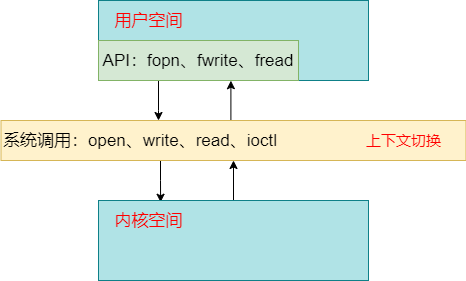
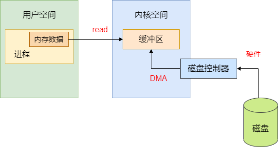
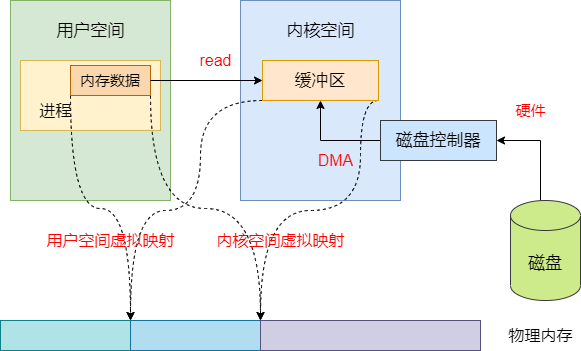
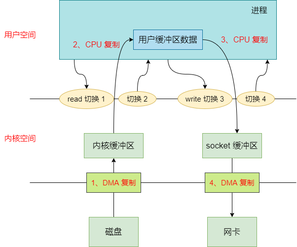
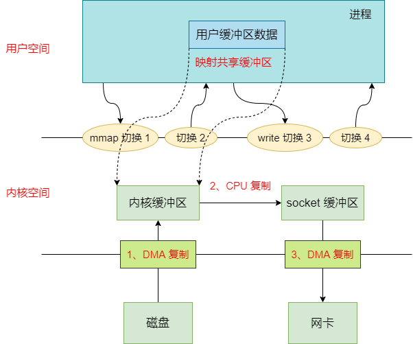
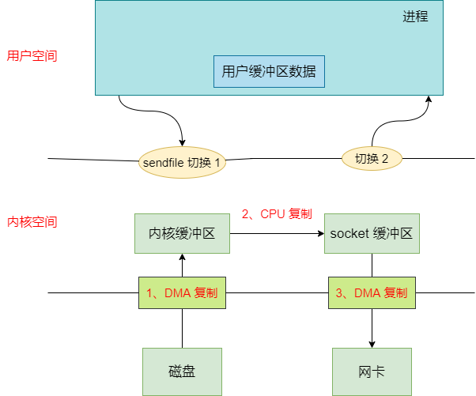
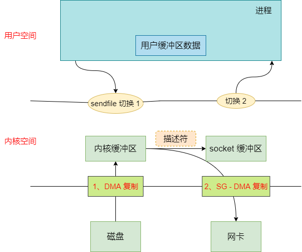

零拷贝就是没有把数据从一个存储区域拷贝到另一个存储区域，但是没有数据的复制，怎么可能实现数据的传输呢？其实我们在 Java NIO、netty、kafka 遇到的零拷贝，并不是不复制数据，而是减少不必要的数据拷贝次数，从而提升代码的性能


## 零拷贝的好处

- 减少或避免不必要的 CPU 数据拷贝，从而释放 CPU 去执行其他任务

- 零拷贝机制能减少用户空间和操作系统内核空间的上下文切换

- 减少内存的占用


## 内核空间和用户空间

- **内核空间**：Linux 自身使用的空间。主要提供进程调度、内存分配、连接硬件资源等功能

- **用户空间**：提供给各个程序进程的空间。用户空间不具有访问内核空间资源的权限，如果应用程序需要使用到内核空间的资源，则需要通过系统调用来完成：从用户空间切换到内核空间，完成相关操作后再从内核空间切换回用户空间





## 缓冲区和虚拟内存

### 直接内存访问

直接内存访问（Direct Memory Access）（DMA）：DMA 允许外设设备和内存存储器之间直接进行 IO 数据传输，其过程不需要 CPU 的参与





### 缓冲区

缓冲区是所有 I/O 的基础，I/O 无非就是把数据移进或移出缓冲区


- 进程发起 `read` 请求，内核先检查内核空间缓冲区是否存在进程所需数据，如果已经存在，则直接 copy 数据到进程的内存区。如果没有，系统则向磁盘请求数据，通过 `DMA` 写入内核的 read 缓冲区，接着再将内核缓冲区数据 copy 到进程的内存区

- 进程发起 `write` 请求，则是把进程的内存区数据 copy 到内核的 write 缓冲区，然后再通过 DMA 把内核缓冲区数据刷回磁盘或者网卡中


### 虚拟内存

现代操作系统都使用虚拟内存，有如下两个好处：


1. 一个以上的虚拟地址可以指向同一个物理内存地址
2. 虚拟内存空间可大于实际可用的物理地址


利用第一点特性可以把内核空间地址和用户空间的虚拟地址映射到同一个物理地址，这样 DMA 就可以填充（读写）对内核和用户空间进程同时可见的缓冲区了。大致如下：





## 传统的 I/O

```c++
#include <unistd>
ssize_t write(int filedes, void *buf, size_t nbytes);
ssize_t read(int filedes, void *buf, size_t nbytes);
```


如 Java 在 Linux 系统上，读取一个磁盘文件，并发送到远程端的服务


1. 发出 `read` 系统调用，会导致用户空间到内核空间的上下文切换，然后再通过 `DMA` 将文件中的数据从磁盘上读取到内核空间缓冲区
2. 接着将内核空间缓冲区的数据拷贝到用户空间进程内存，然后 `read` 系统调用返回。而系统调用的返回又会导致一次内核空间到用户空间的上下文切换
3. `wirte` 系统调用，则再次导致用户空间到内核空间的上下文切换，将用户空间的进程里的内存数据复制到内核空间的 `socket` 缓冲区（也是内核缓冲区，不过是给 socket 使用的），然后 write 系统调用返回，再次出发上下文切换
4. 至于 `socket` 缓冲区到网卡的数据传输则是独立异步的过程，也就是说 `write` 系统调用的返回并不保证数据被传输到网卡





一共有四次用户空间和内核空间的上下文切换。四次数据的 copy，分别是两次 CPU 数据复制，两次 DMA 数据复制


## mmap + write 实现的零拷贝

```c++
#include <sys/mman.h>
void *mmap(void *start, size_t length, int prot, int flags, int fd, off_t offset)
```


`mmap + write` 实现的零拷贝流程大概如下：


1. 发出 `mmap` 系统调用，导致用户空间到内核空间的上下文切换。然后通过 DMA 引擎将磁盘文件中的数据复制到内核空间缓冲区
2. `mmap` 系统调用返回，导致内核空间到用户空间的上下文切换
3. 这里不需要将数据从内核空间复制到用户空间，因为用户空间和内核空间共享了这个缓冲区
4. 发出 `write` 系统调用，导致用户空间到内核空间的上下文切换。将数据从内核空间缓冲区复制到内核空间 socket 缓冲区。`write` 系统调用返回，导致内核空间到用户空间的上下文切换
5. 异步，DMA 引擎将 socket 缓冲区中的数据 copy 到网卡





通过 mmap 实现的零拷贝 I/O 进行了 4 次用户空间与内核空间的上下文切换，以及 3 次数据拷贝；其中 3 次数据拷贝包含了 2 次 DMA 拷贝和 1 次 CPU 拷贝


## sendfile 实现的零拷贝

```c
#include <sys/sendfile.h>
ssize_t sendfile(int out_fd, int in_fd, off_t *offset, size_t count);
```


`sendfile` 实现的零拷贝流程如下：


1. 发出 `sendfile` 系统调用，导致用户空间到内核空间的上下文切换，然后通过 DMA 引擎将磁盘文件中的内容复制到内核空间缓冲区中，接着再将数据从内核空间复制到 socket 相关的缓冲区
2. `sendfile` 系统调用返回，导致内核空间到用户空间的上下文切换。DMA 异步将内核空间 socket 缓冲区中的数据传递到网卡





通过 `sendfile` 实现的零拷贝 I/O 使用了 2 次用户空间与内核空间的上下文切换，以及 3 次数据的拷贝。其中 3 次数据拷贝包括了 2 次 DMA 拷贝和 1 次 CPU 拷贝


## 带有 DMA 收集拷贝功能的 sendfile 实现的零拷贝

从 Linux 2.4 版本开始，操作系统提供 `scatter` 和 `gather` 的 `SG - DMA` 方式，直接从内核空间缓冲区中将数据读取到网卡，无需将内核空间缓冲区的数据再复制一份到 socket 缓冲区。大概流程如下：


1. 发出 `sendfile` 系统调用，导致用户空间到内核空间的上下文切换。通过 DMA 引擎将磁盘文件中的内容复制到内核空间缓冲区
2. 这里没把数据复制到 socket 缓冲区，取而代之的是，相应的描述符信息被复制到 socket 缓冲区。该描述符包含了两种信息：1、内核缓冲区的内存地址；2、内核缓冲区的偏移量
3. `sendfile` 系统调用返回，导致内核空间到用户空间的上下文切换。DMA 根据 socket 缓冲区的描述符提供的地址和偏移量直接将内核缓冲区中的数据复制到网卡





带有 DMA 手机拷贝功能的 `sendfile` 实现的 I/O 使用了 2 次用户空间与内核空间的上下文切换，以及 2 次数据的拷贝，而且这 2 次的数据拷贝都是非 CPU 拷贝。这样一来就实现了最理想的零拷贝 I/O 传输了，不需要任何一次的 CPU 拷贝，以及最少的上下文切换


## Java 提供的零拷贝方式

Java NIO 的零拷贝实现是基于 `mmap + write` 方式


FileChannel 的 map 方法产生的 MappedByteBuffer FileChannle 提供了 map() 方法，该方法可以在一个打开的文件和 MappedByteBuffer 之间建立一个虚拟内存映射，MappedByteBuffer 继承于 ByteBuffer


map 方法底层是通过 mmap 实现的，因此将文件内存从磁盘读取到内核缓冲区后，用户空间和内核空间共享该缓冲区


```java
public static void main(String[] args) throws IOException {

    FileChannel readChannel = FileChannel.open(Paths.get("D:\\test\\read.txt"), StandardOpenOption.READ);
    FileChannel writeChannel = FileChannel.open(Paths.get("D:\\test\\write.txt"), StandardOpenOption.WRITE, StandardOpenOption.CREATE);
    long size = readChannel.size();
    MappedByteBuffer data = readChannel.map(FileChannel.MapMode.READ_ONLY, 0, size);
        
    //数据传输
    writeChannel.write(data);
    readChannel.close();
    writeChannel.close();
        
}
```


FileChannel 的 transferTo、transferFrom 如果操作系统底层支持的话，transferTo、transferFrom 也会使用相关的零拷贝技术来实现数据的传输。用法如下：


```java
public static void main(String[] args) throws IOException {

    FileChannel readChannel = FileChannel.open(Paths.get("D:\\test\\read.txt"), StandardOpenOption.READ);
    FileChannel writeChannel = FileChannel.open(Paths.get("D:\\test\\write.txt"), StandardOpenOption.WRITE, StandardOpenOption.CREATE);
    long size = readChannel.size();
    long position = readChannel.position();

    // 数据传输
    readChannel.transferTo(position, size, writeChannel);
        
    // 效果和 transferTo 一样
    writeChannel.transferFrom(readChannel, position, size);

    readChannel.close();
    writeChannel.close();
}
```


## 参考资料

[Linux 零拷贝原理](https://mp.weixin.qq.com/s/SKuNuC3kSGGor0xwArzvcg)


