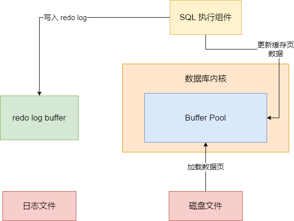
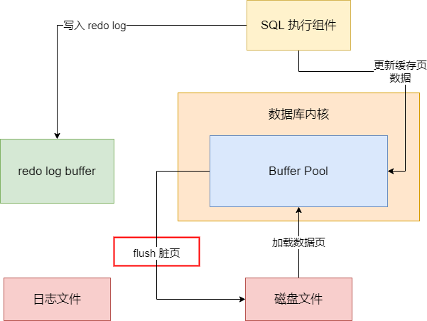
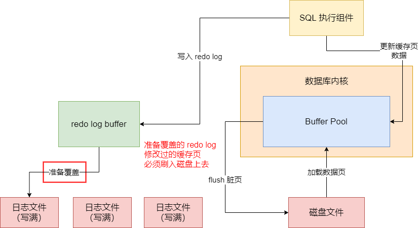

今天我们说说，线上数据库时不时莫名地来一次性能抖动的问题，而且造成性能抖动的还不是之前我们说过的数据库锂电池充放电问题，而是另一个新的问题，跟我们之前讲解的原理是息息相关的

我们平时在数据库里执行的更新语句，实际上都是从磁盘上加载数据页到数据库内存的缓存页里来，接着就直接更新内存里的缓存页吗，同时还更新对应的 redo log 写入一个 buffer 中

既然我们更新了 Buffer Pool 里的缓存页，缓存页机会变成脏页。之所以说它是脏页，就是因为缓存页里的数据目前跟磁盘文件里的数据页是不一样的，所以此时叫缓存页是脏页

既然是脏页，那么得有一个合适的时机把脏页给刷入到磁盘文件里去。之前我们分析过这个脏页刷入磁盘的机制，它是维护了一个 LRU 链表来实现的，通过 LRU 链表，他知道哪些缓存页是最近经常被使用的。

那么如果你要加载磁盘文件的数据页到 Buffer Pool 里去了，但是此时并没有空闲的缓存页了，此时就必须要把部分脏缓存页刷入到磁盘里去，此时就会根据 LRU 链表找那些最近最少被访问的缓存页去刷入磁盘，如图：

那么万一要是你要执行的是一个查询语句，需要查询大量的数据到缓存页里去，此时就可能导致内存里大量的脏页需要淘汰出去刷入磁盘上，才能够腾出足够的内存空间来执行这条查询语句。在这种情况下，可能你会发现突然莫名其妙的线上数据库执行某个查询语句就一下子性能出现抖动，平时只要几十毫秒的查询语句，这次要几秒钟。毕竟你要等待大量脏页 flush 到磁盘，然后语句才能执行

另外还有一种脏页刷磁盘的契机，就是大家都知道 redo log buffer 里的 redo log 本身也是会随着各种条件刷入磁盘上的日志文件的，比如 redo log buffer 里的数据超过容量的一定比例了，或者是事务提交的时候，都会强制 buffer 里的 redo log 刷入磁盘上的日志文件

然后磁盘上是有多个日志文件的，它会依次不停地写，如果所有日志文件都写满了，此时会重新回到第一个日志文件再次写入，这些日志文件是不停地循环写入的，所以其实在日志文件都被写满的情况下，也会触发一次脏页的刷新

为什么？因为假设你的第一个日志文件的一些 redo log 对应的内存里的缓存页的数据都没刷新到磁盘上的数据页里去，一旦你把第一个日志文件里的这部分 redo log 覆盖了写别的日志，此时万一数据库崩溃，是不是有些你之前更新过的数据就彻底丢失了？

因此一旦你把所有日志文件写满了，此时重新从第一个日志文件开始写的时候，它会判断一下，如果你第一个日志文件里的一些 redo log 对应之前更新过的缓存页，还没刷入磁盘，此时必然是要把那些将要被覆盖的 redo log 更新的缓存页都刷入磁盘的

尤其是这一种刷脏页的情况下，因为 redo log 所有日志文件都写满了，此时会导致数据库直接 hang 死，无法处理任何更新请求，因为执行任何一个更新请求都必须要写 redo log，此时你需要刷新一些脏页到磁盘，然后才能继续执行更新语句，把更新语句的 redo log 从第一个日志文件开始覆盖写

所以此时假设你在执行大量的更新语句，可能你突然发现线上数据库莫名地很多更新语句短时间内性能都抖动了，平时就几毫秒就执行好了，这次要等待 1 秒才能执行完毕、因为遇到这种情况，你必须要等待第一个日志文件里部分 redo log 对应的脏页都刷入磁盘了，才能继续执行更新语句，会导致更新语句的性能很差

## 解决方法

上面说的莫名的性能抖动，在分析过底层原理之后，发现根本的原因还是两个：

第一种可能 Buffer Pool 的缓存页都满了，此时你执行一个 SQL 查询很多数据，一下子要把很多个缓存页 flush 到磁盘上去，刷磁盘太慢，就会导致你的查询语句执行的很慢。因为你必须等很多缓存页都 flush 到磁盘了，你才能执行查询从磁盘把你需要的数据页加载到 Buffer Pool 的缓存页里来

第二可能你执行更新语句的时候，redo log 在磁盘上的所有文件都写满了，此时需要回到第一个 redo log 文件覆盖写。覆盖写的时候可能就涉及到第一个 redo log 文件里又很多 redo log 日志对应的更新操作改动了缓存页，那些缓存页还没 flush 到磁盘，此时就必须把那些缓存页 flush 到磁盘，才能执行后续的更新语句，而你这么一等待，必然会导致更新执行的很慢

那么我们怎么**尽可能优化 MySQL 的一些参数**，减少这种缓存页 flush 到磁盘带来的性能抖动问题。

其实，要尽量避免缓存页 flush 到磁盘可能带来的性能抖动问题，核心就两点：一是尽量减少缓存页 flush 到磁盘的频率；二是尽量提升缓存页 flush 到磁盘的速度

但你要减少缓存页 flush 到磁盘的频率，这个是很困难的，因为平时你的缓存页就是正常地被使用，迟早会被填满，一旦填满，必然你执行下一个 SQL 会导致一批缓存页 flush 到磁盘。这个很难控制，除非你给你的数据库采用大内存机器，给 Buffer Pool 分配的空间大一些，那么它缓存页填满的速率低一些，flush 磁盘的频率也会比较低

所以主要还是讲解第二个问题的优化，就是尽可能提升缓存页 flush 到磁盘的速度。例如你现在要执行一个 SQL 查询语句，此时需要等待 flush 一批缓存页到磁盘，接着才能加载查询出来的数据到缓存页。那么如果 flush 那批缓存页到磁盘需要 1s，然后 SQL 查询语句自己执行的时间是 200ms，此时你这条 SQL 执行完毕的总时间就需要 1.2s 了

但是如果你把那批缓存页 flush 到磁盘的时间优化到 100ms，然后加上 SQL 查询自己执行的 200ms，这条 SQL 的总执行时间就只要 300ms 了，性能就提升了很多。

所以这里一个关键之一，就是要尽可能减少 flush 缓存页到磁盘的时间开销最小。如果要做到这一点，通常给大家的建议就是对于数据库部署的机器，一定要采用 SSD 固态硬盘，而不要使用机械硬盘，因为 SSD 固态硬盘的随机 IO 读取能力非常高，而 flush 缓存页到磁盘，就是典型的随机 IO，需要在磁盘上找到各个缓存页所在的随机位置，把数据写入磁盘里去。所以用 SSD 固态硬盘，你的 flush 缓存页到磁盘的性能就会提高不少

其次，光是 SSD 还不够，还得设置一个关键的参数，就是数据库的 `innodb_io_capacity`，这个参数是告诉数据库采用多大的 IO 速率把缓存页 flush 到 磁盘里去

例如，你 SSD 能承载的每秒随机 IO 次数是 600 次，结果你把数据库的 `innodb_io_capacity` 设置为 300，也就是 flush 缓存页到磁盘的时候，每秒最多执行 300 次随机 IO。这速度就相对来说很慢了，没把 SSD 固态硬盘的随机 IO 性能发挥出来

所以通常都会建议对数据库部署的机器的 SSD 固态硬盘能承载的最大随机 IO 速率做一个测试，这个可以使用 `fio` 工具来测试。`fio` 工具是一种用于测试磁盘最大随机 IO 速率的 Linux 工具，如何使用，可以到网上搜一下

查出来 SSD 固态硬盘的最大随机 IO 速率之后，就知道它每秒可以执行多少随机 IO，此时你把这个数值设置给数据库的 `innodb_io_capacity` 就可以了，尽可能地让数据库用最大速率去 flush 缓存页到磁盘

但是实际 flush 的时候，其实它会按照 `innodb_io_capacity`乘以一个百分比来进行刷磁盘，这个百分比就是脏页的比例，是 `innodb_max_dirty_pages_pct` 参数控制的，默认是 75%，这个一般不用动。另外这个比例也有可能会变化，这个比例同时会参考你的 redo log 日志来计算，但是这个细节大家不用太关注

其实比例不比例的，这里的优化不用太关注，核心就是把 `innodb_io_capacity` 调整为 SSD 固态硬盘的 IOPS 也就是随机 IO 速率就可以了。

另外还有一个参数，就是 `innodb_flush_neighbors`，它是说当 flush 缓存页到磁盘的时候，可能会控制把缓存页临近的其它缓存页也刷到磁盘，但是这样有时候会导致 flush 的缓存页太多了。实际上，如果你用的是 SSD 固态硬盘，并没有必要让他同时刷邻近的缓存页，可以把 `innodb_flush_neighbors` 参数设置为 0，禁止刷邻近缓存页，这样就把每次刷新的缓存页数量降到最低

综上，针对这次的案例，就是 MySQL 性能随机抖动的问题，最核心的就是把 `innodb_io_capacity` 设置为 SSD 固态硬盘的 IOPS，让它刷缓存页尽量快。同时设置 `innodb_flush_neighbors` 为 0，让它每次别刷邻近缓存页，减少要刷缓存页的数量，这样就可以把缓存页的性能提升到最高，同时也可以尽可能降低每次刷缓存页对执行 SQL 语句的影响

