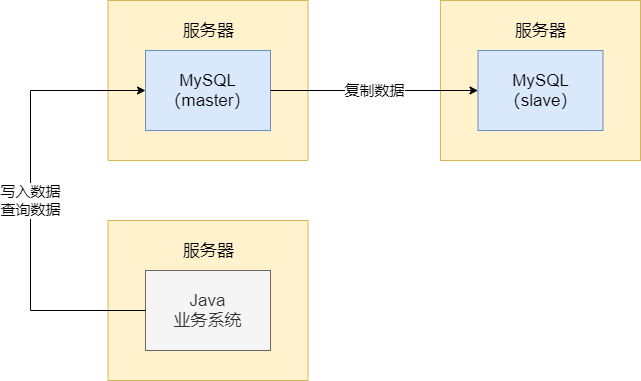
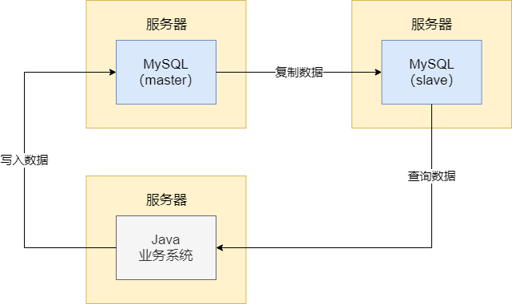
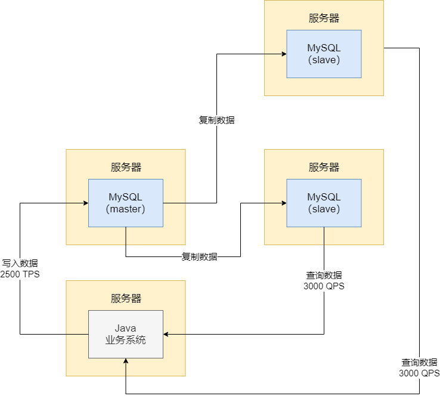
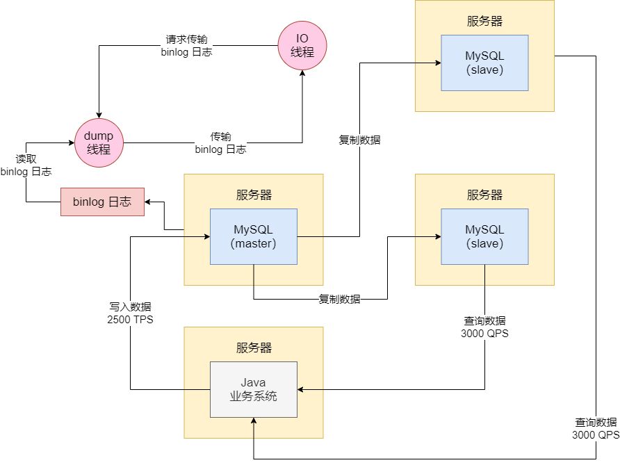
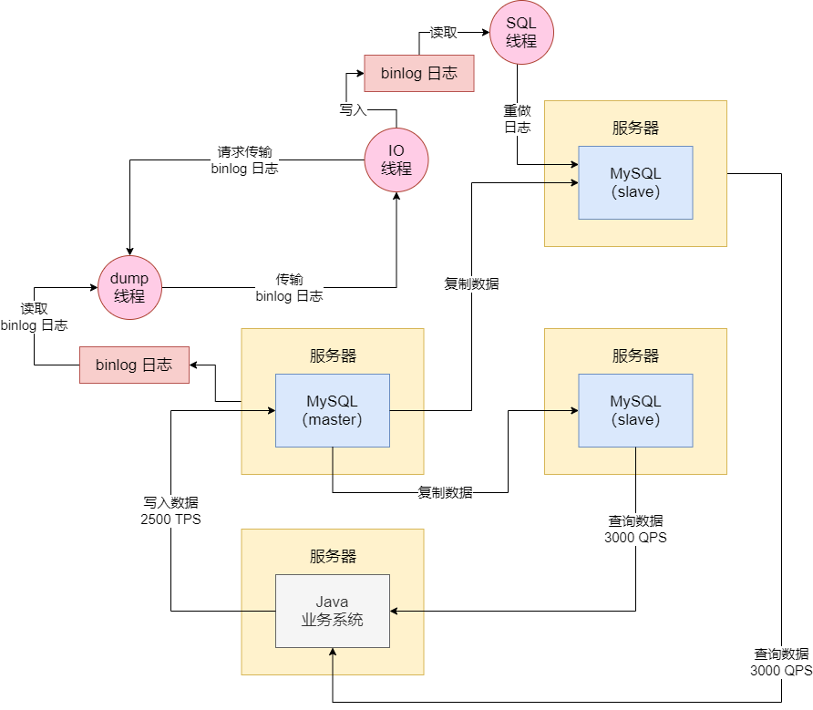

MySQL 的主从复制架构，就是部署两台服务器，每台服务器上都有一个 MySQL，其中一个 MySQL 是 master（主节点），另一个 MySQL 是 slave（从节点）。然后我们的系统平时连接到 master 节点写入数据，当然也可以从里面查询，跟你用一个单机版的 MySQL 是一样的。但是 master 节点会把写入的数据自动复制到 slave 节点去，让 slave 节点可以跟 master 节点有一模一样的数据。如图：

这种架构的意义在哪？如果你的 MySQL 是单机部署的，一旦它宕机了，你的数据库就挂了，那么你的 Java 业务员系统也就挂了。所以在真正的生产架构里，MySQL 要做高可用架构

那高可用架构怎么做？一个先决条件就是主从复制架构。主节点可以复制数据到从节点，保证主从数据是一致的，接着万一你的主节点宕机了，此时可以让你的 Java 业务系统连接到从节点上去执行 SQL 语句。因为主从数据是一致的，所以这是没问题的

但即使生产环境使用这套架构，也还有大量的问题需要解决。例如主从进行数据复制的时候，其实从节点通常都会落后一些，所以数据不完全一致。另外，主节点宕机后，要能自动切换从节点对外提供服务，这也需要一些中间件的支持

## 读写分离

MySQL 主从复制架构，除了实现高可用之外，其实**读写分离架构**，也是依赖于 MySQL 的主从复制架构的。读写分离的意思是，你的 Java 业务系统可以往主节点写入数据，但是从从节点去查询数据，把读写操作做一个分离，分离到两台 MySQL 服务器上去，一台服务器专门让你写入数据，然后复制数据到从节点，另外一台服务器专门让你查询数据。如图：

读写分离的作用是什么？假设我们的 MySQL 单机服务器配置是 8 核 16GB，每秒最多能抗 4000 读写请求。现在假设你真实的业务负载已经达到了每秒 2500 写请求 + 2500 读请求，即每秒 5000 读写请求了，此时一台 MySQL 服务器是扛不住的

此时你可以利用主从复制架构，搭建起来读写分离架构，就可以让每秒 2500 写请求落到主节点那台服务器，2500 读请求落到从节点那台服务器，用 2 台服务器来抗下每秒 5000 的读写请求。

其实，大部分 Java 系统都是读多写少，读请求远远多于写请求。那么随着系统的发展，读请求越来越多，每秒可能有 6000 读请求了，此时一个节点服务器也扛不住。此时，因为 MySQL 的主从复制架构，是支持一主多从的，所以此时可以再在一台服务器上部署一个从节点，去主节点复制数据过来，此时你就有 2 个从节点了，然后你每秒 6000 读请求就可以落到 2 个从节点上去， 每台服务器主要接受处理每秒 3000 的读请求。如图：

Java 业务系统以每秒 2500 的 TPS 写入主库，然后主库会复制数据到两个从库，接着你每秒 6000 QPS 的读请求分散在两个从库上。这就是主从复制的另外一个经典的应用场景，就是读写分离。通过读写分离，可以抗下很高的读请求

在上述架构下，还可以融合高可用架构进去。因为你有多个从库，所以当你主库宕机的时候，可以通过中间件把一个从库切换为主库，此时你的 Java 业务系统可以继续运行，在实现读写分离的场景下，同时实现高可用架构

## 主从复制架构的工作原理

MySQL 在执行增删改的时候会记录 binlog 日志，所以这个 binlog 日志就记录了所有数据的增删改的操作。然后从库上有一个 IO 线程，这个 IO 线程会复制跟主库建立一个 TCP 连接，接着请求主库传输 binlog 日志给自己。这个时候主库上有一个 IO dump 线程，就会负责通过这个 TCP 连接把 binlog 日志传输给从库的 IO 线程。如图：

接着从库的 IO 线程会把读取到的 binlog 日志数据写入到自己本地的 relay 日志文件中，然后从库上另外一个 SQL 线程会读取 relay 日志里的内容，进行日志重做，把所有在主库执行过的增删改操作，在从库上做一遍，达到一个还原数据的过程。如图：

总结起来就是，你只要给主节点挂上一个从节点，从节点的 IO 线程就会跟主节点建立网络连接，然后请求主节点传输 binlog 日志，主节点的 IO dump 线程就会负责传输 binlog 日志给从节点，从节点收到日志后就可以回访增删改操作恢复数据。在这个基础上，就可以实现 MySQL 主从节点的数据复制以及基本一致，进而可以实现高可用以及读写分离架构

