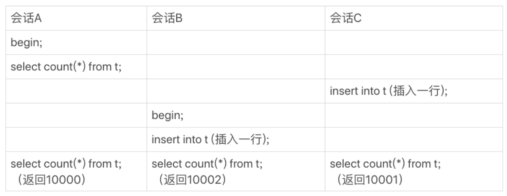

### Count(*) 的实现方式

首先，在不同的 MySQL 引擎中，count(*) 有不同的实现方式

- MyISAM 引擎把一个表的总行数存在了磁盘上，因此执行 count(*) 的时候会直接返回这个数，效率很高
- 而 InnoDB 引擎，它执行 count(*) 的时候，需要把数据一行一行地从引擎里面读出来，然后累积计数

注意，我们讨论的是没有过滤条件的 count(*)，如果加了 where 条件的话，MyISAM 表也是不能返回得这么快的

那为什么 InnoDB 不跟 MyISAM 一样，也把数字存起来呢？

因为即使是在同一个时刻的多个查询，由于多版本并发控制（MVCC）的原因，InnoDB 表「应该返回多少行」也是不确定的。这里，用一个算 count(*) 的例子解释一下

假设表 t 中现在有 10000 条数据，我们设计了三个用户并行的会话

- 会话 A 先启动事务并查询一次表的总行数
- 会话 B 启动事务，插入一行后记录后，查询表的总行数
- 会话 C 先启动一个单独的语句，插入一行记录后，查询表的总行数

假设从上到下是按照时间顺序执行的，同一行语句是在同一时刻执行的

你会发现，在最后一个时刻，三个会话 A B C 会同时查询表 t 的总行数，但拿到的结果却不同

这个 InnoDB 的事务设计有关系，可重复读是它默认的隔离级别，在代码上就是通过多版本并发控制，即 MVCC 来实现的。每一行记录都要判断自己是否对这个会话可见，因此对 count(*) 请求来说，InnoDB 只好把数据一行一行地读出依次判断，可见的行才能够用于计算「基于这个查询」的表的总行数

当然，MySQL 在执行 count(*) 操作的时候还是做了优化的

InnoDB 是索引组织表，主键索引树的叶子节点是数据，而普通索引树的叶子节点是主键值。所以，普通索引树比主键索引树小很多。对于 count(*) 这样的操作，遍历那颗索引树得到的结果逻辑上都是一样的。因此，MySQL 优化器会找到最小的那棵树来遍历。**在保证逻辑正确的前提下，尽量减少扫描的数据量，是数据库系统设计的通用法则之一**

### 不同的 count 用法

在 select count(?) from t 这样的查询语句里面，count(*)、count(主键 id)、count(字段) 和 count(1) 等不同用法的性能，有哪些差别？我们基于 InnoDB 引擎讨论一下

首先要弄清楚 count() 的语义，**count() 是一个聚合函数，对于返回的结果集，一行行地判断，如果 count 函数的参数不是 NULL，累计值就加 1，否则不加。最后返回累计值**

所以，count(*)、count(主键 id) 和 count(1) 都表示返回满足条件的结果集的总行数；而 count(字段) 则表示返回满足条件的数据行你，参数「字段」不为 NULL 的总个数

至于分析性能差别的时候，可以记住这么几个原则：

1. server 层要什么就给什么
2. InnoDB 只给必要的值
3. 现在的优化器值优化了 count(*) 的语义为 「取行数」，其他显而易见的优化并没有做

这是什么意思呢？

**对于 count(主键 id) 来说**，InnoDB 引擎会遍历整张表，把每一行的 id 值都取出来，返回给 server 层。server 层拿到 id 后，判断是不可能为空的，就按行累加

**对于 count(1) 来说**，InnoDB 引擎遍历整张表，但不取值。server 层对于返回的每一行，放一个数字 「1」进去，判断是不可能为空的，按行累加

单看这两个用法的差别的话，能对比出来，count(1) 执行得要比 count(主键 id) 块，因为从引擎返回 id 会涉及到解析数据行，以及拷贝字段值的操作

**对于 count(字段) 来说：**

1. 如果这个「字段」是定义为 not null 的话，一行行地从记录里面读出这个字段，判断不能为 null，按行累加
2. 如果这个「字段」定义允许为 null，那么执行的时候，判断到有可能是 null，还要把值取出来再判断一下，不是 null 才累加

也就是前面的第一条原则，server 层要什么字段，InnoDB 就返回什么字段

但是 count(*) 是例外，并不会把全部字段取出来，而是专门做了优化，不取值。

count(*) 肯定不是 null，按行累加

所以结论是：按照效率排序的话，count(字段) < count(主键 id) < count(1) ≈ count(*)

