开发应用的时候，会遇到需要根据指定的字段排序来显示结果的需求。举个例子，假设有个表的定义是这样子的


```mysql
CREATE TABLE `t` (
  `id` int(11) NOT NULL,
  `city` varchar(16) NOT NULL,
  `name` varchar(16) NOT NULL,
  `age` int(11) NOT NULL,
  `addr` varchar(128) DEFAULT NULL,
  PRIMARY KEY (`id`),
  KEY `city` (`city`)
) ENGINE=InnoDB;
```


这时候你的 SQL 可以这么写：


```mysql
SELECT city, name, age FROM t where city = '杭州' ORDER BY name LIMIT 1000
```


这个语句很简单，但是你了解它的执行流程吗？


### 全字段排序


上面的 SQL 语句中，我们为了避免全表扫描，需要在 city 字段加上索引。在 city 字段上创建索引后，我们用 explain 命令看看看这个语句的执行情况


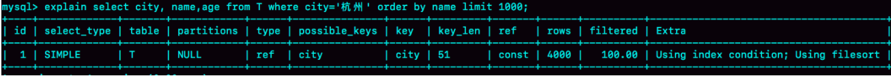


Extra 这个字段中的 `Using filesort` 表示的就是需要排序，MySQL 会给每个线程分配一块内存用于排序，成为 `sort_buffer`


为了说明这个 SQL 查询语句的执行过程，我们先来看一下 city 这个索引的示意图


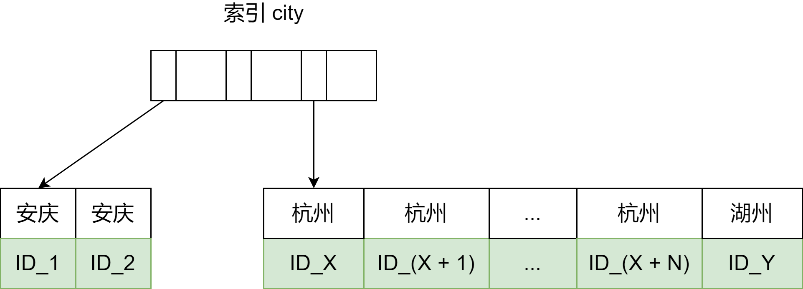


从图中可以看到，满足 city = '杭州' 条件的行，是从 ID_X 到 ID_(X + N) 的这些记录


通常情况下，这个过程执行流程如下：


1. 初始化 sort_buffer，确定放入 name、city、age 这三个字段
2. 从索引 city 找到第一个满足 city = '杭州' 条件的主键 id，也就是图中的 ID_X
3. 到主键 id 索引取出整行，取 name、city、age 三个字段的值，存入 sort_buffer 中
4. 从索引 city 去下一个记录的主键 id
5. 重复步骤 3、4 直到 city 的值不满足查询条件为止，对应的主键 id 也就是图中的 ID_Y
6. 对 sort_buffer 中的数据按照字段name 做快速排序
7. 按照排序结果取前 1000 行返回给客户端


我们暂且把这个排序过程，成为**全字段排序**，执行流程的示意图如下：


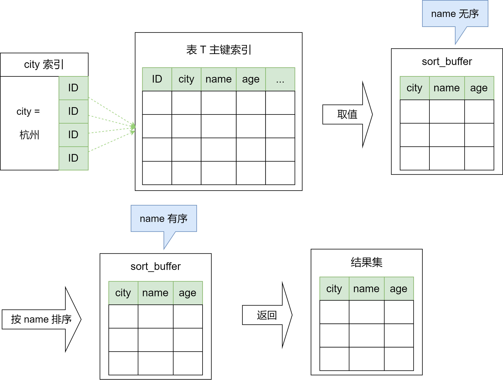


图中 「按 name 排序」这个动作，可能在内存中完成，也可能需要使用外部排序，这取决于排序所需的内存和参数 `sort_buffer_size`


`sort_buffer_size`，就是 MySQL 为排序开辟的内存（sort_buffer）的大小。如果要排序的数据量小于 sort_buffer_size，排序就在内存中完成。但如果排序数据量太大，内存放不下，则不得不利用磁盘临时文件辅助排序


你可以用下面介绍的方法，来确定一个排序语句是否使用了临时文件


```mysql
/* 打开 optimizer_trace，只对本线程有效 */
SET optimizer_trace='enabled=on';

/* @a保存Innodb_rows_read的初始值 */
select VARIABLE_VALUE into @a from  performance_schema.session_status where variable_name = 'Innodb_rows_read';

/* 执行语句 */
select city, name,age from t where city='杭州' order by name limit 1000; 

/* 查看 OPTIMIZER_TRACE 输出 */
SELECT * FROM `information_schema`.`OPTIMIZER_TRACE`\G

/* @b保存Innodb_rows_read的当前值 */
select VARIABLE_VALUE into @b from performance_schema.session_status where variable_name = 'Innodb_rows_read';

/* 计算Innodb_rows_read差值 */
select @b-@a;
```


这个方法是通过 `OPTIMIZER_TRACE` 的结果来确认的，可以从 `number_of_tmp_files` 中看到是否使用了临时文件


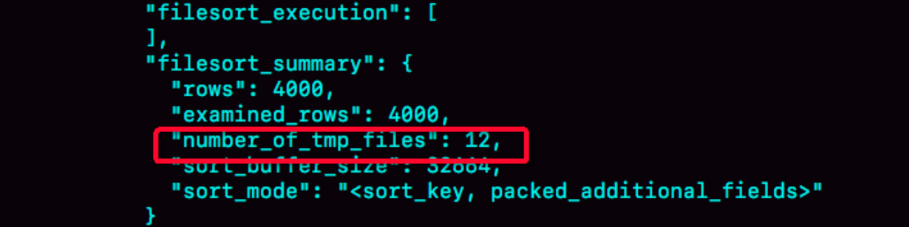


`number_of_tmp_files` 表示的是，排序过程中使用的临时文件数。为什么需要 12 个文件？内存放不下时，就需要使用外部排序，外部排序一般使用归并排序算法。可以这么简单理解，**MySQL 将需要排序的数据分成 12 份，每一份单独排序后存在这些临时文件中。然后把这 12 个有序文件再合并成一个有序的大文件**


如果 `sort_buffer_size` 超过了需要排序的数据量的大小，number_of_tmp_files 就是 0，表示排序可以直接在内存中完成。否则就需要放在临时文件中排序，sort_buffer_size  越小，需要分成的份数越多，number_of_tmp_files 的值就越大


我们示例表中有 4000 条满足 city = '杭州' 的记录，所以你可以看到 examined_rows = 4000，表示参与排序的行数是 4000 行


`sort_mode` 里面的 `packed_additional_fields` 的意思是，排序过程对字符串做了「紧凑」处理。即使 name 字段的含义是 varcahr(16)，在排序过程中还是要按照实际长度来分配空间的


同时，最后一个查询语句 `select @b - @a` 的返回结果是 4000，表示整个执行过程只扫描了 4000 行


这里需要注意的是，为了避免对结论造成干扰，把 `internal_tmp_disk_storage_engine` 设置成 MyISAM，否则，`select @b - @a` 的结果会显示为 4001


这是因为查询 OPTIMIZER_TRACE 这个表时，需要用到临时表，而 interanl_tmp_disk_storage_engine 的默认值是 InnoDB。如果使用的是 InnoDB 引擎的话，把数据从临时表取出来的时候，会让 InnoDB_rows_read 的值加 1


### rowid 排序


上面这个算法过程里面，只对原表的数据读了一遍，剩下的操作都是在 `sort_buffer` 和临时文件中执行的。但这个算法有一个问题，就是如果查询要返回的字段很多的话，那么 sort_buffer 里面要放的字段数太多，这样内存里能够同时放下的行数很少，要分成很多个临时文件，排序的性能会很差


所以如果单行很大，这个方法效率不够好


那么，如果 MySQL 认为排序的单行长度太大会怎么做呢？我们修改一个参数，让 MySQL 采用另外一种算法


```mysql
SET max_length_for_sort_data = 16
```


`max_length_for_sort_data` 是 MySQL 中专门控制用于排序的行数据的长度的一个参数。它的意思是，如果单行的长度超过这个值，MySQL 就认为单行太大，要换一个算法


city、name、age 这三个字段的定义总长度是 36，我把 max_length_for_sort_data 设置为 16，我们在看看计算过程有什么改变


新的算法放入 sort_buffer 的字段，只有要排序的列（即 name 字段）和主键 id


但这时，排序的结果就因为少了 city 和 age 字段的值，不能直接返回了，整个执行流程就变成如下：


1. 初始化 sort_buffer，确定放入两个字段，即 name 和 id
2. 从索引 city 找到另一个满足 city = '杭州' 条件的主键 id，也就是图中的 ID_X
3. 到主键 id 索引取出整行，取 name、id 这两个字段，存入 sort_buffer 中
4. 从索引 city 去下一个记录的主键 id
5. 重复步骤 3、4 直到不满足 city = '杭州' 条件为止，也就是图中的 ID_Y
6. 对 sort_buffer 中数据按照字段 name 进行排序
7. 遍历排序结果，取前 1000 行，并按照 id 的值回到原表中取出 city、name 和 age 三个字段返回给客户端


这个执行流程的示意图如下，我们称为 **rowid 排序**


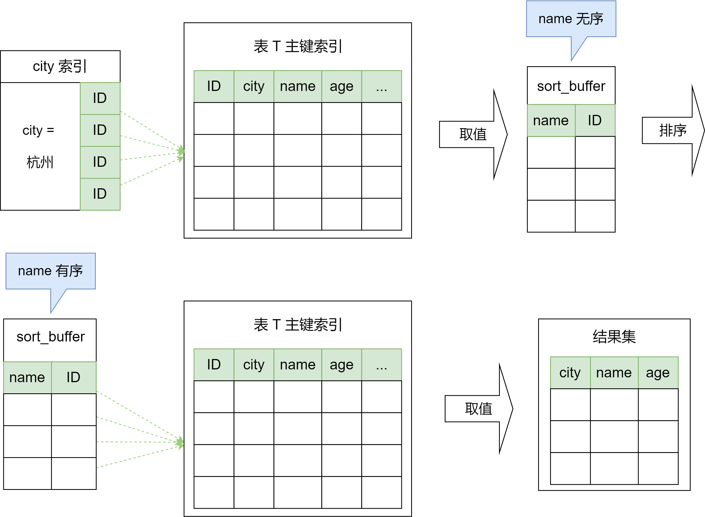


对比全字段排序流程图你会发现，rowid 排序多访问了一次表 t 的主键索引


需要说明的是，最后的「结果集」是一个逻辑概念，实际上 MySQL 服务端从排序后的 sort_buffer 中依次取出 id，然后到原表查到 city、name 和 age 这三个字段的结果，不需要再服务端再耗费内存存储结果，是直接返回给客户端的


根据这个说明过程和图示，你可以想一下，这个时候执行 select @b - @a，结果会是多少？


首先，图中的 examined_rows 的值还是 4000，表示用于排序的数据是 4000 行。但是 select @b - @a 这个语句的值变成 5000 了


因为这时候除了排序过程外，在排序完成后，还要根据 id 去原表取值。由于语句是 limit 1000，因此会多读 1000 行


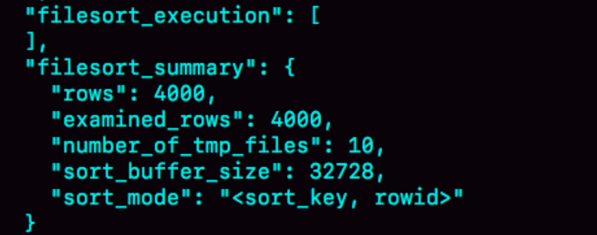


从 OPTIMIZER_TRACE 的结果中，你还能看到另外两个信息也变了


- sort_mode 变成了 <sort_key, rowid>，表示参与排序的只有 name 和 id 这两个字段
- number_of_tmp_files 变成 10 了，是因为这时候参与排序的行数虽然仍为 4000 行，但是每一行都变小了，因此需要排序的总数据量就变小了，需要的临时文件也相应地变小了


### 全字段排序 VS rowid 排序


我们来分析一下，从这两个执行流程，还能得出什么结论


如果 MySQL 实在是担心排序内存太小，会影响排序效率，才会采用 rowid 排序算法，这样排序过程中一次可以排序更多行，但是需要再回到原表去取数据


如果 MySQL 认为内存足够大，会优先选择全字段排序，把需要的字段都放到 sort_buffer 中，这样排序后就会直接从内存里面返回查询结果了，不用再回到原表去取数据


这也就体现了 MySQL 的一个设计思想：**如果内存够，就要多利用内存，尽量减少磁盘访问**


对于 InnoDB 表来说，rowid 排序会要求回表造成磁盘读，因此不会被优先选择


看到这，你就了解了，MySQL 做排序时一个成本比较高的操作。那么，是不是所有的 order by 都需要排序操作呢？如果不排序就能得到正确的结果，那对系统的消耗会小很多，语句的执行时间也会变得更短


其实，并不是所有的 order by 语句，都需要排序操作的。从上面分析的执行过程，我们可以看到，**MySQL 之所以需要生成临时表，并且在临时表上做排序操作，其原因是原来的数据都是无序的**


所以，如果能够保证从 city 这个索引上取出来的行，天然就是按照 name 递增排序的话，是不是就可以不用再排序了呢？


确实是这样。所以，我们可以在这个市民表上创建一个 city 和 name 的联合索引，对应的 SQL 语句是：


```mysql
alter table t add index ciyt_user(city, name)
```


作为与索引 city 索引的对比，我们看看这个索引的示意图


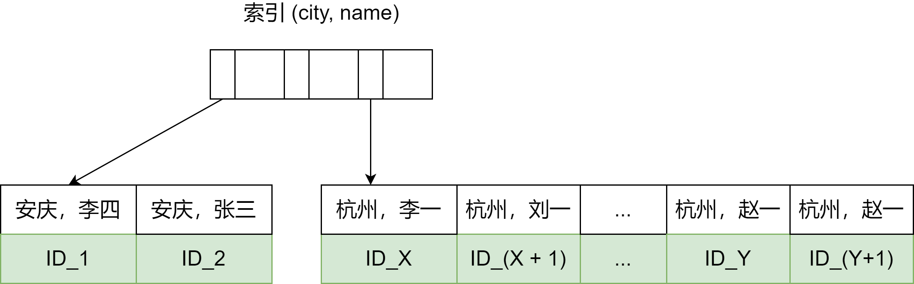


在这个索引里，我们依然可以用树搜索的方式定位到第一个满足 city = '杭州' 的记录，并且额外确保了，接下来按顺序取「下一条记录」的遍历过程中，只要 city 的值是杭州，name 的值就一定是有序的


这样整个查询过程的流程就变成了：


1. 从索引 (city, name) 找打第一个满足 city = '杭州' 条件的主键 id
2. 到主键 id 索引取出整行，取 name、city、age 三个字段的值，作为结果集的一部分直接返回
3. 从索引 (city, name) 取下一个记录主键 id
4. 重复步骤 2、3，直到查到第 1000 条记录，或者是不满足 city = '杭州' 条件时循环结束


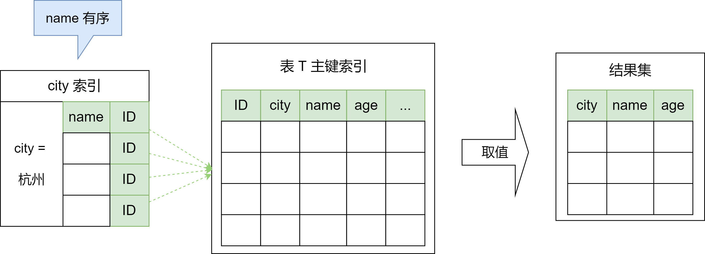


可以看到，这个查询过程不需要临时表，也不需要排序。explain 的结果如下：


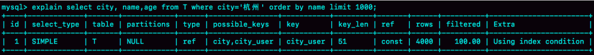


从图中可以看到，Extra 字段中没有 Using filesort 了，也就是不需要排序了。而且由于 (city, name) 这个联合索引本身有序，所以这个查询也不用把 4000 行全都读一遍，只要找到满足条件的前 1000 条记录就可以退出了。即，在我们这个例子里，只需要扫描 1000 次


到这里，这个语句的执行流程有没有可能进一步简化呢？我们可以利用覆盖索引。覆盖索引是指，索引上的信息足够满足查询请求，不需要再回到主键索引上去取数据


按照覆盖索引的概念，我们可以在优化一下这个查询语句的执行流程。我们可以创建一个 city、name 和 age 的联合索引，对应的 SQL 语句就是


```mysql
alter table t add index city_user_age(city, name, age)
```


此时，对于 city 字段的值相同的行来说，还是按照 name 字段的值递增排序的，此时的查询语句也就不再需要排序了。这样整个查询语句的执行流程就变成了：


1. 从索引 (city, name, age) 找到第一个满足 city = '杭州' 条件的记录，取出其中的 city、name 和 age 这三个字段的值，作为结果集的一部分直接返回
2. 从索引 (city, name, age) 去下一个解读那，同样取出这三个字段的值，作为结果集一部分直接返回
3. 重复执行步骤 2，知道查到第 1000 条记录，或者是不满足 city = '杭州' 条件时循环结束


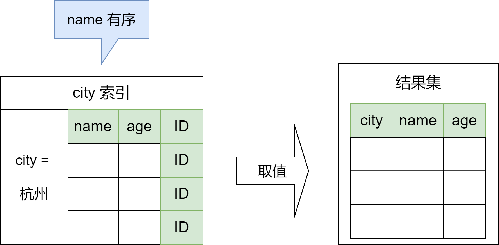


然后，我们来看看 explain 的结果


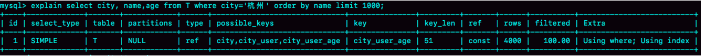


可以看到，Extra 字段里面多了「Using index」，表示的就是使用了覆盖索引，性能上会快很多


当然，这里并不是说要为了么个查询能用上覆盖索引，就要把语句中涉及的字段都建上联合索引，毕竟索引还是有维护代价的。这是一个需要权衡的决定