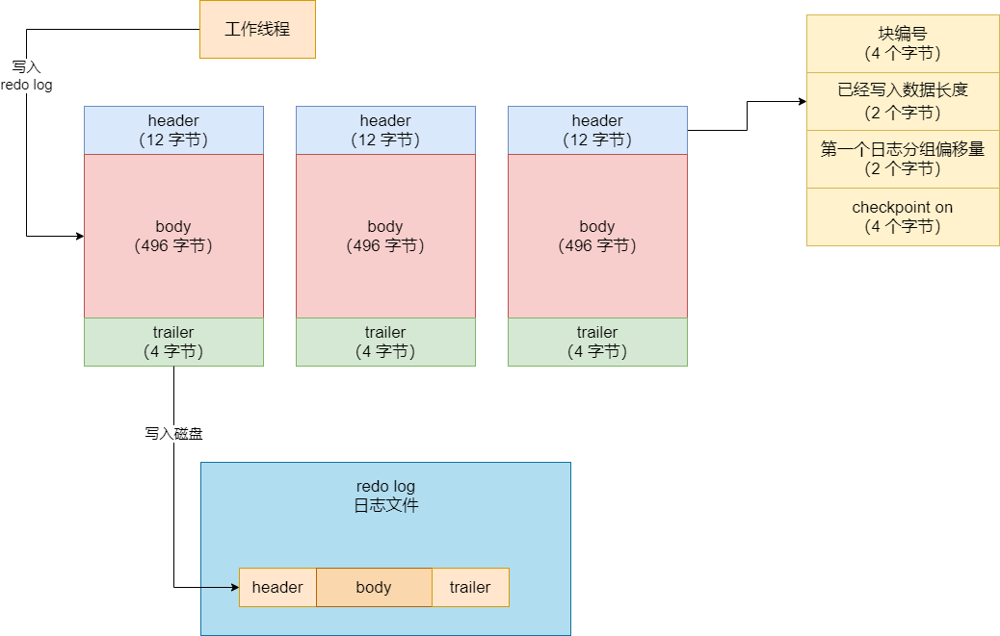
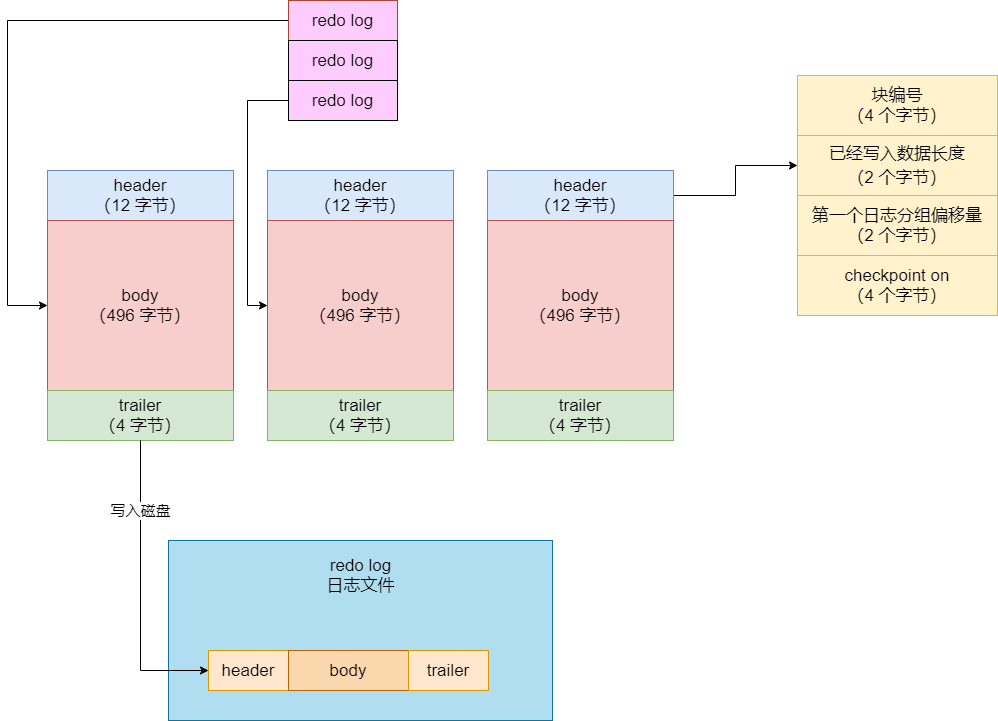
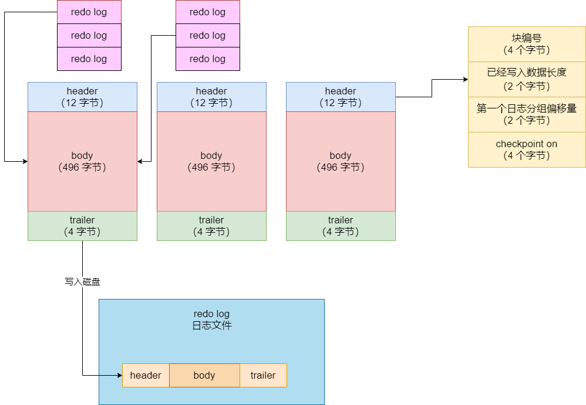
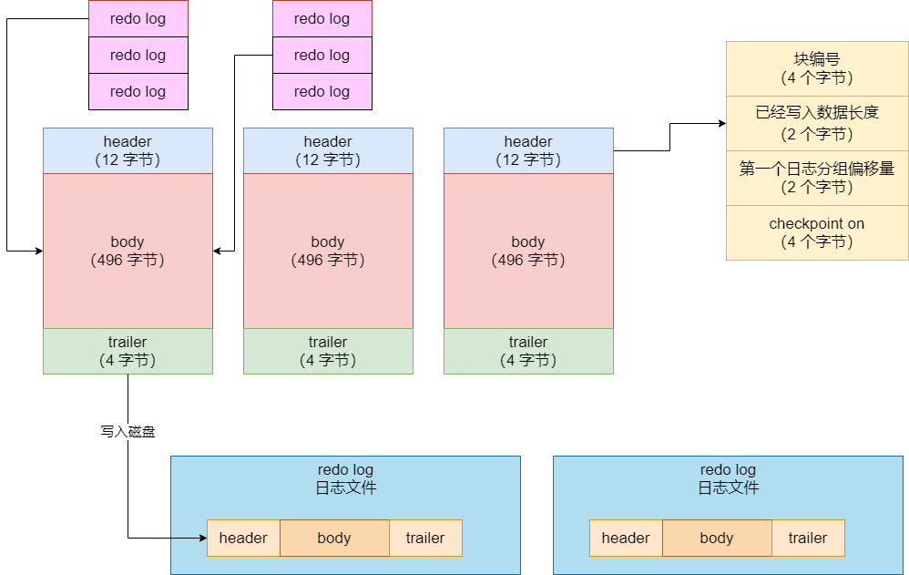

## redo log buffer

之前说了一下 redo log block 这个概念，现在都知道平时我们执行完增删改之后，要写入磁盘的 redo log，其实应该是先进入到 redo log block 这个数据结构里去的，然后再进入到磁盘文件里。

那么 redo log 是如何通过内存缓冲之后，再进入磁盘文件里去的？这就涉及到了一个新的组件，redo log buffer，它就是 MySQL 专门设计了用来缓冲 redo log 写入的。这个 redo log buffer 其实就是 MySQL 在启动的时候，就跟操作系统申请的一块连续内存空间，大概可以认为相当于是 buffer pool 吧。那个 buffer pool 是申请之后划分了 N 多个孔的缓存页和一些链表结构，让你把磁盘上的数据页加载到内存里来的

redo log buffer 也是类似的，它是申请出来的一片连续内存，然后里面划分出了 N 个空的 redo log block。通过设置 MySQL 的 `innodb_log_buffer_size` 可以指定这个 redo log buffer 的大小，默认的值就是 16MB。其实已经够大了，毕竟一个 redo log block 才 512 字节而已，每条 redo log 其实也就几个字节到几十个字节罢了

所以到这里就清楚了，上面我们说过，redo log 都是先写入内存里的 redo log block 数据结构里去的，然后完事了才会把 redo log block 写入到磁盘文件里去。所以当你要写一条 redo log 的时候，就会从第一个 redo log block 开始写入，如图：

写满了一个 redo log block，就会继续写入下一个 redo log block，以此类推，直到所有的 redo log block 都写满。当 redo log buffer 里所有的 redo log block 都写满了，那么此时会强制把 redo log block 刷入到磁盘中去的。上面说过，其实就是把 512 字节的 redo log block 追加到 redo log 日志文件里去就可以了。如图：

另外需要知道的是，在我们平时执行一个事务的过程中，每个事务会有多个增删改操作，那么就会有多个 redo log，这多个 redo log 就是一组 redo log，其实每一次 redo log 都是先在别的地方暂存，然后都执行完了，再把一组 redo log 给写入到 redo log 的 block 里去的。如果一组 redo log 实在是太多了，那么可能会存放在两个 redo log block 中，如下图：

但是反之，如果一个 redo log group 比较小，那么也可能多个 redo log group 是在一个 redo log block 里的，如图：

那 redo log buffer 里的 redo log block 到底是如何写入到磁盘文件里去的？一定要等待 redo log block 全部写满才会刷入磁盘吗？还有哪些其他的时机会把 redo log block 刷入磁盘？

## redo log buffer 中的缓存日志写入磁盘

上面讲了一下 redo log buffer 的缓冲机制。redo log 在写的时候，都是一个事务里的一组 redo log，先暂存在一个地方，完事了以后把一组 redo log 写入 redo log buffer。写入 redo log buffer 的时候，是写入里面提前划分好的一个一个的 redo log block 的，选择有空闲空间的 redo log block 去写入，然后 redo log block 写满之后，其实会在某个时机刷入到磁盘里去。

那么 redo log buffer 里的 redo log 日志文件什么时候可以刷入到磁盘文件里去？磁盘上有几个 redo log 日志文件，不可能大量的 redo log 日志都放在一个文件里吧？磁盘空间会占用得越来越多吗？

首先，我们来看看 redo log block 是哪些时候会刷入到磁盘文件里去：

- 如果写入 redo log buffer 的日志已经占据了 redo log buffer 总容量的一半了，也就是超过了 8MB 的 redo log 在缓冲里了，此时就会把他们刷入到磁盘文件里去

- 一个事务提交的时候，必须把它的那些 redo log 所在的 redo log block 都刷入到磁盘文件里去，只有这样，当事务提交之后，它修改的数据绝对不会丢失，因为 redo log 里有重做日志，随时可以恢复事务做的修改（PS：当然，这个 redo log 哪怕事务提交的时候写入磁盘文件，也是先进入 os cache 的，进入 os 的文件缓冲区里，所以是否提交事务就强行把 redo log 刷入物理磁盘文件中，这个需要设置对应的参数）

- 后台线程定时刷新，有一个后台线程每隔 1 秒就会把 redo log buffer 里的 redo log block 刷到磁盘文件里去

- MySQL 关闭的时候，redo log block 都会刷入到磁盘里去

忽略上面的第四条不说，因为关闭 MySQL 的时候必然会刷 redo log 到磁盘，其他三天我们都看到了，即，如果你瞬间执行大量的高并发 SQL 语句，1 秒内就产生了超过 8MB 的 redo log，此时占据了 redo log buffer 一半的空间了，必然会直接把你的 redo log 刷入磁盘去。这种 redo log 刷盘的情况，在 MySQL 承载高并发请求的时候比较常见，比如每秒执行上万个增删改 SQL 语句，每个 SQL 产生的 redo log 假设有 几百个字节，此时却是会在瞬间生成超过 8MB 的 redo log 日志，必然会触发立马刷新 redo log 到磁盘。

第二种情况就是平时执行了一个事务，这个事务一般都是在几十毫秒到几百毫秒执行完毕的。一般情况下，MySQL 单事务性能一般不会超过 1 秒，否则数据库操作就太慢了。而如果在几十毫秒，或者几百毫秒的时候，执行完了一个事务，此时会立马把这个事务的 redo log 都刷入磁盘。

第一种情况其实是不常见的，第二种情况就比较常见，往往 redo log 刷盘都是以一个短事务提交时候发生的，第三种情况就是后台线程每秒自动刷新到 redo log 到磁盘去，这个就是说即使没有别的情况触发，后台线程自己也会不停地刷新 redo log 到磁盘

但是不管怎样，主要是保证一个事务执行的时候，redo log 都进入 redo log buffer，提交事务的时候，事务对应的 redo log 必须是刷入磁盘文件，接着才算是事务提交成功，否则事务提交就是失败。保证这一点，就能确保事务提交之后，数据不会丢，有 redo log 在磁盘里就行了。当然，绝对保证数据不丢，还得配置一个参数，提交事务把 redo log 刷入磁盘文件的 os cache 之后，还得强行从 os cache 刷入物理磁盘

最后说一下 redo log 日志文件的问题。我们都知道平时不停地执行增删改，MySQL 会不停地产生大量的 redo log 写入日志文件，那么日志文件就用一个写入全部的 redo log？对磁盘占用空间越来越大怎么办？

其实，默认情况下，redo log 都会写入一个目录中的文件里，这个目录可以通过 `show variables like 'datadir'` 来查看，可以通过 `innodb_log_group_home_dir` 参数来设置这个目录。然后 redo log 是有多个的，写满了一个就会写下一个 redo log，而且可以限制 redo log 文件数量，通过 `innodb_log_file_size` 可以指定每个 redo log 文件的大小，默认是 48MB，通过 `innodb_log_files_in_group` 可以指定日志文件的数量，默认就 2 个。

所以默认情况下，日志里就两个日志文件， 分别为 `ib_logfile0` 和 `ib_logfile1`，每个 48MB。最多就这 2 个日志文件，就是先写第一个，写满了写第二个。如果第二个也写满了，就继续写第一个，覆盖第一个日志文件里原来的 redo log 就可以了。

所以 MySQL 最多就给你保留了最近的 96MB 的 redo log 而已。不过这已经算很多了，毕竟 redo log 真的很小，一条通常就几个字节到几十个字节不等，96MB 足够你存储上百万条 redo log 了。如果你还想保留更多的 redo log，上调那两个参数就可以了。

