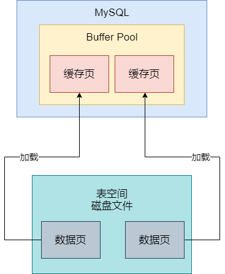
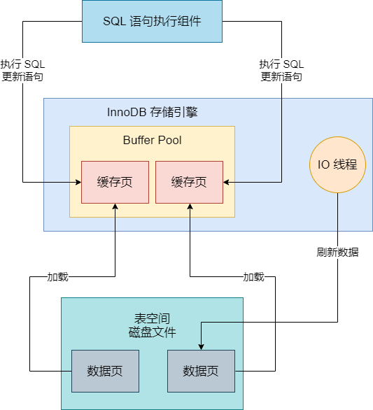
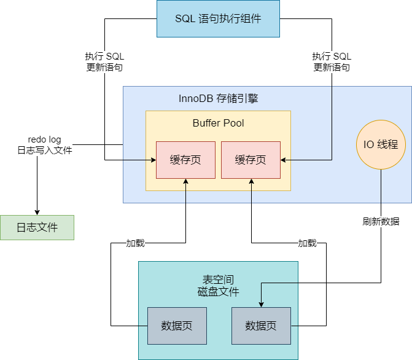
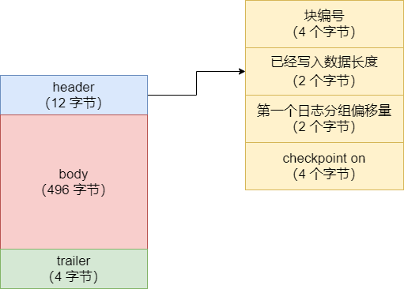
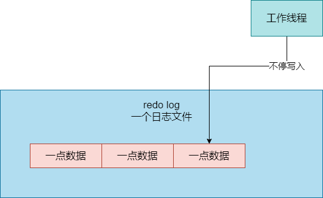
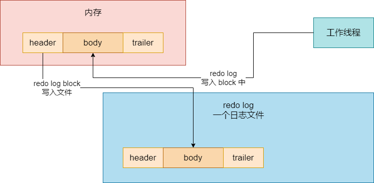
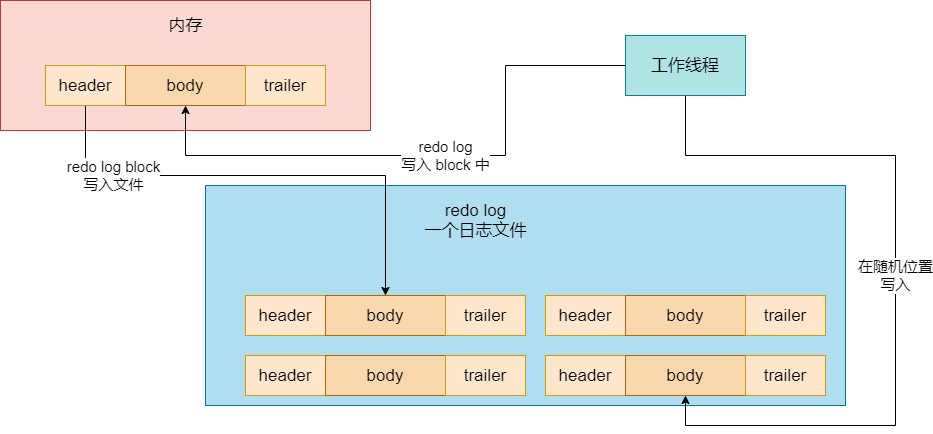

之前我们说过，在我们执行增删改操作的时候，首先会在 Buffer Pool 中更新缓存页。而在更新完 Buffer Pool 中的缓存页之后，必须要写一条 redo log，这样才能记录下来我们对数据库做的修改。redo log 可以保证我们事务提交之后，如果事务中的增删改 SQL 语句更新的缓存页还没刷到磁盘上去，此时 MySQL 宕机了，那么 MySQL 重启之后，就可以把 redo log 重做一遍，恢复出来事务当时更新的缓存页，然后再把缓存页刷到磁盘就可以了

redo log 本质是保证事务提交之后，修改的数据绝对不会丢失。我们就承上启下，给大家简单回顾一下 redo log 这个机制存在的意义

首先，执行增删改 SQL 语句的时候，都是针对一个表中的某些数据去执行。此时的话，首先要找到这个表对应的表空间，然后找到表空间对应的磁盘文件，接着从磁盘文件里把你要更新的那批数据所在的数据页从磁盘读取出来，放到 Buffer Pool 的缓存页里去，如图：

接着你的增删改 SQL 语句就会针对 Buffer Pool 中的缓存页去执行你的更新逻辑，比如插入、更新或者删除一段数据。至于说数据页和数据行的格式，就不用多说了，都是 MySQL 定义的，之前都讲过。

之前学习过 Buffer Pool 底层原理之后都知道，其实你更新缓存页的时候，会更新 free 链表、flush 链表、lru 链表，然后会有专门的后台 IO 线程，不定时地根据 flush 链表、lru 链表，把你更新过的缓存页刷新会磁盘文件的数据页里去，如图：

所以这个机制里最大的漏洞就是，万一你一个事务里又增删改 SQL 更新了缓存页，然后事务提交了，结果万一你还没来得及让 IO 线程把缓存页刷新到磁盘文件里，此时 MySQL 宕机了，然后内存数据丢失，你事务更新的数据就丢失了。

但是也不可能每次你事务一提交，就把你事务更新的缓存页都刷新回磁盘文件里，因为缓存页刷新到磁盘文件里，是随机磁盘读写，性能是非常差的，这会导致你数据库性能和并发能力都很弱。所以此时才会引入一个 redo log 机制，这个机制就是说，你提交事务的时候，绝对是保证把你对缓存页做的修改以日志的形式，写入到 redo log 日志文件里去的

这种日志大致的格式如下：对表空间 XX 中的数据页 XX 中的偏移量为 XXXX 的地方更新了数据 XXX，如图所示：

只要你事务提交的时候保证你做的修改以日志形式写入 redo log 日志，那么哪怕你此时突然宕机了，也没关系。因为你 MySQL 重启之后，把你之前事务更新做过的修改根据 redo log 在 Buffer Pool 里重做一遍就可以了，就可以恢复出来当时你事务对缓存页做的修改，然后找时机再把缓存页刷入磁盘文件里。

可能有人会问，你事务提交的时候把修改过的缓存页都刷入磁盘，跟你事务提交的时候把你做的修改的 redo log 都写入日志文件，它们不都是写磁盘吗？差别在哪？实际上，如果你把修改过的缓存页都输入磁盘，这首先缓存页一个就是 16KB，数据比较大，输入磁盘比较耗时，而且你可能就修改了缓存页里的几个字节的数据，难道也把完整的缓存页刷入磁盘吗？

而且缓存页刷入磁盘是随机写磁盘，性能是很差的，因为它一个缓存页对应的位置可能在磁盘文件的一个随机位置，比如偏移量 45536 这个地方。但是如果是写 redo log，第一个一行 redo log 可能就占据几十个字节，就包含表空间号、数据页号、磁盘文件偏移量、更新值，这个写入磁盘速度很快。此外，redo log 写日志，是顺序写入磁盘文件，每次都是追加到磁盘文件末尾去，速度也是很快的。

所以你提交事务的时候，用 redo log 的形式记录下来你做的修改，性能会远远超过刷缓存页的方式，这也可以让你的数据库的并发能力更强。

## redo log

接下来我们要深入研究一下 redo log 的一些技术细节，我们来看一下写入磁盘文件的 redo log，大致长个什么样，里面都包含一些什么东西。

其实 redo log 里本质上记录的就是在某个表空间的某个数据页的某个偏移量的地方修改了几个字节的值，具体修改的值是什么，它里面需要记录的就是 表空间号 + 数据页号 + 偏移量 + 修改几个字节的值 + 具体的值。

所以根据你修改了数据页里的几个字节的值，redo log 就划分为了不同的类型。`MLOG_1BYTE` 类型的日志指的就是修改了 1 个字节的值，`MLOG_2BYTE` 类型的日志指的就是修改了 2 个字节的值，以此类推，还有修改了 4 个字节的值的日志类型，修改了 8 个字节的值的日志类型

当然，如果你要是一下子修改了一大串的值，类型就是 `MLOG_WRITE_STRING`，就是代表了你一下子在那个数据页的某个偏移量的文职插入或者修改了一大串的值。所以其实一条 redo log 看起来大致的结构如下：

日志类型（就是类似 MLOG_IBYTE 之类的），表空间 ID，数据页号，数据页中的偏移量，具体修改的数据

大致就是一条 redo log 中依次排列上述的一些东西，这条 redo log 表达的语义就很明确了，它的类型是什么，类型就告诉你它这次增删改操作修改了多少字节的数据；然后在哪个表空间里操作的，这个就是跟你 SQL 在哪个表里执行的是对应的；接着就是在这个表空间的哪个数据页里执行的，在数据页的哪个偏移量开始执行的，具体更新的数据是哪些

有了上述信息，就可以精准完美的还原出来一次数据增删改操作做的变动了。只不过如果是 `MLOG_WRITE_STRING` 类型的日志，因为不知道具体修改了多少字节的数据，所以其实会多一个修改数据长度，就告诉你它这次修改了多少字节的数据，如下所示它的格式：

日志类型（就是类似 MLOG_1BYTE 之类的），表空间号，数据页号，数据页中的偏移量，修改数据长度，具体修改的数据

因此今天就简单说一下 redo log 的日志格式，没想象中的那么复杂。当然如果往深了说，那也是很复杂的，比如 redo log 日志里面可能记录你更新了哪些索引之类的，这就很复杂了。我们对 redo log 日志的格式了解到这个程度其实就可以了。就是在执行增删改的时候，在 Buffer Pool 里通过复杂的缓存页机制完成更新，然后就会以今天讲解的这种格式写入一条 redo log 日志记录本次修改。

## redo log 的写入

redo log 是一条一条地直接就往磁盘文件里写入吗？其实没有那么简单。平时我们执行 CRUD 的时候，从磁盘加载数据页到 Buffer Pool 的缓存页里去，然后对缓存页执行增删改，同时还会写 redo log 到日志文件里去，后续不定时把缓存页刷回磁盘文件里去。而我们也介绍了每一条 redo log 长什么样子，说白了它就是记录了：

表空间号 + 数据页号 + 数据页内偏移量 + 修改了几个字节的数据 + 实际修改数据

所以，redo log 就是按照上述格式，一条一条地直接写入到磁盘的日志文件里去了吗？当然不是，其实 MySQL 内有另外一个数据结构，叫做 **redo log block**，你可以简单理解为，平时我们的数据不是存放在数据页的么，用一页一页的数据页来存放数据。那么对于 redo log 也不是单行单行地写入日志文件的，它是用一个 redo log block 来存放多个单行日志的。

一个 redo log block 是 512 字节，分为三个部分：一个是 12 字节的 header 块头，一个是 496 字节的 body 块体，一个是 4 字节的 trailer 块尾。

这里面，12 字节的 header 头又分为了 4 个部分：

- 包括 4 个字节的 block no，就是块唯一编号

- 2 个字节的 data length，就是 block 里写入了多少字节数据

- 2 个字节的 first record group。这个是说每个事务都会有多个 redo log，是一个 redo log group，即一组 redo log。那么在这个 block 里的第一组 redo log 的偏移量，就是这 2 个字节存储的。

- 4 个字节的 checkpoint on

如下图，这个 header 可以进行进一步的区分：

从上面可以看到，对于我们的 redo log 日志而言，它确实是不停地追加写入到 redo log 磁盘文件里去的，但是其实每一个 redo log 都是写入到一个 redo log block 里去的，一个 block 最多放 496 字节的 redo log 日志。

那么一个一个的 redo log block 在日志文件里是怎么存放的？一条一条的 redo log 又是如何写入日志文件里的 redo log block 里去的呢？

假设你有一个 redo log 日志文件，平时我们往里面写数据，你大致可以认为是从第一行开始，从左往右写，可能会有很多行，比如下面那样子，你看看是不是你理解的那样？

既然如此，假设你要写第一个 redo log 了，是不是应该先在内存里把这个 redo log 给弄到一个 redo log block 数据结构里去？然后似乎你应该是等内存里的一个 redo log block 的 512 字节都满了，再一次性把这个 redo log block 写入磁盘文件？

然后其实按照我们所说的，一个 redo log block 就是 512 字节，那么是不是真正写入的时候，把这个 redo log block 的 512 字节的数据，就写入到 redo log 文件里去就可以了？那么 redo log 文件里就多了一个 block，如下图：

看到上图演示之后，对于这个所谓的 redo log 和 redo log block 的关系，以及 redo log block 如何进入日志文件，日志文件里如何存放一个又一个所谓的 redo log block 的，都应该清楚了。其实有一定开发经验的朋友都知道，写文件的时候，可以按照字节，一个字节一个字节地写入的，文件里存放的东西就是很多很多字节，依次排开，然后其中可能 512 个字节组合起来，就固定代表了一个 redo log block。

这此时就是任何一个中间件系统，数据库系统，底层依赖磁盘文件存储数据的一个共同的原理，所以大家也不用把这个复杂数据写入磁盘文件想象得太复杂了

那么如果一次在磁盘文件里的末尾追加不停地写字节数据，就是磁盘顺序写；但是假设现在磁盘文件里已经有很多很多的 redo log block 了，此时要再在磁盘里某个随机位置找到一个 redo log block 去修改它里面几个字节的数据，这就是磁盘随机写，如图：

