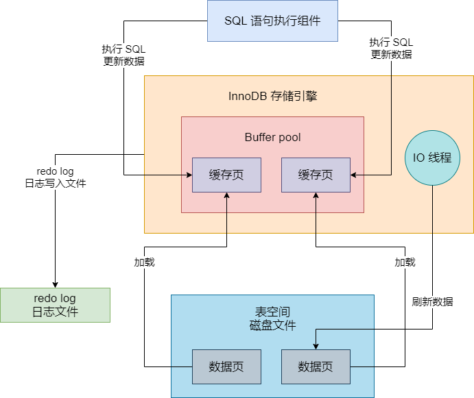
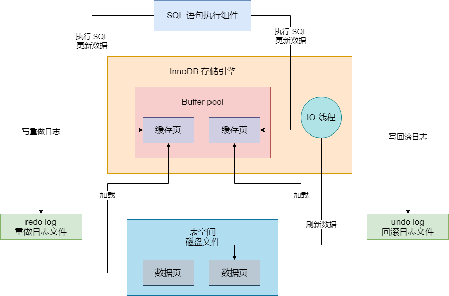

之前我们已经讲了在执行增删改操作时候的 redo log 的重做日志原理，说白了就是你对 buffer pool 里的缓存页执行增删改操作的时候，必须要写对应的 redo log 记录下来你做了哪些修改。而 redo log 都是先进入 redo log buffer 中的一个 block，然后事务提交的时候就会刷入磁盘文件里去。这样万一你提交事务了，结果事务修改的缓存页还没来得及刷入磁盘上的数据文件，此时你 MySQL 关闭了或者是宕机了，那么 buffer pool 里被事务修改的数据就全部丢失了

但是只要有 redo log，你重启 MySQL 之后完全是可以把那些修改了缓存页，但是缓存页还没来得及刷入磁盘的事务，它们对应的 redo log 都加载出来，在 buffer pool 的缓存页里重做一遍，就可以保证事务提交之后，修改的数据绝对不会丢失。

接着我们来讲另外一种日志，就是 undo log 日志，即回滚日志。这种日志要应对的场景，就是事务回滚的场景。

假设现在我们一个事务里要执行一些增删改的操作，那么必然是先把对应的数据页从磁盘加载出来放 buffer pool 的缓存页里，然后在缓存页里执行一遍增删改，同时记录 redo log 日志。如下：

但是万一一个事务的一通增删改操作执行了一半，结果就回滚事务了呢？比如一个事务里有 4 个增删改操作，结果目前为止已经执行了 2 个增删改 SQL 了，已经更新了一些 buffer pool 里的数据了，但是还有 2 个增删改 SQL 的逻辑还没执行，此时事务回滚了，咋整？

这个时候就很尴尬了，如果你要回滚事务的话，那么必须要把已经在 buffer pool 的缓存页里执行的增删改操作给回滚了。但是要怎么回滚呢？无论是插入、更新还是删除，该做的都已经做了。所以在执行的时候，必须引入另外一种日志，就是 undo log 回滚日志。

这个回滚日志，它记录的东西其实非常简单。比如你要是在缓存里执行了一个 insert 语句，那么此时你在 undo log 日志里，对这个操作记录的回滚日志就必须是有一个主键和一个对应的 delete 操作，要能让你把这次 insert 操作给回退了。

你要是执行的是 delete 语句，那么起码你要把你删除的那条数据记录下来，如果要回滚，就应该执行一个 insert 操作把那条数据插入回去；如果你执行的是 update 语句，那么起码你要把那个更新之前的那个值记录下来，回滚的时候重新 update 一下，把你之前更新前的旧值给他更新回去。如果执行的是 select 呢？select 语句根本没有在 buffer pool 里执行任何修改，所以根本不需要 undo log。

所以你除了写 redo log 日志还必须要写 undo log 日志，这个 undo log 日志是至关重要的，没有它你都没办法回滚日志。

## undo 日志长什么样

上面讲解了 undo log 回滚日志的作用，即，你执行事务的时候，里面有很多 INSERT、UPDATE 和 Delete 语句都在更新缓存页里的数据，但是万一事务回滚，你必须有每条 SQL 语句对应的 undo log 回滚日志，根据回滚日志去恢复缓存页里被更新的数据。

那么我们来看一下 INSERT 语句的 undo log 语句长什么样子。INSERT 语句的 undo log 的类型是 `TRX_UNDO_INSERT_REC`，这个 undo log 里包含了以下一些东西：

- 这条日志的开始位置

- 主键的各列长度和值

- 表 id

- undo log 日志编号

- undo log 日志类型

- 这条日志的结束位置

接下来我们逐一解释以下。首先，一条日志必须要有自己的一个开始位置，这个没什么好说的。那么主键的各列长度和值是什么意思？其实，你插入一条数据，必然会有一个主键。如果你自己指定了一个主键，那么可能这个主键就是一个列，比如 id 之类的，也可能是多个列组成的一个主键，比如 `id + name + type` 三个字段组成的一个联合主键，也是有可能的

所以这个「主键的各列长度和值」，意思是你插入的这条数据的主键的每个列，它的长度是多少，具体的值是多少。即使你没有设置主键，MySQL 自己也会给你弄一个 `row_id` 作为隐藏字段，做你的主键

接着是「表 id」，这个也不用多说，你插入一条数据必然是往一个表里插入数据的，那当然得有一个表 id，记录下来是在哪个表里插入的数据了。

「undo log 日志编号」，这个是说每个 undo log 日志都是由自己的编号的。而在一个事务里会有多个 SQL 语句，就会有多个 undo log 日志，在每个事务里的 undo log 日志的编号都是从 0 开始的，然后依次递增

至于「undo log 日志类型」，就是 `TRX_UNDO_INSERT_REC`，insert 语句的 undo log 日志类型就是这个东西。

最后一个 undo log 日志的结束位置，这个就是告诉你 undo log 日志结束的位置是什么。

接着我们用一个图画一下这个 insert 语句的 undo log 回滚日志的结构，如图：

有了这条日志之后，剩下的事情就好办了。万一要是你现在在 buffer pool 的一个缓存页里插入了一条数据，执行了 insert 语句，然后写了一条上面的那种 undo log，现在事务要是回滚了，你直接就把这条 insert 语句的 undo log 拿出来。然后在 undo log 里就知道在哪个表里插入的数据，主键是什么，直接定位到那个表和主键对应的缓存页，从里面删掉之前 insert 语句插入进去的数据就可以了，这样就可以实现事务回滚的效果了。

