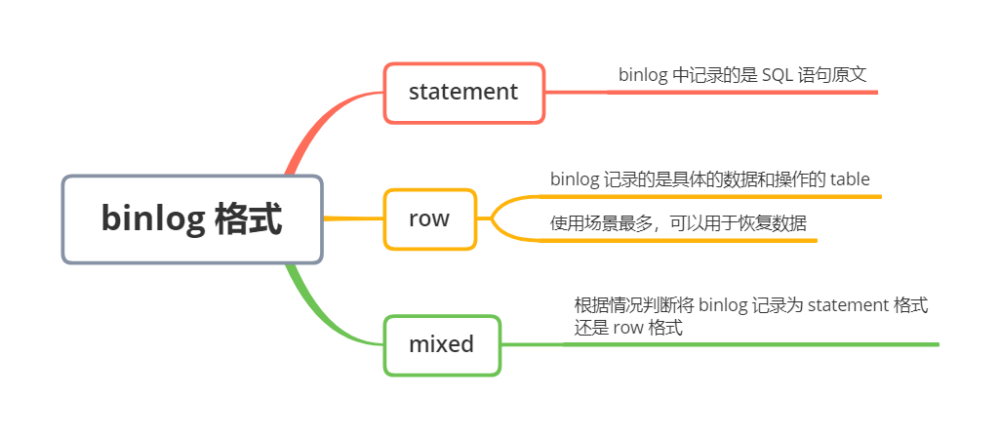
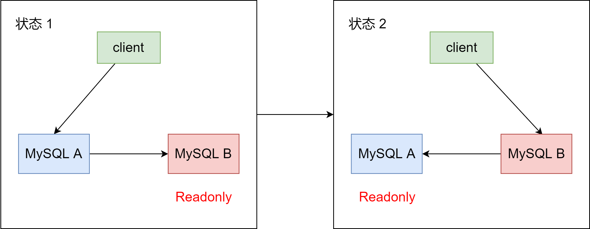
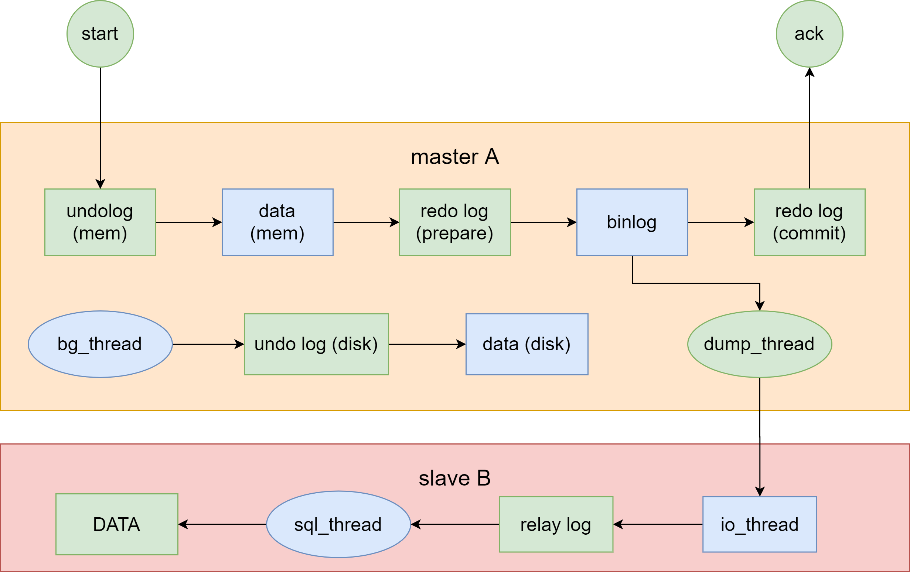
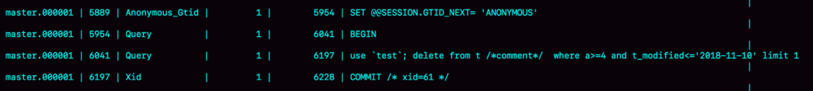
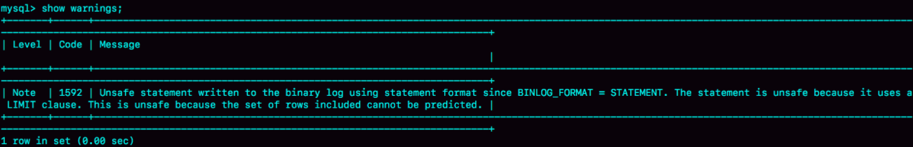
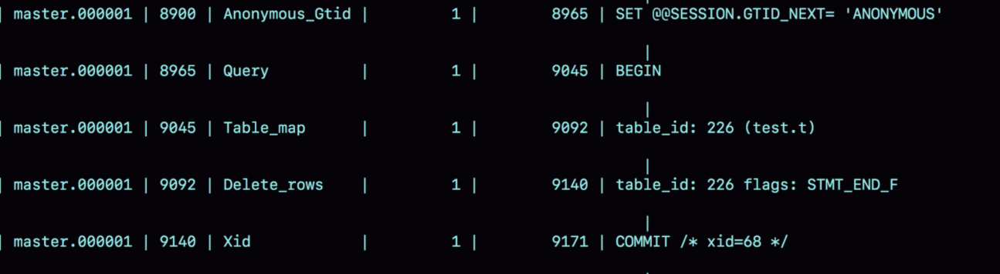
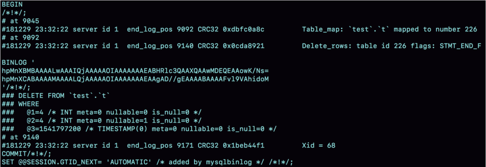
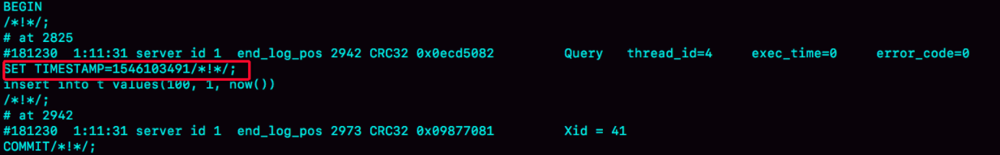
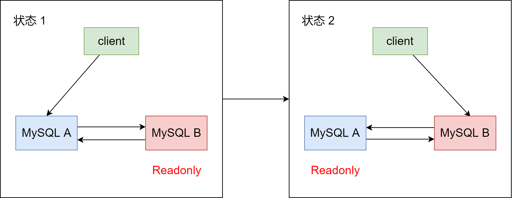

### MySQL 主备的基本原理


下图是基本的主备切换流程





在状态 1 中，客户端的读写都直接访问节点 A，而节点 B 是 A 的备库，只是将 A 的更新都同步过来，到本地执行。这样可以保持节点 B 和 A 的数据都是相同的


当需要切换的时候，就切成状态 2。这时候客户端读写访问的都是节点 B，而节点 A 是 B 的备库


在状态 1 中，虽然节点 B 没有被直接访问，但是依然建议把节点 B（也就是备库）设置成只读（readonly）模式。因为：


1. 有时候一些运营类的查询语句会被放到备库上去查，设置为只读可以防止误操作
2. 防止切换逻辑有 bug，比如切换过程中出现双写，造成主备不一致
3. 可以用 readonly 状态，来判断节点的角色


把主库设置成只读，还怎么跟主库保持同步更新？不用担心。readonly 设置对超级（super）权限用户是无效的，而用于同步更新的线程，就拥有超级权限


接着，看看节点 A 到节点 B 这条线的内部流程是怎样的。如下图，就是一个 update 语句在节点 A 执行，然后同步到节点 B 的完整流程图





上图可以看到：主库接收到客户端的更新请求后，执行内部事务的更新逻辑，同时写 binlog


备库 B 和主库 A 之间维持了一个长连接。主库 A 内部有一个线程，专门用于服务备库 B 的这个长连接。一个事务日志同步的完整过程是这样的：


1. 在备库 B 上通过 `change master` 命令，设置主库 A 的 IP、端口、用户名、密码，以及要从哪个位置开始请求 binlog，这个位置包含文件名和日志偏移量
2. 在备库 B 上执行 `start slave` 命令，这时候备库会启动两个线程，就是图中的 `io_thread` 和 `sql_thread`。其中 `io_thread` 负责与主库建立连接
3. 主库 A 校验完用户名、密码后，开始按照备库 B 传过来的位置，从本地读取 binlog，发给 B
4. 备库 B 拿到 binlog 后，写到本地文件，称为中转日志（relay log）
5. sql_thread 读取中转日志，解析出日志里的命令，并执行


需要说明的是，后来由于多线程复制方案的引入，`sql_thread` 演化成为了多个线程，跟我们今天要介绍的原理没有直接关系，暂不展开


分析完了这个长连接的额逻辑，我们再看一个问题：binlog 里面是什么内容，为什么备库拿过去可以直接执行


### binlog 的三种格式对比


binlog 有两种格式，一种是 `statement`，一种是 `row`，还有 `mixed`，mixed 其实是前两种格式的混合


为了方便描述 binlog 的这三种格式间的区别，我们创建了一个表，并初始化几行数据


```mysql
CREATE TABLE `t` (
  `id` int(11) NOT NULL,
  `a` int(11) DEFAULT NULL,
  `t_modified` timestamp NOT NULL DEFAULT CURRENT_TIMESTAMP,
  PRIMARY KEY (`id`),
  KEY `a` (`a`),
  KEY `t_modified`(`t_modified`)
) ENGINE=InnoDB;

insert into t values(1,1,'2018-11-13');
insert into t values(2,2,'2018-11-12');
insert into t values(3,3,'2018-11-11');
insert into t values(4,4,'2018-11-10');
insert into t values(5,5,'2018-11-09');
```


如果要在表中删除一行数据的话，我们看看 delete 语句的 binlog 是怎么记录的


下面的这个语句包含注释，如果你用 MySQL 客户端来做这个实验，要加 `-c` 参数，否则客户端会自动去掉注释


```mysql
delete from t /*comment*/ where a >= 4 and t_modified <= '2018-11-10' limit 1;
```


当 binlog_format = statement 时，binlog 里面记录的就是 SQL 语句的原文，可以如下命令查看 binlog 的内容


```mysql
show binlog events in 'master.000001'
```





我们看一下上图的输出结果：


- 第一行 `SET @@SESSION.GTID_NEXT='ANONYMOUS'` 可以先忽略
- 第二行是一个 BEGIN，跟第四行的 commit 对应，表示中间是一个事务
- 第三行就是真实执行的语句了。在真实执行 delete 命令之前，还有一个 `use test` 命令，这条命令不是我们主动执行的，而是 MySQL 根据当前要操作的表所在的数据库，自行添加的。这样可以保证日志传到备库去执行的时候，不论当前的工作线程在哪个库里，都能正确地更新到 test 库的表 t
  user 'test' 命令之后是 delete 语句，就是我们输入的 SQL 原文了。可以看到，binlog 记录了 SQL 命令，甚至连注释也一并记录了
- 最后一行是一个 COMMIT，可以看到里面写着 `xid = 61`


为了说明 `statement` 和 `row` 格式的区别，我们看一下这条 delete 命令的执行效果图：





可以看到，运行这条命令产生了一个 warning，原因是当前 binlog 设置的是 statement 格式，并且语句中有 limit，所以这个命令可能是 unsafe 的。为什么？


因为 delete 带 limit，很可能会出现主备数据不一致的情况，比如上面这个例子：


1. 如果 delete 语句使用的是索引 a，那么会根据索引 a 找到第一个满足条件的行，即删除的是 a = 4 这一行
2. 如果使用的是索引 t_modified，那么删除的就是 t_modified = '2018-11-09' ，也就是 a = 5 这一行


由于 statement 格式下，记录到 binlog 里的是语句原文，因此可能会出现这样一种情况：在主库执行这条 SQL 语句的时候，用的是索引 a；而在备库执行这条 SQL 语句的时候，却使用了索引 t_modified。因此，MySQL 认为这样写是有风险的


如果把 binlog 的格式改为 binlog_format = 'row' 是不是就好了呢？我们看 binlog 中的内容吧





可以看到，与 statement 格式的 binlog 相比，前后的 BEGIN 和 COMMIT 是一样的。但是，row 格式的 binlog 里面没有 SQL 语句的原文，而是替换了两个 event：Table_map 和 Delete_rows


1. **Table_map** event，用于说明接下来要操作的表是 test 库的表 t
2. **Delete_rows** event，用于定义删除的行为


上图其实是看不到详细信息的，还需要借助 binlog 工具。用下面这个命令解析和查看 binlog 中的内容。从上图可以知道，这个事务的 binlog 是从 8900 这个位置开始的，所以可以用 `start-position` 参数来指定从这个位置的日志开始解析


```mysql
mysqlbinlog -vv data/master.000001 --start-position=8900;
```





从上图可以看出几个信息：


1. service id 1，表示这个事务是在 server_id = 1 的这个库上执行的
2. 每个 event 都有 CRC32 的值，这是因为把参数 `binlog_checksum` 设置成了 CRC32
3. Table_map event 显示了接下来要打开的表，map 到数字 226。现在我们这条 SQL 语句只操作了一张表，如果要操作多张表呢？每个表都有一个对应的 Table_map event，都会 map 到一个单独的数字，用于区分不同表的操作
4. 我们在 `mysqlbinlog` 的命令中，使用了 `-vv` 参数是为了把内容都解析出来，所以从结果里面可以看到各个字段的值（比如，@1=4、@2=4 这些值）
5. binlog_row_image 的默认配置是 FULL，因此 Delete_event 里面，包含了删掉的行的所有字段的值。如果把 binlog_row_image 设置为 MINMAL，则只会记录必要的信息。这个例子里，就是只会记录 id = 4 这个信息
6. 最后的 XID event，用于表示事务被正确地提交了


可以看到，当 binlog_format 使用 row 格式的时候，binlog 里面记录了真实删除行的主键 id，这样 binlog 传到备库去的时候，就肯定会删除 id = 4 的行，不会有主备删除不同行的问题


### mixed 格式的 binlog


那么，为什么会有 mixed 这种 binlog 格式的存在场景？推论过程是这样子的：


- 因为有些 statement 格式的 binlog 会导致主备不一致，所以要使用 row 格式
- 但 row 格式的缺点是，很占空间。比如你用 delete 语句删除 10 万行数据，用 statement 的话就是一个 SQL 语句被记录到 binlog 中，占用几十个字节的空间。但使用 row 格式的 binlog，就要把这 10 万条记录都写到 binlog 中。这样做，不仅会占用更大的空间，同时写 binlog 也会耗费 IO 资源，影响执行速度
- 所以，MySQL 就取了个折中方案，就有了 mixed 格式的 binlog。mixed 格式的意思是，MySQL 自己会判断这条 SQL 语句是否可能引起主备不一致，如果有可能，就用 row 格式，否则就用 statement 格式


即，mixed 格式可以利用 statement 格式的优点，同时又避免了数据不一致的风险


因此，如果你的线上 MySQL 设置的 binlog 格式是 statement 的话，那基本上就可以认为这是一个不合理的设置。你至少应该把 binlog 的格式设置为 mixed。


比如我们这个例子，设置为 mixed 后，就会记录为 row 格式；而如果执行的语句去掉 limit 1，就会记录为 statement  格式


当然，现在越来越多的场景都是把 MySQL 的 binlog 格式设置成 row。这么做的理由有很多，一个可以直接看出来的好处就是：**恢复数据**


我们分别从 delete、insert 和 update 这三种 SQL 语句的角度，来看看数据恢复的问题


从上图可以看出，即使执行了 delete 语句，row 格式的 binlog 也会被删掉的行的整行信息保存起来。所以，如果你在执行一条 delete 语句以后，发现删错数据了，可以直接把 binlog 中记录的 delete 语句转成 insert，把被错删的数据插入回去就可以恢复了


如果执行错了 insert 语句呢？row 格式下，insert 语句的 binlog 里会记录所有的字段信息，这些信息可以用来精确定位刚刚被插入的那一行。这时，直接把 insert 语句转成 delete 语句，删除掉这被误插入的一行数据就可以了


如果执行的是 update 语句的话，binlog 里会记录修改前整行的数据和修改后的整行数据。所以，如果你误执行了 update 语句的话，只需要把这个 event 前后的两行信息对调一下，再去数据库里面执行，就能恢复这个更新操作了


我们用 mixed 格式来说明一个问题，看一下这条 SQL 语句：


```mysql
insert into t values(10, 10, now())
```


如果我们把 binlog 设置为 mixed，MySQL 会把它记录为 row 格式还是 statement 格式呢？如下：


.png)


可以看到，用的是 statement 格式。如果这个 binlog 过了一分钟才传给备库的话，那主备的数据不就不一致了吗？


我们用 mysqlbinlog 工具来看看：





由上图可以看到，binlog 在记录 event 的时候，多了一条命令：SET TIMESTAMP = 1546103491。他用 `SET TIMESTAMP` 命令约定了接下来的 now() 函数的返回时间


所以，这个 binlog 不管是 1 分钟后被执行，还是 3 天后被执行，这个 insert 语句插入的行，值都是固定的。即，通过这条 `SET TIMESTAMP` 命令，MySQL 就确保了主备数据的一致性


如果你用 mysqlbinlog 解析出日志，然后把里面的 statement 语句直接拷贝出来执行。那么是有风险的，因为有些语句的执行结果是依赖于上下文命令的，直接执行的结果很可能是错误的


所以，用 binlog 来恢复数据的标准做法是，用 mysqlbinlog 工具解析出来，然后把解析结果整个发给 MySQL 执行。类似下面的命令：


```mysql
mysqlbinlog master.000001 --start-position=2738 --stop-position=2973 | mysql -h127.0.0.1 -p13000 -u$user -p$pwd
```


这个命令的意思是，将 master.000001 文件里面从第 2738 字节到第 2973 字节中间这段内容解析出来，放到 MySQL 去执行


### 循环复制问题


通过上面的讲述，我们知道，binlog 的特性确保了在备库执行相同的 binlog，可以得到与主库相同的状态


因此，我们可以认为正常情况下主备的数据是一致的。即，第一张图中的 A B 两个节点的内容是一直的。其实，第一张图画的是 M - S  结构，但实际生产上使用较多的是双 M 结构，也就是下图所示的主备切换流程





相比于第一张图，上图就只是多了一条线，意思是：节点 A 和节点 B 之间总是互为主备关系。这样在切换的时候就不用再修改主备关系


但是，双 M 结构还有一个问题


业务逻辑在节点 A 上更新一条语句，然后再把生成的 binlog 发给节点 B，节点 B 执行完这条更新语句后也会生成 binlog（建议把参数 log_slave_updates 设置为 on，表示备库执行 relay log 后生成 binlog）


那么，节点 A 同时是节点 B 的备库，相当于又把节点 B 新生成的 binlog 拿过来执行了一次，然后节点 A 和 B 之间，会不断地循环执行这个更新语句，也就是循环复制了。怎么解决？


从上面我们知道，MySQL 在 binlog 中记录了这个命令第一次执行时所在实例的 server id。因此，我们可以用下面的逻辑，来解决两个节点间的循环复制问题：


1. 规定两个库的 server id 必须不同，如果相同，则它们之间不能设定为主备关系
2. 一个备库接到 binlog 并在重放的过程中，生产与原 binlog 的 server id 相同的新的 binlog
3. 每个库在收到自己的主库发过来的日志后，先判断 server id，如果跟自己的相同，表示这个日志是自己生成的，就直接丢弃这个日志


按照这个逻辑，如果我们设置了双 M 结构，日志的执行就会变成这样：


1. 从节点 A 更新的事务，binlog 里面记的都是 A 的 server id
2. 传到节点 B 执行一次以后，节点 B 生成的 binlog 的 server id 也是 A 的 server id
3. 再传回给节点 A，A 判断到这个 server id 与自己的相同，就不会再处理这个日志。所以，死循环在这里就断掉了

