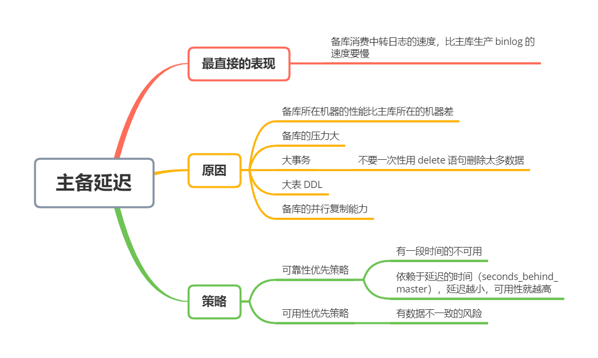
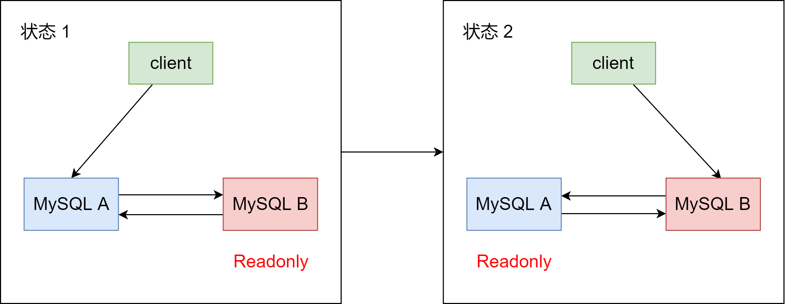
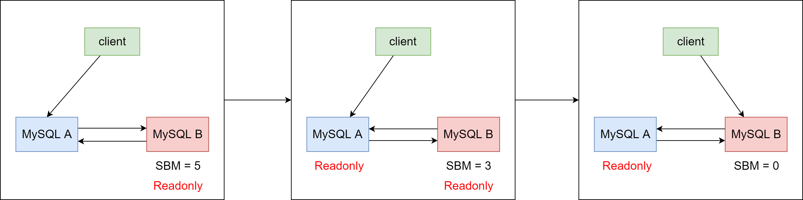
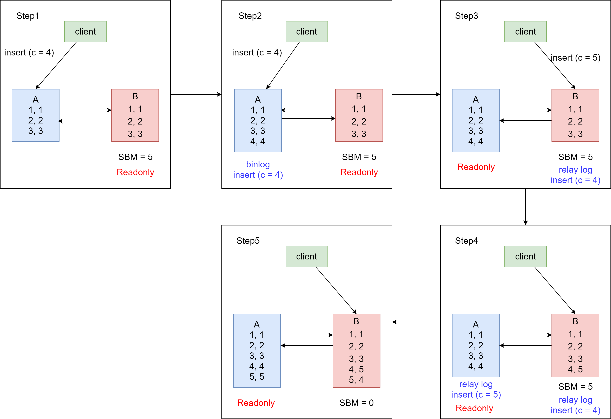
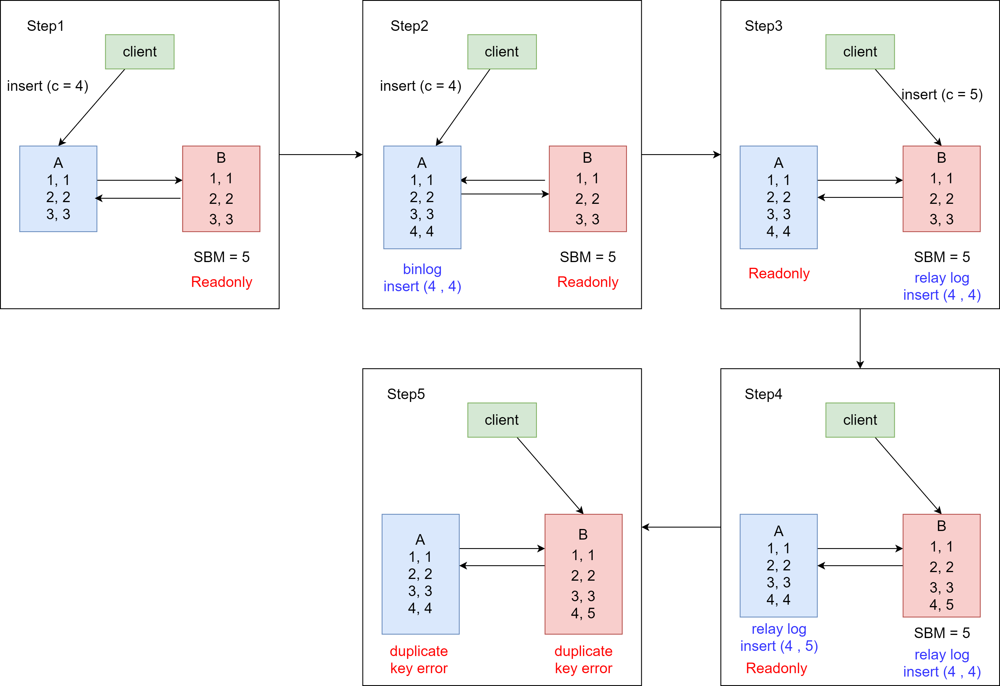
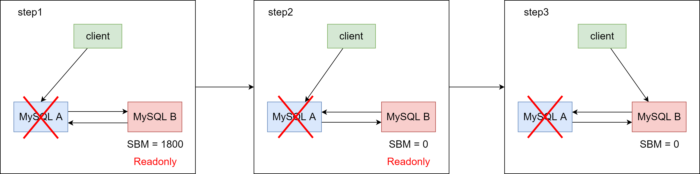

### 主备延迟


主备延迟可能是一个主动运维动作，比如软件升级、主库所在机器按计划下线等，也可能是被动操作，比如主库所在机器掉电


在介绍主动切换流程的详细步骤之前，要先跟你说明一个概念，即「同步延迟」。与数据同步有关的时间点主要包括以下三个：


1. 主库 A 执行完成一个事务，写入 binlog，我们把这个时刻记为 T1
2. 之后传给备库 B，我们把备库 B 接收完这个 binlog 的时刻记为 T2
3. 备库 B 执行完成这个事务，我们把这个时刻记为 T3


所谓主备延迟，就是同一个事务，在备库执行完成的时间和主库执行完成的时间之间的差值，也就是 T3 - T1


你可以在备库上执行 `show slave status` 命令，它的返回结果里面会显示 `seconds_behind_master`，用于表示当前备库延迟了多少秒


`seconds_behind_master` 的计算方法是这样的：


1. 每个事务的 binlog 里面都有一个时间段，用于记录主库上写入的时间
2. 备库取出当前正在执行的事务的时间字段的值，计算它与当前系统时间的差值，得到 seconds_behind_master


所以，`seconds_behind_master` 这个参数计算的就是 T3 - T1。因此，我们可以用这个来作为主备延迟的值，这个值的时间精度是秒


如果主备库机器的系统时间设置不一致，会不会导致主库延迟的值不准？不会的，因为备库连接到主库的时候，会通过执行 `SELECT UNIX TIMESTAMP()` 函数来获得当前主库的系统时间。如果发现主库的系统时间与自己不一致，备库在执行 `seconds_behind_master` 计算的时候会自动扣掉这个差值


在网络正常的时候，日志从主库传到备库所需的时间时很短的，即 T2 - T1 的值是非常小的。即，在网络正常情况下，主备延迟的主要来源是备库接收完 binlog 和执行完这个事务之间的时间差


所以，**主备延迟最直接的表现是，备库消费中转日志（relay log）的速度，比主库生产 binlog 的速度要慢**。


### 主备延迟的来源


**首先，有些部署条件下，备库所在机器的性能要比主库所在的机器性能差**


另外一个可能是，**备库的压力大了**。一般的想法是，主库既然提供了写能力，那么备库可以提供一些读能力。或者一些运营后台需要的分析语句，不能影响正常业务，所以只能在备库上跑


这种情况，我们一般可以这么处理：


1. 一主多从。除了备库外，可以多连接几个从库，让这些从库来分担读的压力
2. 通过 binlog 输出到外部系统，比如 Hadoop 这类系统，让外部系统提供统计类查询的能力


其中，一主多从大都会被采用。因为作为数据库系统，还必须保证有定期全量备份的能力，而从库，就很适合用来做备份


**还有第三种可能，即大事务**


大事务这种情况很好理解。因为主库上必须等待事务执行完才会写入 binlog，再传给备库。所以，如果一个主库上的语句执行 10 分钟，那这个事务很可能就会导致从库延迟 10 分钟


例如，**不要一次性地用 delete 语句删除太多数据**。这就是一个典型的大事务场景


比如，一些归档类的数据，平时没有注意删除历史数据，等到空间快满了，开发人员要一次性删掉大量历史数据。结果，DBA 可能就会收到延迟报警，然后会要求你后续删除数据的时候，要控制每个事务删除的数据量，分成多次删除


另一个典型的大事务场景，**就是大表 DDL**


造成主备延迟还有一个大方向原因，就是**备库的并行复制能力**。这个后续再说


由于主备延迟的存在，所以在主备切换的时候，就有相应的不同策略


### 可靠性优先策略


如图，是之前讲过的双 M 结构





在双 M 结构下，从状态 1 到状态 2 切换的详细过程如下：


1. 判断备库 B 现在的 seconds_behind_master，如果小于某个值（比如 5 秒）继续下一步，否则持续重试这一步
2. 把主库 A 改成只读状态，即把 readonly 设置为 true
3. 判断备库 B 的 seconds_behind_master 的值，直到这个值变成 0 为止
4. 把备库 B 改成可读写状态，也就是把 readonly 设置为 false
5. 把业务请求到切换备库 B


这个切换流程，一般是由专门的 HA 系统来完成的，我们暂时称之为可靠性优先流程





可以知道，这个切换流程中是有不可用时间的。因为在步骤 2 之后，主库 A 和备库 B 都处于 readonly 状态，也就是说这时系统处于不可写状态，知道步骤 5 完成后才能恢复


在这个不可用状态中，比较耗费时间的是步骤 3，可能需要耗费好几秒的时间。这也是为什么需要在步骤 1 先做判断，确保 seconds_behind_master 的值足够小


如果一开始主备延迟就长达 30 分钟，而不先做判断直接切换的话，系统的不可用时间就会长达 30 分钟，这种情况一般业务都是不可接受的


当然，系统的不可用时间，是由这个数据可靠性优先的策略决定的。你也可以选择可用性优先的策略，来把这个不可用时间几乎降为 0


### 可用性优先策略


如果强行把步骤 4、5 调整到最开始执行，也就是不等主备数据同步，直接把连接切换到备库 B，并且让备库 B 可以读写，那么系统几乎就没有不可用时间了


这个切换流程，暂时成为可用性优先流程。这个切换流程的代价，就是可能出现数据不一致的情况


举个例子。有一个表 t:


```mysql
CREATE TABLE `t` (
  `id` int(11) unsigned NOT NULL AUTO_INCREMENT,
  `c` int(11) unsigned DEFAULT NULL,
  PRIMARY KEY (`id`)
) ENGINE=InnoDB;

insert into t(c) values(1),(2),(3);
```


这个表自定义了一个自增主键 id，初始化数据后，主库和备库上都是 3 行数据。接下来，业务人员要继续在 表 t 上执行两条插入语句的命令，依次是：


```mysql
insert into t(c) values(4);
insert into t(c) values(5);
```


假设，现在主库上其他的数据表有大量的更新，导致主备延迟达到 5 秒。在插入一条 c = 4 的语句后，发起了主备切换。


下图是**可用性优先策略，且 binlog_format= mixed** 时的流程切换和数据结果





我们分析下这个切换流程：


1. 步骤 2 中，主库 A 执行完 insert 语句，插入了一行数据 (4, 4)，之后开始进行主备切换
2. 步骤 3 中，由于主备之间有 5 秒的延迟，所以备库 B 还没来得及应用「插入 c = 4」这个中转日志，就开始接收客户端「插入 c = 5」的命令
3. 步骤 4 中，备库 B 插入了一行数据 (4, 5)，并且把这个 binlog 发给主库 A
4. 步骤 5 中，备库 B 执行「插入 c = 4」这个中转日志，插入了一行数据 (5, 4)。而直接在备库 B 执行的「插入 c = 5」这个语句，传到主库 A，就插入了一行新数据 (5, 5)


最后的结果是，主库 A 和备库 B 上出现了两行不一致的数据。可以看到，这个数据不一致，是由可用性优先流程导致的


那么，如果我还是用**可用性优先策略，但设置 binlog_format = row**，情况又会怎样呢？


因为 row 格式记录在 binlog 的时候，会记录新插入的行的所有字段值，所以最后只会有一行不一致，而且，两边的主备同步的应用线程会报错 duplicate key error 并停止。即，这种情况下，备库 B 的 (5, 4) 和 主库 A 的 (5, 5) 这两行数据，都不会被对方执行。如下：





从上图可以得出一些结论：


1. 使用 row 格式的 binlog，数据不一致的问题更容易被发现。而使用 mixed 或者 statement 格式的 binlog 时，数据很可能悄悄地不一致了，如果你过了很久才发现数据不一致的问题，很可能这时的数据不一致已经不可查，或者连带造成了更多的数据逻辑不一致
2. 主备切换的可用性优先策略会导致数据不一致。因此，大多数情况下，我都建议使用可靠性优先策略。毕竟对数据服务来说的话，数据的可靠性一般还是要优于可用性的


那么，**按照可靠性优先的思路，异常切换会是什么效果？**


假设，主库 A 和备库 B 间的主备延迟是 30 分钟，这时候主库 A 掉电了，HA 系统要切换 B 作为主库。我们在主动切换的时候，可以等到主备延迟小于 5 秒的时候再启动切换，但这时候已经别无选择了





采用可靠性优先策略的话，就必须得等到备库 B 的 seconds_behind_master = 0 之后，才能切换。但现在的情况比刚刚更严重，并不是系统只读、不可写的问题了，而是系统处于完全不可用的状态。因为，主库 A 掉电后，我们的连接还没有切换到备库 B


那能不能直接切换到备库 B，但是保持 B 只读呢？


不行。因为这段时间内，中转日志还没有应用完成，如果直接发起主备切换，客户端查询看不到之前执行完成的事务，会认为有「数据丢之」


虽然随着中转日志的继续应用，这些数据会恢复回来，但是对于一些业务来说，查询到「暂时丢失数据的状态」也是不能被接受的


到这就会知道，在满足数据可靠性的前提下，MySQL 高可用系统的可用性，是依赖于主备延迟的。延迟的时间越小，在主库故障的时候，服务恢复需要的时间就越短，可用性就越高


