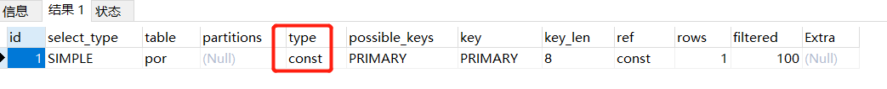

当我们用 `EXPLAIN` 查看执行计划的时候，一般如下图所示：

现在我们就来看看执行计划中 `type` 代表什么意思

假设你写一个 `SELECT * FROM table WHERE id = x` 或者 `SELECT * FROM table WHERE name = x` 的语句，直接就可以通过聚簇索引或者二级索引 + 聚簇索引回源，轻松查到你要的数据，这种根据索引可以快速查找数据的过程，在执行计划里称为 `const`，意思就是性能超高的常量级的。所以你以后在执行计划里看到 `const` 的时候，就知道它就是直接通过索引定位到数据，速度极快，这就是 const 的意思

但这里有一个要点，**你的二级索引必须是唯一索引，才是属于 const 方式**，也就是你必须建立 unique key 唯一索引，保证一个二级索引的每一个值都是唯一的才行。但是如果你是一个普通的二级索引，就是个普通的 KEY 索引。例如你写一个 `SELECT * FROM table WHERE name = x` 的 SQL，name 是普通二级索引，不是唯一索引，那么此时这种查询速度也是很快的，它在执行计划里面叫 `ref` 

如果你是包含多个列的普通索引的话，那必须是从索引最左侧开始连续多个列都是等值比较才可以是 `ref` 方式，就是类似于 `SELECT * FROM table WHERE name = x AND age = x AND xx = xx`，然后索引可能是个 KEY(name, age, xx)

一个例外，就是如果你用 `name IS NULL` 这种语法的话，即使 name 是主键或者是唯一索引，还是只能走 `ref` 方式。但是如果你是针对一个二级索引同时比较了一个值还限定了 `IS NULL`，类似于 `SELECT * FROM table WHERE name = x AND name IS NULL`，那么此时执行计划里就叫 `ref_of_null`。即，在二级索引里搜你要的值以及是 null 的值，然后再回源去聚簇索引里查，因为同时有索引等值比较和 NULL 值查询，就叫做 `ref_of_null`

接着我们说说 `range`，顾名思义，这个就是你 SQL 里又范围查询的时候就会走这个方式。比如你一个 SQL 是 `SELECT * FROM table WHERE age >= x AND age <= x`，假设 age 就是一个普通索引，此时就必然利用索引来进行范围筛选，一旦利用索引做了范围筛选，那么这种方式就是 `range`

接着就是一种比较特殊的数据访问方式，就是 `index`。很多人都会错认为 `index` 就是通过索引来获取数据，从索引根节点开始二分查找，不停地往下层索引跳转就可以了，速度跟 `ref` 和 `range` 一样快

其实不是的。假设我们有一个表，里面完整的字段联合索引是 `KEY(x1, x2, x3)`。接着我们写的一个 SQL 语句是 `SELECT x1, x2, x3 FROM table WHERE x2 = xxx`。这个时候，x2 并不是联合索引的最左侧的那个字段。所以，这个 SQL 是没法直接从联合索引的索引树的根节点开始二分查找的。但是，不知道大家发现没有，这个 SQL 要查的几个字段，就是联合索引里的几个字段

所以针对这种 SQL，在实际查询的时候，就会直接遍历 `KEY(x1, x2, x3)` 这个联合索引的索引树的叶子节点。因为聚簇索引的叶子节点放的是完整的数据页，里面包含完整的一行一行的数据，联合索引的叶子节点放的也是页，但是页里每一行就 x1, x2, x3 和 主键的值。

所以此时针对这个 SQL，会直接遍历 `KEY(x1, x2, x3)` 索引树的叶子节点的那些页，一个接一个的遍历，然后找到 `x2 = xxx` 的那个数据，把里面的 x1, x2, x3 三个字段的值直接提取出来就可以了。这个遍历二级索引的过程，要比遍历聚簇索引快多了，毕竟二级索引叶子节点就包含几个字段的值，比聚簇索引叶子节点小多了，所以速度也快

即，只需要遍历一个 `KEY(x1, x2, x3)` 索引就可以了，不用回源到聚簇索引去。**针对这种只需要遍历二级索引就可以拿到你想要的数据，而不需要回源到聚簇索引的访问方式，就叫做 index 访问方式**

其实，上面说的 `const` `ref` 和 `range`，本质都是基于索引树的二分查找和多层跳转来查询，所以性能是很高的。然后 `index` 速度就比上面要差一些，因为它是走遍历二级索引树的叶子节点的方式来执行的，速度比基于索引树的二分查找要慢多了，但是还是比全表扫描要好的 