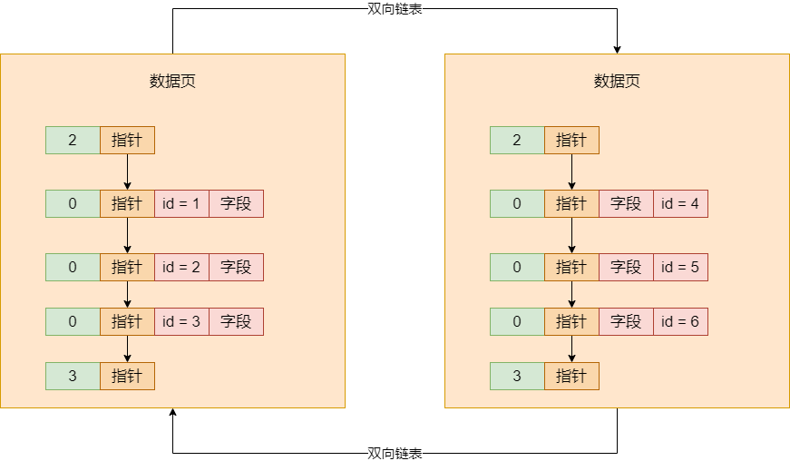

## 磁盘数据页的存储结构

在深入研究索引之前，我们需要先来看磁盘上的数据文件中的数据页的物理存储结构。之前说过，数据库最终所有的数据（包括我们建的各种表以及表里的数据）都是要存放在磁盘上的文件里的，然后文件里存放的物理格式就是数据页，那么大量的数据页在磁盘文件里是怎么存储的呢？


首先，大量的数据页是按顺序一页一页存放的，然后两两相邻的数据页之间会采用双向链表的格式互相引用，大概如下：


上面画的这个图在磁盘文件里到底是怎么弄出来的？其实一个数据页在磁盘里就是一段数据，可能是二进制或者别的特殊格式的数据，然后数据页里包含两个指针，一个指针指向自己上一个数据页的物理地址，一个指针指向自己下一个数据页的物理地址，大概可以认为类似下面这样：


```
DataPage: xx=xx, xx=xx, linked_list_pre_pointer=15367, linked_list_next_pointer=34126 || DataPage: xx=xx, xx=xx, linked_list_pre_pointer=23789, linked_list_next_pointer=46589 || DataPage: xx=xx, xx=xx, linked_list_pre_pointer=33198, linked_list_next_pointer=55681  
```


上面那段数据，不能完全认为是 MySQL 数据库的磁盘文件里的存储格式，这里就是给你看一些类似的东西，其实 MySQL 实际存储大致也是类似这样的，就是每个数据页在磁盘文件里都是连续的一段数据。然后每个数据页里，可以认为就是 DataPage 打头一直到 || 符合的一段磁盘里的连续的数据，你可以认为每一个数据页就是磁盘文件里这么一段连续的东西


然后每个数据页，都有一个指针指向自己上一个数据页在磁盘文件里的起始物理位置，比如 `linked_list_pre_pointer=15367` 就是指向了上一个数据页在磁盘文件里的起始位置，那个 15367 可以认为就是在磁盘文件里的 position 或者 offset。同理，也有一个指针指向自己下一个数据页的物理位置


接着，一个数据页内部会存储一行一行的数据，也就是平时我们在表里插入的一行一行的数据就会存储在数据页里，然后**数据页里的每一行数据都会按照主键大小进行排序存储**，同时每一行数据都有指针指向下一行的位置，组成单向链表。如图：


## 没有索引时，数据库如何查询数据

上面说了数据页在磁盘文件中的物理存储结构。目前知道数据页之间是组成双向链表的，然后数据页内部的数据行是组成单向链表的，而且数据行是根据主键从小到大排序的


然后每个数据页里都会有一个页目录，里面根据数据行的主键存放了一个目录，同时数据行是被分散存储到不同的槽位里去的，所以实际上每个数据页的目录里，就是这个页里每个主键跟所在槽位的映射关系，如图：


假设你要根据主键查找一条数据，而且此时你数据库里那个表没几条数据，那个表总共就一个数据页，那就很简单了。首先就会先到数据页的页目录里根据主键进行二分查找，然后通过二分查找在目录里迅速定位到主键对应的数据是在哪个槽位里，然后到那个槽位里，遍历槽位里的每一行数据，就能快速找到那个主键对应的数据了。每个槽位里都有一组数据行，你就是在里面遍历查找就行


如果你是根据非主键的其它字段来查找数据呢？此时是没办法使用主键的那种页目录来二分查找的，只能进入到数据页里，根据单向链表依次遍历查找数据，这就性能很差了


如果我们有很多数据页呢？一个表里一般都是有大量数据的，这些数据页就存放在物理磁盘文件里，这时如何查询数据？假设你没有建立任何索引，那么无论是根据主键查询，还是根据其它字段来条件查询，都没有什么取巧的方法


你一个表里的所有数据页都是组成双向链表的，那么直接从第一个数据页开始遍历所有数据页，从第一个数据页开始，你得先把第一个数据页从磁盘上读取到内存 buffer pool 的缓存页里来。然后你就在第一个数据页对应的缓存页里，按照上述办法查找，假设是根据主键查找，你可以在数据页的页目录里二分查找；假设你是根据其它字段查找的，只能是根据数据页内部的单向链表来遍历查找，如图：


如果第一个数据页没找到你要的那条数据，那只能根据数据页的双向链表去找下一个数据页，然后读取到 Buffer Pool 的缓存页里去，然后按一样的方法在一个缓存页内部查找那条数据。如果还是找不到，那只能根据双向链表继续加载下一个数据页到缓存页里来，一次类推，循环往复


不知道你们有没有感知到，你似乎是在做一个数据库里很尴尬的操作：**全表扫描**。是的，上述操作过程，就是全表扫描。在你没有任何索引数据结构的时候，无论如何查找数据，都是一个全表扫描的过程，就是根据双向链表依次把磁盘上的数据页加载到缓存页里去，然后在一个缓存页内部来查找那条数据。最坏的情况下，你就得把所有数据页里的每条数据都遍历一遍，才能找到你需要的那条数据，这就是全表扫描


## 页分裂

总结上面的内容就是，数据页之间是组成双向链表的，数据页内部的数据行是组成单向链表的，每个数据页内根据主键做了一个页目录。然后一般来说，你没有索引的情况下，所有的数据查询，其实在物理层都是全表扫描，依次扫描每个数据页内部的每个数据行。


其实，没有索引情况先一个表中的数据查询情况，这个速度是很慢的，所以一般是不能让查询走全表扫描的。因此正常在数据库中的查询，必须要运用索引来加速查询的执行。


在引入索引之前，还得讲一个知识点，就是我们在一个表里不停地插入数据的时候，会涉及到一个**页分裂的过程**，即，这个表里是如何出现一个又一个的数据页的。


正常情况下，我们在一个表里插入一些数据后，它们都会进入到一个数据页里去，在数据页内部，它们会组成一个单向链表，这个数据页内部的单向链表大致如下所示：


如上图，里面是一行一行的数据，刚开始第一行是个起始行，它的类型是 2，就是最小的一行，然后它有一个指针指向了下一行数据，每一行数据都有自己每个字段的值，然后每一行通过一个指针不停地指向下一行数据，普通的数据行的类型都是 0，最后一行是一个的类型 3，代表最大的一行


那什么是页分裂？假设你不停地在表里插入数据，那么刚开始就是不停地在一个数据页插入数据，接着数据越来越多，此时就要在搞一个数据页了，如图：

 


此时会遇到一个问题，索引运作的一个核心机制就是要求你后一个数据页的主键值都大于前面一个数据页的主键值，如果你的主键是自增的，那还可以保证这一点，因为你新插入后一个数据页的主键值一定都大于前一个数据页的主键值。但是如果你的主键不是自增长的，可能会出现你后一个数据页的主键值里，有的主键是小于前一个数据页的主键值的。例如在第一个数据页里有一条数据的主键是 10，第二个数据页里又一条数据的主键值是 8，这就有问题了


所以此时就会出现一个过程，叫做**页分裂**。就是万一你的主键值都是自己设置的，那么在增加一个新的数据页的时候，实际上会把前一个数据页里主键值较大的，挪动到新的数据页里来，然后把你新插入的主键值较小的数据挪到上一个数据页里去，保证新数据页里的主键值一定都比上一个数据页里的主键值大。


例如下图，新数据页里，有两条数据的主键值明显是小于上一个数据页的主键值：


上图中，第一个数据页里有 1、5、6 三条数据，第二个数据页里又 2、3、4 三条数据，明显第二个数据页里的数据的主键值比第一个数据页里的 5 和 6 两个主键都小，这个是不行的。此时就会出现页分裂的行为，把数据页里的两条数据挪动到上一个数据页，上一个数据页里挪两条数据到新数据页里去，如下图：

 


