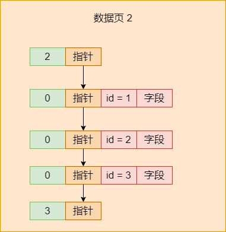
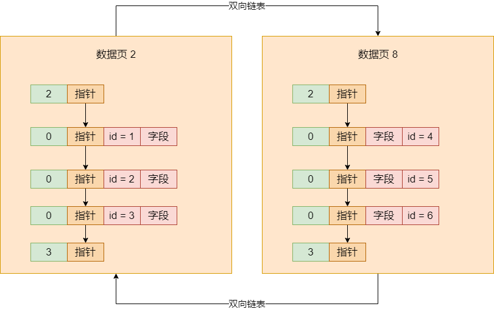
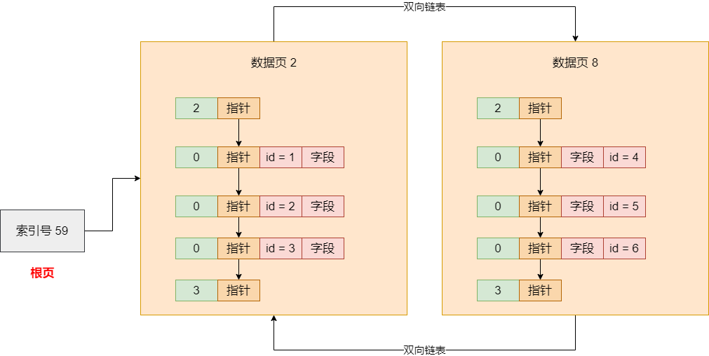
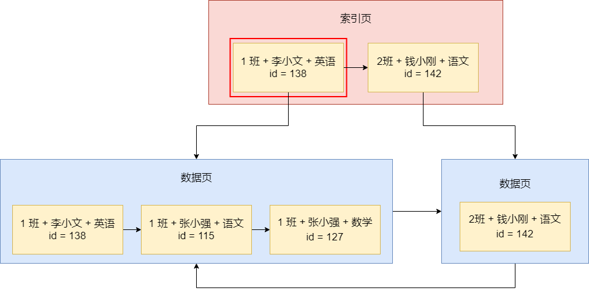
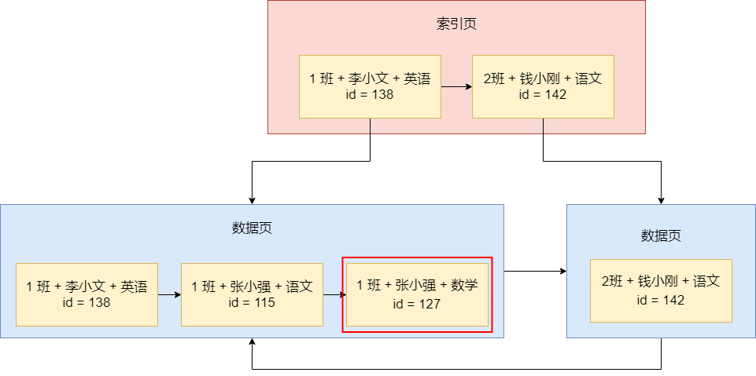

之前讲了 MySQL 数据库的索引结构，让大家清楚不同索引的结构，大致是如何建立的，搜索的时候是如何根据不同的索引去查找数据的。现在，我们说说在插入数据的时候，是如何维护不同索引的 B+ 树的


首先，刚开始你一个表搞出来以后，它就一个数据页，这个数据页是属于聚簇索引的一部分，而且目前还是空的。此时如果你插入数据，就是直接在这个数据页里插入就可以了，没必要弄什么索引页




这个初始的数据页其实就是一个根页，每个数据页内部默认就有一个基于主键的页目录，所以此时你根据主键来搜索时没有问题的，直接在唯一一个数据页里根据页目录找就可以了


然后你表里的数据越来越多，此时你的数据页满了，就会搞一个新的数据页，然后把你根页面里的数据都拷贝过去，同时再搞一个新的数据页，根据你的主键值的大小进行挪动，让两个新的数据页根据主键值排序，第二个数据页的主键值都大于第一个数据页的主键值。




那么此时那个根页在哪？此时根页就升级为索引页，这个根页里存放的是两个数据页的页号和它们里面最小的主键值。如下图，根页就成了索引页，引用两个数据页




接着会不停地往表里灌入数据，然后数据页不停地页分裂，分裂出来越来越多的数据页。此时你的唯一一个索引页，也就是根页里存放的数据页索引条目越来越多，连你的索引页都放不下了，那你就让一个索引页分裂成两个索引页，然后根页继续往上走一个层级引用两个索引页


接着就是以此类推，你的数据页越多，那么根页指向的索引页也会不停地分裂，分裂出更多的索引页，当你下层的索引页数量太多的时候，会导致你的根页指向的索引页太多了，此时根页继续分裂成多个索引页，根页再次往上提上去一个层级


例如你 name 字段有一个索引，那么刚开始的时候你插入一个数据，一方面在聚簇索引的唯一的数据页里插入，一方面在 name 字段的索引 B+ 树唯一的数据页里插入。然后数据越来越多，你的 name 字段的索引 B+ 树里唯一的数据页也会分裂，整个分裂的过程跟上面说的是一样的，所以你插入数据的时候，本身就会维护你各个索引的 B+树


另外补充一点，你的 name 字段的索引 B+ 树里的索引页中，其实除了存放页号和最小 name 字段值以外，每个索引页里还会存放那个最小 name 字段值对应的主键值。这是因为有时候会出现多个索引页指向的下层页号的最小 name 字段值是一样的，此时就必须根据主键判断一下


例如你插入一个新的 name 字段值，此时它需要根据 name 字段的 B+ 树索引的根页面开始，去逐层寻找和定位自己这个新的 name 字段值应该插入到哪个叶子节点的哪个数据页里去。此时万一遇到一层里不同的索引页指向不同的下层页号，但是 name 字段值一样，此时就得根据主键值比较一下，新的 name 字段值肯定是插入到主键值较大的那个数据页里去的


## 索引不是越多越好

默认情况下 MySQL 给我们建立的聚簇索引都是基于主键的值来组织索引的，聚簇索引的叶子节点都是数据页，里面放的就是我们插入的一行一行的完整的数据。在一个索引 B+ 树中，它有一些特性，就是数据页/索引页里面的记录都是组成一个单向链表的，而且是按照数据大小有序排列的；然后数据页/索引页互相之间是组成双向链表的，而且也都是按照数据大小有序排列的，所以其实 B+ 树索引是一个完全有序的数据结构，无论是页内还是页之间


正是因为这个有序的 B+ 树索引结构，才能让我们查找数据的时候，直接从根节点开始按照数据值大小一层一层往下找，这个效率是非常高的


然后如果是针对主键之外的字段建立索引的话，实际上本质就是为那个字段的值重新建立另外一棵 B+ 树索引，那个索引 B+ 树的叶子节点，存放的都是数据页，里面放的都是你字段的值和主键值，然后每一层索引页里存放的都是下层页的引用，包括页内的排序规则，页之间的排序规则，B+ 树索引的搜索规则，都是一样的


但是，如果我们要根据其它字段的索引来搜索，那么只能基于其它字段的索引 B+ 树快速查找到那个值所对应的主键，接着再次做回表查询，基于主键在聚簇索引的 B+ 树里，重新从根节点开始查找那个主键值，找到主键值对应的完整数据


那么，你在 MySQL 的表里建立一些字段对应的索引，好处是什么？好处是显而易见的，你可以直接根据某个字段的索引 B+ 树来查找数据，不需要全表搜索，性能提升是很高的。但坏处呢？索引主要有两个缺点，一个是空间上的，一个是时间上的


空间上而言，你要是给很多字段创建很多的索引，那你会有很多棵索引 B+ 树，每一棵 B+ 树都要占用很多的磁盘空间。如果你建的索引太多，是很耗费磁盘空间的。其次，如果你建了很多索引，那么你在进行增删改的时候，每次都需要维护各个索引的数据有序性，因为每个索引 B+ 树都要求页内是按照值大小排序的，页之间也是有序的，下一个页的所有值必须大于上一个页的所有值


所以你不停地增删改，必然会导致各个数据页之间的值大小可能会没有顺序，此时只能进行数据页的挪动，维护页之间的顺序；或者你不停地插入数据，各个索引的数据页就要不停地分裂，不停地增加新的索引页，这个过程都是耗费时间的


所以你一个表里建的索引太多，很可能就会导致你的增删改的速度就比较差。因此，我们是不建议在一个表里建太多索引的


## 联合索引查询原理和全值匹配规则

之所以讲联合索引，是因为我们设计系统的时候一般是设计联合索引，很少用单个字段做索引，原因是我们要尽可能让索引数量少一些，避免磁盘占用太多，增删改性能太差


假设我们有一个表是存储学习成绩的，这个表有 id，这个 id 是一个自增主键，默认就会基于它做一个聚簇索引。然后就是包含了「学生班级」「学生姓名」「科目名称」「成绩分数」四个字段，平时查询，比较多的就是查找某个班级的某个学生的某个科目的成绩。所以，我们针对「学生班级、学生姓名和科目名称」建一个联合索引


我们用一个图展示这三个字段组成的联合索引的部分内容，如下：


上图有两个数据页，第一个数据页里有三条数据，每条数据都包含了联合索引的三个字段的值和主键值，数据页内部都是按照顺序排序的。首先按照班级字段的值来排序，如果一样就按照学生姓名字段来排序，如果一样泽按照科目名称来排序，所以数据页内部都是按照三个字段的值来排序的，而且还组成了单向链表


然后数据页之间也是有顺序的，第二个数据页里的三个字段的值都一定大于上一个数据页里三个字段的值，比较方法也是按照班级名称、学生姓名、科目名称依次来比较，数据页之间组成双向链表


索引页里就是两条数据，分别指向两个数据页，索引存放的是每个数据页里最小的那个数据的值。而且，索引页里指向两个数据页的索引项里都是存放了那个数据页里最小的值。索引页内部的数据页是组成单向链表有序的，如果你有多个索引页，那么索引页之间也是有序的，组成了双向链表


现在我们要搜索「1 班 + 张小强 + 数学」的成绩，SQL 语句为

```sql
SELECT * FROM student_score WHERE class_name = '1班' AND student_name = '张小强' and subject_name = '数学'
```


这就涉及到一个索引的使用规则，那就是你发起的 SQL 语句里，where 条件里的几个字段都是基于等值来查询的，都是用的等于号。而且 where 条件里的几个字段的名称和顺序也跟你的联合索引一模一样，此时就是等值匹配规则，上面的 SQL 语句是可以用联合索引查询的


那么查询的过程也简单，首先到索引页里去找，索引页里有多个数据页的最小值记录，此时直接在索引页里基于二分查找来找就可以了，先是根据班级名称来找 1 班这个值对应的数据页，直接可以定位到它所在的数据页




然后你就直接找到索引指向的那个数据页就可以了，在数据页内部本身也是一个单向链表，你也是直接二份查找就可以了。先按 1 班这个值找，你会发现几条数据都是 1 班；此时就可以按照「张小强」这个姓名来二分查找，此时会发现多条数据都是张小强，接着就按照「科目名称」数学来二分查找、很快就可以定位到下图中的一条数据，1 班的张小强的数学科目，它对应的数据 id 是127




然后就根据主键 id = 127 到聚簇索引里按照一样的思路，从索引根节点开始二分查找迅速定位下个层级的页，再不停地找，很快就可以找到 id = 127 的那条数据，然后从里面提取所有字段就可以了


上面整个过程就是联合索引的查找过程，以及全值匹配规则。假设你的 SQL 语句的 where 条件里用的几个字段和顺序，都跟你的索引的字段一样，同时你还是用等号在做等值匹配，那么直接就会按照上述过程来找。


对于联合索引而言，就是依次按照各个字段来进行二分查找，先定位到第一个字段对应的值在哪个页里，然后如果第一个字段有多条数据值都一样，就根据第二个字段来找，以此类推，就可以定位到某条或者某几条数据


## 索引使用规则

接着我们讲一下几个基本的索引使用规则。还是用上面的那个例子来做说明


上面我们讲的是等值匹配原则，就是你 where 语句中的几个字段名称和联合索引名称的字段完全一样，而且都是基于等号的等值匹配，那百分百会用上我们的索引。**即使你 where 语句里写的顺序和联合索引里的字段顺序不一致，也没关系，MySQL 会自动优化为按联合索引的字段顺序去找**


第二个规则是**最左侧列匹配**。假设我们联合索引是 `KEY(class_name, student_name, subject_name)`，那么不一定必须要在 where 语句根据三个字段来查，其实只要根据最左侧的部分字段来查，也是可以的


例如你可以写下面的 SQL 语句，就差某个学生所有科目的成绩，这是没问题的

```sql
SELECT * FROM student_score WHERE class_name = '' and student_name = ''
```


但是如果你写一个 `select * from student_score where subject_name = ''`，那就不行了，因为联合索引的 B+ 树里，是必须先按 `class_name` 查，再按 `student_name` 查，不能跳过前面两个字段，直接按最后一个 `subject_name`  查的


另外，如果你写一个 `select * from student_score where class_name = '' and subject_name = ''`，那么只有 `class_name` 的值可以在索引里搜索，剩下的 `subject_name` 是没法在索引里找的，道理同上。


所以在建立索引的时候，必须考虑好联合索引字段的顺序，以及平时写 SQL 的时候要按哪几个字段来查


第三个规则是**最左前缀匹配原则**，即如果你要用 `LIKE` 语法去查，比如 `SELECT * FROM student_score WHERE class_name LIKE '1%'`，查找所有 1 打头的班级的分数，那么可以用到索引的。因为你的联合索引 B+ 树里，都是按照 `class_name` 排序的，所以你给出 `class_name` 的确定的最左前缀是 1，然后后面的给一个模糊匹配符合，那也是可以基于索引来查找的


但是你如果写 `class_name LIKE '%班'`，在左侧用一个模糊匹配符，那他就没法用索引了，因为不知道你最左前缀是什么，没办法去索引里找


第四个就是**范围查找规则**，这个意思是我们可以用 `SELECT * FROM student_score WHERE class_name > '1班' and class_name < '5班'` 这样的语句来范围查找某几个班级的分数。这个时候也是会用到索引的，因为我们的索引的最下层的数据页都是按顺序组成双向链表的，所以完全可以先找到「1 班」对应的数据页，再找到「5 班」对应的数据页，两个数据页中间的那些数据页，就都是在你的范围内的数据了


但是如果你要是写 `SELECT * FROM student_score WHERE class_name > '1 班' AND class_name  < '5 班' AND student_name > ''` 这里只有 class_name 是可以基于索引来找的，student_name 的范围查询时没法用到索引的


这也是一条规则，就是你的 where 语句里如果有范围查询，那只有对联合索引里最左侧的列进行范围查询才能用到索引


第五个规则，就是**等值匹配 + 范围匹配的规则**。如果你是用 `SELECT * FROM student_score WHERE class_name = '1班' AND student_name > '' AND subject_name <  ''` ，那么此时你首先可以用 class_name 在索引里精准定位到一波数据，接着这波数据里的 student_name 都是按照顺序排列的，所以 `student_name > ''` 也会基于索引来查找，但是接下来的 `subject_name < ''` 是不能用索引的


综上所述，一般我们写 SQL 语句，都是用联合索引的最左侧的多个字段来进行等值匹配 + 范围搜索，或者是基于最左侧的部分字段来进行最左前缀模糊匹配，或者基于最左侧字段来进行范围搜索，这就要写符合规则的 SQL 语句，才能用上联合索引


