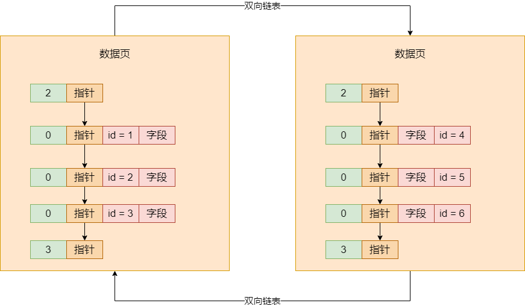
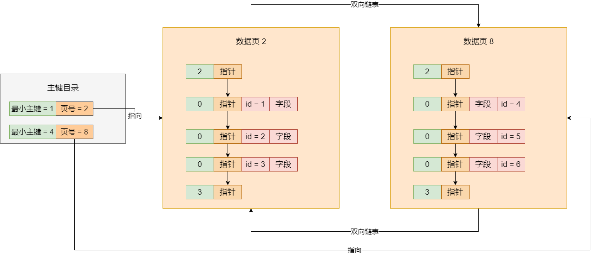
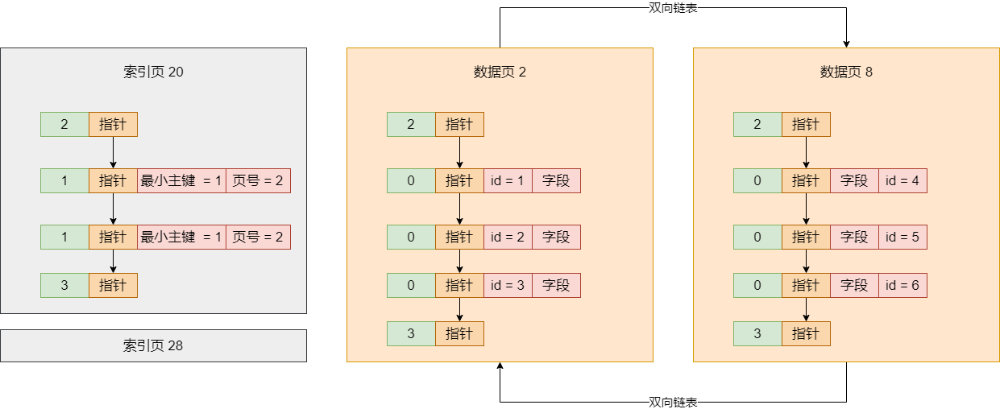
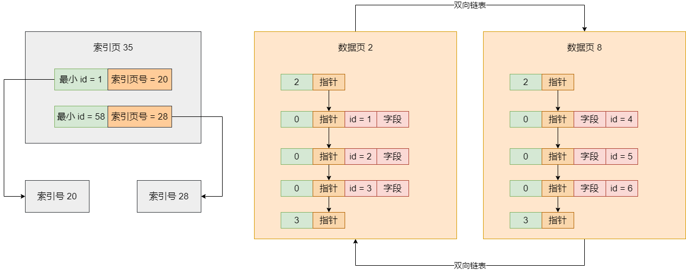
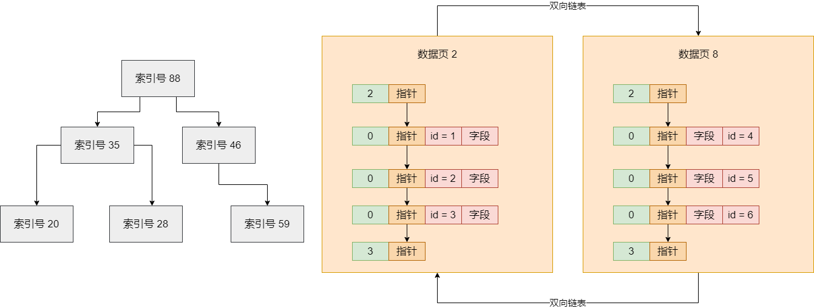
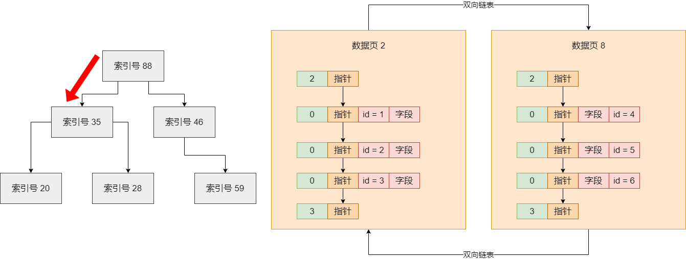
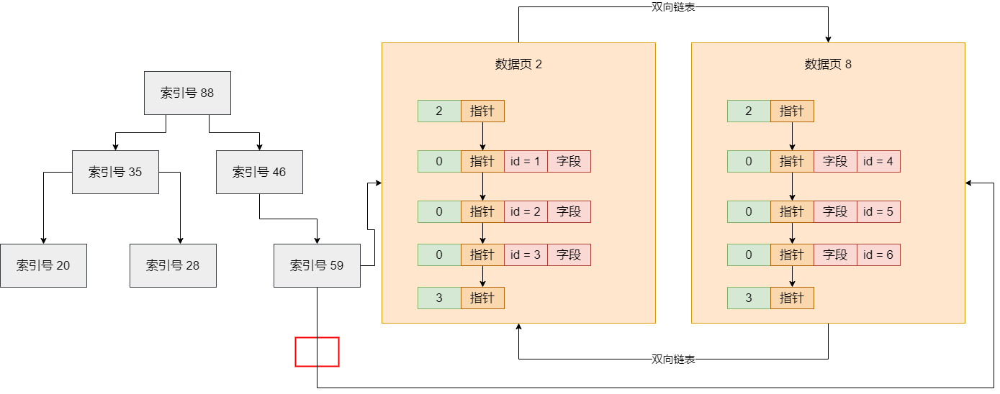
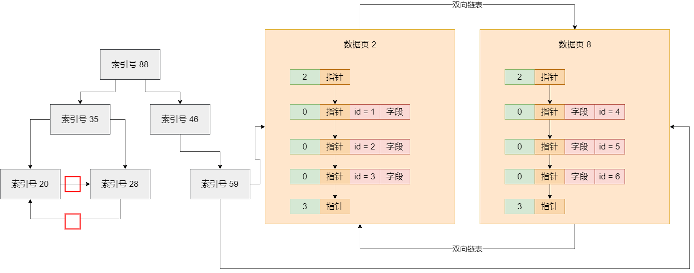
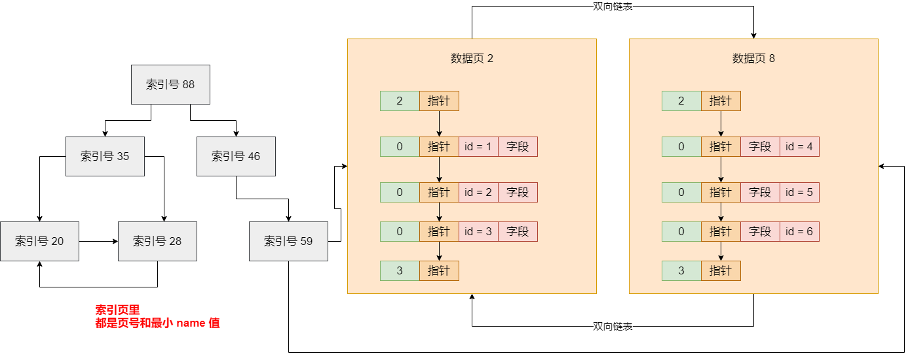

上篇我们讲了数据页分裂的过程，在你不停地往表里插入数据的时候，会出来一个一个的数据页，如果你的主键不是自增的，它可能会有一个数据行的挪动过程，保证你下一个数据页的主键值都大于上一个数据页的主键值

现在是这样，假设我们有很多数据页，然后我们想要根据主键来查询数据，那么直接查询是不行的，因为我们也不知道主键在哪里。如下：

假设你要搜 id = 4 的数据，但你怎么知道在哪个数据页里？没有任何证据可以告诉你它在哪个数据页里。所以如果还是这个样子的话，你也就只能全表扫描，从第一个数据页开始，每个数据页都要进入到页目录里查找主键，最坏的情况下，所有数据页你都得扫描一遍，这是很坑的

所以此时就需要针对主键设计一个索引了，针对主键索引实际上就是主键目录，这个主键目录，就是**把每个数据页的页号，还有数据页里最小的主键值放在一起，组成一个索引的目录**。如下图：

有了主键目录之后就方便了，直接就可以到主键目录里去搜索。比如你要找 id = 3 的数据，此时就会跟每个数据页的最小主键来比，首先 id = 3 大于数据页 2 里的最小主键值 1，接着小于数据页 8 里的最小主键值 4，所以你可以直接定位到 id = 3 的数据一定是在 数据页 = 2 里的

假设你有很多的数据页，在主键目录里就会有很多的数据页和最小主键值，此时你完全可以根据二分查找的方式来找你要找的  id 在哪个数据页里。这个效率是非常高的，而类似上面的主键目录，就可以认为是主键索引

我们的数据页都是一坨一坨的连续数据放在很多磁盘文件里的，所以只要你能够根据主键索引定位到数据所在的数据页，此时假设我们有别的方式存储了数据页跟磁盘文件的对应关系，此时你就可以找到一个磁盘文件。而且我们假设数据页在磁盘文件里的位置也就是 offset 偏移量，你也是可以知道的，此时就可以直接通过随机读的方式定位到磁盘文件的某个 offset 偏移量，然后就可以读取连续的数据页了

## 索引的页存储结构

上面说了主键索引的目录结构。只要在一个主键索引里包含每个数据页跟它最小主键值，就可以组成一个索引目录，然后你后续查询主键值，就可以在目录里二分查找定位那条数据所属的数据页，接着到数据页里二分查找定位那条数据就可以了

现在，你的表里的数据可能有很多，比如有几百万，几千万甚至单表几亿数据都是可能的，所以你可能有大量的数据页，然后你的主键目录里就要存储大量的数据页和最小主键值，这是不行的。所以在考虑这个问题的时候，实际上是采取了一种把索引数据存储在数据页的方式来做的

也就是说，你的表的实际数据是存放在数据页里的，然后你表的索引也是存放在页里的，此时索引放在页里之后，就会有索引页。假设你有很多的数据页，那么此时就可能就有很多的索引页

现在又会存在一个问题，你现在有很多索引页，但是此时你需要知道，应该去哪个索引页里去找你的主键数据。于是我们又可以把索引页多加一个层级出来，在更高的索引层级里，保存了每个索引页和索引页里的最小主键值，如下图：

假设我们要查找 id = 6，直接先到最顶层的索引页 35 里去找，直接通过二分查找可以定位到下一步应该到索引页 20 里去找，接下来到索引页 20 里通过二分查找定位，也可以很快定位到数据应该在数据页 8里，在进入数据页 8， 可以找到 id = 6 的那一行数据

如果最顶层的那个索引页里存放的下层索引页的页号太多了，怎么办？此时可以再次分裂，再加一层索引页，如下图：

是不是觉得索引页不知不觉组成了多个层级，有点像一棵树？没错，这就是一颗 B+ 树，属于数据结构里的一种树形数据结构，所以一直说 MySQL 的索引是 B+ 树来组成的，就是这个意思

我们就以最基础的主键索引来举例，当你为一个表的主键建立起索引之后，其实这个主键的索引就是一棵 B+ 树，然后当你要根据主键来查数据的时候，直接就是从 B+ 树的顶层开始查找，一层一层往下定位，最终定位到一个数据页里，在数据页内部的目录里二分查找，找到那条数据

这就是索引最真实的物理存储结构，采用跟数据页一样的页目录来存储，一个索引就是很多页组成的一棵 B+ 树

## 聚簇索引

上面讲了如何基于主键组织一个索引，然后建立索引之后，如何基于主键在索引中快速定位到那行数据所在的数据页，再如何进入数据页快速定位那行数据。今天我们按照主键来搜索数据的过程重新给大家梳理一遍，方便大家理解**聚簇索引**

首先，假设我们要搜索一个主键 id 对应的行，此时你应该先去顶层的索引页 88 里去找，通过二分查找的方式，很容易定位到你应该去下层哪个索引页里继续找。如图：

比如现在定位到了下层的索引页 35 里去继续找，此时在索引页 35 里也有一些索引条目，分别都是下层各个索引页（20，28，59）和它们最小的主键值，此时在索引页 35 的索引条目里继续二分查找，很容易定位到，应该在到哪个索引页里去继续找

假设从索引页 35 接着就找到下层的索引页 59 里去了，此时索引页 59 里肯定也是有索引条目的，这里就存放了部分数据页页号（比如数据页 2 和数据页 8）和每个数据页里最小的主键值。此时就在这里继续二分查找，就可以定位到应该到哪个数据页里去找

假设进入了数据页 2，里面就有一个页目录，都存放了各行数据的主键值和行的实际物理位置。此时在这里直接二分查找，就可以快速定位到你要搜索的主键值对应行的物理位置，然后直接在数据页 2 里找到那条数据即可

这就是基于索引结构去查找主键的一个过程。其实最下层的索引页，都是会有指针引用数据页的，所以实际上索引页之间跟数据页之间是有指针连接起来的。如图：

另外，其实索引页自己内部，对于一个层级内的索引页，互相之间都是基于指针组成双向链表的，就跟数据页自己组成双向链表是一样的

从上面的描述中我们可以发现一些亮点，假设你把索引页和数据页综合起来看，它们都是连接在一起的，看起来就如同一棵完整的大的 B+ 树一样，从根索引页开始，一直到所有的数据页，其实组成了一颗巨大的 B+ 树。在这棵 B+ 树里，最底层的一层就是数据页，数据页也就是 B+ 树里的叶子节点

所以，**如果一棵大的 B+ 树索引结构里，叶子节点就是数据页自己本身，那么此时我们就可以称这棵 B+ 树索引为聚簇索引**。即，上图中所有的索引页 + 数据页组成的 B+ 树就是聚簇索引

其实在 InnoDB 存储引擎里，你在对数据增删改的时候，就是直接把你的数据页放在聚簇索引里的，聚簇索引就包含了数据。比如你插入数据，那么就是在数据页里插入数据，那么就是在数据页里插入数据。如果你的数据页开始进行页分裂了，它此时会调整各个数据页内部的行数据，保证数据页内的主键值都是有序的，下一个数据页的所有主键值都大于上一个数据页的所有主键值

同时，在页分裂的时候，会维护你的上层索引结构，在上层索引页里维护你的索引条目，不同的数据页和最小主键值。然后如果你的数据页越来越多，一个索引页放不下了，此时就会在拉出新的索引页，同时再搞一个上层的索引页，上层索引页里存放的索引条目就是下层索引页页号和最小主键值

按照这个顺序，以此类推，如果你的数据量越大，此时可能就会多出更多的索引页层级来。不过说实话，一般索引页里可以存放很多索引条目，所以通常而言，即使你是亿级大表，基本上大表里建的索引也就三四层而已

这个举措索引默认是按照主键来组织的，所以你在增删改数据的时候，一方面会更新数据页，一方面其实会给你自动维护 B+ 树结构的聚簇索引，给新增和更新索引页。这个聚簇索引是默认就会给你建立的

## 二级索引（非聚簇索引）

上面讲了聚簇索引这个东西，其实聚簇索引就是 InnoDB 存储引擎默认给我们创建的一套基于主键的索引结构，而且我们表里的数据就是直接放在聚簇索引的，作为叶子节点的数据页。而且我们也对基于主键的数据搜索也比较清晰了，就是从聚簇索引的根节点开始进行二分查找，一路找到对应的数据页里，基于页目录就直接定位到主键对应的数据就可以了

接着我们说说**对主键外的其它字段建立索引的原理**。其实你要是对其它字段建立索引，比如 name、age 之类的字段，都是一样的原理。即，你插入数据的时候，一方面会把完整数据插入到聚簇索引的叶子节点的数据页里去，同时维护好聚簇索引；另一方面会为你其它字段建立的索引，重新再建立一棵 B+ 树

比如你基于 name 字段建立了一个索引，那么此时你插入数据的时候，就会重新建一棵 B+ 树，B+ 树的叶子节点也是数据页，但是这个数据页里仅仅放主键字段和 name 字段

注意，这可是独立于聚簇索引之外的另外一个索引 B+ 树，严格说是 name 字段的索引 B+ 树，所以在 name 字段的索引 B+ 树里，叶子节点的数据页里**仅仅放主键和 name 字段的值**，至于排序规则之类的，都是跟以前一样的，即，name 字段的索引 B+ 树里，叶子节点的数据页中的 name 值都是按大小排序的，同时下一个数据页里的 name 字段值都大于上一个数据页里的 name 字段值，整个整体的排序规则都跟聚簇索引按照主键的排序规则是一样的

然后，name 字段的索引 B+ 树也会构建多层级的索引页，这个索引页存放的就是下一层的页号和最小 name 字段值，整体规则都是一样，只不过存放的是 name 字段的值，根据 name 字段值排序罢了

假设你要根据 name 字段来搜索数据，那搜索过程是一样的，就是从 name 字段的索引 B+ 树里的根节点开始找，一层一层往下找，一直找到叶子节点的数据页里，定位到 name 字段值对应的主键值。然后，此时针对 `SELECT * FROM table WHERE name = 'xx'` 这样的语句，先根据 name 字段值在 name 字段的索引 B+ 树里找，找到叶子节点也仅仅可以找到对应的主键值，而找不到这行数据完整的所有字段

所以此时你还要进行「回表」。这个回表，就是还需要根据主键值，再到聚簇索引里从根节点开始，一路找到叶子结点的数据页，定位到主键对应的完整数据行，此时才能把 `SELECT *` 要的字段值都拿出来。

因为我们根据 name 字段的索引 B+ 树找到主键之后，还要根据主键去聚簇索引里找，所以一般把 name 字段这种普通字段的索引称为二级索引，一级索引就是聚簇索引，这就是普通字段的索引的运行原理

其实我们也可以把多个字段联合起来，建立联合索引，比如 `name + age`。此时联合索引的运行原理是一样的，只不过是建立一棵独立的 B+ 树，叶子节点的数据页里放了 `id + name + age`，然后默认按照 name 排序，name 一样就按照 age 排序，不同数据页之间的 `name + age` 值的排序也如此

然后这个 name + age 的联合索引的 B+ 树的索引页里，放的就是下层节点的页号和最小的 name + age 的值。以此类推，所以你根据 name + age 搜索的时候，就会走 name + age 联合索引的这棵 B+ 树了，搜索到主键，再根据主键到聚簇索引里去搜索

以上，就是 InnoDB 存储引擎的索引的完整实现原理。其实就是建立 B+ 树，根据 B+ 树一层一层二分查找而已。然后不同的索引就是建立不同的 B+ 树，然后你增删改的时候，一方面在数据页里更新数据，一方面就是维护你所有的索引。后续查询，你就要尽量根据索引来查询

