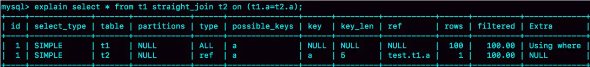
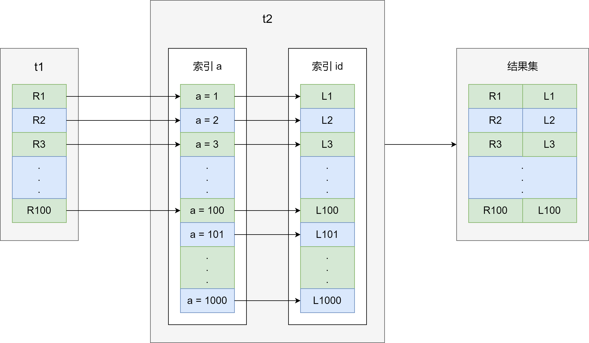
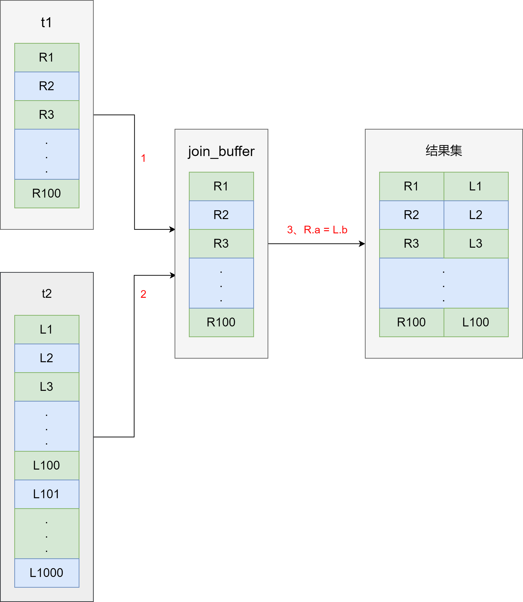
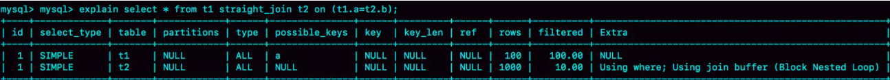
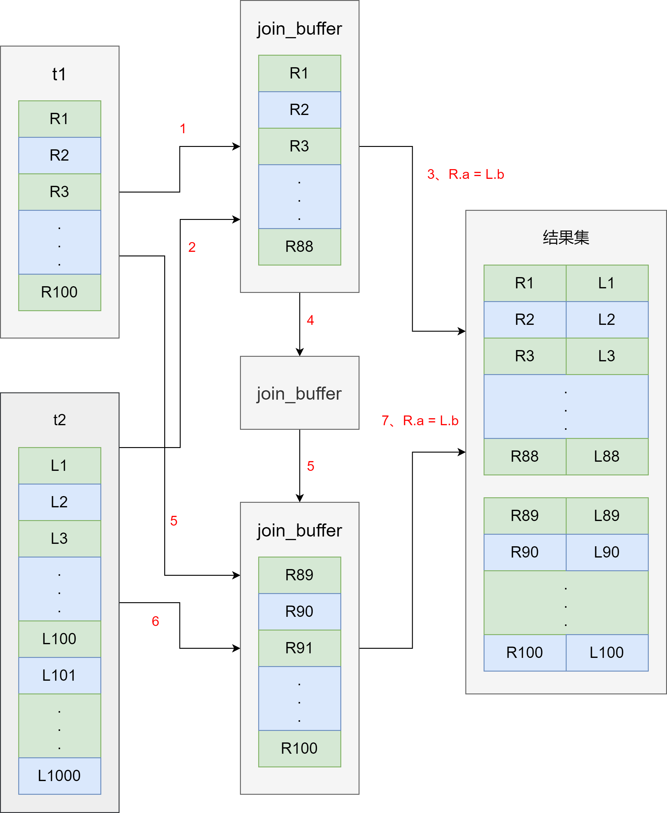

今天我们说说 join 语句是怎么执行的。为了方便分析，我们先创建两个表 t1 和 t2


```mysql
CREATE TABLE `t2` (
  `id` int(11) NOT NULL,
  `a` int(11) DEFAULT NULL,
  `b` int(11) DEFAULT NULL,
  PRIMARY KEY (`id`),
  KEY `a` (`a`)
) ENGINE=InnoDB;

delimiter ;;
create procedure idata()
begin
  declare i int;
  set i=1;
  while(i<=1000)do
    insert into t2 values(i, i, i);
    set i=i+1;
  end while;
end;;
delimiter ;
call idata();

create table t1 like t2;
insert into t1 (select * from t2 where id<=100)
```


可以看到，这两个表都有一个主键索引 id 和一个索引 a，字段 b 上无索引。存储过程 idata() 往表里 t2 里插入了 1000 行数据吗，在表 t1 里插入的是 100 行数据


### Index Nested-Loop Join


先看一条 SQL 语句：


```mysql
select * from t1 straight_join t2 on (t1.a = t2.a)
```


如果直接使用 join 语句，MySQL 优化器可能会选择表 t1 或 t2 作为驱动表，这样会影响我们分析 SQL 语句的执行过程。所以，为了便于分析执行过程中的性能问题，用 `straight_join` 让 MySQL 使用固定的连接方式执行查询，这样优化器只会按照我们指定的方式去 join


这个语句中，t1 是驱动表，t2 是被驱动表。我们看一下这条语句的 explain 结果





在这条语句里，被驱动表 t2 的字段 a 上有索引，join 过程用上这个索引，因此这个语句的执行流程是这样的：


1. 从表 t1 中读入一行数据 R
2. 从数据行 R 中，取出 a 字段到表 t2 里去查找
3. 取出表 t2 中满足条件的行，跟 R 组成一行，作为结果集的一部分
4. 重复执行步骤 1 到 3，直到表 t1 的末尾循环结束


这个过程是先遍历表 t1，然后根据从表 t1 中取出的每行数据中的 a 值，去表 t2 中查找满足条件的记录。在形式上，这个过程就跟我们写程序时的嵌套查询类似，并且可以用上被驱动表的索引，所以我们称之为 **Index Nested - Loop Join**，简称 NLJ。流程图如下：





这个流程里：


1. 对驱动表 t1 做了全表扫描，这个过程需要扫描 100 行
2. 而对于每一行的 R，根据 a 字段去表 t2 查找，走的是树搜索过程。由于我们构造的数据都是一一对应的，因此每次的搜索过程都只扫描一行，也是总共扫描 100 行
3. 所以，整个执行流程，总扫描行数是 200


那么，怎么选择驱动表？


在这个 join 语句执行过程中，驱动表是走全表扫描，而被驱动表是走树搜索


假设被驱动表的行数是 M。每次在被驱动表查一行数据，要先搜索索引 a，再搜索主键索引。每次搜索一棵树近视复杂度是以 2 为底的 M 的对数，记为 log₂M，所以在被驱动表上差一行的时间复杂度是 2 * log₂M


假设驱动表的行数是 N，执行过程就要扫描驱动表 N 行，然后对于每一行，到被驱动表上匹配一次。因此整个执行过程，近似复杂度是 N + N * 2 * log₂M


显然，N 对扫描行数的影响更大，因此应该让小表来做驱动表


接着我们看看驱动表用不上索引的情况


### Simple Nested - Loop Join


我们把 SQL 改成这样：


```mysql
select * from t1 straight_join t2 on (t1.a = t2.b)
```


由于表 t2 的字段 b 上没有索引，因此再用图 2 的执行流程时，每次到 t2 去匹配的时候，就要做一次全表扫描


如果继续使用图 2 的算法，是不是可以得到正确的结果呢？如果只看结果的话，这个算法是正确的，而且这个算法也有一个名字，叫 **Simple Nested - Loop Join**


但是，这样算来，这个 SQL 请求就要扫描表 t2 多达 100 次，总共扫描 100 * 1000 = 10 万行


当然，MySQL 也没有使用这个 Simple Nested - Loop Join 算法，而是使用了另一个叫做 **Block Nested - Loop Join** 的算法，简称 BNL


### Block Nested - Loop Join


这时候，被驱动表上没有可用的索引，算法的流程是这样的：


1. 把表 t1 的数据读入线程内存 **join_buffer** 中，由于我们这个语句中写的 select *，因此是把整个表 t1 放入了内存
2. 扫描表 t2，把表 t2 中的每一行取出来，跟 join buffer 中的数据做对比，满足 join 条件的，作为结果集的一部分返回


这个过程的流程图如下：





对应地，这条 SQL 语句的 explain 结果如下所示：





可以看到，这个过程，对表 t1 和 t2 都做了一次全表扫描，因此总的扫描行数是 1100.由于 join_buffer 是以无序数组的方式组织的，因此对表 t2 中的每一行，都要做 100 次判断，总共需要在内存中做的判断次数是：100 * 1000 = 10 万次


相比较于 Simple Nested - Loop Join 算法进行查询，扫描行数也是 10 万行，时间复杂度是一样的。但是，Block Nested - Loop Join 算法的 10 万次判断是内存操作，速度上会快很多，性能也很好


接着，这种情况下，应该选择哪个表做驱动表


假设小表的行数是 N，大表的行数是 M，那么在这个算法里：


1. 两个表都做一次全表扫描，所以总的扫描行数是 M + N
2. 内存中的判断次数是 M * N


可以看到，这时候选择大表还是小表做驱动表，执行耗时是一样的


如果，表 t1 是一个大表，join_buffer 放不下怎么办呢？


join_buffer 的大小是由参数 `join_buffer_size` 设定的，默认是 256K。**如果放不下表 t1 的所有数据，策略很简单，就是分段放**。


我们把 join_buffer_size 调小，那么执行过程就变成：


1. 扫描表 t1，顺序读取数据行放入 join_buffer 中，放完第 88 行 join_buffer 满了，继续第 2 步
2. 扫描表 t2，把 t2 中的每一行取出来，跟 join_buffer 中的数据做对比，满足 join 条件的，作为结果集的一部分返回
3. 清空 join_buffer
4. 继续扫描表 t1，顺序读取最后的 12 行数据放入 join_buffer 中，继续执行第 2 步


执行流程图也变成这样：





图中的步骤 4 和 5，表示清空 join_buffer 再复用。这个流程才体现出这个算法中「Block」的由来，表示「分块去 join」


可以看到，由于表 t1 被分为了两次放入 join_buffer 中，导致表 t2 会被扫描两次。虽然分成两次 放入 join_buffer，但是判断等值条件的次数还是不变的，依然是 (88 + 12) * 1000 = 10 万次


那么，这种情况下驱动表的选择问题是怎样的


假设，驱动表的数据行数是 N，需要分 K 段才能完成算法流程，被驱动表的数据行数是 M。注意，这里的 K 不是常数，N 越大 K 就会越大，因此把 K 表示为 λ * N，显然 λ 的取值范围是 (0, 1)


所以，这个算法的执行过程中：


1. 扫描行数是 N + λ * N * M
2. 内存判断 N * M 次


显然，内存判断次数是不受选择哪个表作为驱动表影响的。而考虑到扫描行数，在 M 和 N 大小确定的情况下，N 小一些，整个算式的结果会更小


所以结论是，应该让小表当驱动表


当然，你会发现，在 N + λ * N * M 这个式子里，λ 才是影响扫描行数的关键因素，这个值越小越好


N 越大，分段数 K 越大。那么，N 固定的时候，什么参数会影响 K 的大小呢？（也就是 λ 的大小）答案是 `join_buffer_size`。join_buffer_size 越大，一次可以放入的行越多，分成的段数也就越少，对被驱动表的全表扫描次数就越少


这就是为什么，网上会有一些建议，如果你的 join 语句很慢，就把 `join_buffer_size` 改大


所以，能不能使用 join 语句？


1. 如果可以使用 Index Nested - Loop Join 算法，也就是说可以用上被驱动表上的索引，其实是没问题的
2. 如果使用 Block Nested - Loop Join 算法，扫描次数就会过多。尤其是在大表上的 join 操作，这样可能要扫描被驱动表很多次，会占用大量的系统资源。所以这种 join 尽量不要用


所以在判断要不要使用 join 语句时，就看 explain 结果里面，Extra 字段里面有没有出现 **Block Nested Loop** 字样


那么，如果要使用 join，应该选择大表做驱动表还是小表做驱动表？


1. 如果是 Index Nested- Loop Join 算法，应该选择小表做驱动表
2. 如果是 Block Nested Join 算法：
   - 在 join_buffer_size 足够大的时候，是一样的
   - 在 join_buffer_size 不够大的时候，应该选择小表做驱动表


所以，**在决定哪个表做驱动表的时候，应该是两个表按照各自的条件过滤，过滤完成之后，计算参与 join 的各个字段的总数据量，数据量小的那个表，就是「小表」，应该作为驱动表**

