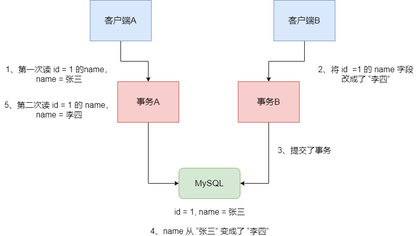

## MySQL 的特性 --- ACID

MySQL 的特性，就是大家常常听到的 ACID。


- Atomic：原子性。就是一堆SQL，要么一起成功，要么一起失败。不允许某个 SQL 执行成功了，某个 SQL 却失败了。这样就不是原子性了。

- Consistency：一致性。这个是针对数据一致性来说的，就是一组 SQL 执行之前，数据必须是准确的，执行之后，数据也必须是准确的。别搞了半天，执行完 SQL，结果 SQL 对应的数据修改没执行，这就很坑爹了。

- Isolation：隔离性。这个就是说多个事务在跑的时候不能互相干扰。不能事务 A 操作个数据，弄到一半还没弄好，结果事务 B 来改了这个数据，导致事务 A 的操作出错了。

- Durability：持久性。事务成功了，就必须永久对数据的修改是有效的，别过来一会数据自己不见了。


## MySQL 事务隔离级别

MySQL 的事务隔离级别主要有 读未提交、读已提交（不可重复读）、可重复读和串行化四种。


1、**读未提交**，Read UnCommitted。这个很坑爹，就是说某个事务还没提交的时候，修改了数据，就让别的事务给读到了。这很容易导致出错，这个也叫做脏读。

2、**读已提交**，Read Committed（不可重复度）。这个比上面那个好一点，但是也比较尴尬。


就是说事务 A 在跑的时候，先查询了一个数据的值是 1，然后过了断时间，事务 B 把那个数据给修改了还提交了。此时事务 A 再次查询这个数据就变成了值 2 了，这是读了人家事务提交的数据了，所以是读已提交。


这个也叫不可重复读，就是所谓的一个事务内对一个数据两次读，可能会读到不一样的值。如图：




3、**可重复读**，Read Repeatable。这个比上面那个再好一点。就是说事务 A 在执行的过程中，对某个数据的值，无论读多少次都是值 1。哪怕这个过程中事务 B 修改了数据的值还提交了，但是事务 A 读到的还是自己事务开始时这个数据的值。如图：


**幻读**，不可重复读和可重复读都是针对两个事物同时对某条数据在修改，但是幻读针对的是插入。比如某个事物把所有行的某个字段都修改为了 2，结果另一个事务插入了一条数据，那个字段的值是 1。然后就尴尬了，第一个事务会突然发现多出来一条数据，那个数据的字段是 1。


幻读会带来什么问题？在此隔离级别下，例如，事务 1 要插入一条数据，我先查询一下有没有相同的数据，但是这时事务 2 添加了这条数据，这就会导致事务 1 插入失败，并且它就算再一次查询，也无法查询到与其插入相冲突的数据，同时自身死活都插入不了。


4、**串行化**，如果要解决幻读，就需要使用串行化级别的隔离级别，所有事务都串行起来，不允许多个事务并行操作。


MySQL 的默认隔离级别是 Read Repeatable，就是可重复读，就是说每个事务都会开启一个自己要操作的某个数据的快照，事务期间，读到的都是这个数据的快照而已，对一个数据的多次读都是一样的。


## MySQL 中的隔离级别的实现

上面的内容解释了一些数据库理论的概念，但是在 MySQL、Oracle 这样的数据库中，为了性能的考虑并不是完全按照上面的理论来实现的。


### MVCC

MVCC，全称 Multi-Version Concurrency Control。是 MySQL 中基于乐观锁理论实现可重复读隔离级别的方式。


这里先引入两个概念：


> 系统版本号：一个递增的数字，每开始一个新的事务，系统版本号就会自动递增。


> 事务版本号：事务开始时的系统版本号。


在 MySQL 中，会在表中每一条数据后面添加两个字段：

- 创建版本号：创建一行数据时，将当前系统版本号作为创建版本号赋值。

- 删除版本号：删除一行数据时，将当前系统版本号作为删除版本号赋值。


### SELECT

select 时读取数据的规则为：创建版本号 <= 当前事务版本号，删除版本号为空或 > 当前事务版本号。


创建版本号 <= 当前事务版本号保证取出的数据不会有后启动的事务中创建的数据；而删除版本号为空或 > 当前事务版本号保证了至少在改事务开启之前数据没有被删除，是应该被查出来的数据。


### INSERT

insert 时将当前的系统版本号赋值给创建版本号字段。


### UPDATE

插入一条新纪录，保存当前事务版本号为行创建版本号，同时保存当前事务版本号到原来删除的行，实际上这里的更新是通过 delete 和 insert 实现的。


### DELETE

删除时将当前的系统版本号赋值给删除版本号字段，标识该行数据在哪一个事务中会被删除，即使实际上在 commit 时该数据没有被删除，根据 select 的规则后开启数据也不会查询该数据。


### 示例

假设现在有这么一个表，如下：

| id   | name | 创建事务id | 删除事务id |
| ---- | ---- | ---------- | ---------- |
| 1    | 张三 | 120        | 122        |
| 2    | 李四 | 119        | 空         |


事务 id = 121 的事务，查询 id  = 1 的这一行的时候，一定会找到创建事务 id <= 当前事务 id 的那一行。所以 `SELECT * FROM table WHERE id = 1` 就可以查到上面那一行。


事务 id = 122 的事务，将 id = 1 的这一行给删除了，此时就会将 id = 1 的行的删除事务 id 设置为 122。当事务 id = 121 的事务，再次查询 id = 1 的那一行，是可以查到的。因为创建事务 id <= 当前事务 id，且 当前事务 id < 删除id。


如果某个事务执行期间，别的事务更新了一条数据呢？这个很关键的一个实现，其实在 InnoDB 中，就是插入了一行记录，然后将新插入的记录的创建事务 id 设置为新的事务的 id，同时将这条记录之前的那个版本的删除 id 设置成新的事务 id。


| id   | name   | 创建事务id | 删除事务id |
| ---- | ------ | ---------- | ---------- |
| 1    | 张三   | 120        | 122        |
| 2    | 李四   | 119        | 空         |
| 2    | 小李四 | 122        | 122        |


事务 id = 121 的事务，查询 id = 2 的那一行，查到 name = 李四。事务 id = 122 的事务，将 id = 2 的那一行的 name 修改成 name = 小李四。事务 id = 121 的事务，查询 id = 2 的那一行，只能查询到 李四。因为创建事务 id <= 当前事务 id，当前事务 id < 删除 id。


### 快照读和当前读

#### select 快照读

当执行 select 操作时，InnoDB 默认会执行快照读，会记录下这次 select 后的结果，之后 select 的时候就会返回这次快照的数据，即使其他事务提交了不会影响当前 select 的数据，这就实现了可重复读了。快照的生成当在第一次执行 select 的时候，也就是说假设当事务 A 开启了事务，然后没有执行任何操作，这时候事务 B insert 了一条数据然后 commit，这时候 A 执行 select，那么返回的数据中就会有 B 添加的那条数据。之后无论有其他事务 commit 都没有关系，因为快照已经生成了，后面的 select 都是根据快照来的。


#### 当前读

对于会对数据修改的操作（update、insert、delete）都是采用当前读的模式。在执行这几个操作的时候会读取最新的记录，即使是别的事务提交的数据也可以查询到。假设要 update 一条记录，但是在另一个事务中已经 delete掉这条数据并且 commit 了。如果 update 就会产生冲突，所以在 update 的时候需要知道最新的数据。


select 的当前读需要手动地加锁：

```mysql
SELECT * FROM table WHERE ? LOCK IN SHARE MODE;
SELECT * FROM table WHERE ? FOR UPDATE
```


## 参考资料

[MySQL的可重复读级别能解决幻读吗](https://juejin.im/post/5c9040e95188252d92095a9e)

[事务的几个特性和隔离方式](https://mp.weixin.qq.com/s/EoHhLE1aA20inHFCu5FAMw)

