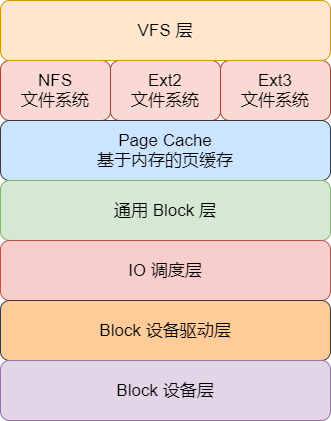
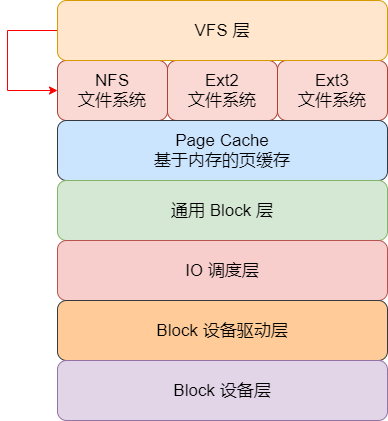
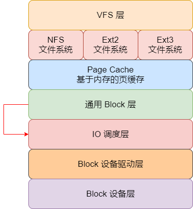
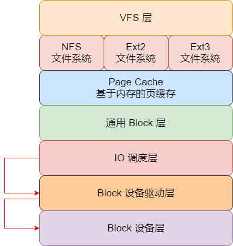
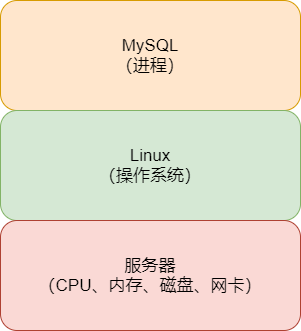
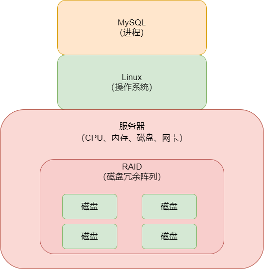
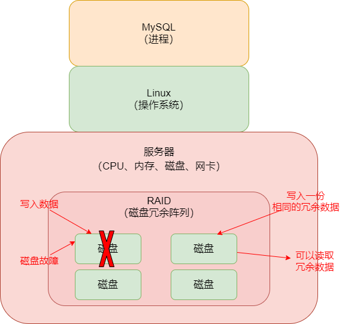
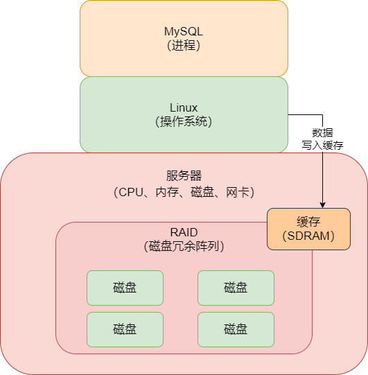
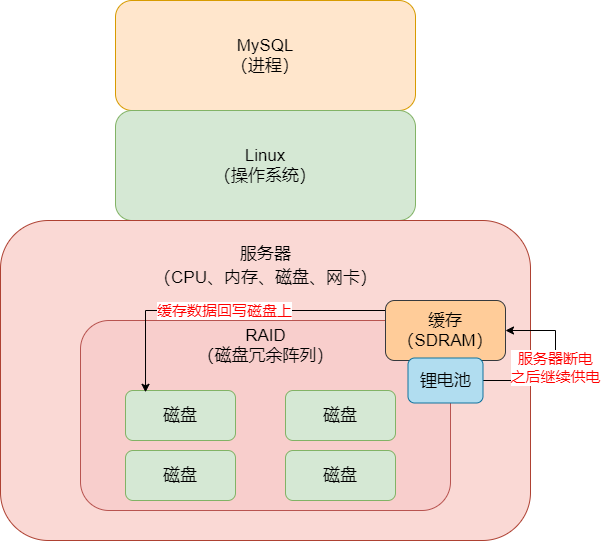

## Linux 操作系统的存储系统软件层原理

今天我们讲讲 MySQL 数据库在执行底层磁盘读写 IO 操作的原理，这其实就涉及到了 Linux 操作系统的磁盘 IO 原理了，不管是 MySQL 执行磁盘随机读写，还是磁盘顺序读写，其实在底层的 Linux 层面，原理几乎是一致的。

所谓的操作系统，无论是 Linux ，还是 Windows，本质上它们自己也是软件系统，之所以需要操作系统，是因为我们不可能直接去操作 CPU、内存、硬盘这些硬件，所以必须要用操作系统来管理 CPU、内存、磁盘、网卡这些硬件设备。操作系统除了管理硬件设备以外，还会提供一个操作界面给我们，例如 Windows 之所以能成功，其实就是它提供了一个比较易用的可视化界面，让我们普通人都能操作电脑内部的内存、CPU、磁盘和网卡。

至于 Linux 操作系统，其实也是类似的，只不过一般我们用 Linux 操作系统，它是不给我们提供可视化界面的，只有命令行界面，我们需要输入各种各样的命令去执行文件编辑、系统部署和运行，本质 Linux 系统在底层也是利用 CPU、内存、磁盘和网卡这些硬件设备在工作。

所以，今天要讲解的就是 Linux 操作系统的存储系统，Linux 利用这套存储系统去管理我们机器上的机械硬盘、SSD 固态硬盘。这些存储设备，可以在里面读取数据，或者是写入数据。理解了这个，你就理解了 MySQL 执行的数据页随机读写，redo log 日志文件顺序读写的磁盘 IO 操作，在 Linux 的存储系统中是如何执行的。

简单来说，Linux 的存储系统分为 **VFS 层、文件系统层、Page Cache 缓存层、通用 Block 层、IO 调度层、Block 设备驱动层、Block 设备层**，如图：

当 MySQL 发起一次数据页的随机读写，或者是一次 redo log 日志文件的顺序读写的时候，实际上会把磁盘 IO 请求交给 Linux 操作系统的 VFS 层，这一层的作用，就是根据你是对哪个目录的文件执行的磁盘 IO 操作，把 IO 请求交给具体的文件系统。

例如，在 Linux 中，有的目录比如 `/xx1/xx2` 里的文件其实是由 NFS 文件系统管理的，有的目录比如 `/xx3/xx4` 里的文件其实是由 Ext3 文件系统管理的，那么这个时候 VFS 层需要根据你是对哪个目录下的文件发起的读写 IO 请求，把请求转交给响应的文件系统，如下图：

接着文件系统会先在 Page Cache 这个基于内存的缓存里找你要的数据在不在里面，如果有就基于内存缓存来执行读写，如果没有就继续往下一层走，此时这个请求会交给 Block 层，在这一层会把你对文件的 IO 请求转换为 Block IO 请求。

接着 IO 请求转换为 Block IO 请求之后，会把这个 Block IO 请求交给 IO 调度层，在这一层里默认是用 CFQ 公平调度算法的。

例如，假设此时数据库发起了多个 SQL 语句同时在执行 IO 操作。有一个 SQL 语句，比如 `update xxx set xx1 = xx2 where id = 1`，它其实可能就只要更新磁盘上的一个 block 里的数据就可以了。但是有的 SQL 语句，比如 `select * from xx where xx1 like "%xx%"` 可能需要 IO 读取磁盘上大量数据。那么此时如果基于公平调度算法，就会导致它先执行第二个 SQL 语句的读取大量数据的 IO 操作，耗时很久，然后第一个仅仅更新少量数据的 SQL 语句的 IO 操作，就一直等待它，等不到执行的机会。

所以在这里，一般建议 MySQL 的生产环境，需要调整为 `deadline` IO 调度算法，它的核心思想就是，任何一个 IO 操作都不能一直不停地等待，在指定时间范围内，都必须让它去执行。所以基于 deadline 算法，上面第一个 SQL 语句的更新少量数据的 IO 操作可能在等待一会儿之后，就会得到执行的机会，这也是一个生产环境的 IO 调度优化经验。

我们看下图，此时 IO 请求被转交给了 IO 调度层

最后 IO 完成调度之后，就会决定哪个 IO 请求先执行，哪个 IO 请求后执行，此时可以执行的 IO 请求就会交给 Block 设备驱动层，然后最后经过驱动把 IO 请求发送给真正的存储硬件，也就是 Block 设备层

然后硬件设备完成了 IO 读写操作之后，要不然是写，要不然是读，最后就把响应通过上面的层级反向依次返回，最终 MySQL 可以得到本次 IO 读写操作的结果

这就是 MySQL 跟 Linux 存储系统交互的一个原理剖析，包括里面的 IO 调度算法那块的一个优化的点。

## 数据库服务器使用的 RAID 存储架构初步介绍

实际上 MySQL 数据库就是个软件，它其实就是用编程语言写的一套数据库管理软件而已，底层就是磁盘来存储数据，基于内存来提升数据读写性能，然后设计了复杂的数据模型，帮助我们高效地存储和管理数据。所以 MySQL 数据库软件都是安装在一台 Linux 服务器上，然后启动 MySQL 的进程，就是启动了一个 MySQL 数据库。

MySQL 运行过程中，它需要使用 CPU、内存、磁盘和网卡这些硬件，但是不能直接使用，都是通过调用操作系统提供的接口，依托于操作系统来使用和运行的，然后 Linux 操作系统负责操作底层的硬件。如图：

一般来说，很多数据库部署在机器上的时候，存储都是搭建的 RAID 存储架构，其实这个 RAID 很多人觉得深奥，确实这个概念比较难以理解，而且说深了里面的技术含量也很高，但简单说一下，还是可以理解的。

简单地说，RAID 就是一个磁盘冗余阵列，什么意思呢？假设我们的服务器里的磁盘就一块，如果一块磁盘的容量不够怎么办？可以再搞几块磁盘出来放在服务器。现在多搞了几块磁盘，机器里又很多磁盘了，不好管理，怎么在多块磁盘上存放数据呢？

所以就是针对这个问题，在存储层面往往会在机器里搞多块磁盘，然后引入 RAID 这个技术，大致理解为用来管理机器里的多块磁盘的一种磁盘阵列技术。有了它以后，你在磁盘里读写数据的时候，它会告诉你应该在那块磁盘上读写数据，如图：

有了 RAID 这种多磁盘阵列技术之后，我们就可以在一台服务器里加多块磁盘，扩大我们的磁盘空间了。当我们往磁盘里写数据的时候，通过 RAID 技术可以帮助我们选择一块磁盘写入，在读取数据的时候，我们也知道从哪块磁盘去读取。

除此之外，RAID 技术很重要的一个作用，就是它还可以实现 数据冗余机制。所谓的数据冗余机制，就是如果你写入了一批数据在 RAID 的一块磁盘上，然后这块磁盘现在坏了，无法读取了，那你就丢失了一波数据。所以其实有的 RAID 磁盘冗余阵列技术里，是可以把你写入的同样一份数据，在两块磁盘上都写入的，这样可以让两块磁盘上的数据一样，作为冗余备份，然后当你一块磁盘坏掉的时候，可以从另外一块磁盘读取冗余数据出来，这一切都是 RAID 技术自动帮你管理的，不需要你操作，如图：

所以 RAID 技术实际上就是管理多块磁盘的一种磁盘阵列技术，它有软件层面的东西，也有硬件层面的东西，比如有 RAID 卡这种硬件设备。具体来说，RAID 还可以分成不同的技术方案，比如 RAID 0、RAID 1、RAID 0 + 1、RAID 2 等等，一直到 RAID10，很多种不同的多磁盘管理技术方案。

如果有兴趣，可以自行去搜索，大家只要了解一下 RAID 这种多磁盘冗余阵列技术的基本思想就可以了，对于存储的深入学习，主要也是一些运维工程师去做的。

## 数据库服务器上的 RAID 存储架构的电池充放电原理

服务器使用多块磁盘组成的 RAID 阵列的时候，一般会有一个 RAID 卡，这个 RAID 卡是带有一个缓存的，这个缓存不是直接用我们的服务器的主内存的那种模式，他是一种跟内存类似的 SDRAM，当然，你大致认为她也是基于内存来存储的吧

然后我们可以设置 RAID 的缓存模式设置为 `write back`，这样的话，所有写入到磁盘阵列的数据，会先缓存在 RAID 卡的缓存里，后续慢慢再写入到磁盘阵列里去，这种写缓冲机制，可以大幅度提升我们的数据库磁盘写的性能。如图：

如果突然断电了，或者是服务器自己故障关闭了，那么这个 RAID 卡的缓存里的数据是不是就会丢失？那么 MySQL 写入磁盘的数据不就没了？正因为如此，为了解决这个问题，RAID 卡一般都配置有自己独立的锂电池或者是电容，如果服务器突然断电了，无法接通电源了，RAID 卡自己是基于锂电池来供电运行的，然后它会赶紧把缓存里的数据写入到阵列中的磁盘上去，如图：

但是锂电池是存在性能衰减问题的，所以一般来说锂电池都是要配置定时充放电的，也就是说每隔 30天 ~ 90天（不同的锂电池厂商是不一样的），就会自动对锂电池充放电一次，这可以延长锂电池的寿命和校准电池容量。如果不这么做的话，那么可能锂电池用着用着就会发现容量不够了，可能容纳的电量在你服务器掉电之后，都没法一次性把缓存里的数据写回磁盘上去，就会导致数据丢失了

所以在锂电池充放电的过程中，RAID 的缓存级别会从 `write back` 变成 `write through`，我们通过 RAID 写数据的时候，IO 就直接写磁盘了，如果写内存的话，性能也就是 0.1ms 这个级别，但是直接写磁盘，性能就退化到 10 倍到毫秒级了。

所以，对于那些在生产环境的数据库部署使用了 RAID 多磁盘阵列存储技术的公司，通常都会开启 RAID 卡的缓存机制，但是此时一定要注意这个 RAID 的锂电池自动充放电问题，因为只要你用了 RAID 缓存机制，那么锂电池就必然会定时进行充放电去延长寿命，保证服务器掉电的时候可以把缓存数据写回磁盘，数据不会丢失

所以这个时候一旦 RAID 锂电池自动充放电吗，往往会导致你的数据库服务器的 RAID 存储定期的性能出现几十倍的抖动，间接导致你的数据库每隔一段时间就会出现性能几十倍的抖动

