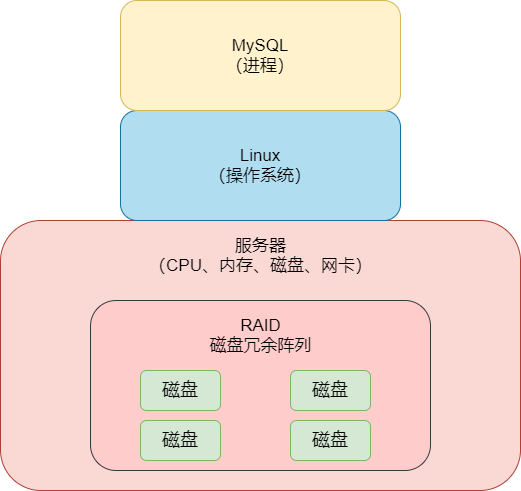
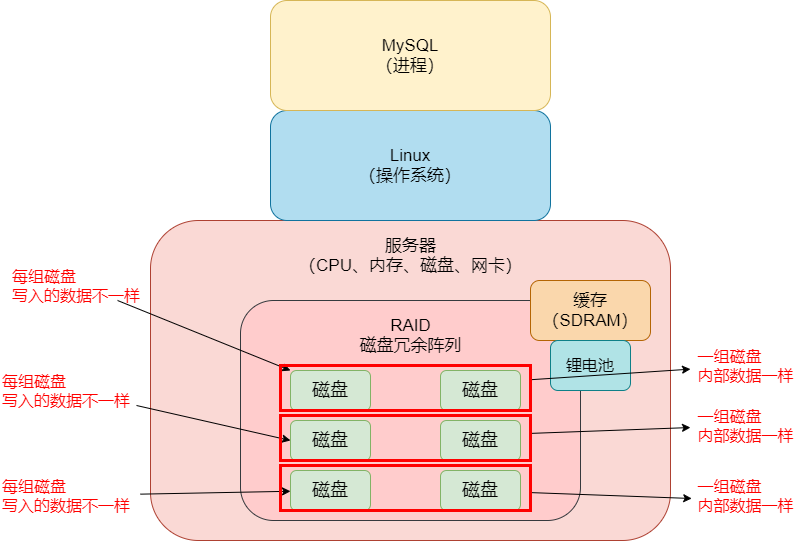
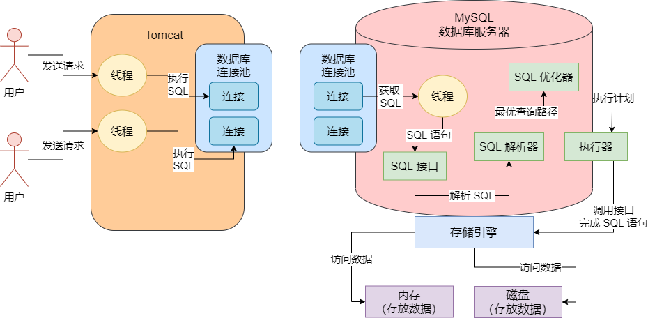
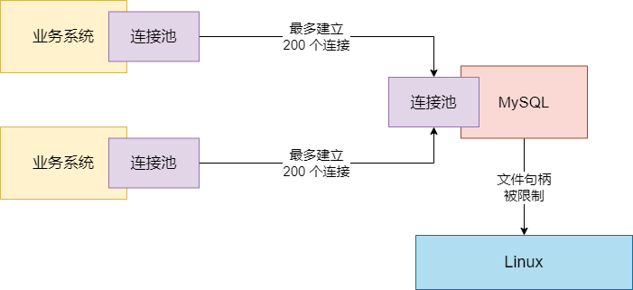

## RAID 锂电池充放电导致的 MySQL 性能抖动

曾经有一个业务，它的数据库是部署在高配置服务器上的，磁盘就是用 `RAID10` 的阵列技术，用了 6 块磁盘组成了 RAID10 磁盘阵列架构。那么 RAID10 是什么？


在知道 RAID10 之前，我们先看一下什么是 `RAID0`。RAID0，就是你有很多磁盘组成了一个阵列，然后你所有的数据都是分散写入不同磁盘的。因为有多块磁盘，所以你的磁盘阵列的整体容量就很大，而且同时写入多块磁盘，让你的磁盘读写并发能力很强。如下：




但是这种模式下，最大的问题就是万一你磁盘坏了一块，那么就会丢失一部分数据了。所以一般如果要严格保证数据不丢失的话，就得用 `RAID1`。这个 RAID1，就是两块磁盘为镜像关系，你写的所有数据，在两块磁盘上都有，形成了数据冗余，一块磁盘坏了，另一块磁盘上还有数据。一块磁盘如果压力大，可以让请求路由到另外一块磁盘上去，分担压力，反正它俩的数据都是冗余的，是一样的。


而所谓的 `RAID10`，就是 `RAID0 + RAID1` 组合起来。就是说当时生产环境的服务器部署，我们有 6 块磁盘组成了一个 `RAID 10` 的阵列，那么其实就是每 2 块磁盘组成一个 RAID1 互为镜像的架构，存放的数据是冗余一样的，一共有 3 组 RAID1，然后对于每一组 RAID1 写入数据的得时候，是用 RAID0 的思路，就是不同组的磁盘的数据是不一样的，但是同一组内的两块磁盘的数据是冗余一致的。如图：




所以对于这样的一个使用 RAID10 架构的服务器，它必然内部是一个锂电池的，然后这个锂电池的厂商设定的默认是 30 天进行一次充电，每次锂电池充放电就会导致 RAID 写入时不经过缓存，性能会急剧下降，所以我们发现线上机器每隔 30 天就会有一次剧烈性能抖动，数据库性能下降了 10 倍


为了排查这个问题，使用 Linux 命令查看了 RAID 硬件设备的日志，这个命令就不说了，因为不同的厂商的 RAID 设备，这个命令其实是不一样的。发现 RAID 就是每隔 30 天就有一次充放电的日志，所以就是由于这个定期的充放电导致了线上数据库的性能定期抖动。


对于 RAID 锂电池充放电问题导致的性能抖动，一般有三个解决方案：

1. 给 RAID 卡把锂电池换成电容，电容是不用频繁充放电的，不会导致充放电的性能抖动，还有就是电容可以支持透明充放电，就是自动检查电量，自动进行充放电，不会说在充放电的时候直接写 IO 直接走磁盘，但是更换电容很麻烦，而且电容容易老化，这个其实一般不常用

   

2. 手动充放电。这个比较常用，大部分互联网大厂的数据库服务器的 RAID 就是用了这个方案避免性能的抖动。就是关闭 RAID 自动充放电，然后写一个脚本，脚本每隔一段时间自动在晚上凌晨的业务低峰时期，脚本自动触发充放电，这样可以避免业务高峰期的时候 RAID 自动充放电引起性能抖动

   

3. 充放电的时候不要关闭 `write back`，就是设置一下，锂电池充放电的时候不要把缓存级别从 `write back` 修改为 `write through`，这个也是可以做到的，可以和第二个策略合起来使用


## 数据库无法连接故障：too many connections

### 场景介绍

一个经常碰到的数据库生产故障，就是数据库无法连接的问题。大家会看到的异常信息往往是 `ERROR 1040(HY000): Too many connections`，这个时候就是说数据库的连接池里有太多的连接了，不能再跟你建立新的连接了


之前我们讲过数据库的整体架构原理。数据库自己其实是有一个连接池的，你的每个系统部署在一台机器上的时候，你那台机器上部署的 系统实例/服务实例 自己也是有一个连接池的，你的系统每个连接 Socket 都会对应着数据库连接池里的一个连接 Socket，这就是 TCP 网络连接，如图：




所以当数据库告诉你 Too many connections 的时候，说明它的连接池已经满了，你业务系统不能跟它建立更多的连接了。


有一个场景，数据库部署在 64GB 的大内存物理机上，机器配置各方面都很高，然后连接这台物理机的 Java 系统部署在 2 台机器上，Java 系统设置的连接池最大大小是 200，即每台机器上部署的 Java 系统，最多跟 MySQL 数据库建立 200 个连接，一共最多建立 400 个连接。


但是这个时候 MySQL 报异常说 Too many Connections，就说明目前 MySQL 甚至都无法建立 400 个网络连接。这太少了，毕竟服务器都是高配置的。于是我们检查了 MySQL 的配置文件：`my.cnf`，里面有一个关键的参数是 `max_connections`，就是 MySQL 能建立的最大连接数，设置的是 800


这就奇怪了，明明设置了 MySQL 最多可以建立 800 个连接，为啥两台机器 400 个连接就不行了？我们再用命令行或者一些管理工具登陆到 MySQL 去，可以执行下面的命令看一下：

```mysql
show variables like 'max_connections'
```


此时看到，当前 MySQL 仅仅只是建立了 214 个连接而已。此时我们想到，是不是 MySQL 不管我们设置的那个 `max_connections`，就是直接强行把最大连接数设置为 214 了？于是我们去检查了 MySQL 的启动日志，发现如下的字样：

```verilog
Could not increase num of max_open_files to more than mysqld(request: 65535)
Changed limits: max_connections:214 (requested 2000)
Changed limits: table_open_cache:400 (requested 4096)
```


看日志就很清楚了，简单来说，就是因为底层的 Linux 系统把进程可以打开的**文件句柄数**限制为 1024 了，导致 MySQL 最大连接数是 214。如图：




### 解决与原理

上面说了 Too many connections 故障，它的核心就是 Linux 的文件句柄限制，导致了 MySQL 的最大连接数被限制。那如何解决这个问题？其实核心就是一行命令：

```shell
ulimit -HSn 65535
```


然后就可以用如下命令检查最大文件句柄是否被修改了：

```shell
cat /etc/security/limits.conf
cat /etc/rc.local
```


如果都修改好了，可以在 MySQL 的 `my.cnf` 里确保 `max_connections` 参数也调整好了，然后可以重启服务器，然后重启 MySQL，这样的话，Linux 的最大文件句柄就会失效了，MySQL 的最大连接数也会生效了。然后你再尝试业务系统去连接数据库，就没问题了


为什么 Linux 的最大文件句柄限制为 1024 的时候，MySQL 的最大连接数是 214 呢？这个其实是 MySQL 源码内部写死的，它在源码中就是有一个计算公式，算下来就是如此罢了。


然后 Linux 的 `ulimit` 命令是干嘛用的？其实，Linux 是默认会限制你每个进程对机器资源的使用的，包括可以打开的文件句柄的限制，可以打开的子进程数的限制，网络缓存的限制，最大可以锁定的内存大小。因为 Linux 系统设计的初衷，就是要尽量避免你某个进程一下子耗尽机器上所有资源，所以它默认都是会做限制的


那么对于我们来说，常见的一个问题，其实就是文件句柄的限制。因为如果 Linux 限制你一个进程的文件句柄太少的话，那么就会导致我们没办法创建大量的网络连接，此时我们系统进程就没办法正常工作了。


举例来说，比如 MySQL 运行的时候，其实就是 Linux 的一个进程，那么他其实是需要跟很多业务系统建立大量的连接的，结果你限制了它最大文件句柄数量，那么它就不能建立太多连接了。所以，往往你在生产环境部署了一个系统，比如数据库系统、中间件系统、存储系统、缓存系统之后，都需要调整一下 Linux 的一些内核参数。而这个文件句柄的数量是一定要调整的吗，通常都得设置为 65535


还有比如 Kafka 之类的消息中间件，在生产环境部署的时候，如果你不优化一些 Linux 内核参数，会导致 Kafka 可能无法创建足够的线程，此时也是无法运行的。


所以我们平时可以用 `ulimit` 命令来设置每个进程被限制使用的资源量，用 `ulimit -a` 就可以看到进程被限制使用的各种资源的量。比如 `core file size` 代表的进程崩溃时候的转储文件的大小限制，`max locked memory` 就是最大锁定内存大小，`open files` 就是最大可以打开的文件句柄数量，`max user processes` 就是最多可以拥有的子进程数量


设置之后，我们要确保变更落地到 `/etc/security/limits.conf` 文件里，永久性地设置进程的资源限制。所以执行 `ulimit -HSn 65535` 命令后，要用以下命令检查一下是否落地到配置文件里去。

```shell
cat /etc/security/limits.conf
cat /etc/rc.local
```


