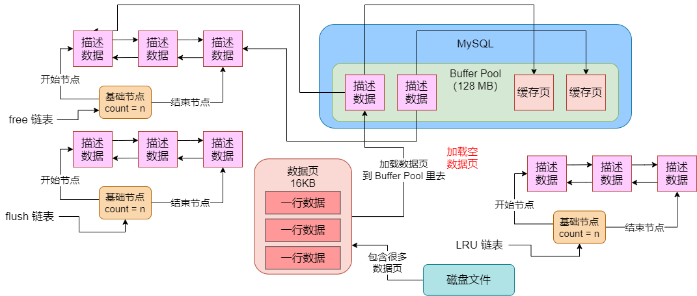

## 数据页的结构

之前一直提到的一个概念，就是「数据页」。我们平时执行 CRUD 的时候，都会从磁盘上加载数据页到 Buffer Pool 的缓存页里去，然后更新了缓存页后，又会刷新回磁盘上的数据页里去。所以其实 MySQL 中进行数据操作的最小单位应该是数据页。

每个数据页，实际上是默认有 16KB 的大小，那么这 16KB 的大小就是存放大量的数据行吗？明显不是的，其实一个数据页拆分成了很多个部分。大体上包含了 `文件头`、`数据页头`、`最小记录和最大记录`、`多个数据行`、`空闲空间`、`数据页目录`、`文件尾部`。如图：

其中文件头占据了 `38` 个字节，数据页头占据了 `56` 个字节，最大记录和最小记录占据了 `26` 个字节，数据行区域的大小是不固定的，空闲区域的大小也是不固定的，数据页目录的大小也是不固定的，然后文件尾部占据 `8` 个字节。

会不会觉得有点懵逼，突然多了那么多的概念出来。其实说白了，这个数据页跟每一行数据一样，都是由 MySQL 开发人员设计出来的一个特殊的存储格式。即，通过这种特殊的存储格式在磁盘文件里去存放一个又一个的数据页，每个数据页在磁盘里实际存储的时候，就是包含了上述一些特殊的数据，然后每个数据里还有专门的区域包含了多个数据行。至于数据行，就是用之前讲解的那套存储格式来存储的。

接下来看一下把这个数据插入数据页的一个过程。刚开始，一个数据页可能是空的，没有一行数据，此时这个数据页实际上是没有数据行那个区域的。如图：

然后，假设我们现在要插入一行数据，此时数据库里可是一行数据都没有的，此时是不是应该先是从磁盘上加载一个空的数据页到缓存里去？此时空的数据页就是如上图所示，至于加载的过程，则如下图所示：

接着我们应该在 Buffer Pool 中的一个空的缓存页里插入一条数据。记住，**缓存页跟数据页是一一对应的**，它在磁盘上的时候就是数据页，数据页加载到缓存池里了，我们就叫它缓存页了。所以此时在缓存页里插入一行数据，实际上就是在数据行那个区域里插入一行数据，然后空闲区域的空间就会减少一些，此时当缓存页里插入一行数据之后，其实缓存页此时看起来如下图所示：

接着你就可以不停低插入数据到这个缓存页里去，直到它的空闲区域都耗尽了，就是这个页满了，此时数据行区域内可能有很多行数据，而空闲区域就没了。如图：

而且，在更新缓存页的同时，其实在 LRU 链表的位置会不停地变动，而且肯定会在 flush 链表里，所以最终它一定会通过后台 IO 线程根据 LRU 链表 和 flush 链表，把这个脏的缓存页刷到磁盘上去。这样，对于数据页的整体存储结构的初步介绍，以及 MySQL 实际运行过程中，数据页的使用，我们今天就介绍完了。

## 表空间以及划分多个数据页的数据区

我们在大致了解了数据页的结构和使用之后，就可以继续了解下一个概念，就是表空间和数据区的概念。

什么是表空间？简单说就是我们平时创建的那些表，其实都是有一个表空间的概念，在磁盘上都会对应着「表名.ibd」这样的一个磁盘数据文件。所以在物理层面，表空间就是对应一些磁盘上的数据文件。

有的表空间，比如系统表空间可能对应的是多个磁盘文件，有的我们自己创建的表对应的表空间可能就是对应了一个「表名.ibd」数据文件。然后在表空间的磁盘文件里，其实会有很多很多的数据页，因为一个数据页也就是 16KB 而已，总不可能一个数据页就是一个磁盘文件吧，所以一个表空间的磁盘文件里，其实是有很多的数据页的。

但现在的问题就是，一个表空间里包含的数据页实在是太多了，不便于管理，所以在表空间里又引入了一个**数据区**的概念，英文就是 **extent**。

**一个数据区对应着连续的 64 个数据页，每个数据页是 16KB，所以一个数据区是 1MB，然后 256 个数据区被划分为一个组。**

对于表空间而言，它的第一组数据区的第一个数据区的前 3 个数据页，都是固定的，里面存放了一些描述性的数据。比如 `FSP_HDR` 这个数据页，它里面就存放了表空间和这一组数据区的一些属性。`IBUF_BITMAP` 数据页，里面存放的是这一组数据页的所有 `insert buffer` 的一些信息。`INODE` 数据页，这里也是存放了一些特殊的信息。

暂时先不用了解这些东西具体是干什么的，你只要知道每一个组数据区的第一个数据区的前 3 个数据页，都是存放一些特殊的信息的。然后这个表空间的其他各组数据区，每一组数据区的第一个数据区的头两个数据页，都是存放特殊信息的。比如，XDES 数据页就是用来存放这一组数据区的一些相关属性的，其实就是很多描述这组数据区的东西，现在也不用去知道是什么。

总结起来就是，**我们平时创建的那些表都是由对应的表空间的，每个表空间就是对应了磁盘上的数据文件，在表空间就是你对应了磁盘上的数据文件，在表空间里又很多组数据区，一组数据区是 256 个数据区，每个数据区包含了 64 个数据页，是 1MB**

然后表空间的第一组数据区的第一个数据区的头三个数据页，都是存放特殊信息的；表空间的其他组数据区的第一个数据区的头两个数据页，也都是存放特殊信息的。

所以磁盘上的各个表空间的数据文件里是通过数据区的概念，划分了很多很多的数据页的，因此**当我们需要执行 CRUD 操作的时候，说白了，就是从磁盘上的表空间的数据文件里，去加载一些数据页出来到 Buffer Pool 的缓存页里去使用。**

如图，图里给出了一个表空间内部的存储结构，包括一组一组的数据区，每一组数据区都是 256 个数据区，然后互一个数据区是 64 个数据页。

