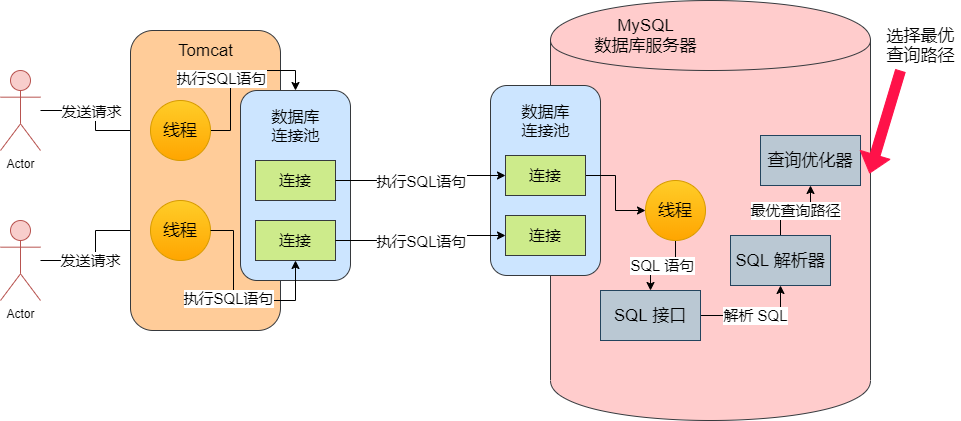

一般情况下，我们的系统采用数据库连接池的方法去并发访问数据库，然后数据库自己也会维护一个连接池，其中管理了各种系统跟这台数据库服务器建立的所有连接。


当我们的系统只要能从连接池获取到一个数据库连接之后，我们就可以执行增删改查的SQL语句了。但大部分人都停留在把 MySQL 当成一个黑盒的阶段，只知道执行相应的 SQL 语句就可以得到相应的结果，如果语句性能差了，就在表里建几个索引，完全当它是个黑盒子，来建表以及执行 SQL 语句。


接下来我们就要深入底层，去探索数据库的工作原理以及生产问题的优化手段。

## 网络连接必须让线程来处理

假设我们的数据库服务器的连接池中的某个连接接收到了网络请求，假设就是一条 SQL 语句，那么由谁负责从这个连接中去监听网络请求？谁负责从网络连接里把请求数据读取出来？大家应该或多或少都知道一点，那就是网络连接必须得分配给一个线程去处理，由一个线程来监听请求以及读取请求数据，比如从网络连接中读取和解析出来一条我们的系统发送过去的 SQL 语句。如图：


## SQL 接口：负责处理接收到的 SQL 语句

当 MySQL 内部的工作线程从一个网络连接中读取出来一个 SQL 语句之后，此时会如何执行这个 SQL 语句呢？为了执行这些 SQL 语句，去完成底层数据的增删改查，MySQL 内部提供了一个组件，就是 SQL 接口（SQL Interface），它是一套执行 SQL 语句的接口，专门用于执行我们发送给 MySQL 的那些增删改查的 SQL 语句。


因此 MySQL 的工作线程接收到 SQL 语句之后，就会转交给 SQL 接口去执行，如图：


## 查询解析器：让 MySQL 能看懂 SQL 语句

当工作线程将 SQL 语句交给 SQL 接口去执行，那么 SQL 接口怎么执行 SQL 语句呢？直接把 SQL 语句交给 MySQL，它能看懂和理解这些 SQL 语句吗？


例如有这么一个 SQL 语句：

```mysql
SELECT id, name, age FROM users WHERE id = 1
```

这个 SQL 语句，我们用人脑是直接就可以处理一下，只要懂 SQL 语法的人，一看就知道是什么意思。但是 MySQL 自己本身也是一个系统，是一个数据库管理系统，它没直接理解这些 SQL 语句。所以这就需要一个关键的组件：**查询解析器**


这个查询解析器就是负责对 SQL 语句进行解析的，比如上面的那个 SQL 语句进行一些拆解，拆解成以下几个部分：

我们现在要从 "users" 表里查询数据

查询 "id" 字段的值等于 1 的那行数据

对查出来的那行数据要提取里面的 "id, name, age" 三个字段


所谓的 SQL 解析，就是按照既定的 SQL 语法，对我们按照 SQL 语句规则编写的 SQL 语句进行解析，然后理解这个 SQL 语句要干什么事情，如图所示：


## 查询优化器：选择最优的查询路径

当我们通过解析器理解了 SQL 语句要干什么时候，接着会找查询优化器来选择一个最优的查询路径。


什么叫做最优的查询路径？举个简单的例子，就拿上面的那个 SQL 语句，现在 SQL 要干这么一件事情：我们要从 "users" 表里查询数据，查询 "id" 字段的值等于 1 的那行数据，对查出来的那行数据要提取里面的 "id, name, age" 三个字段。那到底应该怎么来实现呢？


假设要完成这件事有以下几个查询路径（只是用于大家理解的例子，不代表真实的 MySQL 原理，但是通过这个例子，能让大家理解最优查询路径的意思）：

1. 直接定位到 "users" 表中的 "id" 字段等于 1 的一行数据，然后查出来那行数据的 "id, name, age" 三个字段的值就可以了
2. 先把 "user" 表中的每一行数据的 "id, name, age" 三个字段的值都查出来，然后从这批数据里过滤出来 "id" 字段等于 1 的那行数据的 "id, name, age" 三个字段


上面就是那个 SQL 语句的两种实现路径，我们会发现，要完成这个 SQL 的目标，两个路径都可以做到，但很显然感觉上是第一种查询路径更好。


所以查询优化器大概就是干这个的，它会针对你编写的几十行、几百行复制 SQL 语句生成查询路径树，然后从里面选择一条最优的查询路径处理。相当于会告诉你，你应该按照一个什么样的步骤和顺序，去执行哪些操作，然后一步一步地把 SQL 语句给完成了。



## 调用存储引擎接口，真正执行 SQL 语句

接下来，就是把查询优化器选择的最优查询路径，也就是你到底应该按照一个什么样的顺序和步骤去执行这个 SQL 语句的计划，把这个计划交给底层的存储引擎去真正的执行。这个存储引擎是 MySQL 的架构设计中很有特色的一个环节。


真正在执行 SQL 语句的时候，要不然是更新数据，要不是查询数据，那数据会放在哪里？说到底数据库也不是什么神秘莫测的东西，可以把它理解成一个类似你平时写的图书管理系统，电信计费系统之类的系统。


数据库自己本身就是一个编程语言写出来的系统而已，然后启动之后也是一个进程，执行它里面的各种代码。所以对数据库而言，我们的数据要不是放在内存里，要不就是放在磁盘文件里，没什么特殊的地方。假设我们的数据有的放在内存里，有的放在磁盘文件里，如图：


那么问题来了，我们已经知道一个 SQL 语句要如何执行了，但是我们现在要怎么知道哪些数据在内存里，哪些数据在磁盘里，我们执行的时候是更新内存的数据，还是更新磁盘的数据，我们如果更新磁盘的数据，是先查询哪个磁盘文件，再更新哪个磁盘文件？


是不是感觉很懵逼。这个时候就需要存储引擎了。存储引擎其实就是执行 SQL 语句的，它会按照一定的步骤去查询内存缓存数据，更新磁盘数据，查询磁盘数据等等诸如一系列的操作。如图：


MySQL 的架构设计中，SQL 接口、SQL 解析器、查询优化器其实都是通用的，它就是一套组件而已。但是存储引擎的话，它是支持各种各样的存储引擎的，比如我们常见的 InnoDB、MyISAM、Memory 等等，我们是可以选择使用哪种存储引擎来负责具体的 SQL 语句执行的。当然现在 MySQL 一般都是使用 InnoDB 存储引擎的。

## 执行器：根据执行计划调用存储引擎的接口

看完存储引擎之后，我们回过头来思考一个问题，存储引擎可以帮助我们去访问内存以及磁盘上的数据，那么是谁来调用存储引擎的接口呢？


其实我们还漏了一个执行器的概念，这个执行器会根据优化器选择的执行方案，去调用存储引擎的接口按照一定的顺序和步骤，把 SQL 语句的逻辑给执行了。


例如，执行器可能会先调用存储引擎的一个接口，去获取 "users" 表中的第一行数据，然后判断一下这个数据的 "id" 字段的值是否等于我们期望的一个值，如果不是的话，那就继续调用存储引擎的接口，去获取 "users" 表的下一行数据。


就是基于上述的思路，**执行器就会根据我们的优化器生成的一套执行计划，然后不停地调用存储引擎的各种接口去完成 SQL 语句的执行计划**，大致就是不停地更新或提取一些数据出来。


