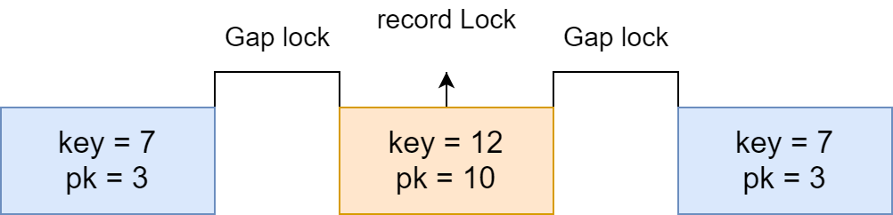

## 锁的基础知识


下方所有实例均依据该表进行，建表语句如下：


```mysql
CREATE TABLE `test_lock` (
  `id` bigint(20) NOT NULL AUTO_INCREMENT COMMENT '主键',
  `gmt_create` datetime NOT NULL COMMENT '创建时间',
  `gmt_modified` datetime NOT NULL COMMENT '修改时间',
  `lock_key` varchar(128) NOT NULL COMMENT '锁名称',
  `lock_context` varchar(512) DEFAULT NULL COMMENT '锁上下文',
  `lock_biz` varchar(64) NOT NULL COMMENT '锁类型',
  PRIMARY KEY (`id`),
  UNIQUE KEY `idx_uk_lock_name` (`lock_key`,`lock_biz`)
) ENGINE=InnoDB AUTO_INCREMENT=26229 DEFAULT CHARSET=utf8 COMMENT='分布式锁表'
;
```


### 锁的作用范围分类


#### 全局锁


在 DB 级别对整个数据库实例加锁


加锁表现：


1. 数据库处于只读状态
2. 阻塞对数据的增删改以及 DDL


加锁方式：`lock Flush tables with read lock`；释放锁：`unlock tables`（发生异常时会自动释放）


作用场景：全局锁主要用于做全库的逻辑备份。和设置数据库只读（set global readonly = true）相比，全局锁在发生异常时会自动释放


#### 表锁


表级别对操作的整张表加锁，**锁颗粒度大，消耗资源少，不会出现死锁，但并发度地**


分为表共享锁和表排它锁，注意：**意向锁为表锁**，但是由存储引擎自己维护，无需用户手工命令干预


显示加锁方式：lock tables {tb_name} read / write；释放锁：unlock table {tb_name}（连接中断也会自动释放）


#### 行锁


InnoDB 支持行级别锁，锁粒度小并发度高，但是加锁开销大业很可能会出现死锁


InnoDB 行锁住的是索引锁，注意当回表时，主键的聚簇索引也会加上锁。例如：


```mysql
INSERT INTO `test_lock` (`id`,`gmt_create`,`gmt_modified`,`lock_key`,`lock_context`,`lock_biz`) VALUES (1,now(),now(),'123456',null,'AccountUser');
```


当执行下面语句，因为查询字段多于组合索引覆盖字段，会出现回表操作补齐其他字段，此时唯一索引 lock_key = 123456 - lock_biz = AccountUser 以及主键索引 id = 1，均被锁住


```mysql
select * from test_lock where lock_key = '123456' and lock_biz = 'AccountUser' for update;
```


加锁方式：


1. 普通 select ... 查询（不加锁）
2. 普通 insert、update、delete ...（隐式加写锁）
3. select ... lock in share mode（加读锁）
4. select ... for update（加写锁）


解锁：


提交 / 回滚事务（commit / rollback） kill 阻塞进程


由于行锁用的最多且更容易出现死锁问题，下面会详细讲述行锁


### 锁的模式分类


我们常规理解的锁分为 2 大类：读锁（也叫共享锁，S）和写锁（也叫排他锁，X）


这两把锁的兼容性说明如下


横轴表示已持有的锁，纵轴表示尝试获取的锁。1 表示成功（即兼容，表现为正常进行下一步操作），0 表示失败（即冲突，表现为阻塞当前操作）


| 兼容性 | X    | S    |
| ------ | ---- | ---- |
| X      | 0    | 0    |
| S      | 0    | 1    |


总结一句话就是：排它锁和任何锁均不兼容


如果仅有读写锁，会存在一个性能问题。思考下面这个场景，其中 T 代表事务，T1 代表事务 1，以此类推


- T1：锁住表中的一行，只能读不能写（行级读锁）
- T2：申请整个表的写锁（表级写锁）


如果 T2 申请成功，则能任意修改表中的一行，但这与 T1 持有的行锁是冲突的。故数据库应识别这种冲突，让 T2 的申请锁被阻塞，知道 T1 释放行锁


若自己实现，最容易想到的识别方案就是遍历：


- step1：判断表是否已被其他事务用表锁锁住
- step2：判断表中的每一行是否已被行锁锁住


其中 step2 需要遍历整个表，效率在数据库是没法接受的。因此 InnoDB 使用意向锁来解决这个问题


InnoDB 实现方案：


- T1 需要先申请表的意向共享锁 IS（注意，意向共享锁为表级锁，且是由存储引擎自己维护，无需用户手工命令干预），成功后再申请一行的行锁 S
- 在意向锁存在的情况下，上面的判断可以改为：step1：不变
- step2：发现表上有意向共享锁，说明表中行被共享行锁锁住了。因此，事务 B 申请表的写锁被阻塞


此时就引入了意向锁。加入意向锁后，锁的兼容性分析如下表：


横轴表示已经持有的锁，纵轴表示尝试获取的锁。1 表示成功（即兼容，表现为正常进行下一步操作），0 表示失败（即冲突，表现为阻塞当前操作）


| 兼容性 | IX   | IS   | X    | S    |
| ------ | ---- | ---- | ---- | ---- |
| IX     | 1    | 1    | 0    | 0    |
| IS     | 1    | 1    | 0    | 1    |
| X      | 0    | 0    | 0    | 0    |
| S      | 0    | 1    | 0    | 1    |


### 锁的类型分类


key 代表二级索引，pk 代表主键，下图二级索引的一段数据，来说明锁的分类





#### 记录锁（Record Locks）


1、记录锁是最简单的行锁，**仅仅锁住一行**，如：


```mysql
select id FROM t WHERE id = 1 FOR UPDATE
```

2、记录锁永远都是加在索引上的，即使一个表没有索引，InnoDB 也会隐式地创建一个索引，并使用这个索引实施记录锁


3、会阻塞其他事务对其插入、更新、删除


#### 间隙锁（Gap Locks）


1. 间隙锁是一种加在两个索引之间的锁（众所周知索引是有序的），或者加在第一个索引之前，或最后一个索引之后的间隙
2. 使用间隙锁锁住的是一个区间，而不仅仅是这个区间中的每一条数据
3. 间隙锁只阻止其他事务插入到间隙中，它们不阻止其他事务在同一个间隙上获得间隙锁，所以 gap x lock 和 gap s lock 有相同的作用


#### Next - Key Locks


Next - Key 锁是记录锁和间隙锁的组合，它指的是加在某条记录以及这条记录前面间隙上的锁


#### 插入意向锁（Insert Intention）


顾名思义，该锁只会出现在 insert 操作执行前（并不是所有 inert 操作都会出现），目的是为了提高并发插入能力，**注意虽有意向二字，但插入意向锁是行锁**


1. 插入意向锁是在插入一行记录操作之前设置的**一种特殊的间隙锁**，这个锁释放了一种插入方式的信号，即多个事务在相同的索引间隙插入时，如果不是插入间隙中相同的位置就不需要互相等待

   普通的 Gap Lock 不允许在（上一条记录, 本记录）范围内插入数据
   插入意向锁 Gap Lock 允许在（上一条记录, 本记录）范围内插入数据

2. 假设有索引值 4、7，几个不同的事务准备插入5、6，每个锁都在获得插入行的独占锁之前用插入意向锁各自锁住了4、7 之间的间隙，但是不阻塞对方不冲突的插入行


锁类型兼容矩阵，横轴表示已经持有的锁，纵轴表示尝试获取的锁。1 表示成功（即兼容，表现为正常进行下一步操作），0 表示失败（即冲突，表现为阻塞当前操作）


| 兼容性           | Gap  | Insert Intention | Record | Next - Key |
| ---------------- | ---- | ---------------- | ------ | ---------- |
| Gap              | 1    | 1                | 1      | 1          |
| Insert Intention | 0    | 1                | 1      | 0          |
| Record           | 1    | 1                | 0      | 0          |
| Next - Key       | 1    | 1                | 0      | 0          |


### 锁组合


虽然我们了解了上述知识，但是看死锁日志时偶尔也会一脸懵，是因为实际运行他们是组合起来共同完成的锁机制


锁的模式：


- lock_s（读锁，共享锁）
- lock_x（写锁，排它锁）


锁的类型：


- Record_Lock（锁记录）
- Gap_Lock（锁记录前的 GAP）
- Next - Key Lock（同时锁记录 + 记录前的 GAP）
- insert_intention_Lock（插入意向锁，其实是特殊的 GAP 锁）


锁模型可以和锁类型任意组合，如：


- locks gap before rec，表示为 gap 锁：lock -> type_mode & LOCK_GAP

- locks rec but not gap，表示为记录锁，非 gap 锁：lock -> type_mode & LOCK_REC_NOT_GAP

- insert intention，表示为插入意向锁：lock -> type_mode & LOCK_INSERT_INTENTION

- waiting，表示锁等待：lock -> type_mode & LOCK_WAIT


在 mysql 源码中使用了 uint32 类型来表示锁， 最低的 4 个 bit 表示 lock_mode, 5 - 8 bit 表示 lock_type（目前只用了 5 和 6 位，大小为 16 和 32 ，表示 LOCK_TABLE 和 LOCK_REC）, 剩下的高位  bit 表示行锁的类型 record_lock_type


## 参考资料


[MySQL 锁机制的再研究](https://mp.weixin.qq.com/s/FJKRUyGUNgDYRvPAy20x3w)